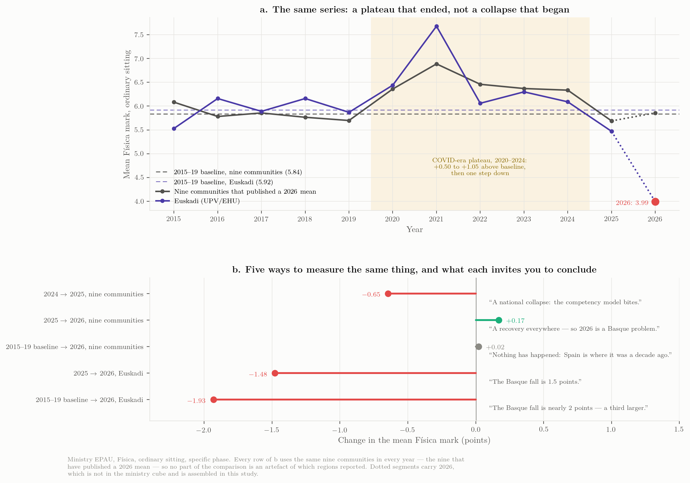
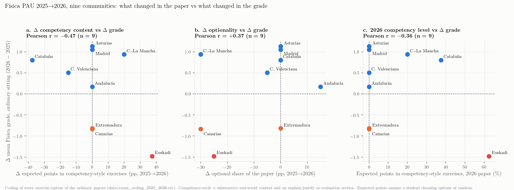
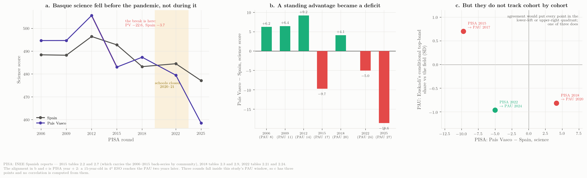

::: {.callout-note title="Cómo leer este documento"}
Cada afirmación lleva una de cuatro clases de evidencia: **oficial** (dato publicado por una universidad, un gobierno o el Ministerio, archivado en el dosier con su *hash*), **prensa** (dato difundido por los medios y todavía no verificable en fuente oficial), **modelado** (magnitud calculada en el dosier a partir de agregados publicados, señalada como tal) y **testimonio** (relato del coordinador sobre decisiones que nunca se publicaron). Nada de lo que sigue es una estimación causal: los datos son estadísticos de cohorte de pruebas distintas corregidas por tribunales distintos, y la prueba cambia todos los años. La evidencia completa, los *scripts* que recalculan cada número y la auditoría que los verificó están en el sitio del dosier; los números de capítulo entre corchetes remiten a él.
:::

## El resultado

En la convocatoria ordinaria de junio de 2026 se presentaron 2 066 estudiantes a Física en la UPV/EHU. La media fue **3.99** y la tasa de aprobados **39.8 %**; el **24.5 %** de los ejercicios obtuvo dos puntos o menos (10 % en 2025) y el **3.2 %** obtuvo cero. En 2025 las cifras fueron 5.47 y 62.3 % sobre 2 189 presentados (oficial: presentación de la EHU del 6 de julio y cubo EPAU del Ministerio). La EHU no ha publicado el *número* de aprobados (la tasa publicada implica 822–823), el resultado de Física de julio de 2026, la tabla de Física por tribunales, las estadísticas de revisión de Física ni desglose alguno por sexo, lengua o territorio — todos ellos publicados para otras materias o en informes anteriores.

{#fig-e-series}

Tres hechos sobre el nivel, a partir de la serie 2010–2026 [cap. 2]:

- **3.99 es el valor más bajo de toda la serie**, por debajo del arranque de la PAU de dos fases en 2010–11 (4.45, 4.44). Entre 2012 y 2024 la prueba produjo medias entre 5.45 y 6.49 en todos los años no COVID; una tendencia plana ajustada a 2012–2024 deja 2025 en $-0.69$ (2.2 desviaciones típicas residuales) y 2026 en $-2.18$ (siete).
- **Es la segunda caída consecutiva**: $6.09 \to 5.47 \to 3.99$. La primera se comunicó como parte de un movimiento nacional; la segunda, como noticia. Medida contra la propia norma prepandémica de Euskadi (media 2015–2019 ≈ 5.9), la convocatoria de 2026 está en **$-1.93$**, un tercio más que el $-1.48$ que circula, porque 2025 ya estaba 0.45 por debajo de esa norma. (La misma comparación sobre las medias combinadas del Ministerio, que es la que usa la tabla interregional de más abajo, da $-1.91$; la pequeña diferencia es la combinación de fases, no una discrepancia.)
- **Una variación interanual de $-1.48$ es rara, pero no inédita.** En el panel del Ministerio (17 comunidades × 10 transiciones 2015→2025: 170 variaciones, desviación típica 0.74) solo siete fueron igual de negativas: Extremadura 2024 ($-2.10$), Cantabria 2017 ($-1.94$), Canarias 2019 ($-1.76$), Baleares 2025, Euskadi 2022 ($-1.62$, la normalización pos-COVID), Asturias 2025 y Cantabria 2025 ($-1.51$). La variación vasca está en $z = -1.97$. Lo excepcional es el *nivel*, y las dos caídas seguidas.

Por regímenes, las medias vascas fueron 4.45 (2010–11), 5.99 (2012–16), 5.98 (2017–19), 7.07 (2020–21, flexibilidad COVID), 6.15 (2022–24) y 4.73 (2025–26), con tasas de aprobado del 48, 70, 68, 82, 71 y 51 %.

## Qué ocurrió en el resto de España

### 2025 fue nacional; 2026 es regional

En 2025, primer año del modelo competencial LOMLOE, la media de Física cayó en **14 de 17** comunidades, $-0.81$ de promedio; el $-0.62$ de Euskadi fue *más suave* que el movimiento nacional. En 2026 hay nueve comunidades con resultado publicado (oficial salvo indicación):

| Comunidad | 2025 | 2026 | Δ | Base del dato |
|---|---:|---:|---:|---|
| Asturias | 5.49 | 6.62 | $+1.13$ | presentados (76.9 % aprobados) |
| Madrid | 5.65 | 6.70 | $+1.05$ | etiquetas de gráfico, un decimal |
| Castilla-La Mancha | 5.86 | 6.80 | $+0.94$ | presentados, n = 1 781 |
| Cataluña | 6.04 | 6.84 | $+0.80$ | estudiantes aptos («aptes»), n = 8 021 |
| Comunitat Valenciana | 5.89 | 6.40 | $+0.51$ | presentados, n = 5 259 |
| Andalucía | 5.69 | 5.86 | $+0.17$ | presentados |
| Extremadura | 6.09 | 5.27 | $-0.82$ | prensa |
| Canarias (ULL + ULPGC) | 5.08 | 4.25 | $-0.83$ | presentados, n = 1 395 |
| País Vasco | 5.47 | 3.99 | $-1.48$ | presentados, n = 2 066 |

: Los nueve resultados de 2026 localizados, contra la referencia de 2025 del Ministerio [cap. 3]. {#tbl-e-regions tbl-colwidths="[24,11,11,11,43]"}

{#fig-e-regions}

Seis comunidades subieron bajo el mismo modelo nacional y en el mismo año; tres bajaron. Una causa nacional no puede producir signos opuestos el mismo año, de modo que **el modelo competencial puede a lo sumo describir 2025; no explica 2026** [cap. 3, cap. 6 H1]. Las ocho comunidades restantes no han publicado nada; el cubo de 2026 del Ministerio se espera en junio de 2027.

### El año de referencia decide el relato

El marco interanual oculta algo que el cubo del Ministerio muestra con claridad en cuanto cada comunidad se mide contra su propia norma 2015–2019 [cap. 6, «What you compare against»]:

- **2020–2024 fue una meseta, no un declive.** Las nueve comunidades con resultado en 2026 estuvieron entre $+0.5$ y $+1.05$ por encima de su norma prepandémica todos los años de 2020 a 2024 (2022–24: $+0.62$, $+0.53$, $+0.50$) y volvieron a ella en 2025 de un solo paso.
- **La meseta estuvo en todas las materias.** Aplicado a todas las materias del cubo (17 comunidades, cada materia contra su propia norma), Matemáticas II estuvo entre $+0.5$ y $+1.0$ por encima, Química entre $+0.6$ y $+0.9$, Biología entre $+0.2$ y $+0.5$, Historia entre $+0.3$ y $+0.7$, Lengua entre $+0.2$ y $+0.5$; en 2025 todas las materias de ciencias volvieron a unos $\pm 0.2$ de su norma (Física $-0.06$, Matemáticas II $+0.11$, Química $+0.20$, Biología $-0.21$), mientras Historia conservó casi todo su ascenso ($+0.53$). La «caída» de 2025 fue el final simultáneo de un régimen común a todas las materias.
- **Así pues, 2025 fue un retorno a la normalidad, no un desplome.** Medidas desde la norma prepandémica, las nueve comunidades terminan 2026 en $+0.02$ — España está donde estaba hace una década —, pero ese promedio esconde una dispersión de dos puntos: Madrid $+1.02$, Castilla-La Mancha $+0.86$, Cataluña $+0.63$, Andalucía y Asturias $+0.48$, Valencia $+0.34$ por encima de su norma; Extremadura $-0.78$, Canarias $-0.86$ y **País Vasco $-1.91$** por debajo.

{#fig-e-frames}

La consecuencia para la hipótesis de la reforma es precisa: las primeras pruebas LOMLOE llegaron el mismo año en que terminó la meseta, y nada en la serie de la PAU separa ambas cosas. La reforma coincide con un retorno a la norma común a todas las materias; no explica el resultado vasco de 2026, que es del que trata este informe.

## La forma del desplome

Euskadi publica tres números resumen; las dos universidades canarias publican histogramas completos y son la imagen empírica más próxima del mismo suceso [cap. 4].

| Universidad, junio | Ejercicios | Media | % < 2 | % < 5 | % en [5, 6) | % ≥ 9 |
|---|---:|---:|---:|---:|---:|---:|
| ULL 2024 | 731 | 5.60 | 10.5 | 36.8 | 17.5 | 9.8 |
| ULL 2025 | 796 | 4.92 | 19.1 | 46.6 | 16.2 | 8.9 |
| ULL 2026 | 683 | 4.08 | 25.2 | 61.5 | 11.9 | 3.1 |
| ULPGC 2024 | 796 | 6.15 | 6.5 | 32.0 | 12.6 | 16.1 |
| ULPGC 2025 | 758 | 5.25 | 14.0 | 45.4 | 13.3 | 12.5 |
| ULPGC 2026 | 712 | 4.41 | 22.6 | 57.2 | 12.8 | 4.9 |

: Los histogramas canarios, leídos de los cuadros de mando de la ULL y la ULPGC (oficial). {#tbl-e-canarias}

{#fig-e-shape}

Lo que muestran, y con lo que los agregados vascos son compatibles:

- **Canarias 2026 es el gemelo del caso vasco**: ULL 4.08 / 38.5 % de aprobados / 25.2 % por debajo de 2 / 30 ceros; ULPGC 4.41 / 42.8 % / 22.6 % por debajo de 2 — frente al 3.99 / 39.8 % / 24.5 % con dos puntos o menos de Euskadi.
- **La distribución entera se desplazó hacia abajo.** En los 187 pares comunidad-año del panel del Ministerio, la tasa de aprobados y la proporción en la banda alta son funciones casi deterministas de la media ($r = 0.974$ y $0.961$). Ambas cohortes canarias caen sobre esa relación histórica y, en la medida menos dominada por el nivel — la proporción de *aprobados* que alcanza la banda 8–10 —, quedan ligeramente por encima. Nada adelgazó la parte alta de la cohorte respecto de su centro. Esto es evidencia contra una explicación composicional o de subgrupo, y no distingue una prueba más difícil de una corrección uniformemente más severa, que dejan la misma huella.
- **Se adelgazó la acumulación en la línea del aprobado.** En la ULL, la proporción de ejercicios en [5, 6), donde habitualmente se redondean al alza los casos límite, pasó del 17.5 % (2024) y el 16.2 % (2025) al 11.9 % en 2026; en la ULPGC, que nunca tuvo la misma acumulación, apenas se movió (12.6 → 13.3 → 12.8 %). Si eso es deseable es una cuestión de política; que mueve la tasa de aprobados varios puntos es una cuestión empírica.
- **Para Euskadi la imagen es modelada, no observada.** Una distribución Beta ajustada a la media, la tasa de aprobados y el recuento de ceros publicados da, para 2026, una densidad nula en el origen con moda cerca de 2.5, mediana 3.8, un 14.6 % de ejercicios en 7 o más (30 % en 2025) y un 2.1 % en 9 o más (5.9 %). Tres momentos no pueden separar una forma en J de una campana comprimida contra el suelo; sí excluyen un efecto de subgrupo pequeño. Solo el histograma observado de 2026, en bandas de un punto con ceros y dieces, sustituiría el modelo por datos.

La estructura de bandas vasca, observada 2015–2025 (Ministerio), hace visible el paso de 2025 antes que el de 2026: la banda de suspensos osciló entre el 24.9 % y el 33.8 % en todos los años de 2016 a 2024 salvo 2021 (10.6 %), y fue del 37.7 % en 2025; la banda 9–10 osciló entre el 10.3 % y el 20.2 % en 2017–2024 salvo 2021 (36.0 %), y fue del 6.7 % en 2025.

## Dentro del sistema vasco

### Materias

El daño se concentra en el bloque científico-técnico [cap. 5]. Euskadi 2025 → 2026: **Física $-1.48$, Matemáticas II $-1.67$**, Historia $-0.83$, Euskara II $-0.48$, Hª Filosofía $-0.29$, Química $-0.21$, Biología $+0.15$, Lengua Castellana $+0.03$. Cataluña muestra la imagen especular con la misma autoridad y la misma cohorte (Física $+0.80$, Matemàtiques $-1.94$); Madrid sube en ambas (Física $+1.10$ según sus propias etiquetas de gráfico, $+1.05$ contra la referencia del Ministerio de 2025; Matemáticas II $+0.50$); Andalucía se divide (Física $+0.17$, Matemáticas II $-0.59$). El patrón materia-por-región es la firma del diseño y la corrección regionales, materia a materia, no la de un único modelo nacional.

Lo mismo vale contra la propia historia de Euskadi. Respecto de sus normas 2015–2019, las Matemáticas II, la Química y la Biología vascas estuvieron entre $+0.1$ y $+1.6$ por encima durante 2021–2024, y en $+0.27$, $-0.01$ y $+0.31$ en 2025; **Física fue la única materia científica vasca claramente por debajo de su norma en 2025 ($-0.39$)**, un año antes del suceso de 2026. Cambie lo que cambie en la base científica vasca, la PAU lo ve solo en Física y solo desde 2025.

### Las notas escolares de los mismos estudiantes

El informe *Resultados escolares 2024-25* de la Inspección da, para 2º de Bachillerato Física en todas las redes y modelos lingüísticos: **4 541 estudiantes, 98.1 % de aprobados, media 7.09** (pública 7.04, privada/concertada 7.15; modelos A/B/D 6.93/7.31/7.09; Araba 7.09, Bizkaia 7.11, Gipuzkoa 7.08) [cap. 5, oficial].

{#fig-e-school}

Tres consecuencias. Solo un 45–48 % de quienes cursan Física en 2º de Bachillerato se presenta a Física en la PAU ($2\,189/4\,541$ y $2\,066/4\,541$), presumiblemente la mitad que necesita la ponderación para ingeniería y física. Incluso esa mitad autoseleccionada quedó 1.6 puntos por debajo de su nota escolar en 2025 y, si las notas escolares no se movieron, 3.1 puntos por debajo en 2026. La tasa de aprobados escolar es del 98 %; la del examen fue del 40 %. Sea lo que sea lo que midió la prueba de 2026, no es lo que certifica el profesorado de Física de Bachillerato. Los resultados escolares de 2025-26, previstos para los próximos meses, darán la cohorte emparejada.

### Participación, convocatorias, grupos

La presentación sobre matriculados se mueve entre el 64 y el 84 % desde 2017 (84.3 % en 2025, la más alta de la década); la matrícula de 2026 no está publicada, de modo que la caída del 6 % en presentados (2 189 → 2 066) no puede separarse en matrícula y abstención. En el conjunto de España la población de Física creció un 30 % en la década (37 661 → 49 010 presentados), pero su *take-up* — la proporción de todos los candidatos de la PAU que se examina de Física — apenas se movió (0.222 en 2015, 0.241 en 2025) y, dentro de cada comunidad, no guarda relación con la media ($r = -0.02$). Física no está reclutando visiblemente más abajo en la distribución [cap. 6, «Is the drift real?»].

La convocatoria extraordinaria está $1.85 \pm 0.86$ puntos por debajo de la ordinaria en el conjunto de España 2015–2025; los tres valores de julio de 2026 localizados (Valencia 4.16, Castilla-La Mancha 3.97, Tenerife 3.27) se sitúan sobre esa relación. El resultado de julio de 2026 de la EHU es una tasa global de aprobados del 71.4 % sobre 1 332 presentados, sin desglose por materias (prensa).

Las mujeres son el 30.6–36 % de la matrícula vasca de Física y, desde 2011, superan a los hombres todos los años salvo 2014, en $+0.21$ de media; los cuadros de mando canarios muestran el mismo signo en condiciones de desplome en 2026 (ULL 4.09 frente a 4.07; ULPGC 4.50 frente a 4.38). Las diferencias euskera/castellano de 2010–2022 son de unas décimas en ambos sentidos. Nada publicado sobre Física 2026 habla de lengua, red o sexo; el análisis de sesgo de la EHU de 2026 se hizo para Euskara II.

## Las pruebas mismas

La pregunta sobre la que giró el debate de julio — ¿eran competenciales las pruebas de las comunidades que subieron? — se respondió codificando todos los ejercicios y opciones de las dieciocho pruebas ordinarias de 2025 y 2026 de las nueve comunidades con resultado en 2026 (146 ítems) con los criterios competenciales de la EHU: contexto (nulo / decorativo / sustantivo), aplicación, explicación, lectura de gráficas, dibujo, evaluación, más estructura y puntuación. Un ítem competencial es el que tiene contexto sustantivo *y* una demanda de explicación o evaluación. Un segundo codificador repitió el ejercicio a ciegas en la auditoría: concordancia κ = 0.76 en la marca competencial, 0.83–1.00 en dibujo, lectura de gráficas, evaluación y explicación, 0.76 en aplicación y 0.61 en el código de contexto de tres niveles (cuya frontera 1/2 es el elemento menos fiable del esquema), y todas las direcciones de cambio 2025 → 2026 idénticas [caps. 11 y 13].

| Comunidad | Δ media | % optativo 2025 → 2026 | Puntos competenciales, % del valor esperado, 2025 → 2026 | Puntos competenciales obligatorios 2025 → 2026 |
|---|---:|---:|---:|---:|
| Asturias | $+1.13$ | 100 → 100 | 0 → 0 | 0 → 0 |
| Madrid | $+1.05$ | 75 → 75 | 0 → 0 | 0 → 0 |
| Castilla-La Mancha | $+0.94$ | 100 → 70 | 0 → 20 | 0 → 2.0 |
| Cataluña | $+0.80$ | 50 → 50 | 75 → 38 | 5.0 → 0 |
| C. Valenciana | $+0.51$ | 85 → 80 | 15 → 0 | 1.5 → 0 |
| Andalucía | $+0.17$ | 60 → 75 | 0 → 0 | 0 → 0 |
| Extremadura | $-0.82$ | 75 → 75 | 0 → 0 | 0 → 0 |
| Canarias | $-0.83$ | 100 → 70 | 0 → 0 | 0 → 0 |
| **País Vasco** | $\mathbf{-1.48}$ | **75 → 50** | **25 → 62.5** | **2.5 → 5.0** |

: Estructura y contenido competencial de las dieciocho pruebas, y la variación de la nota [cap. 11]. {#tbl-e-papers tbl-colwidths="[22,12,22,24,20]"}

{#fig-e-exam}

Los hallazgos:

- **Ninguna de las seis comunidades que subieron aumentó el contenido competencial de su prueba.** Asturias, Madrid y Andalucía no tuvieron ningún ejercicio competencial en ninguno de los dos años (los contextos asturianos son pintorescos y decorativos; el único ítem obligatorio madrileño de 2026 es una lectura de gráfica). Cataluña ya estaba plenamente contextualizada en 2025, como lo está desde hace una década, y no cambió de género. Valencia sustituyó su ítem obligatorio competencial de 2025 por otro más llano. Solo Castilla-La Mancha añadió un ítem obligatorio contextualizado (0 → 20 % de los puntos esperados) — y subió 0.94.
- **La prueba vasca es la única del conjunto que cambió de género**, y lo hizo en tres ejes a la vez: contenido competencial del 25 % al 62.5 % de los puntos esperados, puntos competenciales obligatorios de 2.5 a 5, optatividad reducida a la mitad (75 % → 50 %) y un formato de subtareas granulares con el mayor número de criterios de corrección por ítem de las dieciocho pruebas (2.67; Cataluña 2.33).
- **Canarias recortó la opcionalidad sin añadir contenido competencial y también bajó.** En el conjunto de las nueve comunidades, la variación de la nota correlaciona $-0.47$ con el cambio en puntos competenciales, $+0.37$ con el cambio en optatividad y $-0.89$ con el cambio en puntos contextualizados (n = 9; ninguna significativa por separado).
- **Carga de lectura.** Contando solo el texto del enunciado (descontados criterios, soluciones y el bloque de instrucciones en euskera), la prueba vasca se alargó un **45 %**, de 1 335 a 1 940 palabras; Asturias, Madrid y Valencia acortaron las suyas y subieron; Extremadura, Canarias y País Vasco las alargaron y bajaron. En las ocho comunidades con pares archivados, la correlación con la variación de la nota es $r = -0.905$ ($p = 0.002$). Dos cautelas: longitud y contenido competencial correlacionan a $+0.90$ (los ítems contextualizados son más largos, de modo que se trata en gran medida de una misma señal medida dos veces, con un recuento objetivo allí donde la codificación es un juicio), y la hipótesis surgió del conocimiento que el coordinador tenía de su propia prueba, por lo que el resultado es exploratorio por pequeño que sea su $p$. La interacción que pretendía contrastar — pruebas largas que perjudican más a los lectores débiles — queda sin contrastar con ocho comunidades. La puntuación PISA de lectura del País Vasco cayó 72 puntos en la década hasta 2025 (491 → 419; distancia con España $-4$ → $-32$), mucho más que la de ciencias.

## La prueba vasca en su propia historia

El dosier contiene los 34 exámenes de Física de la EHU de 2010 a 2026 y el material de corrección que existe para ellos (criterios incorporados en los propios exámenes de 2012–2024 y solucionarios separados para 2025 y 2026; nada publicado para 2010–2011), el modelo de 2025 y la lista oficial EHU–Departamento de cuestiones teóricas [cap. 12, oficial; el relato de las decisiones no publicadas es testimonio].

{#fig-e-formats}

- **Cuatro formatos desde 2010.** 2010–2019: dos opciones completas A/B, cada una con dos problemas (3 pts) y dos cuestiones teóricas (2 pts). 2020–2024: el «cuatro de ocho» de la pandemia (2 problemas de 4, 2 cuestiones de 4), mantenido cinco años. 2025: cuatro problemas de 2.5, bloque A competencial y obligatorio, bloques B–D uno de dos, sin teoría. 2026: ejercicios 1 y 2 competenciales y obligatorios, 3 y 4 con elección entre dos.
- **El cuarenta por ciento de los puntos venía de una lista de títulos.** Las 118 cuestiones teóricas de 2010–2024 reproducen literalmente títulos de una lista oficial cerrada de 22, y los 22 se preguntaron al menos una vez; la lista, con su guía de desarrollo, estaba en manos del profesorado y del profesorado corrector.
- **Un temario de facto.** De los 146 problemas planteados entre 2010 y 2026, 18 de los 29 de gravitación de 2010–2024 son la órbita circular y 14 de los 15 de física moderna de esos años son el efecto fotoeléctrico (la excepción, un problema de de Broglie en julio de 2022); los cuatro de física moderna de 2025 también lo fueron, de modo que 18 de 19 hasta 2025 lo son; los espejos esféricos aparecieron por primera vez en junio de 2025; las ondas estacionarias y los niveles sonoros, en junio de 2026; un espectrómetro de masas, obligatorio, en julio de 2026; la energía y el defecto de masa nucleares, la relatividad y el efecto Doppler, nunca. La restricción del bloque E al efecto fotoeléctrico fue una decisión de coordinación de hace unos veinte años, ratificada por la reunión de profesorado de 2024 para la prueba de 2025 en contra de la propuesta del coordinador, y levantada para 2026 (testimonio).
- **Reglas de corrección.** 2012–2024: cualitativas («se penalizará» la ausencia de unidades, los desarrollos puramente matemáticos, los resultados incoherentes; sin cuantías). 2025: unidades obligatorias en el resultado final; penalización lingüística de $-0.1$ a partir del tercer error (tope 1 punto) y hasta $-0.5$ por sintaxis; los errores conceptuales pesan más que los de cálculo. 2026: resolución simbólica primero; $-0.1$ por unidades, por errores reiterados de símbolo vectorial y por redondeo; los errores graves anulan el apartado; subapartados de 0.25 puntos; tabla de constantes en el examen. Ninguna de estas reglas es exclusiva: Canarias aplica la lista CRUE completa de $-0.1$ en 2025 y 2026 y también bajó; Valencia exige resolución simbólica (60/40) y subió; Extremadura tiene la misma regla ortográfica que la EHU de 2025 y bajó; Cataluña, Asturias y Andalucía descuentan 0.25 por error de unidades.
- **Cuánto vale la elección por sí sola** (modelado: misma población, mismos ítems, dispersión por ítem de 0.2 puntos). La ganancia esperada por elegir la mejor opción es de $+1.24$ con el formato «cuatro de ocho» de 2020–24, $+0.79$ con el de 2025, $+0.54$ con el de 2010–19 y $+0.53$ con el de 2026. El recorte de 2025 a 2026 vale unos $-0.26$ del $-1.48$; el formato 2020–24 fue el más generoso que ha tenido la prueba y coincide con las medias más altas de la serie.

{#fig-e-premium}

Leídos juntos, los dos pasos se comportan de manera distinta. **El corte de 2025 fue el cambio estructural mayor** (desaparición de la teoría, nueva estructura, primeras penalizaciones numéricas) y la cohorte vasca lo absorbió *mejor* que la media nacional ($-0.62$ frente a $-0.81$). **El paso de 2026 cambió menos sobre el papel y más en naturaleza**: cada rasgo es una intensificación de 2025 — contenido competencial de un cuarto a la mitad de los puntos y de un ejercicio obligatorio a dos; elección de tres opciones binarias a dos; corrección de reglas cualitativas a una lista impresa de penalizaciones, simbólico primero y granularidad de 0.25 — más la apertura del temario de facto. Ningún elemento por separado es grande con las medidas disponibles (la prima de elección es un cuarto de punto; los temas nuevos estaban en apartados optativos; las reglas de corrección se comparten con comunidades que subieron). Lo que ninguna comunidad que subió hizo fue moverse en tipo de contenido, exposición, formato y corrección el mismo año, y encima de un corte de 2025 que los centros solo habían tenido un curso para absorber. El relato del coordinador aporta el mecanismo: un sistema escolar entrenado durante quince años en una prueba cuya teoría venía de una lista y cuyos problemas venían de una docena de plantillas tuvo que enseñar, para 2026, todo el bloque E y los rincones nunca preguntados de los bloques C y D, mientras sus estudiantes se encontraban con una mitad obligatoria que les pedía leer, juzgar y explicar en lugar de reconocer.

## Las hipótesis, con veredicto

| Hipótesis | Veredicto | Fundamento |
|---|---|---|
| H1 El modelo competencial es el culpable | Describe 2025 a lo sumo; no explica 2026 | Aplicado en las 17 comunidades los dos años; 14/17 bajaron en 2025, con Euskadi más suave que la media; 6 de 9 subieron en 2026. Además, 2025 fue el final de una meseta común a todas las materias, inseparable de la reforma en la serie de la PAU. La única valoración sistemática de la orientación competencial de las pruebas (Universitat Jaume I, seis comunidades, 2015–2025, publicada en *The Conversation*; no se ha localizado el artículo primario) sitúa a País Vasco y Cataluña entre los sistemas *más* competenciales antes de la reforma; Cataluña subió. |
| H2 La prueba vasca de 2026 fue más difícil o de otro tenor que su propia prueba de 2025 y que las de 2026 de las demás | Compatible con todo; variable de primer orden | Desplazamiento de toda la cohorte; daño limitado a Física y Matemáticas II; imagen especular catalana; única prueba del conjunto que cambió de género; tres ejes a la vez; carga de lectura $+45$ % y su correlación con la variación de la nota $r = -0.905$; elección reducida a la mitad (≈ $-0.26$ por simulación). El paquete de julio señalaba además un problema de validez en la comparación energética del problema de gravitación de 2026. |
| H3 Los tribunales corrigieron con más severidad | Posible, no medido, reconocido por la EHU | El rector informó de «variación significativa entre tribunales» en Física; la presentación del 6 de julio dio rangos por tribunal para Euskara (2.88–4.43), Lengua (5.80–6.92) e Inglés (6.65–7.56), pero no para Física. La forma de la distribución en el conjunto de la cohorte indica que la severidad, de haberla, fue general y no limitada a unos pocos tribunales. Solo la tabla de Física por tribunales lo resuelve. |
| H4 Cohorte más débil o de distinta composición | Débil dentro de la PAU; real fuera de ella | Los presentados bajaron un 6 % (matrícula no publicada); los mismos estudiantes mantuvieron Química y Biología; el *take-up* es plano; las cohortes canarias se sitúan sobre la relación histórica. Pero PISA muestra un declive vasco de una década (sección siguiente) que la PAU solo ve en Física y solo desde 2025. |
| H5 El alumnado prepara menos Física porque las ponderaciones la hacen prescindible | Motor lento plausible; no un detonante de 2026 | Es la hipótesis de los coordinadores canarios para su propio declive; encaja mejor con una erosión lenta que con una caída de 1.5 puntos; abordable mediante la tabla de ponderaciones y el horario. |
| H6 Sesgo de lengua o de red | Sin evidencia en ningún sentido para Física | Solo se hizo el análisis de sesgo de Euskara II; las diferencias de 2010–2022 son pequeñas y de ambos signos. |

: Ordenación: H2 primero; H3 sin resolver y contrastable; H5 como fondo; H1 como coincidencia de 2025 con el final de la meseta; H4 no sostenida como efecto de cohorte específicamente vasco en la PAU; H6 no sostenida [cap. 6]. {#tbl-e-hyp tbl-colwidths="[24,14,62]"}

## La cuestión de la cohorte y lo que PISA 2025 dice sobre 2027

Existe un instrumento corregido fuera del sistema vasco y alineable por cohorte de nacimiento: PISA evalúa a los de 15 años, que llegan a la PAU dos años después, aunque muestrea toda la cohorte de edad mientras que a Física se presenta alrededor de un cuarto de los candidatos de la PAU [cap. 6].

{#fig-e-pisa}

- **Una ventaja vasca consolidada en ciencias se convirtió en déficit hace una década.** El País Vasco estuvo $+6.2$, $+6.4$ y $+9.2$ puntos por encima de España en 2006, 2009 y 2012; entre 2012 y 2015 cayó 22.6 puntos mientras España caía 3.7; no se ha recuperado ($-9.7$ en 2015, $+4.1$ en 2018, $-5.0$ en 2022, indistinguibles entre sí dentro del error de muestreo). La ruptura está en la ronda de 2015, cinco años antes del cierre de los centros.
- **PISA 2025 (publicada el 8 de septiembre de 2026) es la cohorte que se examina en la PAU de 2027, y es la más débil registrada.** Ciencias País Vasco 458.5 frente a España 477.1 y la OCDE 481.9; una brecha de $-18.6 \pm 4.7$, casi el doble de la peor anterior; la proporción vasca en los niveles de rendimiento 5–6 cae del 3.32 % al 1.83 % (España, del 4.9 % al 4.2 %).
- **La PAU es mal detector de esto.** La media vasca de Física se mantuvo cerca de su propia referencia hasta 2024; el emparejamiento cohorte a cohorte entre la brecha PISA y la medida de banda alta de la PAU coincide en un caso de tres, lo que es azar. Un debilitamiento de la base no tiene por qué verse en una materia cuyos examinandos proceden de lo alto de esa base — hasta que, como en 2025, se ve en una sola materia.

{#fig-e-2027}

Convertir PISA 2025 en una estimación de la PAU es aritmética, y la aritmética es el hallazgo. La caída vasca de 21 puntos PISA es 0.23 de una desviación típica estudiantil; trasladada uno a uno a la PAU y prorrateada sobre los dos años que separan las cohortes de 2025 y 2027, es un **término de cohorte de $-0.36$ puntos** ($\pm 0.12$ solo por el error de muestreo de PISA), o $-0.18$ medido desde la cohorte de 2026. Frente a eso, la desviación típica de la variación interanual de la propia media vasca (excluido 2026) es de 0.855 puntos, y 2026 por sí solo movió la media $-1.48$ con una prueba distinta — cuatro veces el término de cohorte.

| Si la prueba de 2027 se parece a | Término de cohorte | Estimación central |
|---|---:|---:|
| la prueba de 2025 | $-0.36$ | **5.11** |
| la prueba de 2026 | $-0.18$ | **3.81** |

: Dos escenarios para la PAU Física 2027 (modelado); la banda a dos años derivada solo de la variación interanual es de $\pm 2.4$ puntos en torno a cualquiera de ellos. {#tbl-e-2027}

**La PAU de 2027 no es algo que PISA prediga; es algo que deciden la prueba de 2027 y su esquema de corrección**, con la cohorte aportando un empujón hacia abajo entre cuatro y siete veces menor que esa decisión. De ahí se siguen dos usos prácticos: conviene suponer una cohorte algo más débil que la de 2025 y bastante más que la media de la década, y diseñar la prueba con eso en mente y no contra una cohorte recordada; y, cuando llegue el resultado de 2027, unos $-0.36$ son la parte que no debe atribuirse a la prueba, y todo lo que exceda de eso es la parte que hay que explicar.

## Lo que la evidencia no establece, y cómo se verificó

El dosier se auditó antes de redactar este informe [cap. 13]: se reejecutaron todos los *scripts* desde las fuentes originales, se recalculó de forma independiente cada número de cada capítulo, se rederivó cada figura, se recodificaron las pruebas a ciegas y se releyó la interpretación paso a paso. Se retiraron tres afirmaciones interpretativas de una versión anterior (que la meseta de la pandemia hubiera *reconfigurado* la distribución — la elevó; que Euskadi mostrara un giro temprano distintivo en una medida condicional — otras cuatro comunidades muestran lo mismo; que la PAU y PISA cayeran al mismo ritmo — los registros son escalones, no pendientes) y se corrigieron unos cuarenta errores de dato y de hecho. Todo lo anterior es la versión auditada.

Lo que queda realmente abierto:

- **H2 y H3 no pueden separarse con datos publicados.** Una prueba más difícil y una corrección uniformemente más severa dejan la misma huella en toda la cohorte. La tabla de Física por tribunales (que la EHU calculó) las separa en un solo paso.
- **La distribución vasca de 2026 es modelada.** Solo el histograma observado diría si la cohorte vasca, como las canarias, se desplazó sin reconfigurarse.
- **No se sabe qué parte de la prueba de 2026 costó los puntos.** Si se perdieron (i) en los dos ejercicios competenciales obligatorios y no en los optativos, (ii) en las subtareas de explicar/evaluar y no en los cálculos, (iii) por acumulación de penalizaciones de $-0.1$ y apartados anulados, o (iv) en los temas recién examinados — cada caso tiene un remedio distinto para 2027, y solo los dos primeros justificarían tocar el diseño competencial. Las notas por ítem de una muestra de ejercicios lo deciden.
- **Varias cifras proceden de prensa** (Extremadura 5.27; los valores por materia de Asturias; las cifras de julio de la EHU) y deberían confirmarse en fuente oficial antes de citarlas hacia afuera.

## Datos que conviene solicitar, por orden de valor

1. **Física por tribunal, 2025 y 2026**: $n_j$, $\bar{x}_j$, $s_j$ y la composición por centros de los ejercicios de cada tribunal. Separa H2 de H3 en una sola tabla.
2. **El histograma completo de notas de Física, 2024–2026**, en bandas de un punto con ceros y dieces, como publican rutinariamente la ULL y la ULPGC. Sustituye el modelo por datos.
3. **Física en julio de 2026**: presentados, aprobados, media — si la prueba de julio estuvo calibrada como la de junio.
4. **Estadísticas de revisión de Física 2026**: solicitudes, proporción de subidas, variación media (publicadas para cuatro materias, no para la de media más baja).
5. **Física por sexo, lengua y territorio para 2023–2026**, los desgloses que los informes anuales incluyeron hasta 2022.
6. **Notas por ejercicio** (cuatro ejercicios, opciones a/b, subapartados) para una muestra de exámenes de 2026 — la evidencia que distingue «la prueba fue difícil» de «la prueba fue irresoluble», y lo que la subcomisión canaria había previsto para 2026.

## Palancas de diseño para 2027 que los datos ya informan

Ninguna de ellas es una recomendación de abandonar el modelo competencial, que la evidencia no incrimina: las pruebas más competenciales de España (las catalanas, desde hace una década) están en comunidades que subieron. Son las palancas sobre las que el registro es informativo.

1. **Dosificar el despliegue.** La única prueba que movió tipo de contenido, exposición, formato y corrección en un solo año es la que más bajó; el corte de 2025, tomado por separado, se absorbió mejor que la media española. Se cambie lo que se cambie para 2027, conviene cambiar un eje y anunciarlo; 2028 es el año en que el modelo debe desplegarse por completo.
2. **Optatividad.** La prueba de 2026 fijó los ejercicios 1 y 2 sin alternativa (proporción optativa del 75 % al 50 %). Por simulación, ese recorte vale alrededor de un cuarto de punto de nota esperada, y el formato 2020–24, el más generoso que ha tenido la prueba, coincide con las medias más altas de la serie. Recortar la elección no predice por sí solo la dirección: Canarias la recortó 30 puntos y bajó, y Castilla-La Mancha la recortó los mismos 30 puntos y subió 0.94 — pero Castilla-La Mancha dedicó el espacio recuperado a un único ítem obligatorio contextualizado y no cambió nada más. Una elección *dentro* de los ejercicios competenciales obligatorios — dos contextos, mismo saber básico — restituye la prima sin renunciar al género.
3. **Exposición del temario.** Durante quince años el bloque E significó el efecto fotoeléctrico, y los espejos, las ondas estacionarias y los decibelios nunca se preguntaron. Abrir el temario es legítimo; abrirlo sin anunciarlo el mismo año que todo lo demás no es lo que el registro aconseja. Una declaración explícita y publicada de qué saberes pueden sustentar un problema en 2027, con ítems modelo, es el instrumento más barato disponible.
4. **Longitud del enunciado.** El enunciado de 2026 fue un 45 % más largo que el de 2025, y la lectura de la cohorte vasca ha caído más que su nivel en ciencias. Conviene fijar una longitud objetivo por ejercicio, registrarla y limitar el contexto a lo que la física necesita.
5. **Reglas de corrección.** La lista de $-0.1$, la resolución simbólica primero y los subapartados de 0.25 puntos se comparten, cada uno, con alguna comunidad que subió o bajó, de modo que ninguno queda incriminado por separado; su introducción conjunta en un solo año, sí. Dos cosas merecen decidirse explícitamente: si las cláusulas de error grave que anulan un apartado entero se aplican de manera uniforme entre tribunales (la tabla por tribunales lo mostrará), y si se quiere o no el redondeo de casos límite que los histogramas canarios muestran desaparecer en 2026 — vale entre 5 y 8 puntos de tasa de aprobados.
6. **Calibrar contra un objetivo.** El cubo del Ministerio da la distribución completa por bandas para cada materia, comunidad y año. Un objetivo para Física — por ejemplo la estructura vasca de 2017–2024, [0, 5) ≈ 30 %, [9, 10] ≈ 15 % — puede escribirse en las instrucciones de coordinación y comprobarse pilotando la prueba con una muestra de alumnado de Bachillerato, como ya hacen informalmente las ponencias de algunas comunidades.
7. **Horario.** Física se examina en la última franja del día de ciencias en varias comunidades; las actas de Tenerife lo señalan como factor. El horario vasco es un parámetro libre.
8. **Doble corrección y revisión externa.** La reforma gallega para 2027 (revisión por pares de las pruebas, doble corrección) es el modelo hacia el que apunta el lenguaje del «déficit de confianza» de julio; la equiparación Rasch de tribunales, como se practica en la Comunitat Valenciana, es su complemento estadístico.
9. **Atribuir 2027 con honestidad.** Registrar los parámetros de la prueba (longitud, proporción competencial, proporción optativa, reglas de penalización, temas) antes de la convocatoria, y leer el resultado contra el término de cohorte de PISA ($-0.36$), de modo que la contribución de la prueba se mida en lugar de discutirse.
10. **Mantener un conjunto de indicadores.** Media, tasa de aprobados, proporciones por banda y la razón condicional de banda alta $P(x \ge 8 \mid x \ge 5)$ para cada año y por tribunal — esta última es la magnitud publicada menos dominada por el nivel, y es la que habría mostrado en 2025 que solo Física estaba por debajo de su norma.

## Fuentes y reproducibilidad

El dosier archiva 166 ficheros fuente con sus *hashes* (presentaciones e informes anuales de la EHU, cubos EPAU del Ministerio 2015–2025, resultados escolares de la Inspección, cuadros de mando de la ULL, la ULPGC y la UCLM, las pruebas y documentos de corrección de 2025–2026 de nueve comunidades, el archivo completo de la EHU 2010–2026, la lista oficial de cuestiones teóricas y las tablas PISA del INEE 2006–2025). Cada número de este informe lo produce un *script* de `scripts/` a partir de esos ficheros y puede regenerarse con una orden; la auditoría del 19 de septiembre y sus informes por capas están en `logs/audit/`. Todo está en el sitio del dosier, capítulo a capítulo, con la edición de página única para leer sin conexión. Las figuras se reproducen tal como se generan en el dosier y conservan sus rótulos en inglés; los pies de figura de este informe están en castellano.
