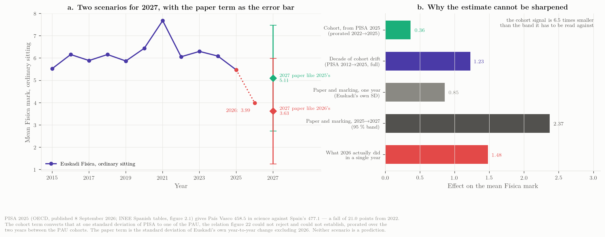

::: {.callout-important title="The short version"}
The Basque Física mean fell to **3.99** in June 2026. Of that fall, the part that is Euskadi's own — measured against the nine communities that have published a 2026 result — is **1.65 points**, all of it in one year. Two components of it can be quantified, each as a difference from the field: the choice removed from the paper beyond what other communities removed (about $-0.20$) and the Basque cohort's decline in excess of Spain's, as measured outside the Basque system (about $-0.12$). **The remaining four fifths cannot be attributed to anything with the data that has been published**, because paper content, reading load, marking severity and newly examined topics leave the same trace in a mean. Separating them needs marks at the level of the sub-task and the tribunal, which EHU holds and has not released. And a year earlier, in 2024, the Basque distribution had already changed shape — the top band fell six points further than the level implied while the pass rate rose 2.3 points where the level predicted a fall of 2.8 — the second-most-negative single-year move of the 170 in the national panel, on the last paper of the old format.

Three further things this round established. **More than half of what separates Euskadi from the field is not Física's**: on the balanced subject panel, Euskadi's Física sits $2.28$ marks below what the four comparators' Física did, and that gap divides into $-1.18$ which moved all of Euskadi's quantitative subjects together — Matemáticas II fell 1.67 — and $-1.10$ which is Física's alone. **A general marking severity cannot be the main cause**, because Lengua Castellana rose $+0.03$ and Biología $+0.15$ under the same tribunals; a severity confined to the numerical deductions fits the pattern, and one tally of the marking sheets would settle it. **No rate of cohort decay can be projected**: the PISA per-cohort-year change runs from $+3.7$ to $-7.5$, so it is a sequence of steps and not a slope, and the cohort is worth about a fifth of a mark a year against a paper worth 0.85.

If the 2027 paper resembles the 2026 one, the central estimate is **3.81**. If it resembles the 2025 one, **5.11**. The cohort accounts for a third of a mark of the difference; the paper accounts for the rest.
:::

::: {.callout-note title="How to read this document"}
Every statement carries one of four evidence classes: **official** (published by a university, a government or the Ministry, archived here with its hash), **press** (reported by the media, not verifiable at an official source), **modelled** (computed in the dossier from published aggregates, labelled as such), or **testimony** (the coordinator's account of decisions that were never published). Nothing here is a causal estimate: these are cohort statistics of different papers marked by different tribunals, and the paper changes every year. Bracketed chapter numbers refer to the dossier's chapters, which are listed in its sidebar.
:::

## The result

In the ordinary sitting of June 2026, 2 066 candidates sat Física at UPV/EHU. The mean was **3.99** and the pass rate **39.8 %**; **24.5 %** of the scripts scored two points or less (10 % in 2025) and **3.2 %** scored zero. The 2025 figures were 5.47 and 62.3 % on 2 189 candidates (official: the EHU deck of 6 July and the Ministry EPAU cube). EHU has not published the pass *count* (the rate implies 822–823), the July 2026 Física result, the tribunal-level Física table, the revision statistics for Física, nor any split by sex, language or territory — all of which it published for other subjects or in earlier years.

![Física in the Basque university-entrance exam, ordinary sitting, 2010–2026. **The ribbon carries two separate facts on the same axis**: the *law* under which the exam was set, and the *paper model* actually used. They do not coincide — LOMCE governed from 2017 but the paper did not change until 2020, and it changed then for COVID and not for the law — which is why they are two rows and not one band; the marked interval under them spans those two years. `L1` and `L2` are the two LOMLOE papers, keyed beneath. **COVID is two sittings and one model**: the darker tint is 2020 and 2021, both set under the relief measures — 2021 is the highest mean in the series, 7.69 — and the lighter one the four-of-eight paper they forced, which was then kept through 2024. **The grey line is the Ministry cube** for all seventeen communities and stops at 2025, because the 2026 cube is not published until June 2027. **The green marks** are this study's own cross-section of the nine communities that have published a 2026 result — a different population, and drawn detached for that reason. **The two arrows on the right are changes, not levels**, and both leave the same point, Euskadi's own 2025 mean of 5.47. The **blue** arrow is Euskadi's own change to 3.99, $-1.48$. The **green** arrow is the change of the nine-community field, $+0.17$, drawn from that same origin so that its head at 5.64 reads as *where Física would have ended had it moved with the field*. The bracket between the two heads is therefore the Basque-specific component, $-1.65$, exactly. The distance between the two 2026 **levels** is 1.87 and is *not* that component, because the two series did not start level in 2025 (5.47 against 5.69). The field is the mean of the nine **including** Euskadi, which is the conservative reading; against the eight others alone the component would be $-1.86$. The three values are the `total`, `common` and `basque_specific` terms of `data/analysis/decomposition.json`, computed by `scripts/21_decay_decomposition.py`. The Basque series is spliced from the EHU annual reports (2010–2022, all phases), the Ministry cube (2023–2025) and the EHU deck (2026); the three agree to ±0.02 where they overlap.](../plots/fig01_euskadi_series.png){#fig-b-series}

Three facts about the level [Ch. 2]:

- **3.99 is the lowest value of the whole series**, below the 2010–11 start of the two-phase PAU (4.45, 4.44). From 2012 to 2024 the exam produced means between 5.45 and 6.49 in every year but the COVID peak of 2021; a flat trend fitted to those twelve years leaves 2025 at $-0.69$ and 2026 at $-2.18$, which is seven residual standard deviations.
- **It is the second consecutive fall**: $6.09 \to 5.47 \to 3.99$. Against Euskadi's own pre-COVID norm the 2026 sitting is $-1.93$ on the Ministry's specific-phase series, $-1.91$ pooled and $-1.92$ on EHU's own published series — a third larger than the $-1.48$ in circulation, because 2025 was already 0.45 below that norm. (Three conventions, three numbers within two hundredths; this briefing uses the pooled one wherever communities are compared.)
- **A single-year change of $-1.48$ is rare but not unprecedented.** Across the 170 year-to-year changes in the Ministry panel (17 communities × 10 transitions, SD 0.74) exactly seven were as negative: Extremadura 2024 ($-2.10$), Cantabria 2017 ($-1.94$), Canarias 2019 ($-1.76$), Baleares 2025 ($-1.65$), Euskadi 2022 ($-1.62$, the post-COVID normalisation), Asturias 2025 ($-1.55$) and Cantabria 2025 ($-1.51$). What is exceptional is the *level*, and the two falls in a row.

## What happened elsewhere in Spain

In 2025, the first year of the LOMLOE competency exam, the Física mean fell in **14 of 17** communities by $-0.81$ on average; Euskadi's $-0.62$ was *milder* than the national move. In 2026, nine communities have a published result:

| Community | 2025 | 2026 | Δ | Basis |
|---|---:|---:|---:|---|
| Asturias | 5.49 | 6.62 | $+1.13$ | presented, 76.9 % pass — **press** (Uniovi release, not archived) |
| Madrid | 5.65 | 6.70 | $+1.05$ | chart labels, one decimal |
| Castilla-La Mancha | 5.86 | 6.80 | $+0.94$ | presented, n = 1 781 |
| Cataluña | 6.04 | 6.84 | $+0.80$ | eligible students ("aptes") both years, n = 8 021 |
| Comunitat Valenciana | 5.89 | 6.40 | $+0.51$ | presented, n = 5 259 |
| Andalucía | 5.69 | 5.86 | $+0.17$ | presented |
| Extremadura | 6.09 | 5.27 | $-0.82$ | **press** |
| Canarias (ULL + ULPGC) | 5.08 | 4.25 | $-0.83$ | presented, n = 1 395 |
| País Vasco | 5.47 | 3.99 | $-1.48$ | presented, n = 2 066 |

: The nine 2026 results found. Official unless marked press; the 2025 comparator is the Ministry's except for Cataluña, which is compared with itself on the aptes basis. The cross-section is unweighted: Madrid and Extremadura count equally [Ch. 3]. {#tbl-b-regions tbl-colwidths="[22,10,10,10,48]"}

{#fig-b-regions}

Six communities rose under the same national model in the same year; three fell. A national cause cannot produce opposite signs in the same year, so **the competency model can at most describe 2025; it does not explain 2026**. The eight remaining communities have published nothing; the Ministry's 2026 cube is due in June 2027.

There is a second reason not to read 2025 as a national collapse. Measured against each community's own 2015–2019 norm, **2020–2024 was a plateau, not a decline**: the nine communities sat $+0.50$ to $+1.05$ above their pre-COVID norm in every one of those years and returned to it in 2025 in a single step. The plateau is in every subject in the Ministry cube, and in 2025 every science subject came back to within about a fifth of a point of its norm while the humanities kept part of the lift. So the reform arrived in the same year as the end of a subject-general regime, and nothing in the PAU series separates the two. Against those norms the nine communities finish 2026 at $+0.02$ on average — but that average hides 2.9 points of spread, from Madrid at $+1.02$ to País Vasco at $-1.91$.

## What the fall is made of

This is the part of the briefing that bears on 2027, and it is new: it asks not how large the fall was but how many distinct things happened and which of them can be told apart.

{#fig-b-decomp}

### Three events, not one

A distribution can move in two ways: **location** (everything slides together, and the pass rate and the top band move exactly as the mean implies) or **shape** (they do not). The published aggregates can tell them apart, and the three recent Basque years are not the same kind of event.

| Year | Δ mean | Δ top band | what the level predicts | excess | Δ pass % | predicted | excess | Reads as |
|---|---:|---:|---:|---:|---:|---:|---:|---|
| 2023 → 2024 | $-0.21$ | $-9.0$ | $-3.1$ | $\mathbf{-5.9}$ | $+2.3$ | $-2.8$ | $\mathbf{+5.0}$ | **shape** |
| 2024 → 2025 | $-0.62$ | $-8.2$ | $-8.1$ | $-0.1$ | $-10.7$ | $-8.9$ | $-1.8$ | **location** |
| 2025 → 2026 | $-1.48$ | — | — | — | — | — | — | not published |

: The Basque steps against the locus fitted on all 187 region-years [Ch. 6]. {#tbl-b-steps tbl-colwidths="[16,11,12,14,11,11,11,14]"}

**2024 changed the shape and barely touched the level.** The mean moved 0.21 in a series whose year-to-year standard deviation is 0.85 — nothing. But the top band fell nine points where the level predicts three, and the pass rate *rose* two where the level predicts a fall of three. The distribution compressed: fewer at the top, more just over the line. As a move of the conditional top-band residual it is the **second-most-negative of the 170 transitions** in the national panel, and the largest negative move outside the LOMLOE year (two positive moves are larger in absolute size). It happened on the last paper of the old format, with the old choice rule and the old theory questions.

**2025 changed the level and not the shape**, and most of that change was the country's, not Euskadi's.

**2026 cannot be classified**, because EHU has not published the distribution. The two 2026 cohorts in Spain that do publish one — the two Canarian universities, at almost exactly the Basque level — are pure location shifts.

One consequence is worth spelling out, because it is easy to miss and it governs how the rest of the dossier should be read. A distribution can lose candidates from its top and gain them just above the pass line at the same time, and the two movements cancel in the mean. That is precisely what 2024 did: the 8–10 share fell 9.0 points while the pass rate *rose* 2.3, and what came out was a change in the mean of 0.21 — a twentieth of what the two band moves were worth separately. So every test in this dossier that works on the mean — the reference frames, the plateau comparison, Euskadi's rank among the communities — reports Euskadi at or near its own norm in 2024. Those tests are not wrong. They are answering a question about the average candidate, and the average candidate was where he had always been. The candidates who disappeared were at the top, and a mean cannot see them leave when others arrive from below. That is why this dossier reads the bands as well as the mean, and it is why the first thing that moved in the Basque exam moved in 2024, a year before the first LOMLOE paper.

### The mark budget

Of the 1.48 points lost between 2025 and 2026, how much is Euskadi's own? Comparing with the nine communities that have a 2026 result — the same nine in every year, so the comparison population never changes:

| Year | Euskadi mean | Δ total | Common to the nine | Basque-specific |
|---|---:|---:|---:|---:|
| 2024 | 6.09 | $-0.21$ | $-0.03$ | $-0.18$ |
| 2025 | 5.47 | $-0.62$ | $-0.65$ | $+0.03$ |
| 2026 | 3.99 | $-1.48$ | $+0.17$ | $\mathbf{-1.65}$ |

: The Basque change split into the country's move and Euskadi's own, pooled phase [Ch. 6]. {#tbl-b-budget tbl-colwidths="[16,22,20,22,20]"}

In 2025 Euskadi moved with the field to within three hundredths of a point: **the whole of that year's fall was national**. In 2026 the field rose $+0.17$ and Euskadi fell $-1.48$, so the Basque-specific component is **$-1.65$**.

That is the number to explain — not 1.48, which mixes a national recovery into a Basque fall, and not 1.93, which is the same thing measured from a different year.

### Which frame, and does it matter

Why measure a Basque fall against a Spanish field at all, when the question is what happened in Euskadi? Three frames give three numbers:

| Frame | What it asks | 2026 |
|---|---|---:|
| Year on year | how far did the Basque mean fall from 2025? | $-1.48$ |
| Against Euskadi's own pre-COVID norm | how far is 2026 from where Euskadi normally sits? | $-1.91$ |
| Against the nine-community field | how much is Euskadi's own, once the country's move is out? | $-1.65$ |

: The same result, three frames [Ch. 6]. {#tbl-b-frames tbl-colwidths="[28,50,22]"}

They span 0.43 of a mark. Nothing in this briefing turns on the choice, and every design implication below is the same under all three.

What the field buys is not size but **separation**, for one purpose no absolute number can serve: telling a year in which everyone fell from a year in which only Euskadi did. Read absolutely, Euskadi lost 0.62 marks in 2025 and that looks like a Basque problem. Read against the field, which lost 0.65 in the same sitting, there is nothing Basque in 2025 at all, and the whole of the anomaly is in 2026. Without the field the two years look like one slide of 2.10 marks; with it, they are one national event followed by one Basque event, and only the second is this office's to answer.

What the field is **not** is a control group, and the arithmetic should not be allowed to imply otherwise. These nine sat nine different papers, marked to nine different criteria, by nine different sets of correctors. Euskadi is the only community that moved all four reform axes in the direction the orientations ask for (optionality 75 % → 50 %, competency marks 25 % → 62.5 %, substantive context $+50$, contextualised marks $+75$); Castilla-La Mancha is the only other that both cut choice and raised competency content, and it cut contextualised marks by 45 points while doing so; Cataluña moved the competency share the other way; three communities moved on no axis but the contextualised share; and Asturias, which rose $+1.13$, sits outside the structural optionality band altogether at 100 % [Ch. 11]. Across the nine, the further a paper moved toward the competency model the further its mean fell ($r = -0.70$, $p = 0.035$) — but Euskadi is the extreme point on both axes and dropping it leaves $r = -0.40$, $p = 0.33$, so that is one community making the point rather than eight agreeing.

The practical consequence is a range. Against all eight other communities the Basque-specific component is $-1.65$; against the six whose papers barely moved, $-1.95$; against nothing at all, $-1.48$. It is somewhere in $[-1.95, -1.48]$, and it cannot be narrowed because nobody has calibrated these nine papers against each other. That is data request 9.

### Is the 1.65 Física's, or Euskadi's?

The budget is computed on Física alone, so it cannot distinguish two situations that call for different responses: something that happened to the *Física paper*, or something that happened to *Euskadi* — its cohort, its tribunals, its marking — and landed on Física along with everything else.

The subject results separate them without any modelling. EHU published eight subjects; four comparator communities published three of the same ones, giving a balanced five-by-three panel on which the Basque Física change splits into four terms that sum exactly to $-1.48$.

::: {#tbl-b-subj}


The balanced panel behind the split [Ch. 6].
:::

| Term | Marks | What it is |
|---|---:|---|
| Field core | $+0.06$ | what the three shared subjects did in the four comparators |
| Field Física premium | $+0.74$ | Física above its own community's mean in all four; the mean of $+0.38$ to $+1.29$ |
| **Euskadi-common** | $\mathbf{-1.18}$ | what moved all of Euskadi's quantitative subjects together |
| **Física-specific** | $\mathbf{-1.10}$ | what is left for the Física paper |

: The exact split of the $-1.48$ [Ch. 6]. {#tbl-b-split tbl-colwidths="[24,12,64]"}

Add the two Euskadi terms and Euskadi's Física sits **2.28 marks below what these four comparators' Física did** — the four-community analogue of the $-1.65$, larger because these four are among the communities that rose most, and no more a control than the nine are. What the split adds is the proportion: **slightly more than half of that gap, 1.18 of 2.28, is not Física's.** In the same sitting, at the same university, under the same marking specification, Matemáticas II lost 1.67 marks — more than Física — while Química ($-0.21$), Biología ($+0.15$) and Lengua Castellana ($+0.03$) did not follow.

That changes what the 2027 Física paper can be expected to fix. Rewriting it addresses the $-1.10$. It does not touch the $-1.18$, which is invisible to anything decided inside one subject's *ponencia*, and which the Matemáticas II coordination is presumably looking at from its own side without either group seeing the shared term. **The first operational consequence of this briefing is therefore that Física and Matemáticas II should be looked at together, and that is a decision for this office rather than for either ponencia.**

One caution: the comparator set is four communities and three subjects because that is all that was published by mid-September, and each of those communities changed its own papers too. A symmetric analysis of variance over all five leaves the Física-specific residual at $-0.88$ rather than $-1.10$; the conclusion — that the Euskadi-wide term is of the same order as the Física-specific one — holds either way.

### What can be subtracted, and what cannot

| Component | Marks | Range | Status | What would identify it |
|---|---:|---|---|---|
| Common to the country | $+0.17$ | — | observed | already separated |
| Choice removed, net of the field's own cuts | $-0.20$ | $-0.10$ to $-0.27$ | quantified (modelled) | option take-up and per-option means |
| Cohort: Basque PISA decline in excess of Spain's | $-0.12$ | $\pm 0.11$ (sampling error only) | quantified (modelled) | nothing inside the PAU; it is an outside measure |
| Paper content and reading load | — | — | **not identified** (the two are one signal, $r = +0.79$); the *cause* of the length is now measured, and it is the itemisation, not the competency items | sub-task marks |
| Marking severity (penalties, voided sections) | — | bounded: $0.65$ to $0.96$ of the Física-specific $-1.10$ | **sufficient, not identified** | the penalty ledger crossed with each script's mark, and the 2026 band table |
| Tribunal severity and spread | — | — | **not identified** | Física by tribunal |
| Newly examined topics | — | — | **not identified** (bounded: optional in June) | option take-up |
| Who sat the exam | — | — | **not identified** (bounded small) | enrolment and the 2025-26 school marks |

: Components of the Basque-specific 2026 change [Ch. 6]. {#tbl-b-components tbl-colwidths="[27,10,14,22,27]"}

Two rows changed again in the seventh round, and one of them changed for a reason that is not about marking at all. The **reading-load** row is unchanged in what it claims — the paper really is 39 per cent longer to read, and length really does track the fall across the nine communities — but its *cause* is no longer what this briefing said. Splitting both papers' statements into narrative, demand text and printed prices shows the contextual narrative at 71 words a printed statement in 2025 and **70 in 2026**, while the demand text more than doubled from 88 to 181 and the printed prices went from nothing to 17. The 2026 criteria itemise each apartado into sub-items of 0.25, and a paper marked that way must print each quantum's demand and each quantum's price. The length is the price of that decision ([Ch. 16](16-paradigm.qmd)). It matters here because the two causes are differently actionable: the competency requirement is imposed, the itemisation is local. The **marking** row tightens: only 14 to 19 of a script's 27 to 32 sub-items can attract a unit, prefix or rounding error, so the fitted intensity restated in countable currency is 0.67 penalties on every numerical answer of every script; and the linguistic channel, which this briefing twice called an unmodelled understatement, is capped by the criteria at 1.00 and fitted at 0.04.

The marking row changed status in the fifth and sixth rounds and is worth reading in full rather than from the table. What changed in 2026 was not markers becoming harsher on the same scale but a change of **regime**: a defect that until 2025 cost the part of the sub-task depending on it now costs that part *and* $-0.10$, uncapped, and a grave error voids the whole apartado. Put the published 2025 distribution through that regime and the four published 2026 figures come out together, on about twelve deductions per script ([Ch. 6](06-interpretation.qmd#penalty-regime)). But that model gives every candidate the same twelve, and when the penalties are allowed to fall unevenly — which is what anybody would expect — the regime is worth **less**, because a deduction removes a full $0.10$ only where $0.10$ is left and the zero floor absorbs the rest of any penalty aimed at weak work. Flat and equal is therefore the *most expensive* way to spend a fixed number of penalties, over every reading in which the weaker candidates collect more than their share. At twelve deductions the regime carries $0.96$ marks read flat and $0.89$ to $0.65$ read as a distribution: 87 % down to 59 % of the Física-specific $-1.10$ ([Ch. 6](06-interpretation.qmd#penalty-shape)). **So this row is a ceiling and a floor rather than an estimate**, and the difference between them — a fifth to nearly half a mark — stays with the rows above and below it. One unpublished table, the 2026 grade bands, would close the interval: refitted to everything that *is* published, the readings differ on the share at nine or above from 0.3 % to 6.1 %.

Two components can be quantified, and both have to be expressed as differences *from the field*, because the quantity they are subtracted from is one. **Choice**: removing the option from two of the four exercises is worth $-0.26$ by simulating both Basque formats on the same population and items; the other eight communities cut optionality by 6.25 points on average, and whatever that cost is already inside the $+0.17$, so the part that belongs here is about **$-0.20$**. **Cohort**: the Basque PISA decline in excess of Spain's — 13.6 of the 21.0 points — is worth about **$-0.12$** for one PAU year. Together **$-0.31$**, under a fifth of the Basque-specific fall. Both are modelled magnitudes under stated assumptions, not measurements: their quoted ranges are sensitivities to one assumption each, and the cohort's $\pm 0.11$ covers PISA's sampling error and nothing else.

The other **$-1.33$ — four fifths — is not attributed to anything**, and the reason is structural rather than a gap in the work: paper content, reading load, marking severity and syllabus exposure all leave the same trace in a mean. Length and competency content are one signal measured twice ($r = +0.79$ across eight communities), and the cross-community relation between length and grade change, taken literally, would assign 2.3 marks to the Basque paper's 45 % lengthening — more than the entire Basque-specific fall, which is itself the reason not to take it literally.

**Four fifths of what happened is therefore a bundle, not a mystery.** It has four named candidates, each with a different remedy, and one dataset — marks at the level of the sub-task — would go a long way towards separating them, though not perfectly: a section voided by a grave error and a sub-task nobody could start both appear as a zero on the same sub-task.

### Marking severity: the timing fits, and one version of it survives

2026 was the second year in which the linguistic component — 0.2 of a point for grammar, spelling and presentation — and the seven minor-error deductions of the marking specification were in force, and the first in which correctors had already applied them once. The seven are $-0.10$ each and are written for numerical work: units, a vector arrow missing from a vector, a vector arrow on a scalar, intermediate rounding beyond 5 %, a wrong SI prefix, a factor of ten, a transcription error.

The hypothesis that a rule applied cautiously in year one is applied in full in year two predicts little in 2025 and a step in 2026. **That is exactly the shape of the mark budget**: the Basque-specific component is $+0.03$ in 2025 and $-1.65$ in 2026. The timing fits, and that should be on the record.

The eight-subject table then separates two versions of it, because they predict different things.

::: {#tbl-b-severity}


The 2026 Basque subject changes grouped by which marking rules can reach them [Ch. 6].
:::

A **general** severity effect — spelling, presentation, "this year we apply the criteria in full" — reaches every subject that asks a candidate to write, which all eight of these do, and should move all eight together. They did not: the spread is 1.82 marks, and of the three subjects where written language is most exposed two rose (Lengua Castellana $+0.03$, Biología $+0.15$) while Euskara II fell $-0.48$. Whatever is common to all eight is at most the verbal mean of $-0.28$ — on the condition that the 2026 verbal papers were no easier than their predecessors, which is not known, since part of that $-0.28$ is the cohort and part each subject's own paper. **On that condition a general severity effect accounts for at most a fifth of Física's 1.48, and probably much less.**

A **quantitative-specific** severity effect is a different proposition, and the pattern fits it: the deductions can only reach Física, Química and Matemáticas II, and those three fell 0.84 marks further than the other five. The fit is not strong evidence — Química fell only 0.21, so the effect would not be uniform over the subjects it can reach, and Física and Matemáticas II share long symbolic derivations and a 2026 format change as well as the deductions. Eight subjects in one year is a pattern with a prediction attached, not a test.

**The test is cheap and the data already exist.** The linguistic component and the seven deductions are recorded separately when applied. A tally — how many scripts lost the 0.2, how many $-0.10$ penalties per script and of which type, in Física, Matemáticas II, Lengua Castellana and Euskara II, in 2025 and in 2026 — turns the hypothesis into two cross-tabulations. It collects nothing new and can be answered from inside the university. It is **data request 3**, and it is the only decisive item on that list obtainable in days rather than months.

One design consequence does not wait for the answer. The 2026 Basque paper raised the competency-coded share of its expected marks from 25 % to 62.5 %, the largest such move among the nine. Competency items ask for a calculation *and* an argument, so they are exposed to the linguistic component and the numerical deductions at once, where a bare calculation is exposed only to the second. If the deductions bite harder on that compound surface, the format change and the second year of full application are not two hypotheses but one — and nothing published can separate them, because both happened in Euskadi in June 2026 and in no other community.

## The shape of the collapse

Euskadi publishes four summary numbers; the two Canarian universities publish full histograms and are the closest empirical picture of the same event [Ch. 4].

| University, June | Exams | Mean | % < 2 | % < 5 | % in [5, 6) | % ≥ 9 |
|---|---:|---:|---:|---:|---:|---:|
| ULL 2024 | 731 | 5.60 | 10.5 | 36.8 | 17.5 | 9.8 |
| ULL 2025 | 796 | 4.92 | 19.1 | 46.6 | 16.2 | 8.9 |
| ULL 2026 | 683 | 4.08 | 25.2 | 61.5 | 11.9 | 3.1 |
| ULPGC 2024 | 796 | 6.15 | 6.5 | 32.0 | 12.6 | 16.1 |
| ULPGC 2025 | 758 | 5.25 | 14.0 | 45.4 | 13.3 | 12.5 |
| ULPGC 2026 | 712 | 4.41 | 22.6 | 57.2 | 12.8 | 4.9 |

: The Canarian histograms, from the ULL and ULPGC dashboards (official). {#tbl-b-canarias}

- **Canarias 2026 is the Basque twin**: ULL 4.08 / 38.5 % pass / 25.2 % below 2; ULPGC 4.41 / 42.8 % / 22.6 % — against Euskadi's 3.99 / 39.8 % / 24.5 % at or below 2.
- **Both moved along the locus.** Across the 187 region-years the pass rate and the top-band share are near-deterministic functions of the mean ($r = 0.974$ and $0.961$), and both Canarian cohorts sit on that relation; on the measure least dominated by the level they sit slightly above it. Nothing thinned the top relative to the middle. That is evidence against a compositional explanation, and it does not distinguish a harder paper from uniformly stricter marking.
- **The pass-line bunching thinned at the ULL** — scripts in $[5,6)$ from 17.5 % (2024) to 11.9 % (2026), worth about 5.6 points of pass rate — and did not move at the ULPGC (12.6 → 12.8 %). Whether EHU rounds at the threshold at all is not published.
- **For Euskadi the shape is modelled, not observed.** A Beta fitted to the published mean, pass rate and zero count gives a 2026 density with a mode near 2.5 and a median of 3.8, 14.6 % of scripts at 7 or above (30 % in 2025) and 2.1 % at 9 or above (5.9 %). Three caveats, and the third was learned the hard way. The fit under-predicts the published pass rate by 4.7 points, so every tail share read off it is pessimistic by about that much. The continuous part is zero at the origin while 3.2 % of scripts did score exactly zero, which the model carries as a separate point mass. And **that 2.1 % is a two-parameter curve's extrapolation above a region where nothing was measured**: it is what a smooth distribution implies, not what Euskadi observed, and the sixth round found this dossier quoting it elsewhere as though it were published. A model of the marking regime, fitted to the same four figures, puts 0.3 % there instead ([Ch. 6](06-interpretation.qmd#penalty-shape)). Two models can agree on everything published and disagree by a factor of eight on this — and across the seven readings of the marking regime the same band runs from 0.3 % to 6.1 %, a factor of twenty-three — which is why the band table is now a request in its own right and why no tail share above eight should be quoted from this fit without the word modelled attached. The observed fail share needs no model at all: it is **60.2 %**, the complement of the published pass rate, which is close to the ULL's observed 61.5 %.

## Inside the Basque system

**Subjects.** The damage is confined to the science-technical block [Ch. 5]. Euskadi 2025 → 2026: **Física $-1.48$, Matemáticas II $-1.67$**, Historia $-0.83$, Euskara II $-0.48$, Hª Filosofía $-0.29$, Química $-0.21$, Biología $+0.15$, Lengua Castellana $+0.03$. Cataluña shows the mirror image with the same authority and cohort (Física $+0.80$, Matemàtiques $-1.94$); Madrid rose in both; Andalucía split. Against Euskadi's own 2015–2019 norms, Matemáticas II, Química and Biología sat $+0.1$ to $+1.6$ above through 2021–2024 and at $+0.27$, $-0.01$ and $+0.31$ in 2025, while **Física was the only Basque science subject clearly below its norm in 2025 ($-0.39$)** — a year before the 2026 event, and the year after the 2024 shape step.

**School marks.** The Inspectorate's *Resultados escolares 2024-25* gives 2º Bachillerato Física: **4 541 students, 98.1 % passed, mean 7.09**. Only 45–48 % of them sit PAU Física, presumably the half that needs the weighting; even that self-selected half scored 1.6 points below its school mark in 2025 and, if school marks did not move, 3.1 points below in 2026. The school pass rate is 98 %, the exam pass rate was 40 %.

{#fig-b-school}

**Participation.** Presentation among those enrolled ran 64–84 % from 2017 (84.3 % in 2025); 2026 enrolment is unpublished, so the 5.6 % fall in candidates cannot be split into enrolment and abstention. Nationally the Física population grew 30 % over the decade while take-up — the share of PAU candidates sitting Física — moved only from 0.222 to 0.240, and within a community take-up is unrelated to the mean ($r = -0.10$, $p = 0.34$).

## The papers

**One finding in this section was corrected in the seventh round, and it is the one most often quoted from this briefing.** The Basque 2026 paper is 39 per cent longer to read than the 2025 one, and across the nine communities length is the strongest single correlate of the change in the mean ($r = -0.905$). Both of those stand. What does not stand is the account of *why* the Basque paper is long. Splitting both papers' statements into the narrative and context the competency form requires, the text that states what to do, and the printed prices, and normalising per printed statement because 2025 printed seven and 2026 six: **the narrative is unchanged — 71 words a statement against 70 — while the demand text more than doubled, 88 against 181, and the printed prices went from nothing to 17.** The 2026 criteria itemise each apartado into sub-items of 0.25, and a paper marked that way has to print each quantum's demand and each quantum's price. The length is the cost of the itemisation, not of the competency items ([Ch. 16](16-paradigm.qmd), [Ch. 6](06-interpretation.qmd#exposure-and-the-third-channel)). It matters for what follows because the two causes are differently actionable: the competency requirement is imposed from outside and cannot be declined, while the itemisation is a local decision, taken to protect candidates, which can be revisited at the cost of the protection.

Every exercise and option of the eighteen ordinary papers of 2025 and 2026 in the nine communities was coded on the EHU competency criteria (146 items). A blind second coder repeated the exercise: $\kappa = 0.76$ on the competency flag, 0.83–1.00 on drawing, graph reading, evaluation and explanation, 0.76 on application and 0.70 on the three-level context code. Every direction of change 2025 → 2026 is identical under both coders. Separately, the structural claims were verified against the thirty-two archived PDFs [Ch. 11, Ch. 13].

| Community | Δ mean | Optional % | Competency-style points, % of expected | Obligatory competency points |
|---|---:|---:|---:|---:|
| Asturias | $+1.13$ | 100 → 100 | 0 → 0 | 0 → 0 |
| Madrid | $+1.05$ | 75 → 75 | 0 → 0 | 0 → 0 |
| Castilla-La Mancha | $+0.94$ | 100 → 70 | 0 → 20 | 0 → 2.0 |
| Cataluña | $+0.80$ | 50 → 50 | 75 → 38 | 5.0 → 0 |
| C. Valenciana | $+0.51$ | 85 → 80 | 15 → 0 | 1.5 → 0 |
| Andalucía | $+0.17$ | 60 → 75 | 0 → 0 | 0 → 0 |
| Extremadura | $-0.82$ | 75 → 75 | 0 → 0 | 0 → 0 |
| Canarias | $-0.83$ | 100 → 70 | 0 → 0 | 0 → 0 |
| **País Vasco** | $\mathbf{-1.48}$ | **75 → 50** | **25 → 62.5** | **2.5 → 5.0** |

: Structure and competency content of the eighteen papers [Ch. 11]. {#tbl-b-papers tbl-colwidths="[24,12,20,26,18]"}

- **Five of the six rising communities did not increase the competency content of their paper.** The sixth, Castilla-La Mancha, added one obligatory contextualised item (0 → 20 %) and rose $+0.94$ — which is the single most instructive data point in the set, because it moved on that axis and on no other.
- **The Basque paper is the only one that changed genre**, and it moved on four axes at once: competency-style content 25 → 62.5 % of expected points, obligatory competency points 2.5 → 5, optionality 75 → 50 %, and a granular sub-task format with the highest count of marking criteria per item of the eighteen (2.67; Cataluña 2.33).
- **Cutting choice does not by itself set the direction.** Three communities cut optionality by 25 points or more: Castilla-La Mancha and Canarias by 30, Euskadi by 25. Two fell; Castilla-La Mancha rose.
- **Reading load.** Counting statement text only, the Basque paper lengthened **45 %**, from 1 335 to 1 940 words — against a median of about 1 200 across the eight communities with extractable papers, and a range from 899 (Asturias) to 1 628 (Cataluña). Across those eight the correlation with the grade change is $r = -0.905$ ($p = 0.002$). Three cautions, all material: it leads the contextualised-points measure only narrowly ($-0.86$), with which it is collinear at $+0.79$; the Basque paper is the leverage point, at $+45$ % against a next-largest $+19$ %; and the hypothesis was generated by the coordinator from his own paper, so it is exploratory whatever its $p$-value.

**Were the nine sitting comparable exams?** Measured against the three structural criteria as the EHU coordination applies them — optionality 50–85 %, at least 70 % open response, at least one obligatory contextualised item — eight of the nine 2026 papers comply and one does not: **Asturias, which rose $+1.13$, has 100 % optionality and no obligatory item at all**. Open response separates nobody: on the reading made here none of the 146 items uses a closed format, which is a judgement from the papers rather than a coded variable. A standardised index of how far each paper moved from its own 2025 predecessor — optionality, competency marks, substantive context, contextualised marks — puts **Euskadi first at $+1.76$ SD, more than a full standard deviation clear of the second**; three communities moved on no axis but the contextualised share, and none of the nine is at zero on all four [Ch. 11].

The natural conclusion — that the other communities' 2026 rises are partly an artefact of papers that did not change — is the right direction and it is not established here. What is established is narrower and still decisive for how the field number should be read: **the nine did not sit the same kind of exam, so the field is a comparison and not a control.** Whether every community was *required* to move as Euskadi moved cannot be answered from this study's sources: the text of RD 534/2024 and the Ministry and CRUE orientations were not retrievable during the data hunt and are not in the source registry, so no claim of non-compliance by anybody is made or implied. That gap is data request 9, and it is the difference between "Euskadi did what was required and others did not" and "Euskadi did more than was required" — a compliance question and a design choice respectively, with very different consequences for 2027.

**The Basque paper in its own history** [Ch. 12]. Four formats since 2010: two whole options A/B to 2019; the COVID "four-of-eight" 2020–2024; the 2025 paper (four problems of 2.5, one obligatory competency block, no theory); the 2026 paper (two obligatory competency exercises, two with a choice). From 2012 to 2024 all 104 theory questions reproduced verbatim a title from a closed official list of 22, sent to teachers and correctors with its development guide, worth 40 % of the marks. Of the modern-physics problems set in 2010–2024, 14 of 15 were the photoelectric effect. Spherical mirrors were first set in June 2025; standing waves with sound levels and carbon-14 dating in June 2026; a mass spectrometer, obligatory, in July 2026. Marking went from qualitative rules (2012–2024) to first numerical penalties (2025) to a printed $-0.1$ list with symbolic-first, grave errors that may void a section and 0.25-point sub-items (2026). None of those rules is unique — Canarias applies the same list and tightened it the same way, and fell; Andalucía prints a near-identical one and rose; Valencia requires symbolic-first and rose. By simulation, choice alone was worth $+1.24$ under the 2020–24 format, $+0.79$ under 2025 and $+0.53$ under 2026.

## The hypotheses, with verdicts

| Hypothesis | Verdict | Grounds |
|---|---|---|
| H1a The competency model **as a national frame** | Describes 2025 at most; does not explain 2026 | Applied in all 17 communities both years; 14/17 fell in 2025 with Euskadi milder; 6 of 9 rose in 2026. 2025 was also the end of a subject-general plateau and cannot be separated from it. The only systematic rating of PAU papers' competency orientation (Universitat Jaume I, six communities, 2015–2025, in *The Conversation*; primary article not located) places País Vasco and Cataluña among the *most* competency-oriented before the reform; Cataluña rose. |
| H1b The competency model **as the EHU implemented it** | First-order candidate; the strongest surviving explanation of 2026 | The frame was national; the implementation was not. On a reform-intensity index from four independent axes (optionality withdrawn, competency marks, substantive context, contextualised marks) Euskadi is first of nine at $+1.76$, the next community at $+0.39$. Five of the six communities that *rose* carry negative indices; $r = -0.70$, $p = 0.035$ across the nine, falling to $r = -0.40$, $p = 0.33$ without Euskadi — the relation *is* Euskadi. One community implemented the frame completely and alone. |
| H1c The syllabus reopened, and what the schools were prepared for | Plausible, unmeasured, not separable from H1b | The narrowing was *de facto* — mirrors, standing waves and nuclear decay were never excluded, only never set, over fifteen years. 2026 reopened them. The channel is preparation rather than an unavoidable item: in June the new sub-topics sat in *optional* slots, which bounds the effect and makes option take-up (request 5) the measurement. Separable from H1b in principle, not in published aggregates: both are properties of one paper in one year and both displace the whole distribution. |
| H2 The 2026 Basque paper **as a format** — length, optionality, genre | Consistent with everything; first-order variable | Set apart from H1b: reading load $+45$ %, to about 1 430 words of statement; choice halved, two of four problems carrying none ($-0.26$ by simulation); the only paper in the set that changed genre. The whole distribution displaced; damage confined to Física and Matemáticas II; the Catalan mirror image. |
| H3 Tribunals marked more severely | Possible, unmeasured, acknowledged by EHU | The rector reported "significant variation between panels" in Física; the 6 July deck gave tribunal ranges for three other subjects and not for Física. The whole-cohort shape says severity, if present, was general rather than confined to a few panels. Only the tribunal table settles it. |
| H4 A weaker or differently composed cohort | Weak inside the PAU; real outside it | Presentation fell 5.6 %; the same students held Química and Biología; take-up flat; the Canarian cohorts sit on the locus. But PISA shows a decade-long Basque decline that the PAU sees only in Física and only from 2025. |
| H5 Weighting rules make Física dispensable | Plausible slow driver, not a 2026 trigger | The Canarian coordinators' hypothesis for their own decline; fits a slow erosion better than a 1.5-point fall. |
| H6 Language or network bias | No evidence either way for Física | Only the Euskara II bias analysis was run; the 2010–2022 differences are small and of both signs. |

: Ranking: H1b and H2 together at the front and not separable on published aggregates; H1c plausible behind them; H3 unresolved and testable; H5 background; H1a a 2025 coincidence; H4 unsupported inside the PAU; H6 unsupported [Ch. 6](06-interpretation.qmd). {#tbl-b-hyp tbl-colwidths="[24,14,62]"}

## PISA 2025 and the 2027 estimate

PISA is the one instrument that measures these students and is marked outside the Basque system. A standing Basque advantage in science became a deficit a decade ago: $+6.2$, $+6.4$ and $+9.2$ points above Spain in 2006, 2009 and 2012; then a fall of 22.6 points between 2012 and 2015 while Spain fell 3.7, and no recovery. **PISA 2025, published on 8 September 2026, is the cohort that sits the PAU in 2027 and is the weakest recorded**: Basque science 458.5 against Spain 477.1 and the OECD 481.9, a gap of $-18.6$ (one standard error 4.7), with the Basque share at proficiency levels 5–6 falling from 3.32 % to 1.83 %.

{#fig-b-2027}

Converting that into a PAU estimate is arithmetic, and the arithmetic is the finding. The Basque PISA fall of 21 points is 0.23 of a student standard deviation; transferred one-for-one to the PAU and prorated over the two years between the 2025 and 2027 cohorts it is a **cohort term of $-0.36$ marks**, or $-0.18$ measured from 2026. Three conventions sit inside that number and should travel with it: the transfer is one-for-one because nothing in the data rejects it; the PAU standard deviation of 2.343 comes from the Comunitat Valenciana's published figures, the only ones available; and the PISA standard deviation of about 90 is Spain's.

| If the 2027 paper resembles | Cohort term | Central estimate |
|---|---:|---:|
| the 2025 paper | $-0.36$ | **5.11** |
| the 2026 paper | $-0.18$ | **3.81** |

: Two scenarios for 2027 (modelled). {#tbl-b-2027}

**PAU 2027 is not something PISA predicts; it is something the 2027 paper and its marking decide.** The two scenarios differ by 1.3 marks; the cohort contributes a third of a mark. Two practical uses: assume an intake slightly weaker than 2025's and considerably weaker than the decade's average, and set the paper with that in mind rather than against a remembered cohort; and when the 2027 result arrives, about $-0.36$ is the part that should not be attributed to the paper.

### Can a rate of decay be projected?

The coordination has asked whether the cohort decline can be turned into a *rate*, so that a PAU year could be anticipated before it is sat. Four answers, in order.

{#fig-b-cohortrate}

**The rate is not a slope.** Between consecutive PISA rounds the Basque change per cohort-year runs $+0.01$, $+3.65$, $-7.53$, $+1.44$, $-1.97$, $-6.99$ points — a spread of 11.2 points a year around a mean of $-1.90$. Two of the six intervals carry almost the whole decline and three are flat or positive. A line fitted through them would have a slope, and quoting it would put an honest interval around the wrong model. The cohort that sat PAU 2026 was fifteen in spring 2024, between rounds, so PISA never measured it at all: the cohort term used above interpolates, and assumes the fall was spread evenly over three cohorts.

**A constant within-cohort degradation is invisible, and that is the right answer rather than a failure.** Write the PAU mean as $s[A(c,15) + G(c)] + \mathrm{sel}(c) + \mathrm{paper}(y) + \mathrm{marking}(y)$, with $G$ the gain or loss over the three school years. PISA delivers $A(c,15)$ and nothing about $G$, which enters every year-to-year difference alongside the paper term — the largest and least measured term in the dossier. A $G$ that is *constant* cancels in every difference: it is invisible precisely because it is irrelevant to the question the office faces, which is why one year differs from the next. A $G$ that is *changing* would matter, and would show as the PAU falling faster than PISA for matched cohorts. It falls more slowly ($-0.157$ against $-0.245$ SD per decade in Euskadi, difference $p = 0.67$) — no support for acceleration, and at four to six points per series no refutation either.

**The motivated/unmotivated split is real, and in 2026 it runs the wrong way for dilution.** If more candidates sit Física without needing the mark, the mean falls with nobody's ability changing. In 2026 it cannot have happened: 2 066 sat Física against 2 189 in 2025, 5.6 % fewer. On the assumption most favourable to the dilution story — that the ones who stayed away were the weakest — the 2026 group should have scored **0.29 marks higher** on an unchanged paper. The composition change is a credit against the fall, not a part of it. (2025 is the opposite case, 22.4 % more candidates with a mean 0.62 lower; and the budget assigns 2025 almost wholly to the national component in any case.)

**How much of a population shift reaches the candidates** depends on how selection works, and the two natural rules differ by a factor of four: 0.23 of the shift under a fixed ability bar, exactly 1.00 under a fixed share. The evidence points at the second — a falling population under a fixed bar should produce falling take-up, and take-up instead drifts slightly up (0.222 in 2015 to 0.240 in 2025, $r = -0.096$, $p = 0.34$) — and independently, the Basque PISA fall is a location move rather than a collapse of the top: the level 5–6 share went 3.32 % → 1.83 % where a uniform shift of the whole distribution predicts 1.92 %, a discrepancy of just under five per cent of the predicted share. So the one-for-one conversion used above is defensible, but it is the *top* of the range: the cohort term is an upper bound in magnitude and could be as small as $-0.03$ a year.

**What follows for practice.** A cohort projection is real, is worth about a fifth of a mark a year, and is swamped by the choice of paper: one standard deviation of paper-to-paper variation is 0.85, nearly five times the cohort term, and the 95 % band one year out is 1.68, roughly nine times it. It belongs in the office's expectations and not in its targets. If the 2027 mean comes in half a point below 2026, nothing about the cohort will have been demonstrated; if two points above, nothing will have been refuted.

**What would give a rate** is not PISA, which measures every three years and stops at fifteen. It is a yearly census measure of Basque fifteen-year-olds, bracketed at the other end by the school marks of the same cohort at eighteen — which EHU already holds paired with the PAU mark for every candidate, and which this study has for one year only (7.09 against 5.47 in 2025). That pairing over several cohorts is the design that separates a cohort arriving weaker from a cohort being taught and examined differently. It is **data request 8**.

## What the evidence does not establish

The dossier was audited twice, on 19 and 20 September: every script re-run from the raw sources, every number recomputed independently by readers working only from the files, the exam papers re-read as PDFs, all 25 figures checked against their data, and the reasoning read step by step. The second audit corrected the first, which had reported three corrections it had not applied. Everything above is the audited version [Ch. 13].

What remains genuinely open:

- **H2 against H3 cannot be separated from published data.** A harder paper and uniformly stricter marking leave the same whole-cohort signature.
- **Three quarters of the Basque-specific fall is unattributed**, among four named candidates that the published aggregates cannot prise apart.
- **The 2026 Basque distribution is modelled.** Only the observed histogram would say whether it, like the Canarian cohorts, moved without reshaping.
- **Whether 2024 and 2026 are one mechanism or two** is undecided. A compression at the top in 2024 and a collapse of the level in 2026 are compatible with a single slow change in what the marking rewards, and equally compatible with two unrelated events.
- **The Euskadi-common $-1.18$ has no candidate explanation at all.** It is larger than the Física-specific term, it moved Matemáticas II further than Física, and nothing in this dossier isolates it. It is not the Física paper, because Química and Biología sat the same tribunals and did not follow.
- **The two versions of the severity hypothesis are not separated.** The subject pattern excludes a general effect as the main cause and is consistent with a numerical-deduction effect; consistency over eight subjects in one year is not a test, and the deduction tally is.
- **The within-cohort term cannot be identified** from PISA and the PAU together, at any sample size, because it enters every difference alongside the paper term. Only paired school and PAU marks over several cohorts would bound it.
- **Several figures are press-sourced** (Extremadura 5.27; Asturias's headline and subject values; the EHU July figures; the Catalan revision requests) and should be confirmed before being quoted onward.

## Data to request, and what each would separate

Ordered by how much of the unattributed $-1.33$ each would resolve, not by how easy it is to obtain. Items 3, 8 and 9 are new since the first version of this briefing.

1. **Sub-task marks for a stratified sample of 2026 scripts** (say 300, across tribunals): the mean and distribution of marks on each numbered sub-task of each exercise and option. *Separates all four* unattributed components at once, because each leaves a different signature — marks lost in the obligatory competency exercises rather than the options (content); in the explain-and-evaluate sub-tasks rather than the calculations (genre); through accumulated $-0.1$ penalties and voided sections (marking); only among those who chose the new options (exposure).
2. **Física by tribunal, 2025 and 2026**: $n_j$, $\bar{x}_j$, $s_j$ and the school composition of each tribunal's scripts. EHU computed this and published the equivalent for three other subjects. *Separates* tribunal severity, and shows whether what is visible in 2026 was building in 2025.
3. **The deduction tally, 2025 and 2026, for Física, Matemáticas II, Lengua Castellana and Euskara II**: how many scripts lost the 0.2 linguistic component, and how many $-0.10$ minor-error deductions were applied per script, by type. *Separates* general marking severity from the quantitative-specific kind. **This is the cheapest decisive request on the list**: it collects nothing new, the four subjects are already marked, and the comparison the coordination wants falls out of two cross-tabulations. If one item can be obtained quickly and from inside the university, it is this one.
4. **The full Física histogram for 2024, 2025 and 2026**, in one-point bands with the zero and ten counts. *Separates* location from shape in 2026 — the classification this study could not make — and tests the 2024 compression directly.
5. **Option take-up in 2026**: how many chose each of 3a/3b and 4a/4b, and the mean of each. *Separates* syllabus exposure from paper difficulty, and measures the realised choice premium against the simulated $-0.26$.
6. **July 2026 Física**: presented, passed, mean. *Separates* whether the June pitch was that paper or the 2026 marking.
7. **Revision statistics for Física 2026**. *Separates* marking severity weakly but cheaply.
8. **School mark and PAU mark, paired, for every Física candidate of the last five cohorts**, with sex, language and territory, and the enrolment figures published until 2022. *Separates* two things: who sat the exam, which is currently bounded rather than measured; and, over cohorts, the within-cohort term $G$ — the only instrument available for it, since the school mark and the PAU mark are two measurements of the same students weeks apart against two different standards.
9. **The other eight communities' 2026 papers and marking criteria with their published means**, and the text that fixes the structural criteria nationally, if it exists. *Separates* nothing inside Euskadi, but decides how much weight the field comparison can carry. Until it is settled, the $-1.65$ is a comparison with communities that did something different, not with a control group.
10. **The record of the correctors' meeting held before the 2026 sitting**: agenda, attendance and the criteria document circulated. *Separates* nothing by itself, but it is what turns the account of the regime change from testimony into record. It costs nothing to retrieve.
11. **The 2026 grade-band table for Física** — the shares in $[0,5)$, $[5,6)$, $[6,7)$, $[7,8)$, $[8,9)$ and $[9,10]$, the same table published every year through 2025. *Separates* how the penalties were spread across candidates, and with it how much of the fall the marking can be held to account for. Seven readings of the same regime, each refitted on its own parameters, match all four published figures and differ on the share at or above nine by a factor of twenty-three — 0.3 % if the penalties fell evenly on everybody, 6.1 % if they concentrated on the weakest — which is the difference between the marking accounting for 87 % of the Física-specific fall and 59 % of it. **This is the cheapest request on the list**: the table is a by-product of a tabulation already run and it was routine until last year. The $2.09$ % this dossier quotes for that band is its own smooth-curve extrapolation and is labelled modelled throughout; it is not a substitute.

**If request 1 is refused as too laborious**, the substitute is a blind re-marking of a stratified sample of 2026 scripts by a second panel: it costs marking time instead of clerical time and it answers requests 1 and 2 together. **If request 2 is refused**, requests 4 and 7 together give a weaker version of the same answer. Nothing substitutes for all three. **Request 3 is the exception to the ordering** — it is decisive for one component and obtainable within days, so it should be made first whatever else is agreed. **Request 11 is the second exception**, for the same reason and at even lower cost: it is one table that already exists, and it settles a question on which two readings of the same marking regime differ by a factor of twenty-three.

## Design levers for 2027, ordered by evidence and cost

None of these is a recommendation to abandon the competency model, which the evidence does not indict: the most competency-oriented papers in Spain before the reform — Cataluña's and Euskadi's own, on the one systematic rating available — sit in communities that went opposite ways in 2026, and Cataluña's decade of fully contextualised papers is in the one that rose.

1. **Record the paper's parameters before the sitting** and read the result against them: statement length per exercise, competency share, optional share, penalty rules, topics examined, and the PISA cohort term ($-0.36$). Costs nothing, requires no new belief, and is what makes 2027 interpretable whatever it produces. *Evidence: not needed — this is measurement, not a hypothesis.*
2. **Treat Física and Matemáticas II as one problem.** More than half of the Basque-specific fall is a term the two share, and neither *ponencia* can see it from inside its own subject: Matemáticas II fell 1.67 on the same cohort and the same tribunals. A joint reading of the two subjects' 2026 results — and, when it arrives, of the deduction tally for both — is the cheapest way to find out whether the shared term is the cohort, the marking regime, or the simultaneous format change in two quantitative subjects. *Evidence: the exact subject split, which is arithmetic rather than a model; what the shared term* is *remains open.*
3. **Keep a monitoring set**: mean, pass rate, band shares, and each subject's mean against its own 2015–2019 norm, computed per tribunal. The subject-against-own-norm comparison is what showed that Física alone was below norm in 2025; the band shares are what would have shown the 2024 compression at the time. *Evidence: strong — both findings came from these statistics.*
4. **Set and record a target statement length — and decide where the words come from, which is a separate decision and the harder one.** The 2026 statement was 45 % longer than 2025's and the longest of the sixteen papers whose text could be extracted; the 2026 median across those is about 1 200 words and the 2025 Basque paper was 1 335. A target near the Basque paper's own 2025 length — say 1 300–1 400 words for the whole statement — is the defensible starting band, and it is a bookkeeping target rather than a finding. **What the seventh round adds is that the slack is not where this briefing previously implied it was.** Per printed statement the contextual narrative is already at 70 words and has not grown since 2025; the growth is 93 words a statement of demand text and 17 of printed prices, both of which exist because the marking is itemised into quanta of 0.25 and printed on the paper. Four routes, three of which this dossier can price in words and none in marks: compress the narrative (there is not 470 words of slack in it); flatten two levels of demand back to one (cheapest, and it returns partial credit to the corrector's discretion); itemise in the criteria as now but print only the apartado and its total (the only route that separates the reading cost from the protection, and nobody has tested whether candidates use the printed weights); or leave the length alone and cap the deductions instead, which is item 8. *Evidence: the strongest cross-community association in the study by a short head ($r = -0.905$ against $-0.86$ for contextualised points), and the weakest causally — it is post-hoc, collinear with competency content, and leveraged by the Basque paper itself. The decomposition of the statement, by contrast, is a direct measurement of the Basque papers themselves and is corroborated independently by the coordination's own reconstruction, which prices the itemisation step at 66 words on one problem.*
5. **Restore a choice inside the obligatory competency exercises** — two contexts, the same *saber básico* — rather than restoring optionality elsewhere. The two simulated formats differ by 0.26 of expected mark; a third format with a choice inside the obligatory exercises was not simulated, so that figure is an indication of the size of the lever and not a prediction for it. *Evidence: a simulation of the actual formats, plus the coincidence of the most generous choice rule with the highest means in the series. Note that cutting choice did not set the direction: Castilla-La Mancha cut it by more and rose.*
6. **Publish which *saberes* can carry a problem in 2027, with model items.** For fifteen years modern physics meant the photoelectric effect; in 2026 three topics were examined for the first time. Opening the syllabus is legitimate; opening it unannounced in the same year as everything else is not what the record recommends. *Evidence: the inventory of 146 problems, plus the coordinator's account of the restriction.*
7. **Pace the deployment: change one axis a year and announce it.** The one paper that moved on four axes at once fell furthest; the 2025 break taken alone was absorbed better than the Spanish average. *Evidence: n = 1 — and the count of axes is four on this study's own coding, three on an earlier one — which is why it sits seventh rather than first despite being the most plausible recommendation in the list. 2028 is the year the model is to be fully deployed.*
8. **Decide the marking questions explicitly, and count the deductions first.** The tally of request 3 comes before any decision here, because it says whether the second year of the criteria was in fact stricter and whether it was stricter in the same way for a physics script as for a language script. Then three questions the seventh round makes concrete. **Whether the $-0.10$ deductions should stay uncapped**, when the linguistic penalties in the same criteria are capped at 1.00 and every other community that specifies a cap applies one to the numerical deductions too — Andalucía at $-0.25$ per apartado, Extremadura at 1.00, Canarias at 20 % of the section until it removed the cap in 2026. **Whether a penalty of $0.10$ belongs in a scheme built on a quantum of $0.25$**, since one deduction takes a sub-item to 0.15 and no script is on the grid after the first. And **whether the deductions should fall on half the paper**: only 14 to 19 of a script's 27 to 32 sub-items can attract a unit, prefix or rounding error, so the uncapped penalties land on the numerical part — which is precisely the part the itemisation was introduced to make forgiving. Then also: whether grave-error clauses that void a whole section are applied uniformly across tribunals (the tribunal table will show it), and whether borderline rounding is wanted — at the ULL its thinning was worth about 5.6 points of pass rate, while the ULPGC shows no such bunching at all, and whether EHU rounds at the threshold is not published. *Evidence: no single rule is indicted; their joint introduction in one year is.*
9. **Calibrate against a target distribution and pre-test.** The Ministry cube gives a full band distribution for every subject, community and year; the 2017–2024 Basque structure outside the COVID peak is $[0,5)$ ≈ 30 %, $[9,10]$ ≈ 16 %. A pre-test on 40–60 Bachillerato students from two or three centres, sat under exam conditions on a paper that will not be used, gives a usable mean to within about half a point and a clear read on whether the paper can be finished. *Evidence: the practice exists informally in other communities' ponencias; its effect here is untested.*
10. **Second marking and external review** of the paper before the sitting, on the Galician 2027 model (peer review of papers, double marking), with Rasch equating of tribunals as the statistical complement. *Evidence: one Galician announcement and one methodological literature; no effect measured in this data.*
11. **Timetable.** Física sits in the last slot of the science day in Canarias, whose coordinators name it as a factor; the Basque timetable is a free parameter. *Evidence: one set of minutes from another community.*

**What this needs from the office.** Items 1 and 3 are decisions for the coordination alone and can be taken now. Item 2 needs the office, because no single *ponencia* can convene it. Items 4 to 8 belong in the 2027 coordination instructions and therefore have to be settled before those instructions go to schools — which, on the 2026 calendar, means before the end of the autumn term. Items 9 to 11 need the admissions office: a pre-test needs permission and centres, double marking needs budget, and the timetable is set centrally. And the data requests are the office's to make of EHU; nothing in the first three levers is blocked by them, but the choice between remedies in items 4 to 8 is — and request 3, the deduction tally, is both the cheapest and the one that would most change which of those remedies is right.

## Sources and reproducibility

The dossier archives 166 source files with their hashes: the EHU decks and annual reports, the Ministry EPAU cubes 2015–2025, the Basque Inspectorate's school results, the transcribed dashboards of ULL, ULPGC and UCLM (recorded as read, without file hashes), the 2025–2026 papers of nine communities with the corrector documents that exist for seven of them, the complete EHU archive 2010–2026, the official theory list, and the INEE PISA tables 2006–2025. Every number in this briefing is produced by a script in `scripts/` from those files and can be regenerated with one command; the two audits and their layer reports are in `logs/`. The figures are reproduced as generated, with English labels.
