# Overview {#sec-overview .unnumbered}

## Headline numbers

::: {.kpi-row}
::: {.kpi .bad}
[3.99]{.v}
[Física mean, Euskadi, June 2026 (2025: 5.47)]{.l}
:::
::: {.kpi .bad}
[39.8 %]{.v}
[pass rate, Euskadi 2026 (2025: 62.3 %)]{.l}
:::
::: {.kpi .bad}
[24.5 %]{.v}
[of Basque Physics exams at ≤ 2 points (2025: 10 %)]{.l}
:::
::: {.kpi}
[9 / 17]{.v}
[communities with a published 2026 Física mean (3 down, 6 up)]{.l}
:::
::: {.kpi .bad}
[4.08 · 4.41]{.v}
[Tenerife (ULL) and Las Palmas (ULPGC), June 2026 — the Canarias twin]{.l}
:::
::: {.kpi .good}
[+0.80]{.v}
[Cataluña Física 2025→2026 (6.04 → 6.84, 8 021 students)]{.l}
:::
:::

## What this study adds

The July 2026 package in this project (`fisica_pau_ehu_package`, `hist_evolution`) already held the Euskadi Physics series 2010–2025 and the Ministry EPAU cubes 2015–2025. The question the user asked on 18 September was different: *since then, what else has been published, anywhere in Spain, and what does the whole body of evidence say?* This site answers in three layers.

**Data hunt** ([Chapter 1](#sec-ch01)). Five parallel searches (Euskadi/EHU; Ministry and north-east; south; north-west, Madrid and Valencia; literature and national press) plus a second pass with a real browser on the official dashboards that block automated readers. Nine communities now have a 2026 Física mean; two of those (Castilla-La Mancha and Canarias, through Tenerife and Las Palmas), together with La Rioja's 2010–2022 series, were retrieved from dashboards or chart-only PDFs that no search engine indexes. The Basque Government's school-results report gives, for the first time in this project, the *school* Physics marks of the cohort that sits the PAU.

**Independent analysis** ([Chapters 2–6](#sec-ch02)). Everything is recomputed from the raw files with the scripts in `scripts/`. The Ministry cubes are parsed with a small dependency-free PC-Axis reader and the result is checked cell-by-cell against the July package (exact agreement, [Chapter 10](#sec-ch10)). Where a number is modelled rather than observed (the implied 2026 grade distribution) it is labelled as such.

**Log and sources** ([Chapters 8–9](#sec-ch08)). Every figure on this site can be traced to a URL, a page number or a dashboard filter, and every dead end is recorded so that the next update does not repeat it.

## Fifteen findings in one paragraph each

**1. The 2025 fall was national; the 2026 fall is regional.** Across the 17 communities the ordinary-sitting Physics mean changed by $-0.81$ points on average between 2024 and 2025 (14 of 17 fell), the first year of the LOMLOE competency exam. Euskadi's $-0.62$ that year was *milder* than the national move. In 2026 most communities that have reported bounced back ($+0.5$ to $+1.13$ for Asturias, Madrid, Castilla-La Mancha, Cataluña and C. Valenciana; $+0.17$ for Andalucía), while Euskadi ($-1.48$), Canarias ($-0.83$) and Extremadura ($-0.82$) fell further. Measured against the pre-COVID norm rather than the previous year, 2025 was a return to the 2015–2019 level in every subject, so the reform's first year coincides with the end of a five-year plateau and cannot be separated from it; neither explains 2026. ([Chapter 3](#sec-ch03))

**2. A one-year change of $-1.48$ is rare but not unprecedented; the *level* is what is exceptional.** In the Ministry panel of 170 year-to-year changes (17 communities × 10 transitions, 2015–2025) the standard deviation is 0.74 and only 7 changes were as negative — Extremadura 2024 ($-2.10$), Cantabria 2017 ($-1.94$), Canarias 2019 ($-1.76$), Baleares 2025, Euskadi itself in 2022 ($-1.62$, the post-COVID normalisation), Asturias 2025, Cantabria 2025. But a mean of 3.99 is lower than any ordinary-sitting regional mean in the eleven years of Ministry data except Canarias 2019 (3.60), and it is Euskadi's second consecutive fall: $6.09 \to 5.47 \to 3.99$. ([Chapter 2](#sec-ch02))

**3. Canarias 2026 is the Basque case's twin.** Tenerife (ULL): 683 exams, mean 4.08, 38.5 % pass, 30 zeros, 25 % of exams below 2. Las Palmas (ULPGC): 712 presented, mean 4.41, 42.8 % pass, 22.6 % below 2. These histograms, read directly from the universities' dashboards, show the same shape the Basque summary statistics imply: a flat-to-decreasing density with a heavy tail at 0–2 and a collapsed top decile. They are the best available empirical picture of what "3.99 / 39.8 % / 24.5 % ≤ 2" looks like exam by exam. ([Chapter 4](#sec-ch04))

**4. In Euskadi the damage is concentrated in the science-technical block; elsewhere the pattern differs by subject.** Euskadi 2025→2026: Física $-1.48$, Matemáticas II $-1.67$, Historia $-0.83$, Euskara $-0.48$, Química $-0.21$, Biología $+0.15$. Cataluña: Física $+0.80$ but Matemàtiques $-1.94$. Madrid: Física $+1.1$ on the chart labels ($+1.05$ against the Ministry 2025 baseline), Matemáticas II $+0.5$. Andalucía: Física $+0.17$, Matemáticas II $-0.59$. The subject-by-region pattern is not the signature of a single national exam-model effect; it is the signature of regional paper design and marking, subject by subject. ([Chapter 5](#sec-ch05))

**5. The same students carry a school Physics mark of 7.09.** The Basque Inspectorate's *Resultados escolares 2024-25* gives 2º Bachillerato Física: 4 541 students, 98.1 % pass, mean 7.09 (public 7.04, private/concertada 7.15; models A/B/D 6.93/7.31/7.09). Roughly 45–48 % of them sit PAU Física. The school-to-exam gap was 1.6 points in 2025 and, if school marks did not move, 3.1 points in 2026. ([Chapter 5](#sec-ch05))

**6. The papers of the communities that rose did not become more competency-oriented; the Basque paper did, and changed genre.** Coding every exercise of the eighteen 2025 and 2026 ordinary papers (nine communities) on the EHU competency criteria: Asturias, Madrid and Andalucía had no competency-style exercise in either year; Cataluña was already fully contextualised in 2025 and did not change; Valencia replaced its 2025 competency-style obligatory item with a lighter one; only Castilla-La Mancha added one contextualised obligatory item (0 → 20 % of expected points). Euskadi went from 25 % to 62.5 % of expected points in competency-style exercises, from 2.5 to 5 guaranteed points, halved its optionality (75 % → 50 %) and moved to a granular sub-task format — four changes at once, and the largest change of any paper in the set. Canarias, which cut choice without adding competency content, fell too. Against the three structural criteria the Basque coordination works to, eight of the nine 2026 papers comply and one does not — Asturias, which rose $+1.13$, has 100 % optionality and no obligatory item — and on a standardised index of how far each paper moved from its own 2025 predecessor Euskadi ranks first at $+1.76$ SD, more than a full standard deviation clear of the second, and is the only community that moved all four axes in the direction the orientations ask for. The nine therefore did not sit the same kind of exam, which makes the field a comparison and not a control; whether the criteria bind every community cannot be answered here, because the binding text is not in the source registry. ([Chapter 11](#comparability))

**7. Against its own sixteen-year history, the Basque paper changed twice, and the second change is the one the grades react to.** The 34 EHU papers since 2010 show a very stable exam, in two successive formats — until 2019 two options with two problems and two theory "questions" that reproduced, verbatim, titles from an official EHU–Department list of 22 (40 % of the marks; the list, with its marking guide, was in teachers' hands), problems drawn from about a dozen templates (of the modern-physics problems set in 2010–2024, 14 of 15 were the photoelectric effect; mirrors, standing waves, sound levels and radioactive decay were never set), qualitative marking rules, and — from 2020 to 2024 — the most generous choice rule the exam ever had (+1.2 points of expected score through choice alone, by simulation). The 2025 paper removed the theory, restructured the paper and introduced numerical penalties, and the Basque mean fell *less* than the national average. The 2026 paper doubled the obligatory competencial share, halved choice (worth about −0.26 by simulation), printed a −0.1 penalty list with symbolic-first and 0.25-point sub-tasks, and opened the de facto syllabus (modern physics to any topic; in June, standing waves with sound levels and carbon-14 dating, both examined for the first time; in July, a mass spectrometer, also a first, and obligatory). No rule is unique to Euskadi — Canarias applies the same penalty list and also fell; Valencia requires symbolic-first and rose — but no community that rose moved on all axes at once. ([Chapter 12](#sec-ch12))

**8. The fall has an internal structure, and four fifths of the Basque part of it cannot yet be attributed to anything.** Measured against the nine communities that have published a 2026 result, Euskadi's own component of the 2026 fall is $-1.65$ — and in 2025 it was $+0.03$, so the whole of that year's fall was the country's. Of the $-1.65$, the choice removed from the paper beyond what other communities removed accounts for about $-0.20$ and the Basque cohort's decline in excess of Spain's for about $-0.12$; the remaining $-1.33$ cannot be separated into paper content, reading load, marking severity and newly examined topics, because those leave the same trace in a mean. And a year earlier, in 2024, the Basque distribution changed *shape* without changing level: the top band fell six points further than the level implied while the pass rate rose, the second-most-negative one-year move of the 170 in the national panel, on the last paper of the old format. ([Interpretation](#what-the-decay-is-made-of))

**9. More than half of the Basque-specific fall is not Física's.** Euskadi published eight subjects and four comparator communities published three of the same ones, which gives a balanced five-by-three panel. On it the $-1.48$ splits exactly, with no fitting, into a field core of $+0.06$, a field Física premium of $+0.74$ (Física ran above its own community's mean in all four comparators, by $+0.38$ to $+1.29$), a Euskadi-common term of $\mathbf{-1.18}$ and a Física-specific term of $\mathbf{-1.10}$. The two Euskadi terms put Euskadi's Física 2.28 marks below what these four comparators' Física did, and slightly more than half of that gap is not Física's. In the same sitting, at the same university and under the same marking specification, Matemáticas II lost 1.67 marks — more than Física — while Química ($-0.21$), Biología ($+0.15$) and Lengua Castellana ($+0.03$) did not follow. Rewriting the Física paper addresses half the problem; the other half is invisible from inside any one subject's *ponencia*. The same table bounds the marking-severity hypothesis: a *general* severity effect would move all eight subjects and, if the verbal papers were no easier in 2026, accounts for at most a fifth of Física's fall, while a severity confined to the seven numerical deductions fits the pattern and is settled by one tally of the marking sheets. ([Interpretation](#marking-severity))

**10. There is no rate of cohort decay to project, and the paper swamps the cohort five to one.** Between consecutive PISA rounds the Basque change per cohort-year runs $+0.01$, $+3.65$, $-7.53$, $+1.44$, $-1.97$, $-6.99$ points: steps, not a slope, so a linear extrapolation would be an honest interval around the wrong model. A within-cohort degradation between fifteen and eighteen cannot be identified from PISA and the PAU together at any sample size, because it enters every difference alongside the paper term; a *constant* one cancels and is therefore irrelevant to the year-to-year question, and a *changing* one would show as the PAU falling faster than PISA, which it does not. The 2026 entry count runs the wrong way for dilution: 5.6 % fewer candidates sat Física, which under the assumption most favourable to dilution should have *raised* the mean by 0.29. And the cohort term for 2027 is $-0.18$ marks against a paper-to-paper standard deviation of 0.85. ([Interpretation](#rate-of-decay))

**11. The reading load lives in the competency items, and the 2027 target is the 2025 paper plus an allowance.** Counted statement by statement rather than paper by paper, the 2025 Basque paper's six ordinary items run 56 to 147 words and its single obligatory competency exercise runs **403**; in 2026 there are two such exercises, 289 and **406**, and between them they carry 49 % of everything a candidate reads. Statements went from 1 026 to 1 431 words; the non-question furniture barely moved in total, 356 to 398, but changed entirely in composition — the block headings shrank and **103 words of printed sub-task weights appeared where the 2025 paper had none**, which can go without touching a question. A competency item costs about 400 words in its first year and 300 in its second — block A ran 403 in 2025 and 289 in 2026, block B 406 in 2026 — so the 250 the coordination wants for both in 2027 is a continuation of a trajectory the papers already show, and it implies a **two-tier** budget (competency items ≤250, options ≤150, about 1 100 read) rather than one uniform band. The 2026 electromagnetic problem, reconstructed by the coordination along two separate routes, shows where the words are: its scaffolding is symmetric — the same three-step chain asked of two configurations — and one of its three "competency elements" is a marking rule that applies whether printed or not. ([Interpretation](#statement-budget))

**12. The change from non-award to deduction is sufficient, on its own, to produce the four published 2026 figures.** What changed in the marking was not that correctors became harsher on the same scale: until 2025 a missing unit cost the part of the sub-task that depended on it, and from 2026 it costs that part *and* $-0.10$ with no cap, while a grave error voids the whole apartado. That the rules were applied in full in 2026 and not in 2025 is the coordinator's account and is labelled as testimony throughout; the amounts themselves are in the published criteria. Put the **published** 2025 distribution through that regime — about twelve deductions per script, a grave error carrying part of the paper in one script in six, and essentially all of it in three to four per cent — and the four published 2026 figures come out together: mean 4.11 against 3.99, pass 39.0 % against 39.8, 25.2 % at or below two against 24.5, and 3.5 % at zero against 3.2. Two caveats. Those four figures were **fitted**, so this is sufficiency and not prediction. And the deduction count of twelve is robust to everything internal to the model but not to the assumption that every candidate collects the same twelve — which is finding 13. ([Interpretation](#penalty-regime))

**13. Once the penalties are allowed to fall unevenly, the marking regime accounts for less of the fall — and the flat model is a ceiling, not an estimate.** A deduction of $-0.10$ removes a full $0.10$ only where there is $0.10$ left on the sub-task; on weak work the zero floor absorbs the rest. So the marks removed per deduction fall as the penalties move down the distribution, with a correlation of $-0.99$ across seven ways of spreading the same average of twelve. Every reading in which weaker candidates collect more than their proportionate share — the realistic reading — costs less per deduction than spreading them evenly, between 93 % and 68 % of the flat figure, and unequal rates at the same average cost less again. **Flat and equal is therefore the most expensive way to spend a fixed number of penalties, which makes it a maximum.** Read as a budget against the $-1.10$ the subject split assigns to Física specifically — the marking change is a Física change, so the $-1.18$ that fell on every Basque subject at once is not its to explain — twelve deductions carry 87 % of that $-1.10$ if spread flat and 81 % to 59 % if distributed. **Between a fifth and nearly half a mark of the Física-specific fall is left for the paper, the reading load, the optionality and the cohort**, and the dossier leaves it open rather than claiming it. The published figures also bound the tilt from the other side: a heavy concentration at the bottom would need sixteen to twenty-five deductions to reach the observed mean and would put 27–30 % of scripts at or below two against the 24.5 % observed. A mild tilt is what survives. **This finding also corrects an error in the previous edition**, which compared the model with "2.1 % of scripts at nine or above" as though that were published; it is the dossier's own Beta extrapolation from the same four figures. Correcting it turns a supposed failure into the sharpest request on the list: refitted, the readings agree on all four published figures and differ on the share at or above nine by a factor of twenty-three, from 0.3 % to 6.1 %, so the 2026 band table — routine until last year — decides the question by itself. ([Interpretation](#penalty-shape))

**14. The reading load is the price of the itemised marking, not of the competency reform — and the competency narrative has not grown at all.** The 2026 criteria break each apartado into sub-items of 0.25, forty quanta over the ten marks, a decision the coordination took to protect candidates: failing a sub-question costs a quarter of a point instead of an apartado, and more of what a candidate knows gets its own chance to be credited. A paper marked that way has to **print** each quantum — its demand and its price. Splitting both papers' statements into narrative, demand text and printed prices shows what that cost. Per printed statement the contextual narrative is **the same size it was**, 71 words in 2025 against 70 in 2026; the demand text **more than doubled**, 88 words against 181; and the printed prices went from nothing to 17. The 2025 paper stated twenty plain numbered demands with no nesting; the 2026 paper states seventeen apartado lead-ins with thirty-six numbered sub-demands inside them and fifty-one printed weights. The coordination's own reconstruction of the electromagnetic problem prices the same step at 66 words. **This dossier has attributed the reading load to the competency items since its first day, and that attribution was wrong** — the measurement was available throughout. It matters because the two causes are differently actionable: the competency requirement is imposed and cannot be declined, while the itemisation is a local decision that can be revisited — at the cost of giving back exactly the protection it was introduced to provide. ([The paradigm change](#sec-ch16), [the measurement](#exposure-and-the-third-channel))

**15. Only half the paper can attract a deduction, and the third channel is capped — so the marking regime is bounded more tightly than the dossier had it, not less.** Coded from the corrector's own document, a candidate's paper has 27 to 32 sub-items of which **14 to 19 can attract a missing unit, a wrong prefix or a rounding error**; the rest ask for a definition, a judgement, a comparison with its justification or a sketch, where those errors cannot be made. Restated in the currency a marking sheet can be counted in, the fitted twelve deductions are **0.67 penalties on every numerical answer of every script**, and carrying the whole observed fall alone would take 1.26 — more than one penalty on every numerical answer there is. Concentrating the penalties on the exposed half also wastes more of them, so exposure **lowers** the ceiling of finding 13. Separately, the dossier said three times that it *understated* the regime by leaving the linguistic channel unmodelled. That was wrong: the Basque criteria cap spelling and syntax together at 1.00, ten per cent of the paper, and the rule was in the repository's own marking-rules table the whole time. Modelled, the channel's absolute bound is 0.96 marks even if every script in Euskadi lost the maximum, and fitted jointly with the other two the four published figures want **one error per script, worth 0.04**. And a last piece of arithmetic points the same way: a regime fitted to all four published figures carries the whole $-1.48$, but the subject split allows Física at most $-1.10$, so such a fit is **over-attributed by 0.38 marks by construction** — an independent reason, on top of finding 13's, to read it as a ceiling. ([Interpretation](#exposure-and-the-third-channel))

## What is still missing

No 2026 Física figure has been published for Aragón, Baleares, Cantabria, Castilla y León, Galicia, Murcia, Navarra or La Rioja; the Ministry's 2026 cube is due in June 2027. EHU has not published the Física result of the July 2026 sitting, the pass *count*, the revision statistics for Física, the tribunal-level spread it referred to on 6 July, nor any split by sex, language or territory. The Basque *Resultados escolares 2025-26* (the school marks of the cohort that sat PAU 2026) is not yet out. [Chapter 9](#sec-ch09) lists the URLs to poll and the dates by which each is expected.

::: {.callout-note title="How to read the numbers"}
All means are on the 0–10 scale and, unless stated, refer to the **ordinary (June) sitting** and to **students who sat the exam**. Cataluña publishes means over students *eligible for university assignment* ("aptes"), Madrid publishes chart labels rounded to one decimal, Extremadura's 2026 value comes from the university's press release as quoted by regional media; these are flagged wherever they appear. Nothing on this site is a causal estimate: the data are cohort statistics of different exams marked by different tribunals.
:::


# The data hunt {#sec-ch01}

*What was searched, what exists, what was found, what is still unpublished*

## Design of the search

The search was organised as five parallel investigations, each with an explicit brief, followed by a second pass with a real browser session on the user's computer for the sites that reject automated readers (Power BI dashboards, WAF-protected university sites, rate-limited servers). The five briefs were:

1. **Euskadi / EHU** — anything published after 6 July 2026: extraordinary sitting, revisions, tribunal data, Basque Government, Parliament, unions, press in Spanish and Basque, Open Data Euskadi, Eustat, ISEI-IVEI, the Inspectorate's school results.
2. **Ministry and north-east** — SIIU/EPAU 2026 status, Cataluña (Govern dossiers and Recull estadístic), Aragón, Navarra, Baleares, La Rioja.
3. **South** — Andalucía (Distrito Único, ponencias UMA/US/UCA), Extremadura, Castilla-La Mancha, Murcia, Canarias (coordination minutes).
4. **North-west, Madrid, Valencia** — Galicia (CiUG), Asturias, Cantabria, Castilla y León (four universities), Madrid (six universities), Comunitat Valenciana (five universities).
5. **Literature and national narrative** — Dialnet, Redalyc, UNED/UM journals, MDPI, Frontiers, arXiv, TESEO; national press and professional bodies (RSEF, CRUE, teacher associations).

Query families were run in Spanish, Basque, Catalan and Galician (`nota media Física PAU 2026`, `Fisika USaP 2026 emaitzak`, `mitjana Física PAU 2026`, `estatísticas PAU 2026 Física`, …) until the search budget of the session (200 web searches) was exhausted. Direct URL probes (HTTP status of the predictable 2026 filenames) were used to distinguish "not found by search" from "not yet published".

::: {.callout-tip title="What made the difference"}
The four largest gains came from **reading dashboards and chart-only PDFs in a real browser**, not from search engines: the UCLM Power BI (Física 2021–2026, both sittings, by province), the ULL and ULPGC Power BI (Física histograms 2024–2026 with zeros, tens and means by sex), and the University of La Rioja's chart-only PDF (Física 2010–2022). None of these numbers exist as text anywhere on the web.
:::

## Coverage matrix, 18 September 2026

| Community | 2026 Física (ordinary) | 2025 baseline | Best source found | Status |
|---|---:|---:|---|---|
| País Vasco | **3.99**, 39.8 % pass, N = 2 066 | 5.47, 62.3 % | EHU presentation 6 Jul 2026 [@ehu2026notak] | [official]{.pill .ok}; July sitting, pass count, tribunal spread **not** published |
| Cataluña | **6.84** (aptes basis), N = 8 021 | 6.04 (aptes) / 5.98 (ministry) | Govern dossier 23 Jun 2026, pp. 19–21 [@govern2026dossier] | [official]{.pill .ok}; September sitting aggregate only; Recull 2026 due after 29 Sep |
| Andalucía | **5.86** | 5.69 | Junta table of 33 subject means [@junta2026pevau]; UMA/US/UCA ponencias give 2025 by university | [official]{.pill .ok}; N and pass % unpublished; ponencias for 2026 due Nov 2026 |
| Extremadura | **5.27** (lowest subject) | 6.09 | UEx release via Canal Extremadura [@canalextremadura2026] | [press]{.pill .press}; unex.es statistics pages block readers |
| Asturias | **6.62**, 76.87 % pass | 5.49 | Uniovi press release 12 Jun 2026 [@uniovi2026junio] | [official]{.pill .ok}; July release omits Física |
| Comunidad de Madrid | **6.7** (chart, 1 dec.) | 5.6 (chart) / 5.65 | CM presentation p. 14, read from the rendered chart [@madrid2026pau] | [official]{.pill .ok}; per-university 2026 not published; UAM ponencia charts have no labels |
| Comunitat Valenciana | **6.396**, 76.35 %, N = 5 259, SD 2.38 | 5.889, 69.6 % | GVA statistics PDFs June/July/Global 2026, p. 43 [@gva2026junio] | [official]{.pill .ok}; re-extracted here; July 2026 = 4.162 |
| Castilla-La Mancha | **6.80**, 80.07 %, N = 1 781 | 5.86, 65.6 % | UCLM Power BI, curso 2025-26 [@uclm_powerbi] | [official]{.pill .ok}; full 2021–2026 series by province and sitting retrieved |
| Canarias | **4.08** (ULL, N = 683) / **4.41** (ULPGC, N = 712) | 4.92 / 5.25 (ministry pooled 5.08) | ULL and ULPGC Power BI [@ull_powerbi; @ulpgc_powerbi] | [official]{.pill .ok}; histograms, zeros, tens, sex means; July ULL = 3.27 |
| Aragón | — | 6.469, 79.4 % | UNIZAR xlsx 2020–2025 with grade bands [@unizar2025asig] | [gap]{.pill .gap}; `pauresulasig2026.*` → 404 (expected winter 2026-27) |
| Navarra | — | 5.36, 60.9 % | UPNA Informe 2024-25, grade bands [@upna2025informe] | [gap]{.pill .gap}; `Informe_PAU_2025-26.pdf` → 404 |
| Región de Murcia | — | 5.33, 61 % | Informe General PAU2025 (2017–2025 pass series) [@umu2025informe] | [gap]{.pill .gap}; 2026 report due at first COPAU meeting of 2026-27 |
| Cantabria | — | 5.44, 63.2 % | UC per-subject PDFs 2025 [@unican2025materia] | [gap]{.pill .gap}; four 2026 filename probes → 404 |
| Galicia | — | 5.63 (ministry) | CiUG working-group report 2020–2023 [@ciug_fisica2023] | [gap]{.pill .gap}; "Grupos de traballo" page reads *Actualizando contido* (18 Sep 2026) |
| Castilla y León | — | 6.19 (ministry) | UVa/USAL/UBU/ULE releases (global only) | [gap]{.pill .gap}; no per-subject publication exists in any year; USAL viewer is a dead Infogram embed |
| Illes Balears | — | 4.45 (ministry) | UIB releases (global only) | [gap]{.pill .gap}; UIB appears never to publish subject statistics |
| La Rioja | — | 6.39 (ministry) | UR chart-only PDF, Física 2010–2022 [@unirioja_evolucion] | [gap]{.pill .gap}; page still links the 2022 edition |
| **Spain (Ministry)** | — | 5.65 | SIIU EPAU 2025 cubes, published 8 Jun 2026 [@siiu_epau2025] | [gap]{.pill .gap}; 2026 edition due ≈ June 2027; no *avance* exists |

## Euskadi: everything found after 6 July 2026

**Numerical.** The EHU deck of 6 July [@ehu2026notak] remains the only source of Física 2026 figures. It also gives the other subjects' means, pass rates and low-score shares, revision requests for four subjects (not Física), and the global PAU counts: 12 080 presented, 41 tribunals, 848 evaluators, 4 223 revision requests covering 8 127 exams, 313 zeros (2.6 %). The extraordinary sitting was reported on 7 July through the press (1 332 presented, 951 passed, 71.40 %; Araba 77.9 %, Bizkaia 64.3 %, Gipuzkoa 79.8 %; euskera 75.7 %, castellano 61.7 %) with **no subject breakdown** [@donostitik2026extra]. The annual *Informe* archive still ends at 2025 (two-page summaries since 2023, with no subject tables).

**A genuinely new dataset.** The Basque Inspectorate's *Resultados escolares 2024-2025* [@gv_resultados_escolares_2425] tabulates 2º Bachillerato Física by territory, network and linguistic model: 4 541 students evaluated, 4 455 passed (98.11 %), mean 7.09. This is the first time the project has the school marks of a PAU cohort ([Chapter 5](#sec-ch05)).

**Institutional narrative.** The Education Counsellor's interview of 12 July [@pedrosa2026entrevista] is the key post-6-July document: the Department has "only the report the university made public", will "ask for more data", will review "all subjects" for 2027 "in the short term", and has no diagnosis yet. The Science and Universities Counsellor admitted a "déficit de confianza" in the marking system (7 July). The rector's press conference, as reported in Basque by Argia [@argia2026ehu], acknowledged significant variation between evaluation panels in Física and other subjects. As of 7 September nothing had been sent to schools for PAU 2027 beyond the Euskara II instructions. The 22 June *agerraldia* referenced in the deck's footer was not located.

**Not found.** No Ararteko file, no union or physics-teacher statement on Física, no Open Data Euskadi or Eustat PAU dataset, no parliamentary initiative text (the Parliament's search interface could not be driven from this session — a lead, not a negative), no EHU 2027 Física orientations, no per-territory or per-language Física figure for 2026.

## The exam papers (added 19 September 2026)

For the content audit of [Chapter 11](#sec-ch11) the ordinary-sitting Física papers of 2025 and 2026 were collected for the nine communities with a 2026 result: EHU (both years, with the corrector documents, from ehu.eus), Cataluña (Generalitat exam archive; the 2026 corrector document from the Betevé mirror, the official file returning 404), Madrid (UCM archive, criteria in the same PDF), Asturias (Uniovi archive with criteria), Andalucía (Junta archive: 2025 models A and B with criteria, 2026 with criteria), Canarias (Gobierno de Canarias archive with criteria), Extremadura 2025 (Educarex teachers' site, Google Drive), Comunitat Valenciana 2026 (universitats.gva.es, downloaded from the user's machine), and Castilla-La Mancha (both years read in the built-in browser behind UCLM's bot check and transcribed to `sources/exams/clm_20xx_ord_transcript.md`). Two papers were not at their official location — Valencia 2025 had been overwritten by the 2026 file, and Extremadura 2026 sits behind UEx's WAF — and were retrieved from FiQuiPedia's public GitLab archive of official PAU papers, with the Valencia copy checked byte-for-byte against an independent teacher's copy. All files are in `sources/exams/` and hashed in the [source registry](#sec-ch08). No Internet Archive copy of a blocked site was used; the two files taken from FiQuiPedia's public archive of official papers are flagged as such in the registry.

For [Chapter 12](#sec-ch12) the complete EHU archive was downloaded from ehu.eus: the 34 Física papers 2010–2026 (June and July, Spanish and Basque versions where both exist; criteria embedded in the 2012–2024 papers; separate solucionarios for 2025–2026), the PAU 2025 model paper of 18 November 2024 with its general correction criteria, and the earlier October 2024 version of that model. No pre-2025 theory-title document, no "Orientaciones Física 2026" and no coordination-meeting minutes are published on the site; the official list of 22 theory titles was supplied by the coordinator from his own files and is archived as `ehu_theory_list_official.pdf`. Files in `sources/exams_ehu_hist/` (77 PDFs), URLs in its `urls_tried.log`.

## Sources that exist but could not be read

- **unex.es** (Extremadura statistics) and **uclm.es** return 403 to automated readers; UCLM was solved with the browser, UEx's `alumnado.unex.es/pau/` page turned out to contain no statistics section at all.
- **estadisticas.ciencia.gob.es** (Ministry PC-Axis host) serves an incomplete TLS chain; the July copies already in the project (byte-identical to the September re-download made by the earlier session) were used.
- **ciug.gal** also serves an incomplete chain; it was fixed legitimately by adding the missing intermediate certificate, but the statistics section itself is empty.
- **universitats.gva.es** is disallowed by robots.txt for the fetch tool; the three 2026 PDFs were downloaded from the user's own machine and re-extracted (values identical to the earlier session's).
- **unirioja.es** rate-limits (HTTP 429); the four PDFs were downloaded from the user's machine with a browser session.
- **Deia / Noticias de Gipuzkoa / Noticias de Álava** return 406; worked around with a browser user-agent. **El Correo** and **El Diario Vasco** are paywalled and were not retrieved.

## Numbers that must not be mixed

- **Cataluña** means are over *students eligible for university assignment*, and the ordinary-only figure (6.04 for 2025) differs from the full-year Recull figure (5.85). The 2026 dossier's back-series is the ordinary-only one.
- **Valencia** publishes six differently-scoped 2025 reports (Ordinaria/JUNIO/Extraordinaria/JULIO/JULIO finales/GLOBALES) whose Física means differ at the second decimal; the JUNIO files are used here for both years.
- **Aragón**'s `DESV` column is a *mean absolute deviation*, not a standard deviation.
- **Andalucía** 2025: the ponencias' 5.69 (unweighted mean of ten university means) coincides with the ministry's 5.69; a secondary blog's 5.67 is unverified.
- **EHU** press: 3.98 (Orain/EITB copy) versus 3.99 (deck and Campusa); some outlets copied Matemáticas II's $-1.67$ onto Física. Use 3.99 and $-1.48$.
- **Valencia July 2026** Física pass rate 39.41 % (resit population) is *not* comparable with Euskadi's 39.8 % (ordinary sitting) despite the coincidence.


# Euskadi 2010–2026: the series and the break {#sec-ch02}

*Level, pass rate and regimes of the Physics exam at UPV/EHU*

## The consolidated series

The Euskadi Physics series is spliced from three sources: the EHU annual reports for 2010–2022 (all Physics takers, both phases) [@ehu_informes], the Ministry EPAU cube for 2023–2025 (specific/admission phase, which is where Física sits since 2017 — the two agree to ±0.02 on the overlap 2017–2022) [@siiu_epau2025], and the EHU presentation of 6 July 2026 for the last point [@ehu2026notak]. The splice is validated in [Chapter 10](#sec-ch10).

![Física in the Basque university-entrance exam, ordinary sitting, 2010–2026. **The ribbon carries two separate facts on the same axis**: the *law* under which the exam was set, and the *paper model* actually used. They do not coincide — LOMCE governed from 2017 but the paper did not change until 2020, and it changed then for COVID and not for the law — which is why they are two rows and not one band; the marked interval under them spans those two years. `L1` and `L2` are the two LOMLOE papers, keyed beneath. **COVID is one sitting and one model**: the darker tint is the 2020 sitting itself, the lighter one the four-of-eight paper it forced, which was then kept through 2024. **The grey line is the Ministry cube** for all seventeen communities and stops at 2025, because the 2026 cube is not published until June 2027. **The green marks** are this study's own cross-section of the nine communities that have published a 2026 result — a different population, and drawn detached for that reason. **The two arrows on the right are changes, not levels**, and both leave the same point, Euskadi's own 2025 mean of 5.47. The **blue** arrow is Euskadi's own change to 3.99, $-1.48$. The **green** arrow is the change of the nine-community field, $+0.17$, drawn from that same origin so that its head at 5.64 reads as *where Física would have ended had it moved with the field*. The bracket between the two heads is therefore the Basque-specific component, $-1.65$, exactly. The distance between the two 2026 **levels** is 1.87 and is *not* that component, because the two series did not start level in 2025 (5.47 against 5.69). The field is the mean of the nine **including** Euskadi, which is the conservative reading; against the eight others alone the component would be $-1.86$. The three values are the `total`, `common` and `basque_specific` terms of `data/analysis/decomposition.json`, computed by `scripts/21_decay_decomposition.py`.](plots/fig01_euskadi_series.png){#fig-series}

::: {#tbl-series}


Euskadi Física, ordinary sitting, 2010–2026. Pass rate over presented; "Spain mean" is the Ministry national mean (all communities, presented-weighted over phases). File: `data/analysis/euskadi_fisica_series_2010_2026.csv`.
:::

Two features of the table matter for everything that follows. First, the **2011 presented count (2 610) is an artefact** of the 2011 report, which prints an implausible ten no-shows; the pass rate for that year should be read as roughly 55 % rather than 49.6 %. Second, from 2017 the presented/enrolled ratio drops sharply (from ≈ 89 % to ≈ 70 %) because Física became an optional admission-phase subject that many students enrol in and then skip; **2025 reversed this** (2 189 of 2 597, 84 %), so the 2025 and 2026 means are computed over a *larger and less self-selected* pool than 2017–2024. Part of the 2025 drop is therefore compositional; the 2026 drop, on a slightly smaller pool (2 066), is not.

## Regimes rather than a trend

The series is not stationary; it is a sequence of plateaus separated by policy changes — the two-phase PAU of RD 1892/2008 (2010), the EAU under LOMCE (2017), the COVID flexibility (2020–21), and the LOMLOE competency model of RD 534/2024 (2025) [@rd534_2024]. Averaging within each regime:

::: {#tbl-regimes}


Regime means, Euskadi Física, ordinary sitting.
:::

Between 2012 and 2024, excluding the COVID year 2021, the series is flat: a linear fit $x_t = \alpha + \beta t + \varepsilon_t$ gives $\beta = +0.013$ points per year ($r = 0.17$, $p = 0.60$) with a residual standard deviation $\sigma_\varepsilon = 0.31$. Against that baseline,

$$
\hat{x}_{2026} = 6.17, \qquad x_{2026} - \hat{x}_{2026} = -2.18 \approx -7.0\,\sigma_\varepsilon ,
$$

and the 2025 residual was already $-0.69 \approx -2.2\,\sigma_\varepsilon$. In plain words: for twelve years (2012–2024, excluding the COVID peak of 2021) the Basque exam produced means between 5.45 and 6.49 in normal years; 2025 (5.47) sat at the bottom of that band, 2.2 residual standard deviations below the trend, and 2026 fell far outside it. The only comparable level in the series is the 2010–11 start of the two-phase PAU (4.45, 4.44), when Física was the lowest-scoring modality subject in the Basque system and roughly half of the candidates passed — and, as [Chapter 3](#sec-ch03) shows with the newly found La Rioja series, that 2010–11 trough was itself a national feature, not a Basque one.

## How unusual is a −1.48 change?

A single region's history is a small sample. The Ministry cube offers a much larger reference set: the year-to-year change of the ordinary-sitting Physics mean for each of the 17 communities over 2015–2025, $n = 170$ changes.

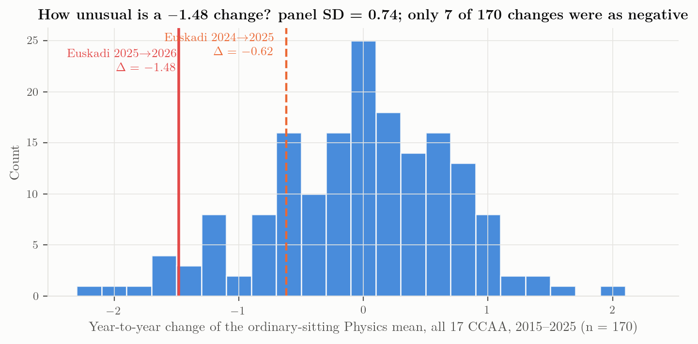{#fig-changes}

The panel of changes has mean $\bar\Delta = -0.03$ and standard deviation $s_\Delta = 0.74$ (excluding the COVID transitions 2020–2022: 0.69). The Basque 2026 change sits at

$$
z = \frac{-1.48 - \bar{\Delta}}{s_\Delta} = -1.97,
$$

and only 7 of the 170 observed changes were as negative: Extremadura 2024 ($-2.10$), Cantabria 2017 ($-1.94$), Canarias 2019 ($-1.76$), Baleares 2025 ($-1.65$), Euskadi 2022 ($-1.62$, the post-COVID normalisation), Asturias 2025 ($-1.55$), Cantabria 2025 ($-1.51$). Regional Physics means are volatile — the standard deviation of the annual change is 0.74 and the median absolute change 0.5 points — so a fall of this size, while rare (≈ 4 % of transitions), has precedents. The Basque series' own year-to-year standard deviation before 2026 is 0.85.

What has fewer precedents is the **level**. Among the 187 community-year ordinary means in the cube, only Canarias 2019 (3.60) lies below 3.99; the next lowest are Baleares 2025 (4.45), Andalucía 2018 (4.65) and Galicia 2023 (4.67). Two consecutive falls summing to more than two points have precedents in the panel — Extremadura $8.55 \to 6.45 \to 6.09$ and Baleares $6.49 \to 6.10 \to 4.45$, both over 2023–2025 — but Euskadi's ($6.09 \to 5.47 \to 3.99$) ends 0.46 below Baleares and 2.10 below Extremadura.

::: {#tbl-changes}


Year-to-year changes of the ordinary-sitting Physics mean across the 17 communities, by transition year (Ministry cube). The 2025 row is the first year of the LOMLOE model.
:::

The last row of @tbl-changes is the first key result of this study: **2025 was a national fall**. Fourteen of seventeen communities went down, by $-0.81$ on average; Euskadi's $-0.62$ was milder than the typical move. Whatever the new exam model did to Physics marks, it did it everywhere in 2025.

## Euskadi's position among the communities

::: {#tbl-rank}


Rank of Euskadi among the 17 communities by ordinary-sitting Physics mean (1 = highest), Ministry cube.
:::

Euskadi has been a mid-table region in Physics: its median rank over 2015–2025 is 8, with three years in fourth place (2016, 2018, 2021) and lows of 15th in 2015 and 13th in 2024. In 2025 it ranked 12th with 5.47, 0.18 below the national mean. Among the nine communities with 2026 data Euskadi is last; if the 2025 values are kept for the eight that have not published, Euskadi 2026 would still be last, 0.46 below Baleares 2025.

::: {#tbl-wide}


Ordinary-sitting Física mean by community, 2015–2025 (Ministry cube, presented-weighted over phases; "Estado" = UNED/foreign centres omitted). Sorted by 2025.
:::

## What the series does and does not say

The series establishes three facts. The 2026 value is the lowest since the start of the two-phase PAU; it is the second consecutive fall; and the size of the single-year fall is at the edge of, but inside, the range of regional Physics volatility in Spain. It does not, by itself, identify a cause: a change of exam difficulty, of marking severity, of the students' preparation, or of who sits the exam all produce the same summary statistic. [Chapter 3](#sec-ch03) uses the other communities to narrow the field; [Chapter 4](#sec-ch04) uses the shape of the distribution.


# Spain 2026: nine communities, three directions {#sec-ch03}

*The 2026 Física results located in this study, against the 2025 Ministry baseline*

## The 2026 table

::: {#tbl-regions}


Ordinary-sitting Física mean, 2025 (Ministry cube, presented-weighted over phases; Cataluña on its own "aptes" basis) and 2026 (this study's data hunt). Canarias 2026 pools ULL and ULPGC by presented students. File: `data/analysis/regions_2026_vs_2025.csv`.
:::

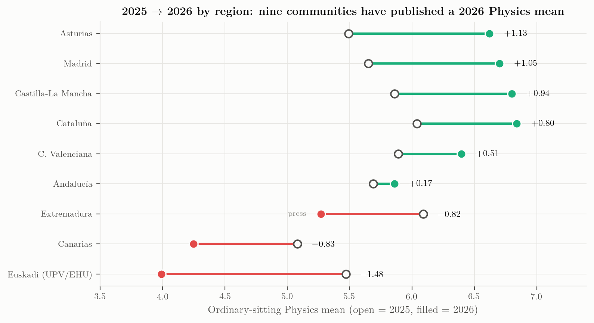{#fig-dumbbell}

Nine of seventeen communities have a published or retrievable 2026 Física mean. Six rose, three fell, and the three that fell are Euskadi, Canarias and Extremadura. Weighted by the number of presented students where it is known (Canarias, C. Valenciana, Cataluña, Castilla-La Mancha), the change outside Euskadi is $+0.58$; the median change over the eight other communities is $+0.65$. Read together with the table of annual changes in the previous chapter, this is the central comparative fact of the study:

> In 2025 the Physics mean fell in 14 of 17 communities (mean $-0.81$). In 2026 it **recovered** in six of the nine communities that have reported — five of them by $+0.5$ to $+1.13$, Andalucía by $+0.17$ — and fell further in three. The competency model of RD 534/2024 was applied in all seventeen in both years. What differs between Cataluña ($+0.80$) and Euskadi ($-1.48$) is not the legal framework; it is the paper, the marking scheme and the tribunals of each community.

## Small multiples, 2015–2026

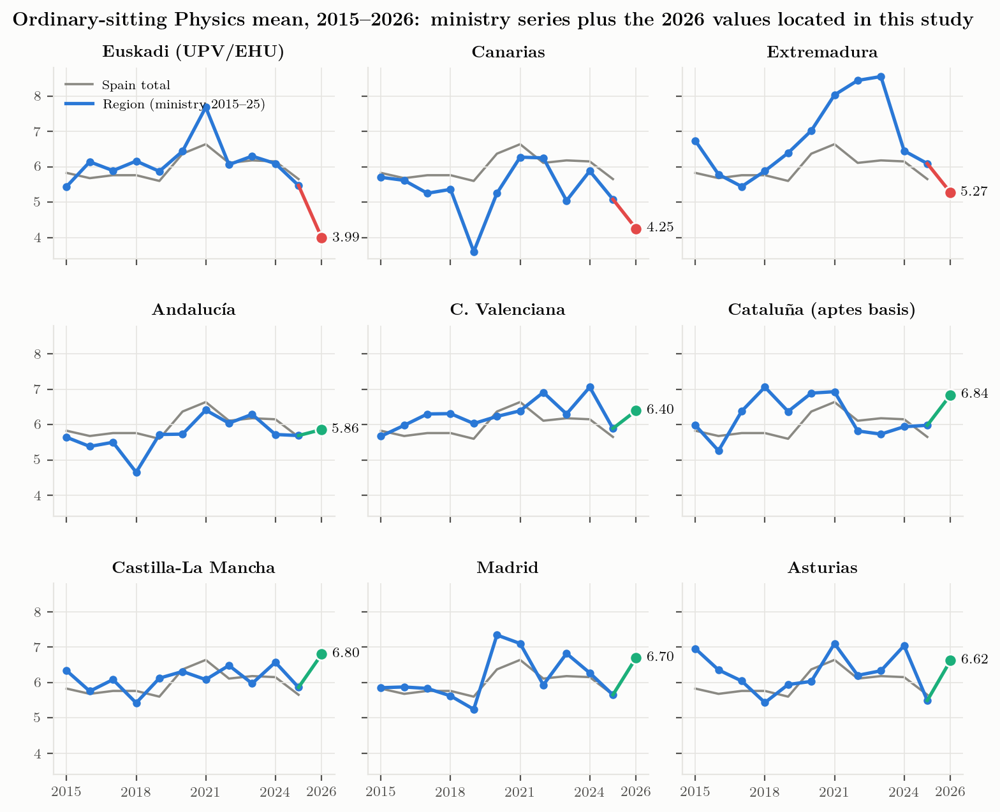{#fig-small}

Three readings of @fig-small:

- **Euskadi** tracked the national line closely for a decade (gap within ±0.5 except 2021) and detached from it in 2025–26.
- **Canarias** is the one community that had already fallen to a level below 3.99: 5.36 → 3.60 in 2019 (six other communities have had a one-year fall at least as large as Euskadi's −1.48, but none reached this level), then 5.25 in 2020. Its 2024 → 2025 → 2026 path (5.88 → 5.08 → 4.25 pooled) is the same two-step fall as Euskadi's (6.09 → 5.47 → 3.99), from a lower starting level and ending a quarter of a point above it. The Canarias Physics coordination minutes of October 2025 [@canarias2025acta] already listed candidate explanations for 2025 — superficial preparation, low incentive (few degrees require a high Física mark), Física being the *third exam of the same day* after Matemáticas and Química, the weighting of Matemáticas crowding out Física — and Las Palmas undertook to run an item/option error study for 2026.
- **Extremadura** is the third faller, from a level that had been among the highest in Spain in 2021 (8.03, second to La Rioja) and the highest in 2022–2023 (8.44, 8.55) before a $-2.10$ correction in 2024; its 2026 figure (5.27, the lowest subject in the UEx table) is press-reported and should be confirmed from the university's statistics when they become readable.

## Two long series that did not exist in the project before

**Castilla-La Mancha, 2021–2026, both sittings** (UCLM Power BI). The ordinary mean went 6.08, 6.48, 5.97, 6.57, 5.86, **6.80** with pass rates 71.7, 75.1, 71.2, 76.6, 65.6, **80.1 %** on 1 589–1 795 presented students each year; the extraordinary sitting sits 1.2–2.8 points lower (3.97 in 2026 on 142 presented). The 2025 dip and 2026 recovery are exactly the national pattern. The dashboard also gives the 2026 result by province (Albacete 6.75, Ciudad Real 6.91, Cuenca 6.68, Toledo 6.77): within a single tribunal system the between-province spread is 0.23 points, a useful yardstick for what "normal" geographic dispersion looks like under one paper and one marking scheme.

**La Rioja, 2010–2022** (UR chart-only PDF). Física ordinary means 4.49, 5.49, 6.73, 5.63, 6.17, 5.78, 6.10, 6.33, 6.61, 6.15, 6.97, 8.31, 7.43, with pass rates 41.8 % in 2010 and 63.6 % in 2011 before settling at 66–86 % in normal years (94 % in 2021). This matters for Euskadi because it shows that the **2010–2011 trough was national**: La Rioja's 4.49 / 41.8 % in 2010 mirrors Euskadi's 4.45 / 46.3 %, and both had gained two points by 2012 (Euskadi in one step, La Rioja in two). The Basque series' worst historical years were not a Basque anomaly either.

## Comparability, stated once

The figures in @tbl-regions are not a designed experiment and the following differences are irreducible:

- **Denominator.** Cataluña's mean is over students *eligible for university assignment*; everyone else's is over students who sat the exam. Cataluña's 2025 value on the same basis (6.04) is used for its change, so the *change* is comparable even if the level is not.
- **Precision.** Madrid's values are chart labels to one decimal; Andalucía, Extremadura and Asturias publish the mean but not the number of examinees.
- **Population.** The Ministry 2025 baselines include FP and foreign-access students; university releases sometimes report Bachillerato students only. The effect on Física, a subject taken overwhelmingly by Bachillerato science students, is small (≤ 0.06 in eight of the nine comparators; 0.11 for Cataluña).
- **Revision stage.** Some releases are provisional (before revision), some are final. EHU's 3.99 is the figure the university itself chose to present on 6 July, after the revision window.

None of these can turn a $+0.8$ into a $-1.5$. The direction and rough magnitude of the 2026 divergence are robust to every caveat listed.

## Bottom line for the Basque question

If the 2026 Basque result had been caused by the competency model as such, the other sixteen communities — which use the same model — would show the same sign in 2026. They do not; most show the opposite sign. The Basque result is regional, and it is shared, in a slightly milder form, by one other region with a documented history of Physics volatility (Canarias) and possibly by a third (Extremadura). The next chapter asks what the shape of the grade distribution can add.


# The shape of the collapse {#sec-ch04}

*What the published moments imply about the 2026 grade distribution, checked against the Canarias histograms*

## What EHU published, and what it implies

For Física 2026 the university published four summary statistics [@ehu2026notak]: the mean $\bar{x} = 3.99$ over $N = 2\,066$ examinees, the pass share $P(x \ge 5) = 0.398$, the low-score share $P(x \le 2) = 0.245$ (2025: 0.10) and the zero share $P(x = 0) = 0.032$. No histogram, no standard deviation, no pass *count*. With $N = 2\,066$ the rounded percentages pin the counts to narrow intervals: 822–823 passes, 506–507 exams at two points or less, 66–67 zeros. These are arithmetic consequences, not observations, and are used only as such.

A mean, a pass rate and a tail share are three constraints. A two-parameter family on $[0,10]$ with a point mass at zero,

$$
f(x) = p_0\,\delta(x) + (1-p_0)\,\frac{1}{10}\,\mathrm{Beta}\!\left(\tfrac{x}{10};\,a,b\right),
\qquad p_0 = 0.032 ,
$$

can be fitted to them by least squares in $(\log a, \log b)$. The Beta family is not a theory of how marks arise; it is the simplest smooth density on a bounded interval that can be unimodal, flat or J-shaped, which is what is needed to see whether "3.99 / 39.8 % / 24.5 %" describes a shifted bell or a different shape altogether. The same fit is made for 2025 (mean 5.47, pass 62.3 %, 10 % at ≤ 2; the zero share was not published and 1.2 % is assumed, with a sensitivity check in `results.json`).

::: {#tbl-beta}


Beta-mixture fits to the published Euskadi Física moments. "SD (model)" and the tail shares are model-implied, not observed. Residuals of the three constraints are below 0.05 in every case (`results.json → beta_fits`).
:::

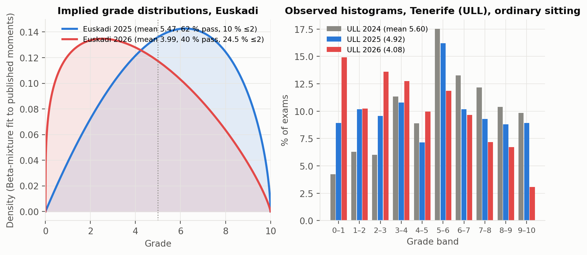{#fig-dist}

The 2025 fit is a mild bell with mode near 6 ($a = 2.0,\ b = 1.6$). The 2026 fit has $a = 1.27 < b = 1.81$: a density skewed towards the low end, zero at the origin, with its mode near 2.5 (against 6.2 in 2025) and roughly flat band shares of 12–13 % across $[0,5)$ before declining, with an implied median of 3.8, an implied share of marks above 7 that falls from 30 % to 15 %, and a share above 9 that falls from 6 % to 2 %.

Three moments cannot, however, distinguish a low-skewed density from a bell that has been pushed down against the floor: shifting the 2025 fit by $-1.48$ and letting the mass below zero pile up in the lowest band reproduces $P(x \le 2) \approx 0.23$ and $P(x \ge 5) \approx 0.38$, close to the published 0.245 and 0.398. What the moments *do* establish is the opposite of a subgroup effect. If 2026 had been a normal year for most candidates and a disaster for a minority — say, the scripts of a few of the 41 tribunals — the low tail would be a lump added to an otherwise 2025-like distribution, and a quarter of all candidates could not end up at two points or less while the pass rate stayed near 40 %. The 2026 numbers describe a **cohort-wide displacement of roughly one and a half points** with the lower part of the cohort compressed into the 0–2 band. Whatever the cause, it acted on almost everyone.

## The Ministry grade bands, 2015–2025

The Ministry cube gives, for every community and year, the distribution of Physics marks in six bands. For Euskadi (specific phase, ordinary sitting):

::: {#tbl-bands}


Share of Basque Física examinees by grade band, ordinary sitting, 2015–2025 (Ministry cube, `data/analysis/euskadi_grade_bands_2015_2025.csv`).
:::

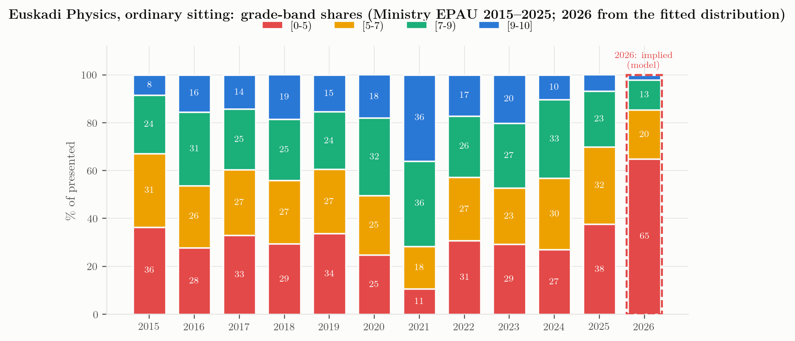{#fig-bands}

Two things stand out. The failing band $[0,5)$ had been 24.9–36.4 % in every normal year (36.4 % in 2015, 24.9 % in 2020) and 37.7 % in 2025; in 2026 it is **60.2 %** — that one is arithmetic, not a model, since EHU published a 39.8 % pass rate. (The Beta fit puts it at 64.9 %: the fit under-predicts the published pass rate by 4.7 points, and every tail share read off it inherits that bias.) And the **top band $[9,10]$ had already collapsed in 2025** (6.7 %, from 10.3 % in 2024 and 15–20 % in 2018–2023 outside the 36 % of 2021) before the mean did: so the top of the Basque distribution went before the middle did. The competency model is not what removed it: the larger single-year fall in that band was 2023 → 2024, 20.2 % → 10.3 %, on the last pre-LOMLOE paper — which is the 2024 shape step the [decomposition](#what-the-decay-is-made-of) isolates.

## The Canarias mirror: observed histograms

Euskadi publishes moments; the two Canarian universities publish full histograms, zero counts, ten counts and means by sex on their Power BI dashboards [@ull_powerbi; @ulpgc_powerbi]. Their 2026 results are the closest observed analogue of the Basque case.

::: {#tbl-canarias}


Física, June sitting, Tenerife (ULL) and Las Palmas (ULPGC), 2024–2026, read from the universities' dashboards on 18 September 2026. Files: `data/found_canarias_ull_powerbi.csv`, `data/found_canarias_ulpgc_powerbi.csv`.
:::

::: {#tbl-canarias-hist}


Percentage of exams per one-point band, same sources.
:::

The 2026 Tenerife histogram — 683 exams, 15 % in $[0,1)$, 25 % below 2, 61 % below 5, 3 % at or above 9, mean 4.08 — is, band for band, what the Basque fit predicts for 2026 (13 % in $[0,1)$, 26 % below 2, 65 % below 5, 2 % above 9). Las Palmas 2026 (22.6 % below 2, 57 % below 5, mean 4.41) is the same shape one step less severe. Both islands had a 2024 concentrated in the upper half (ULL modal at $[5,6)$; ULPGC rising, with one dip at [6,7), to a mode at $[9,10]$), a flattened 2025, and a 2026 that is flat-to-decreasing across the scale with a heavy $[0,2)$ tail.

Two details of the Canarian histograms are worth carrying back to Euskadi:

- **The pass-line pile-up disappeared.** In 2024 and 2025 the $[5,6)$ band is the modal band at ULL (17.5 %, 16.2 %) — the familiar signature of markers rounding borderline scripts up to 5. In 2026 it is 11.9 %, still the fourth-largest band but no longer a peak that stands out from its neighbours (10.0 % and 9.7 %). Whatever happened in 2026, it did not include a benevolent hand at the threshold.
- **Zeros multiplied.** ULL: 5 → 18 → 30 zeros (0.7 % → 2.3 % → 4.4 % of exams). Euskadi 2026: 3.2 %. Zeros in a four-problem paper are not students who tried and failed; they are blank or near-blank scripts, i.e. a decision by the candidate. Their growth is a participation signal (students sitting Física because they enrolled for it, then giving up) as much as a difficulty signal.

## Variance, not only level

Where standard deviations are published — Valencia gives them per university — the 2026 Física SD is 2.38 on a mean of 6.40, essentially unchanged from 2.28 on 5.89 in 2025. The Basque fit implies an SD of 2.5 in 2026 against 2.4 in 2025: the coefficient of variation rises from 0.44 to 0.63 simply because the mean fell while the spread did not. In the language of the Ikastorratza comparison [@ruizdegauna2013comparado], the Basque exam did not become a finer discriminator in 2026; it compressed everyone toward the floor while keeping the same absolute dispersion.

## What the shape rules out, and what it does not

A distribution with a quarter of the candidates at two points or less and a vanishing top decile, in a cohort whose school marks average 7.1 ([Chapter 5](#sec-ch05)), is not the product of one severe tribunal or one badly prepared school network: those would show up as a lump, not as a shift of the whole mass. It is consistent with a cohort-wide cause — a paper that a large fraction of candidates could not start, marking criteria applied strictly to all, or both — and with the disappearance of any compensating leniency at the pass threshold that the Canarian histograms make visible. The Canarian coordinators wrote exactly this diagnosis for their milder 2025 [@canarias2025acta]. The Basque tribunal-level data that EHU says it holds ([Chapter 6](#sec-ch06)) would separate the paper from the marking; the published moments cannot.


# Subjects, sittings, participation and groups {#sec-ch05}

*Física against its neighbours, June against July, exam marks against school marks, and the sex and language dimensions*

## The science block, 2025 → 2026, five regions

Five communities have published subject means for both 2025 and 2026: Euskadi (EHU deck), Cataluña (Govern dossiers, "aptes" basis), Madrid (chart labels), Andalucía (Junta table; 2025 baselines for Matemáticas II and Química from the Ministry cube) and Asturias (Uniovi releases; same treatment).

::: {#tbl-subj-delta}


Change of the ordinary-sitting mean, 2025 → 2026, by subject and region. File: `data/analysis/subjects_2025_2026_by_region.csv`.
:::

::: {#tbl-subj-2026}


Ordinary-sitting mean, 2026, same sources.
:::

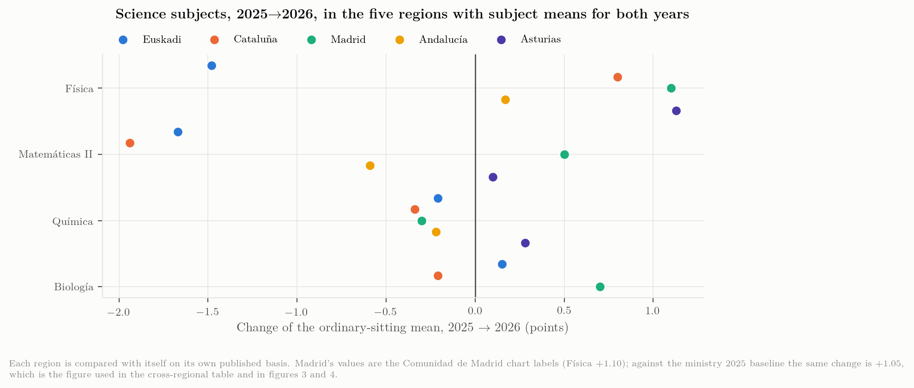{#fig-subjects}

Read by rows, @tbl-subj-delta says that **no subject moved the same way everywhere**. Física fell in Euskadi and rose in the other four; Matemáticas II fell in Euskadi, Cataluña and Andalucía and rose in Madrid and Asturias; Química fell slightly in four of five and rose in Asturias; Biología rose in Euskadi and Madrid and fell in Cataluña (not published for Andalucía and Asturias). Read by columns, Euskadi is the only community where the two hardest quantitative subjects fell together by more than a point and a half ($-1.48$, $-1.67$) while Química ($-0.21$), Biología ($+0.15$) and Lengua ($+0.03$) barely moved. The Basque 2026 problem is a *science-technical block* problem, and within that block it is a Física-and-Matemáticas problem, not a general marking or cohort problem — Química is marked by tribunals drawn from the same pool of secondary teachers.

Cataluña shows the mirror image: a Matemàtiques paper that produced the lowest subject mean of a decade (4.18) and, as the regional press reported, some 2 000 revision requests [press; no official figure is archived in this study], next to a Física paper that produced the best Física mean in five years (6.84). Two subjects, one exam authority, one cohort, opposite outcomes: the paper is the variable.

## Ordinary versus extraordinary

The July sitting is a different population — candidates who failed or did not sit in June — and it is almost always below June — by $1.85 \pm 0.86$ points across the Ministry community-years, over a range from $-0.34$ (Murcia 2022, one of only two community-years in which July came out above June) to $+4.05$.

::: {#tbl-oe}


Euskadi Física, ordinary and extraordinary means (Ministry cube, pooled phases).
:::

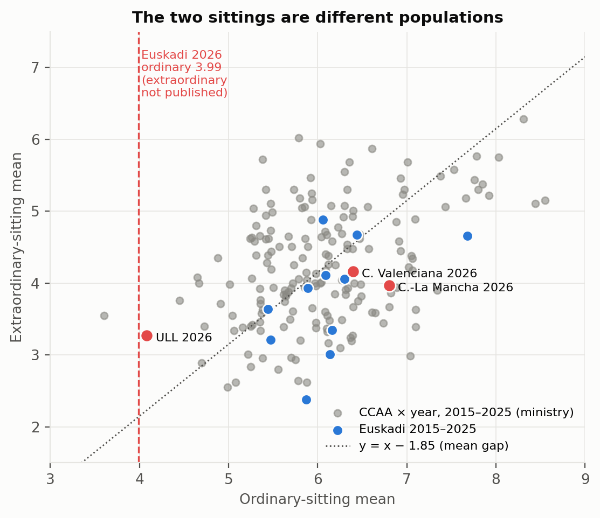{#fig-oe}

Across the 187 community-years the gap averages $1.85 \pm 0.86$ points. The three 2026 extraordinary values found — Comunitat Valenciana 4.16 (777 presented), Castilla-La Mancha 3.97 (142), Tenerife 3.27 (97) — sit on the historical relation, Tenerife low among them (gap 0.81, 1.2 SD below the mean gap, with 29 of the 187 community-years lower still). **EHU has not published the July 2026 Física mean**; only the global July pass rate (71.40 % of 1 332 presented, against 83.2 % in July 2025 and 90.6 % in July 2024 according to EHU's own annual reports; the press comparison quoted 90.6 % as the 2025 figure) and the observation that the 624 candidates who re-sat to *improve* a June mark chose "sobre todo Matemáticas II, Biología y Química" [@donostitik2026extra]. If the historical gap held, the Basque July Física mean would be near 2, which would be the lowest in the panel; if the July paper was pitched differently, it would not. This single number is the most informative unpublished Basque figure after the tribunal spread.

## Who sits Física, and how many

::: {#tbl-part}


Euskadi Física, specific phase, ordinary sitting: enrolled, presented and presentation rate (Ministry cube; 2026 from the EHU deck, enrolment not published).
:::

Two structural facts. First, Física enrolment in Euskadi has been flat at 2 334–2 603 since 2017 while the Basque PAU cohort grew from ≈ 9 900 to ≈ 12 300, so Física's share of the cohort fell from about a quarter to about a fifth. Second, the presentation rate jumped from 63.9–76.4 % (2017–2024) to 84 % in 2025: under the 2025 rules far fewer enrolled students skipped the Física exam. The 2025 pool therefore contained some 200–530 candidates (depending on which earlier rate is taken as the counterfactual) who, under the previous incentives, would not have sat — plausibly the weakest — and the 2025 fall of $-0.62$ is partly this compositional change. For 2026 the enrolment is unpublished; 2 066 presented is 6 % fewer than in 2025 and 16 % more than in 2024.

## School marks against exam marks

The Basque Inspectorate's *Resultados escolares 2024-2025* [@gv_resultados_escolares_2425] gives, for 2º Bachillerato Física across all networks and linguistic models: 4 541 students evaluated, 4 455 passed (98.11 %), mean 7.09 — public 7.04, private/concertada 7.15; Araba 7.09, Bizkaia 7.11, Gipuzkoa 7.08; model A 6.93, B 7.31, D 7.09.

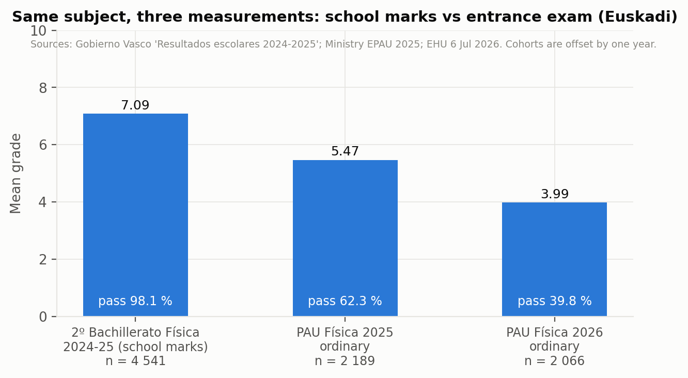{#fig-school}

Three consequences. (i) Only about 45–48 % of the students who take Física in 2º Bachillerato sit PAU Física ($2\,189 / 4\,541 = 0.48$ for the 2025 exam; $2\,066 / 4\,541 = 0.45$ for 2026 against the same, offset, cohort). The PAU Física population is a self-selected half of the Bachillerato Física population — presumably the half that needs the weighting for engineering and physics degrees. (ii) Even that stronger half scored 1.6 points below its school mark in 2025 and, if school marks did not move, 3.1 points below in 2026. (iii) The school pass rate is 98 %; the exam pass rate is 40 %. Whatever the 2026 paper measured, it is not what Bachillerato Física teachers certify. The 2025-26 school results, due in the coming months, will give the matched cohort.

The centre-level scatter of the July package (`hist_evolution`, 2010–2016) already showed a mean school-minus-exam gap of about one point across *all* subjects; a three-point gap in a single subject is of a different order.

## Sex and language

::: {#tbl-gl}


Euskadi Física, ordinary sitting, by sex and by exam language, 2010–2022 (EHU annual reports; no breakdown has been published since).
:::

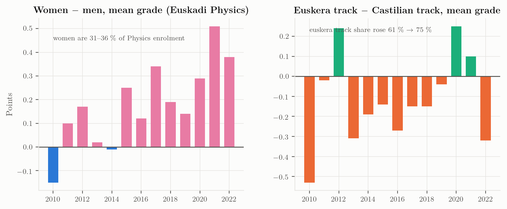{#fig-gl}

Women are 30.6–36 % of Basque Física enrolment and, from 2011, outscore men in every year but 2014 ($-0.01$) by $+0.21$ on average, with the gap widening after 2016 ($+0.34$ in 2017, $+0.51$ in 2021, $+0.38$ in 2022). The Canarian dashboards show the same sign in 2026 under collapse conditions: ULL women 4.09 vs men 4.07, ULPGC women 4.50 vs men 4.38. The euskera track rose from 61 % to 75 % of Física candidates over 2010–2022; its mean was below the castellano track by 0.1–0.3 in most years, and above it in 2012, 2020 and 2021. Neither dimension has been published for Física since 2022, and EHU's 6 July statement that its global 2026 analysis found no bias by linguistic model or network referred to Euskara II, not Física.


# Interpretation and the 2027 question {#sec-ch06}

*Which explanations survive the evidence, what would decide between the rest, and what to ask for*

::: {.callout-important title="Audit of 19 September 2026"}
This chapter was audited after it was written — every number recomputed, every figure re-derived, the argument read step by step. The corrections are applied in the text below and listed, with what they cost, in [Audit](#sec-ch13) and in the last section of this chapter. It was audited a second time on 20 September, which corrected the first audit in turn and added the decomposition that now closes the chapter. Three claims of the first version were withdrawn: that the COVID-era plateau *reshaped* the grade distribution (it is a level effect), that Euskadi shows a distinctive turn on the conditional top-band measure in 2024 (four other communities show the same), and that the PAU and PISA series fall at the same rate (the fit was stale, and the two records are steps rather than slopes).
:::

## The hypotheses, one by one

The evidence assembled in Chapters 2–5 is observational and the exam changes every year, so nothing below is a causal estimate. But the hypotheses that circulated in July can be sorted by what the data allow.

**H1 — "The competency model (RD 534/2024) is to blame."** *Explains 2025, not 2026.* The model was applied in all seventeen communities in both years. In 2025 the Física mean fell in 14 of 17, by $-0.81$ on average — Euskadi's $-0.62$ was below the national move. In 2026 six of nine reporting communities rose under the same model — five by $+0.5$ to $+1.13$, Andalucía by $+0.17$; Euskadi fell $-1.48$. A national cause cannot produce opposite signs in the same year. The Basque institutions' July framing ("el nuevo enfoque competencial pasa factura") is therefore at most a description of 2025. There is a further difficulty with it: the only systematic rating of PAU papers' competency orientation, covering six communities over 2015–2025 [@sancheztarazaga2026pau], places País Vasco and Cataluña at the *top* of the range before the reform, so the Basque papers did not "become competency-based" in 2025 — they were already the most competency-oriented in Spain, and Cataluña, rated alongside them, rose in 2026.

**H2 — "The 2026 Basque Física paper was harder, or differently pitched, than its own 2025 paper and than other communities' 2026 papers."** *Consistent with everything.* The cohort-wide displacement of the distribution ([Chapter 4](#sec-ch04)), the confinement of the damage to Física and Matemáticas II with Química, Biología and Lengua unaffected ([Chapter 5](#sec-ch05)), the Catalan mirror image (Física up, Matemàtiques down, same authority, same cohort) and the Canarian coordinators' own reading of their milder 2025 all point to the paper — its problems, its optionality (two of four problems with no choice in 2026), its marking scheme — as the first-order variable. The July package already noted that the 2026 ordinary paper's gravitational problem contains a validity issue in its energy comparison. A structured content audit of the 2025 and 2026 papers of the nine communities with a 2026 result was carried out on 19 September and is reported in [The papers themselves](#sec-ch11): five of the six rising communities did not increase the competency content of their paper (they stayed at zero or fell); the sixth, Castilla-La Mancha, added one obligatory contextualised item and rose $+0.94$, while the Basque paper moved from one competency exercise to half the marks, halved its optionality and changed format at the same time — it is the only paper in the set that changed genre between the two years. The comparison with the 2010–2024 Basque papers is in [Sixteen years of one paper](#sec-ch12): the 2025 break (no theory questions, new structure, first numerical penalties) was absorbed better than the national average; the 2026 step (competencial half, choice halved, −0.1 list and symbolic-first, syllabus opened) is the one the grades react to. An item-level analysis of the 2026 scripts is the natural continuation.

**H3 — "Tribunals marked more severely."** *Possible, unmeasured, and acknowledged by EHU.* The rector's press conference reported "significant variation between evaluation panels" in Física among other subjects [@argia2026ehu], and the 6 July deck published tribunal-mean ranges for Euskara (2.88–4.43), Lengua (5.80–6.92) and Inglés (6.65–7.56) but not for Física. Rater-severity effects of the size needed to move a subject mean by more than a point are not unknown in Spanish PAU marking [@veas2025consistency], but the cohort-wide shape of the 2026 distribution says severity, if present, was general rather than confined to a few panels. Only the tribunal-level Física table settles this.

**H4 — "The cohort was weaker or differently composed."** *Weak inside the PAU data, stronger outside it. The recruitment version fails outright ([below](#is-the-drift-real)) and the PAU shows no drift; but an externally marked instrument shows Basque science falling from +9 points above Spain to −5 over the decade, breaking in 2015 ([below](#an-instrument-the-basque-tribunals-do-not-mark)).* Presentation fell 5.6 % from 2025 and enrolment is unpublished, so a small compositional component cannot be excluded, but the school marks of the preceding cohort were 7.09 with 98 % passing, and the same students' Química and Biología marks did not move. A weaker cohort does not fail Física and Matemáticas by 1.5 points while holding Química. The same test can be run against Euskadi's own pre-COVID baselines: relative to 2015–2019, Basque Matemáticas II, Química and Biología sat $+0.1$ to $+1.6$ above baseline through 2021–2024 and $+0.27$, $-0.01$ and $+0.31$ in 2025, while Física was $-0.39$ in 2025 — the only Basque science subject clearly below its norm a year before the 2026 event and the year after the 2024 shape step (Química sits on it at $-0.01$; on a pooled-phase baseline Química is $-0.18$ and the contrast is weaker, which is why the convention is stated here) (`data/audit/basque_subjects_vs_baseline.csv`). Whatever PISA sees in the Basque science base, the Basque PAU sees it in Física only, and only from 2025.

### Is the drift real? {#is-the-drift-real}

H4 is usually posed as a claim about one cohort, but it has a slower version worth testing separately: that the students presenting for Física arrive a little less prepared each year, so that part of 2025 and 2026 is the end of a long drift rather than an event. The mechanism is concrete. Física is voluntary, its examined population grew 30 % over this decade — from 37,661 to 49,010 — and a subject that recruits more widely should be recruiting further down the distribution.

The counts matter here more than usual, and an earlier version of this section got them wrong. Física appears in both phases until 2016 and only in the specific phase from 2017, so counting the specific phase alone understates 2015 and 2016 by about 18 % — 30,839 against a true 37,661 in 2015. Those two years then present as small-cohort years that happen to have high means, and a dilution effect appears which is not there. Every count below is pooled across phases.

![**a** — the national mean by year with the 2015–2019 trend extrapolated forward, and the number presented (pooled across phases) on the right-hand axis. The shaded plateau years are the ones that cannot be used to measure a drift. **b** — take-up, the share of each community's PAU candidates sitting Física, with the pooled national series in black; it is flat. **c** — the dilution test on take-up: each point is a community-year, with both variables expressed as deviations from that community's own average, so the comparison is a community against itself rather than against communities that differ for other reasons. The fitted line is flat, and the raw-cohort-size version of the same test is no better.](plots/fig20_cohort_drift.png){#fig-drift}

Three tests. The two that can see composition find nothing, and the one that appears to support the intuition cannot tell students from papers.

The pre-COVID years do decline, at $-0.071$ points a year with $R^2 = 0.75$ ($p = 0.058$) — five points falling steadily, which is what the intuition predicts. But the decline did not continue: extrapolated to 2025 that trend projects a mean of 5.20, and the actual 2025 mean is **5.67**, $+0.47$ above it. Whatever was pulling the mean down between 2015 and 2019 either stopped or was offset.

The dilution mechanism is not detectable at all, and this is where the count correction bites. On the undercounted series it looked real and modest — $r = -0.212$, $p = 0.032$ — which is what an earlier version of this section reported. On the pooled counts it disappears: $r = -0.064$, $p = 0.525$ over the same 102 non-plateau region-years. The entire apparent effect was two mislabelled years.

Panels b and c of @fig-drift test it on the variable that actually corresponds to the mechanism. Raw cohort size confounds a community whose whole candidate population grew with one in which a larger fraction chose Física; only the second is composition. Using `Lengua Castellana y Literatura II` — compulsory in the general phase, hence a count of candidates — as the denominator, take-up is the share of a community's PAU candidates sitting Física. It has barely moved: **0.222 in 2015, 0.240 in 2025**, a rise of 8 % in relative terms across a decade. And within a community it is unrelated to the mean: $r = -0.096$, $p = 0.339$. Física is not visibly recruiting further down the distribution, because it is not visibly recruiting more widely at all.

And the shape measure shows nothing either. The conditional top-band share has no significant trend across the non-plateau years ($-0.0029$ a year, $p = 0.082$), which is where a recruitment effect should show first and most clearly.

The honest summary is that the drift is not visible on any measure that can see composition, and that the one measure suggesting a fall — the 2015–19 trend in the mean — cannot distinguish students from papers. The reason is visible in panel a of @fig-drift and is the same obstruction that produced the reference-frame problem: the five years in the middle of the decade are the plateau, and they are unusable for estimating a slow trend. Six year-points remain to fit a decade. That is why none of these tests is decisive, and it is a better reason to withhold judgement than any of the individual $p$-values — a drift of $-0.07$ a year would need about fifteen clean years to separate from noise, and this decade contains six.

One consequence for the reading of 2026: a slow drift and a one-year event are not competing explanations here. The composition channel, which is the one that could have been measured, contributes nothing detectable, and the pre-2019 decline in the mean — the only surviving evidence of a drift — is confounded between the students and the paper in exactly the way this chapter cannot resolve from PAU data alone.

### The 2024 turn: not a level, but the largest negative move in the panel {#a-basque-signal-that-arrives-a-year-early}

The conditional ratio, measured against the common locus and then against the field in the same year (@fig-condtop, panel b), gives Euskadi a positive residual in six of the nine years 2015–2023 (mean $+0.72$ SD over 2016–2023; negative in 2015, 2020 and 2021), then $-1.08$ SD in 2024 and $-0.59$ in 2025 — all on the field-adjusted scale used throughout this chapter. An earlier version of this section read that as "a two-year turn away from eight consecutive years on the other side" and as a Basque signal that predated both candidate causes. The audit removed both readings. The run was not unbroken, and — the test that had not been made — the turn is not Basque: five of the seventeen communities (Aragón, Castilla y León, Comunitat Valenciana, La Rioja and País Vasco) have a residual below $-0.5$ SD in both 2024 and 2025, nine of seventeen have some two-year run below $-0.5$ SD in the panel, and three communities have more positive years over 2016–2023 than Euskadi (`data/audit/conditional_turn_base_rate.csv`). On a right-skewed measure whose "SD" units are, as the [shape section](#was-2026-a-shift-or-a-change-of-shape) says, only indicative, two negative years after a mostly positive run is what five of the seventeen communities show in the same two years.

The second audit, on 20 September, then asked the question neither version had asked. Both of them tested the *level* of the residual in 2024 and 2025 — whether Euskadi sat low — and the level is unremarkable. But "a turn" is a statement about a *change*, and the change had never been tested. Across the 170 year-to-year transitions in the panel, Euskadi's conditional residual moved $-3.08$ standard deviations between 2023 and 2024. That is the second-largest *negative* move of the 170, behind Cantabria 2025 ($-3.98$), and the largest negative move outside the LOMLOE year. (Two positive moves are larger in absolute size: Castilla y León 2017 and Madrid 2025.) The five communities that shared the low *level* do not share this: their moves into 2024 are ordinary.

So the correct statement is neither of the two the study has made. There was no Basque signal "arriving a year early" in the sense first claimed, and the retraction went too far: something did happen to the shape of the Basque distribution in 2024, it was an unusually large and unusually negative one-year move of the top-band residual — eleventh of the 170 on the combined size of both excesses — and it happened on the last pre-LOMLOE paper. What it was is taken up in [the decomposition](#what-the-decay-is-made-of), which is where this chapter now ends.

What also remains is a cheap monitoring statistic — the conditional ratio is the one published quantity least dominated by the level — and a caution: the school record of the 2024–25 cohort (7.09, 98 % passing) and the widening school-to-PAU gap (1.62 in 2025, 3.10 in 2026 on unchanged school marks) cannot be read through it, because a thinner top tail and a paper that discriminates less at the top produce the same signature.

### An instrument the Basque tribunals do not mark {#an-instrument-the-basque-tribunals-do-not-mark}

The ambiguity above — a thinner top tail or a paper that stopped rewarding it — is not resolvable from the PAU, because the PAU produces one number for both. It needs an instrument that measures the same students and is marked elsewhere. PISA is that instrument, and the cohorts can be matched by birth year: PISA tests 15-year-olds, modal 4º ESO, who reach the PAU two years later — although PISA samples the whole age cohort, repeaters included, while the PAU is sat by the Bachillerato half of it and Física by about a quarter of the PAU candidates, so the match is by cohort, not by population.

That alignment also says what *cannot* be done. Only three PISA rounds fall inside this study's PAU window — 2015 → PAU 2017, 2018 → PAU 2020, 2022 → PAU 2024 — and two of the three land in the marking plateau. A PAU–PISA correlation would be three points with two contaminated, and none is attempted here. What is available is one aligned cohort, compared on the one quantity both instruments measure at the same place in the distribution: PISA's proficiency levels 5 and 6 are the top of its scale as the 8–10 band is the top of the PAU's.

{#fig-pisa}

The long series settles the question the two-round version could not, and it settles it against the reading offered here in an earlier draft. Across 2006, 2009 and 2012 the Basque science score ran **+6.2, +6.4 and +9.2 points above Spain**. Between 2012 and 2015 it fell **22.6 points** while Spain fell 3.7, and it has not recovered: $-9.7$ against Spain in 2015, $+4.1$ in 2018, $-5.0$ in 2022. Over the decade to 2022 the Basque fall is **26 points against Spain's 12**.

The break is in the **2015 round** — administered five years before the schools closed. Sampling error matters for the rest of the series: the INEE tables give the Basque science mean a standard error of 2.4 (2012), 3.0 (2015), 4.2 (2018), 4.6 (2022) and 4.3 points (2025), Spain's 1.6–2.1, so the 2012→2015 change in the gap ($-18.9$) is about four standard errors while the 2018→2022 move ($-9.1$) is within two standard errors and the 2015→2018 one ($+13.8$) is 2.4, so neither is the kind of step 2012→2015 was; the moves between them are; "$+4.1$ in 2018" and "$-5.0$ in 2022" are not distinguishable from each other. The break and the 2025 gap ($-18.6 \pm 4.7$) are real; the shape of the series between them is not resolved. An earlier version of this section read only 2018 and 2022, found the Basque top tail thin in 2022, and attributed it to the pandemic cohort. That was wrong, and wrong in a way that mattered: it was offered as a reason to *discount* the slow-drift reading, and the earlier rounds show the opposite. A standing Basque advantage in science became a deficit a decade ago, on an instrument marked outside the Basque system, and stayed one.

The top of the distribution tells the same story without a trend. The Basque share at proficiency levels 5–6 in science runs 3.25 % in 2015, 3.87 % in 2018 and 3.32 % in 2022, against Spanish figures of 4.98 %, 4.18 % and 4.92 %. There is no progressive thinning: 2015 is as low as 2022. What there is, is a level that has sat below Spain's in all three rounds and below the OECD's (7.47 % in 2022) in all of them.

**But the cohorts do not line up.** This is the second correction, and it undoes the triangulation this section originally claimed. Of the three PISA rounds that map onto a PAU year inside the study window, only one agrees with the PAU conditional measure:

| Cohort | PISA gap vs Spain | PAU conditional vs field | |
|---|---|---|---|
| PISA 2015 → PAU 2017 | $-9.7$ | $+0.70$ SD | disagree |
| PISA 2018 → PAU 2020 | $+4.1$ | $-0.82$ SD | disagree |
| PISA 2022 → PAU 2024 | $-5.0$ | $-0.96$ SD | agree |

One of three is what chance produces. The 2022/2024 match, which this section was originally built around, is not evidence of a cohort mechanism; it is the one case out of three in which two noisy measures happened to point the same way.

What survives is worth more than what was lost, and it supports the drift reading rather than the event reading. There is a real, large and sustained deterioration in Basque science attainment beginning in 2015, visible to an external instrument, which the PAU Física series does not show — Euskadi's Física mean sits near its own baseline through 2024. Two conclusions follow. The PAU is not a good detector of whatever PISA is measuring, which is unsurprising given that Física is sat by a self-selected quarter of the cohort. And the slow-drift version of H4, which the [previous section](#is-the-drift-real) could not find in the PAU data, is clearly present in the schooling that precedes it. Those are compatible: a decade-long weakening of the base need not show in a subject whose takers are drawn from the top of it.

### Do the two instruments fall at the same rate? {#do-the-two-instruments-fall-at-the-same-rate}

The cohort test above compares single years and finds noise. A gentler question is whether the two series, taken whole, descend at the same rate — whether @fig-drift's panel a and @fig-pisa's panel a are parallel. That is a better question than whether they correlate, which three overlapping points cannot answer, and it turns out to have a more interesting answer than the cohort test did.

It needs a common scale. Each series is divided by a student-level standard deviation: 2.343 marks for PAU Física, the median of the thirteen standard deviations published by the Comunitat Valenciana universities for 2025–2026 (the only community that publishes them) and consistent with the Beta fits of [Chapter 4](#sec-ch04); about 90 points for PISA science, from Spain's p10–p90 spread in the 2015 tables. A slope in standard deviations per decade is then the same quantity on both instruments. The PISA fit runs over the four rounds 2012–2022, the decade the PAU series covers; the 2025 round is held out because the section below uses it as the forward-looking measurement, and the fit that includes it is reported at the end.

{#fig-slopes}

| Series | Slope, SD per decade | 95 % interval |
|---|---|---|
| PAU Física, Spain | $-0.092$ | $[-0.251,\ +0.068]$ |
| PISA science, Spain | $-0.147$ | $[-0.381,\ +0.086]$ |
| PAU Física, Euskadi | $-0.157$ | $[-0.601,\ +0.286]$ |
| PISA science, Euskadi | $-0.245$ | $[-0.785,\ +0.296]$ |

The point estimates are strikingly consistent. All four decline; the PAU and PISA slopes for the same population differ by $+0.06$ and $+0.09$ SD per decade, differences that no test could distinguish from zero ($p = 0.48$ and $p = 0.67$). And the relative figure is closer still: **Euskadi falls 1.72 times as fast as Spain on the PAU and 1.66 times as fast on PISA**. Two instruments with nothing in common — different ages, different subjects, different markers, different scales — put the Basque disadvantage at the same multiple of the national one.

That is worth stating because it tempers a claim made in the previous section. There it was said that PISA shows a deterioration the PAU Física series does not. On *cohorts* that stands, and the matching is one of three. On *trend* it overstates: the PAU does decline, at a rate whose point estimate sits comfortably inside PISA's interval, and the reason it looked absent is that the plateau hides it in the raw series and the six surviving year-points cannot make it significant.

The honest summary is the one panel b is drawn to make unavoidable: on this window **every interval includes zero**. With four PISA rounds and six usable PAU years, these data are consistent with two instruments measuring one common decline at the same rate — and equally consistent with no decline at all in either. The agreement of four point estimates, and of two ratios to within 4 %, is the kind of coincidence that is worth recording and is not worth believing on its own: the ratio is of two slopes whose own $p$-values are 0.19 and 0.38, and has no usable interval.

Two further things the audit added. First, adding the 2025 round changes the PISA half of the table: on 2012–2025 the Spanish PISA slope is $-0.155$ SD per decade $[-0.256,\ -0.054]$ ($p = 0.016$) and the Basque one $-0.327$ $[-0.603,\ -0.051]$ ($p = 0.033$), both significant on their own, and the Basque-to-Spanish ratio becomes 2.1 rather than 1.7 (`data/analysis/slope_compare.json`). Second, and more fundamental: the comparison is not well posed as a comparison of *rates*, because neither record is a slope. The Basque PISA series is a step in 2015 followed by noise and a second step in 2025; the Basque PAU series is a plateau followed by a step. A straight line through step changes measures where the steps fall in the window, not a common rate of decline. The right statement is the weaker one: both instruments show the Basque position relative to Spain deteriorating over the decade, in steps rather than steadily, and the PAU shows it only from 2025 and only in Física. It is a reason to keep measuring both, which is the recommendation of the next section, rather than a finding.

### How much of the paper is reading? {#how-much-of-the-paper-is-reading}

::: {.callout-note}
## Disclosure
The author of this study was involved in setting the 2026 Basque Física paper, and specifically chose to expand the statement of its second exercise — spelling out each requirement and repeating it — because a competency-style *saber básico* was entering the examined set for the first time. That account is the origin of the hypothesis tested in this section, and it is first-hand evidence no amount of text analysis could have supplied: it establishes that the length was deliberate rather than accidental. It also means this section examines a decision its author made. The author is the Física coordinator whose account [Sixteen years of one paper](#sec-ch12) reports in the third person; that chapter's "testimony of the coordinator" is the author's own. The provenance note in [Methods](#sec-ch10) records the same facts.
:::

Every section so far has treated the paper as a single variable — harder or easier, more or less competency-oriented. It has another dimension that is objective, easy to measure and so far unexamined: how much text a candidate must read before answering. The competency reform pushes in exactly that direction, because contextualised items carry a scenario and the scenario has to be written down.

That matters more if the cohort's reading has weakened, and the Basque cohort's has, far more than its science. Over the decade to 2025 the País Vasco PISA reading score falls **72 points**, from 491.4 to 419.1, against a science fall of 24.5. The gap to Spain widens from $-4.1$ to $-32.2$. Whatever else is true of these students, reading is where they have lost most ground. (There is no 2018 point: the Spanish PISA 2018 report contains mathematics and science only, because the OECD withheld Spain's 2018 reading results over anomalous response patterns.)

{#fig-reading}

The association is as strong as any this study has found between a property of a paper and the movement of its grade — and it ties with the contextualised-points measure of [Chapter 11](#sec-ch11), which gives $-0.86$ on the same eight: **$r = -0.905$, $p = 0.002$** across the eight communities with both a 2026 result and an archived pair of papers (Castilla-La Mancha's papers exist only as transcripts and are excluded), and $\rho = -0.86$, $p = 0.007$ on ranks. Stripping rubric and constant tables from the counts moves it to $-0.94$; leaving País Vasco out, $-0.88$ ($p = 0.008$). Asturias, Madrid and the Comunitat Valenciana shortened their papers and rose; Extremadura, Canarias and País Vasco lengthened theirs and fell. The Basque paper lengthened **45 %**, from 1 335 words of statement to 1 940, and fell furthest.

Those are the audited numbers. The first version of this section counted whole PDF files and reported $r = -0.84$, a Basque change of $+39.5$ % and a Madrid paper of 4 070 words; the audit found that the Madrid files embed the marking criteria and full solutions (about 70 % of their words — the statement itself went from 1 127 to 1 093 words, a *shortening*), that the Valencian files are bilingual, and that the EHU Spanish files open with the Basque instruction block. Counting statement text only, the correlation strengthens rather than weakens. The raw-file figures are kept in `data/analysis/reading_load.json` for the record.

Three cautions, and the second is the one that matters.

The word count includes everything the candidate is given, and papers that offer more choice print more text for the same student workload. That is why only within-community change is used, and why the levels (Cataluña 1,628 words, Asturias 899) are not compared.

**Length and competency content are not independent.** The competency measure of [The papers themselves](#sec-ch11) correlates with the length change at $r = +0.79$ ($p = 0.02$, $n = 8$). Contextualised items are longer items, so the two are largely one signal seen twice, and with eight points they cannot be separated. What length adds is not a second cause but a better instrument: it is a count, reproducible by anyone with the PDFs, where the competency coding is a judgement made by one reader (a blind second coder agreed with it on every direction of change; [Audit](#sec-ch13)). On the same eight communities the competency-points measure gives $-0.64$ and the contextualised-points measure $-0.86$, so length leads it but not by much; length is worth preferring because it is a count anyone can reproduce from the PDFs, not because it is the stronger signal. Two cautions belong here as well: the hypothesis was suggested by the author's knowledge of his own paper's length, which makes length a variable chosen after the outcome was known, and with eight points the result should be read as exploratory however small its $p$-value.

And the interaction that motivated the section — long papers hurting weak readers more than strong ones — is not tested here. Testing it needs the reading level of each community crossed with its length change, and with eight communities an interaction term would be fitting noise. It remains a hypothesis, and a cheap one to settle: the 2027 paper could be set with its statement length recorded, and the Basque reading collapse means that number now carries more weight than it did.

### What PISA 2025 says about PAU 2027 {#what-pisa-2025-says-about-pau-2027}

PISA 2025 was published on 8 September 2026, ten days before this chapter was first written, and science was its major domain. It is the cohort that sits the PAU in 2027, so for the first time in this study a genuinely forward-looking measurement exists, and it is worth asking what estimate it supports.

The measurement itself is severe. Basque science falls to **458.5**, against a Spanish **477.1** and an OECD **481.9**. The gap to Spain, which was $+9.2$ in 2012 and $-5.0$ in 2022, is now $-18.6 \pm 4.7$ — the largest in the series and nearly double the previous worst ($-9.7$ in 2015). At the top of the distribution the Basque share at levels 5–6 **falls by almost half, from 3.32 % to 1.83 %** (a change of about two standard errors), against a Spanish figure that eases from 4.9 % to 4.2 %. On the instrument that does not depend on Basque marking, the cohort now in 2º Bachillerato, which sits the PAU in 2027, is the weakest this series has recorded.

{#fig-2027}

Converting that into a PAU estimate is arithmetic, and the arithmetic is what makes the answer honest. The Basque PISA fall of 21.0 points is $0.233$ of a student standard deviation; transferred one-for-one to the PAU — the relation [figure 22](#do-the-two-instruments-fall-at-the-same-rate) could neither reject nor establish — and prorated over the two years separating the PAU 2025 and PAU 2027 cohorts, it is a **cohort term of $-0.36$ marks** (about $\pm 0.11$ from PISA's sampling error alone); measured from the 2026 cohort, one year closer, the same move gives $-0.18$.

Set that against what else moves the number. The standard deviation of Euskadi's own year-to-year change in the Física mean, excluding 2026, is **0.855 marks** (0.72 without the COVID transitions); over two years, treating the changes as independent, the 95 % band on that alone is **$\pm 2.37$**. That term is not "the paper": it is everything the PISA cohort measure does not capture — paper, marking, sitting composition and cohort noise together — and the random-walk assumption behind the two-year band overstates it for a series that visibly reverts to its mean. Even so, the cohort term is **6.5 times smaller than the band it has to be read against**. And 2026 itself moved the mean by $-1.48$ in a single year on a changed paper — four times the cohort term, and more than the whole decade of PISA drift converted the same way ($1.23$ marks from 2012 to 2025).

So the estimate exists and is this:

| If the 2027 paper resembles | Cohort term | Central estimate | 95 % band from the year-to-year term alone |
|---|---|---|---|
| the 2025 paper | $-0.36$ | **5.11** | $[2.74,\ 7.48]$ |
| the 2026 paper | $-0.18$ | **3.81** | $[1.44,\ 6.18]$ |

The two scenarios differ by 1.3 marks, most of the size of the 2026 event; the cohort contributes a third of a mark or less to either. That is the finding, and it is not the one the question was hoping for. **PAU 2027 is not something PISA predicts. It is something the 2027 paper and its marking scheme decide**, with the cohort supplying a slow downward nudge three and a half to seven times smaller than the choice. A forecast whose interval spans 2.7 to 7.5 is not a forecast; it is a restatement that the exam is the dominant variable.

Two things follow that are worth acting on rather than reading. The cohort term, small as it is, points the same way as every other measure in this section, so the sensible default for 2027 is that the intake will be slightly weaker than 2025's and considerably weaker than the decade's average — which argues for the paper being set with that in mind rather than against a remembered cohort. And the honest use of PISA 2025 here is not prediction but *attribution after the fact*: when the 2027 result arrives, the $-0.36$ is the part that should not be blamed on the paper, and everything beyond it is the part that should be explained.

**H5 — "Students under-prepare Física because the weighting rules make it dispensable."** *Plausible as a slow driver, not as a 2026 trigger.* This is the Canarian coordinators' hypothesis for their own decline (few degrees need a high Física mark; Matemáticas II carries the weighting; Física is examined last on a long day). It fits the ten-year erosion of the top decile better than a one-year fall of 1.5 points, and it is the hypothesis most directly addressable by the Basque ponderación table and the exam timetable for 2027.

**H6 — "Language or network bias."** *No evidence either way for Física.* The 2010–2022 series shows euskera/castellano differences of a few tenths in both directions and no sign that either network fails Física differentially; EHU's 2026 bias analysis was run for Euskara II. Nothing published for Física 2026 speaks to this.

The ranking that emerges is H2 first, H3 unresolved and testable, H5 as background, H1 as a national 2025 coincidence that cannot be separated from the end of the COVID-era plateau and says nothing about 2026, H4 unsupported as a Basque-specific cohort effect in the PAU (though the PISA level decline is real), and H6 unsupported.

## Was 2026 a shift or a change of shape?

The hypotheses above divide along a line the published aggregates can be made to test. A harder paper or a uniformly stricter marking scheme moves the whole distribution down together. A change in who sits the exam, or a marking change that bites only at the bottom, changes its *shape* — it thins the pass region without touching the top, or the reverse. The published data carry three summaries of the same distribution — the mean, the pass rate, and the share in the 8–10 band — and the second and third are near-deterministic functions of the first: across seventeen communities and eleven years the correlations are $r = 0.974$ and $r = 0.961$. A scatter of pass rate against mean therefore mostly redraws arithmetic. What carries information is the *residual*: a cohort sitting off the common locus has a differently shaped distribution, not merely a lower one.

![**a, b** — Pass rate and the 8–10 band share against the mean Física mark, ordinary sitting, specific phase, seventeen communities 2015–2025 (n = 187 region-years, Ministry EPAU). The solid line is a quadratic fit; the pale band is ±2 residual standard deviations (1.9 pp left, 2.7 pp right) and the darker band the 95 % confidence interval of the fit itself, which widens where the region-years thin out. The dashed line is the same locus refitted with the 2020–2024 plateau removed: it departs from the solid one in the middle and upper range, where the plateau years sit, and converges on it at the low end, so the 2026 readings do not depend on the plateau. Hollow grey markers are 2015–16, the years in which Física could still be sat in the general phase; from 2017 LOMCE left it in the voluntary phase only and the presented cohort grew from 37,661 to 49,010 (pooled across phases). The Euskadi trajectory is drawn as a connected path. ULL and ULPGC 2026 are observed histograms, on a denominator of exams sat rather than presented. The EHU 2026 marker is hollow because its band share is a Beta fitted to the published mean, pass rate and zero count, so on these axes it can only restate them. The tinted strip marks the part of the mean axis where only two of the 187 region-years lie, and where all three 2026 cohorts sit. **c** — the ratio of b to a, $P(x \ge 8 \mid x \ge 5)$: the share of those who passed who reached the top band. Because it is conditional on passing it carries far less of the level than either component, tracking the mean at $r = 0.905$ against $0.974$ and $0.961$, and it is therefore the column that can separate a distribution that moved from one that was reshaped. **d, e, f** — the distribution of each column's own vertical variable, with a normal of the same mean and standard deviation drawn for comparison and the 2026 values marked as vertical rules. These are deliberately not the distribution of the mean, which is the same variable on all three horizontal axes. **g, h, i** — the same three distributions with the 2020–2024 plateau removed, drawn over the full sample in pale grey; the dashed curve is the normal fitted to all years and the solid one the normal fitted without the plateau. Panels d–i share one vertical scale, which is why the bars in g–i are lower: 85 of the 187 region-years have been removed, and a density normalisation would have hidden that.](plots/fig16_shape_locus.png){#fig-locus}

Two things follow, and the first is a precondition for the second.

**The locus is a property of the marking scale, not of the cohort.** Física's examined population changed substantially inside this window: until 2016 it could be taken in the general phase, from 2017 LOMCE left it voluntary only, and the number presented grew by 30 % — from 37,661 to 49,010, pooled across phases. If the mapping from mean to pass rate depended on who sits the paper, it should step at that boundary. It does not: comparing residuals before and after 2017, the pass panel gives $p = 0.40$ and the top-band panel $p = 0.12$ once the two COVID sittings are excluded. On the full series the top-band difference does reach $p = 0.008$, but that result is carried by 2020, whose year-mean residual of $+3.6$ pp is the largest of the eleven, and it is the COVID year — so the honest reading is the conservative one. In @fig-locus the hollow 2015–16 markers interleave with the later ones along the same curve. That stability is what licenses reading a 2026 point off the locus at all.

**Where 2026 can be observed, it is a location shift — but the test is weaker than it looks.** The only 2026 cohorts with a published histogram are the two Canarian universities, and both land on the locus: ULL at $-0.08$ SD on the pass panel and $+0.65$ SD on the top band, ULPGC at $-1.04$ and $+0.24$, against a historical scatter that runs from $-2.6$ to $+3.0$ SD on the pass panel and $-3.5$ to $+2.6$ on the top band. Their distributions are the same shape as everyone else's at that mean — simply further down it. Nothing was thinned selectively: the top of the Canarian cohort fell with the rest.

How much that settles depends on how much evidence sits where these cohorts fall, and the answer is honestly very little. The 187 region-year means pile up between 5.0 and 6.5 — they are themselves right-skewed and heavy-tailed rather than normal (skew $+0.60$, excess kurtosis $+0.88$; Shapiro–Wilk $p = 0.00017$, Anderson–Darling $A^2 = 2.06$ against a 5 % critical value of $0.75$). Only **2 of 187** sit below 4.5 — the tinted strip in all three upper panels of @fig-locus — and none within $\pm 0.25$ of where ULL (4.08) and the Basque cohort (3.99) fall. The curve there is therefore an extrapolation from the body of the data, and the pass panel's own 95 % interval is $\pm 1.41$ pp at mean 4.08 against $\pm 0.32$ pp at mean 6.0 (on the 8–10 panel, $\pm 2.04$ and $\pm 0.46$), which is why the figure draws that interval as well as the flat scatter band. ULL's residual of $-0.16$ pp sits comfortably inside the uncertainty of the very curve it is measured against.

The columns are also not equally well-behaved, and panels d, e and f of @fig-locus separate them because they give different answers. The pass rate is symmetric and close to normal (skew $+0.01$, excess kurtosis $+0.39$; Shapiro–Wilk $p = 0.096$, Anderson–Darling $A^2 = 0.58$, below the critical value — normality cannot be rejected). The 8–10 share is not (skew $+1.29$, $A^2 = 5.80$), and neither is the conditional ratio (skew $+0.98$, $A^2 = 3.90$). Right-skew is what one should expect of a tail quantity pressed against zero, but it has a practical consequence: a residual quoted "in standard deviations" assumes roughly symmetric scatter, so the SD units are trustworthy on the pass panel and only indicative on the other two. Those residuals should be read as directional, not as calibrated probabilities.

The third column settles the question the first two could not. A uniform shift of the whole distribution moves the pass rate and the 8–10 share together, so a cohort sitting on both loci is consistent with a shift but does not demonstrate one — the two measurements are not independent tests. The conditional ratio is the quantity that distinguishes them, and on it the two observed 2026 cohorts sit *above* the locus, not below: ULL at $+1.05$ SD and ULPGC at $+0.53$ SD. Among the students who passed in Canarias in 2026, the top band is if anything slightly better represented than their mean predicts. Whatever happened there did not thin the top of the cohort relative to its middle, which is the first measurement in this sequence to strengthen a conclusion rather than qualify it.

The consequence is a limit on power, not a reversal of sign. Nothing in the 2026 data indicates a change of shape, and a *large* one would still have shown: a cohort that had thinned only at the bottom would sit several points off the curve, far outside even the widened interval. But a modest reshaping at mean 4 could not be detected with two historical neighbours, so "consistent with a pure location shift" is the correct reading, and "demonstrated to be one" is not.

That bears on the ranking above in one direction and one only. It is evidence against **H4**: a cohort that had become differently composed would be expected to sit off the locus, and Canarias does not. It does not discriminate between **H2** and **H3**, because a harder paper and a uniformly severer marking scheme produce the same signature here — both move the distribution without reshaping it. What it weighs against is any mechanism acting *strongly* and selectively on one part of the range.

The Basque case cannot be put to this test with what is published. The 2026 band shares shown in [Chapter 4](#sec-ch04) are output of the Beta fitted to the mean, the pass rate and the zero count; plotting them here as evidence would be circular, which is why the EHU 2026 marker in @fig-locus is drawn hollow. Its apparent residual of $-0.05$ SD on the top band is the model agreeing with itself and should not be read as a result. Resolving the Basque case the same way needs one thing: the observed 2026 grade histogram, which is item 3 of the data requests below.

One data caveat surfaced in building this. The Ministry's own cube is internally inconsistent for two of the 187 region-years — Galicia 2015 and 2016 — where the published pass rate and the published $[0,5)$ share disagree by 5.64 and 4.48 pp; these are the two years in which Física appeared in both phases, so the cells are carried on different bases. Every band row sums to 100.0 and the remaining 185 agree to rounding, so the two points are kept rather than discarded, and they are recorded in `data/analysis/shape_locus.json`.

## What you compare against decides what you find

Every number in this report is a change measured from some reference point, and the reference point is almost never argued for. It is usually the previous year, because that is what the sources publish and what the press quotes. Reading the same series against a different baseline does not merely adjust the size of the effect — in this case it reverses the sign of the national story.

{#fig-frames}

The pattern in panel a of @fig-frames is not a decline. It is a plateau that ended. The nine communities sit $+0.50$ to $+1.05$ above their pre-COVID baseline in every year from 2020 to 2024, peaking in 2021, and then return to it in 2025. The relaxation did not decay gradually, which is what "returning to normal" would look like; it held for three full years after the peak — 2022, 2023 and 2024 are $+0.62$, $+0.53$ and $+0.50$ — and then ended in a single step. Whatever produced the COVID-era regime was still producing it in 2024, and stopped in 2025.

It was not a Física phenomenon either. Run on every subject in the Ministry cube (seventeen communities, each subject against its own 2015–2019 norm; `data/audit/plateau_by_subject.csv`), the plateau is present everywhere — Matemáticas II $+0.48$ to $+0.97$, Química $+0.58$ to $+0.94$, Biología $+0.17$ to $+0.55$, Historia $+0.29$ to $+0.75$, Lengua $+0.23$ to $+0.47$ — and in 2025 every science subject returned to within about a fifth of a point of its norm (Física $-0.06$, Matemáticas II $+0.11$, Química $+0.20$, Biología $-0.21$), while Historia kept most of its lift ($+0.53$). The 2025 fall was the simultaneous end of a subject-general regime.

Was it a uniform lift? The conditional measure of @fig-locus was first read as saying no: among students who passed, the share reaching the 8–10 band ran $0.353$ across 2015–2019, rose to $0.466$ through the plateau and came back to $0.331$ in 2025, and an earlier version of this section called that a reshaping ($p = 4 \times 10^{-11}$). The audit withdrew it. The conditional ratio tracks the mean at $r = 0.905$, so most of that rise is what the level alone produces: the locus predicts $0.356$ at the pre-COVID mean of 5.77 and $0.442$ at the plateau mean of 6.44, about 0.09 of the observed 0.11. Measured on the locus residual, the plateau's excess is $+0.02$ (about half a residual SD), $p = 0.17$ on the five-against-five year means, and it is carried by 2020 alone (residual $+0.06$; 2021–2024 are within $\pm 0.02$). To the precision these data allow, the plateau lifted the distribution and did not reshape it. Panels h and i of @fig-locus still show that the conditional ratio's departure from normality is largely an artefact of those five years (Anderson–Darling $3.90 \to 0.94$ without them), where the raw 8–10 share stays non-normal at $1.53$ because its skew is intrinsic.

![**a** — the conditional top-band share $P(x \ge 8 \mid x \ge 5)$ against the mean, with the Euskadi path, the two observed 2026 Canarian cohorts and the fitted EHU 2026 value, drawn hollow because its band share is modelled rather than measured. **b** — the residual of that ratio from the locus, by year, with Euskadi's own path drawn over the panel: the plateau years carry an excess of $+0.02$ over the rest of the panel, carried by 2020, which is what a lift of the level — not a reshaping — leaves behind. Euskadi's own residual is positive in most years to 2023 and then drops by three standard deviations in 2024, which is the step the [decomposition](#what-the-decay-is-made-of) takes up.](plots/fig19_conditional_top.png){#fig-condtop}

That is enough to change the reading of three separate claims in this report.

| Measured as | Change | Invites the conclusion |
|---|---|---|
| 2024 → 2025, nine communities | $-0.65$ | "A national collapse; the competency model bites." |
| 2025 → 2026, nine communities | $+0.17$ | "A recovery everywhere, so 2026 is a Basque problem." |
| 2015–19 baseline → 2026, nine communities | $+0.02$ | "Nothing has happened; Spain is where it was a decade ago." |
| 2025 → 2026, Euskadi | $-1.48$ | "The Basque fall is one and a half points." |
| 2015–19 baseline → 2026, Euskadi | $-1.93$ | "The Basque fall is nearly two points — a third larger." |

Rows one and three are the uncomfortable pair — and row three hides a dispersion that is the real 2026 story: against their own pre-COVID baselines, Madrid ($+1.02$), Castilla-La Mancha ($+0.86$), Cataluña ($+0.63$), Andalucía and Asturias ($+0.48$) and Valencia ($+0.34$) sit above their norm in 2026, Extremadura ($-0.78$), Canarias ($-0.86$) and País Vasco ($-1.91$) below it (`data/audit/baseline_2026_by_community.csv`). "Spain is where it was" is an average of communities a point apart in both directions. Both are true of the same nine communities and the same ministry series, and they are not reconcilable as statements of fact about "what happened to Physics in Spain": one says the subject collapsed, the other that it is exactly where it was in 2015–2019, $+0.02$ away after eleven years. The contradiction is entirely in the choice of reference year, and the year-on-year framing is the one that misleads, because 2024 was not a normal year to measure from.

This weakens **H1** further than [the hypothesis review above](#the-hypotheses-one-by-one) already did, though not as far as an earlier version of this section claimed. That section could say only that the competency model explains 2025 and not 2026. Measured from the pre-COVID baseline, the 2025 sitting did not fall below the historical norm, it returned to it — in every subject at once. A model introduced in 2025 that leaves the national Física mean 0.15 below where it sat in 2015–2019 is not doing anything visible to the *level*. What the frame cannot decide is why the plateau ended in 2025 rather than in 2023 or 2024: the withdrawal of a COVID-era regime and the first LOMLOE papers, with their new marking instructions in every subject, arrive in the same year, and nothing in the PAU series separates them. The honest form of H1 is therefore: the reform coincides with the end of a subject-general plateau and cannot be told apart from it; it does not explain the 2026 Basque result, which is the one this study is about.

It also makes the Basque case worse, not better. The headline everyone quoted is $-1.48$, measured from 2025. Against Euskadi's own pre-COVID baseline of 5.92 the 2026 fall is $-1.93$ — a third larger than the number in circulation — because 2025 was already 0.45 below that baseline. The Basque series did not fall once; it fell twice, and only the second fall was reported as news.

None of this is a criticism of the sources. The Ministry publishes years, the universities publish years, and a year-on-year change is the only comparison most readers can make from what is published. But it means the honest form of every claim in this report carries its reference point on its face, and that the three sentences most likely to be quoted from this study — "the 2025 fall was national", "the 2026 fall is regional", "Euskadi fell 1.48" — are each true only in the frame that produced them.

### Why measure a Basque fall against a Spanish field at all? {#why-a-field}

The objection is a fair one and it should be answered before the decomposition uses the field. The question this study asks is what happened in Euskadi. Euskadi's mean is published. Why introduce eight other communities, each with its own exam, into the measurement of a Basque event?

Three frames give three numbers, and the first thing to say is how little they differ.

| Frame | What it asks | 2026 |
|---|---|---:|
| Year on year | how far did the Basque mean fall from 2025? | $-1.48$ |
| Against Euskadi's own 2015–2019 norm | how far is 2026 from where Euskadi normally sits? | $-1.91$ |
| Against the nine-community field | how much of the fall is Euskadi's own, once the country's move is taken out? | $-1.65$ |

: The same Basque 2026 result in three frames. The middle row takes the Basque pre-COVID norm as 5.900, the convention used by the mark budget so that Euskadi and the field are computed on the same series; the specific-phase convention of 5.922 used in the frames section above gives $-1.93$, and EHU's own published series $-1.92$. {#tbl-threeframes tbl-colwidths="[30,48,22]"}

They span 0.43 of a mark around a fall of roughly a point and a half. No conclusion in this study turns on which is used, and the design implications in the last section of this chapter are identical under all three. Anyone who prefers to read the whole thing with $-1.48$ in mind, or with $-1.91$, will not be misled.

What the field buys is not size but *separation*, and it buys it for one specific purpose that no absolute number can serve: telling a year in which everyone fell from a year in which only Euskadi did. 2025 is the case that makes the point. Read absolutely, Euskadi lost 0.62 marks in 2025 and that looks like a Basque problem worth a working group. Read against the field, which lost 0.65 in the same sitting, there is nothing Basque in 2025 at all — and the whole of the anomaly sits in 2026, where the field gained 0.17. Without the field those two years look like one slide of 2.10 marks over two sittings. With it, they are one national event followed by one Basque event, and only the second is the coordination's to answer.

What the field is *not* is a control group, and it is important not to let the arithmetic imply otherwise. A control requires that the comparison units differ from the treated unit only in the treatment. These nine sat nine different papers, marked to nine different criteria, by nine different sets of correctors. [Chapter 11](#sec-ch11) measures how different, and the answer is: very. Euskadi is the only community that moved all four of those axes in the direction the orientations ask for: optionality 75 % → 50 %, competency-coded marks 25 % → 62.5 %, and substantive context and contextualised marks up 50 and 75 points. Castilla-La Mancha is the only other that both cut optionality and raised its competency share, and it cut contextualised marks by 45 points at the same time; Cataluña moved the competency share 37.5 points the other way; three communities moved on no axis but the contextualised share. Across the nine, the further a paper moved toward the competency model the further its mean fell — $r = -0.70$, $p = 0.035$, though Euskadi is the extreme point on both axes and dropping it leaves $r = -0.40$, $p = 0.33$ among the other eight, so that coefficient is largely one community making its own point rather than eight communities agreeing.

The practical consequence is a range rather than a number. Measured against all eight other communities the Basque-specific component is $-1.65$ on the pooled ministry basis and $-1.85$ on the published-means basis; measured against only the six whose papers barely moved it is $-1.95$. Measured against nothing at all it is $-1.48$. The Basque-specific fall is somewhere in $[-1.95, -1.48]$, and the reason it cannot be narrowed is that nobody has calibrated these nine papers against each other. That is request 9 below, and it is the request that would turn a comparison into a control.

One further thing follows for how this chapter's headline should be quoted. If the other communities' 2026 rises came partly from keeping papers their own candidates found easier — which is what the reform-intensity association is consistent with and does not establish — then the field's $+0.17$ is not an estimate of what Basque candidates would have scored on an unchanged exam, and the $-1.65$ overstates the part of the fall that is specifically Basque *ability or marking* while understating the part that is specifically the Basque *paper*. Both readings are in the decomposition that follows, which is why it reports the field term separately rather than folding it in.

## How this reading was arrived at, and what it cost each earlier one

The previous section shows that the frame decides the answer. This one records the order in which the frames were tried, because the sequence is itself a finding: the analysis in this chapter was not assembled in one pass, and most of its fourteen steps damaged the conclusion that motivated them — the last two, which audited the rest, most of all.

![**a** — the two headline quantities under three successive framings; the national quantity is computed on the same nine communities in every frame, the Basque one on Euskadi alone. The national number does not merely shrink as the frame widens; it changes sign. **b** — the order the questions were asked in, the claim each step produced, and what the later steps did to it. The numbers are read from the JSON written by the scripts that computed them; the step descriptions are written by hand, which is how step 10's text drifted from its own data until the audit caught it.](plots/fig18_analysis_path.png){#fig-path}

The sequence in panel b of @fig-path ran as follows.

**Step 1** was the July framing, taken from the institutions: Física fell 1.48 points and the competency model is to blame. **Step 2**, the cross-section of 2026 in [Chapter 3](#sec-ch03), overturned it — six of nine communities rose in 2026 under the same model, and a national cause cannot produce opposite signs in the same year. That is the step that produced this chapter's original hypothesis ranking.

**Step 3** asked whether the 2026 fall was a change of shape or of position, and answered that Canarias 2026 sits on the historical locus: the distribution moved down without being reshaped. **Step 4** then asked how much evidence supports the locus where those cohorts fall, and found almost none — two region-years of 187 below mean 4.5, and a fit whose own interval there is four times its width at the centre of the data. The step-3 claim survived, but only as *consistent with* a location shift rather than a demonstration of one. **Step 5** decoupled the two distributions and found the 8–10 share strongly non-normal, so the standard-deviation units in which the step-3 residuals had been quoted are not calibrated on that panel, and those residuals are directional only.

**Step 6** re-baselined to the pre-COVID norm and did the most damage of all — not to step 3, but to step 2. Step 2's reasoning depends on 2025 having been a national collapse that the competency model could be blamed for. Measured from 2015–2019 the 2025 sitting was not a collapse: it was a return to the norm after a five-year plateau, and the nine communities finish 2026 $+0.02$ from where they started in 2015. So the hypothesis ranking earlier in this chapter had to demote H1 further than "a description of 2025".

**Step 7** conditioned on passing. The pass rate and the 8–10 share are both dominated by the level, so a cohort lying on both loci was never two independent tests; their ratio is less so, and on it the two observed 2026 cohorts sit *above* the locus. That part stood. The step also made two further claims — that the plateau had reshaped the distribution, and that Euskadi showed a turn in 2024 that predated both candidate causes — and both were withdrawn at step 13.

**Steps 8 to 12** widened the evidence beyond the PAU: the slow version of H4 (no recruitment drift visible; a dilution effect this study had itself reported turned out to be a phase-undercount of 2015–16), PISA as an outside instrument (a Basque break in 2015; the cohort triangulation first claimed, then retracted, one of three), the slope comparison (four series falling; "Euskadi 1.7 × Spain on both"), the 2027 estimator (a cohort term of a third of a mark against a two-year band of year-to-year variation 6.5 times larger), and the reading load (the strongest single correlate of the 2026 grade change, $r = -0.905$).

**Step 13** was an audit of the other twelve, made on the evening of 19 September with every script re-run from the raw sources, every number recomputed independently, a blind second coder on the exam papers and a reading of the logic ([Audit](#sec-ch13)). It cost more than any step before it. The plateau "reshaping" was a level effect (the conditional ratio tracks the mean at $r = 0.905$; the residual test gives $p = 0.17$). The Basque 2024 "signal" is shared by four other communities and rests on a run that was not unbroken. The slope agreement was stale — the committed figure already contained the 2025 round, on which both PISA slopes are significant and the ratio is 2.1 — and the comparison itself treats two step-changes as slopes. The 2027 estimator added the same cohort term to both scenarios when the 2026 baseline should carry half of it. The reading-load count included Madrid's embedded solutions; corrected, the correlation is stronger ($-0.905$) but the sentence explaining Madrid's length was simply wrong. And the audit found the test the frame section should have run: the plateau, and its end in 2025, are in every subject.

**Step 14**, on 20 September, audited the audit and then changed the question. The re-audit found three inherited errors and a data bug (a weighting that gave one community a fifth of its true expected exposure, which moved one correlation from $-0.89$ to $-0.85$; two theory questions missing from the 2019 inventory; a merge that computed the length–competency collinearity on six papers instead of eight, $+0.90$ rather than $+0.79$), and it found that the retraction at step 13 had over-reached: the 2024 turn is not a level, it is the second-largest single-year *move* in the panel. The change of question is [the decomposition](#what-the-decay-is-made-of): instead of asking which hypothesis survives, ask what the fall is made of. That produced the one genuinely new result in this chapter — that 2024 and 2025 are different kinds of event, and that three quarters of the Basque-specific 2026 fall cannot be attributed to anything with the data now published.

Three things follow that are worth stating plainly, because they bear on how this report should be read rather than on what it found.

The first is that the steps which *narrowed* the claims came from two kinds of question. Steps 4–6 came from asking about the data rather than about the subject — where the observations lie, whether the distributions are what the summary statistics assume, what the baseline year happens to be. Step 13's findings came mostly from asking about the subject — what the plateau did in other subjects, what the base rate of a two-year turn is, what PISA's sampling error is, what a PDF actually contains. Neither kind was enough on its own.

The second is that the surviving strong claims are the narrow ones. That Euskadi 2026 is anomalous survives every reframing and gets *larger* under the honest baseline, from $-1.48$ to $-1.93$. That the 2026 fall is confined to Física and Matemáticas II while Química and Biología held ([Chapter 5](#sec-ch05)) is untouched by any of this, because it is a within-cohort comparison and carries no baseline choice at all — and the audit added its baseline twin: in 2025 Basque Física was the only Basque science subject clearly below its own pre-COVID norm ($-0.39$; Química $-0.01$, Matemáticas II $+0.27$, Biología $+0.31$; `data/audit/basque_subjects_vs_baseline.csv`). Comparisons that do not need a reference point are the ones that did not move.

The third is the uncomfortable one, and the audit sharpened it. If this analysis had stopped at step 2 — which is where a competent and honest reading of the published sources naturally stops — it would have produced a coherent, quotable and partly wrong account: a national collapse in 2025 caused by the reform, and a separate Basque failure in 2026. If it had stopped at step 12, it would have produced a longer, more careful and still partly wrong account, with three quotable sentences that the data did not support. Nothing in the published sources signals that the previous year was abnormal, and nothing in a finished-looking figure signals that its text was written before its data changed. Both are reasons to treat any single-year comparison, and any figure whose numbers have not been re-derived by someone else, as provisional.

## What the decay is made of {#what-the-decay-is-made-of}

Everything above asks how large the fall was and which explanation survives. The question that matters for 2027 is a different one: what is the fall *made of* — how many distinct things happened, which of them can be told apart from each other with published data, and which of them can be acted on separately. This section answers it as far as the data allow and is explicit about where that stops.

![**a** — every year-to-year transition in the panel, placed by how much the mean moved (location) and by how far the top band moved away from what that change of mean alone predicts (shape). Euskadi's ten transitions are in violet; 2024 and 2025 are ringed. **b** — the same two Basque years, observed against the locus prediction, for both published band quantities. **c** — the 2025 → 2026 fall split into the part common to the nine reporting communities, the two Basque-specific components this study can put a number on, and the part it cannot.](plots/fig25_decomposition.png){#fig-decomp}

### Three events, not one

A grade distribution can move in two ways. It can change **location** — everything slides together, and the pass rate and the top-band share move exactly as the common mean-to-band locus of @fig-locus says they must. Or it can change **shape** — the two move differently, because the paper or the marking has changed what separates candidates rather than how hard the paper is overall. The distinction is worth making because the two have different causes and different remedies, and because the published aggregates can tell them apart.

Run over the Basque series, the three recent years are not the same kind of event.

::: {#tbl-steps}


Each Basque transition 2016–2025: the change in the mean, the change in each published band quantity, what the level alone predicts for it through the locus fitted on all 187 region-years, and the excess. A year in which both excesses are small moved along the locus; a year in which they are large moved off it. File: `data/analysis/decomposition_steps.csv`.
:::

**2024 was a change of shape with almost no change of level.** The mean fell 0.21 — nothing, in a series whose year-to-year standard deviation is 0.85. But the top band fell 9.0 points when the level predicts 3.1, and the pass rate *rose* 2.3 points when the level predicts a fall of 2.8. The distribution compressed: fewer at the top, more just over the line, on a paper of the old format with the old choice rule and the old theory questions. Measured as a move of the conditional residual, it is the second-most-negative of the 170 transitions in the panel; on the combined size of both excesses it is eleventh.

**2025 was a change of level with almost no change of shape.** The mean fell 0.62 and both band quantities moved within 1.9 points of what that fall alone predicts. This is what a harder paper, or a uniformly stricter marking scheme, looks like — and it is also the year the whole country fell 0.81, so most of it is not Basque at all.

**2026 cannot be classified, because EHU has not published the distribution.** What can be said is that the two 2026 cohorts anywhere in Spain that *do* publish one — the two Canarian universities, at almost exactly the Basque level — sit on the locus, and on the conditional measure slightly above it. As the [shape section](#was-2026-a-shift-or-a-change-of-shape) says, with only two region-years of the 187 below mean 4.5 that is consistent with a location shift rather than a demonstration of one. The Basque histogram is the third data request below, and it is the one that would close this.

That 2024 sits first in the sequence matters for how the rest is read. Every mean-based test in this chapter — the reference frames, the drift tests, the subject comparisons — puts Euskadi at or near its own norm through 2024, and they are all correct. They are also all blind to what happened that year, because it barely touched the mean. The first thing that changed in the Basque exam changed the top of the distribution, a year before the first LOMLOE paper.

### The mark budget

The second question is arithmetical: of the 1.48 points lost between 2025 and 2026, how much is Euskadi's own?

::: {#tbl-budget}


The Basque change each year split into the part shared with the nine communities that have published a 2026 result — the same nine in every year, so the comparison population never changes — and the remainder. Pooled phase. File: `data/analysis/decomposition_budget.csv`.
:::

The answer is sharp. In 2025 the Basque-specific component is **$+0.03$**: Euskadi moved with the field, to within three hundredths of a point, and the entire 0.62 it lost that year is the country's move, not its own. In 2026 the field moved $+0.17$ and Euskadi moved $-1.48$, so the Basque-specific component is **$-1.65$** — larger than the headline number, and the whole of it in one year.

This is the quantity to explain. Not 1.48, which mixes a national recovery into a Basque fall; not 1.93, which is the same thing measured from a different year; but the 1.65 points by which the Basque exam departed from what nine comparable communities did in the same sitting.

### Is the 1.65 Física's, or Euskadi's? {#fisica-or-euskadi}

The budget is computed on Física alone, so it cannot tell apart two situations that call for entirely different responses. The Basque-specific 1.65 could be something that happened to *the Física paper* — its content, its length, its choice rule — or something that happened to *Euskadi*, to its cohort or its tribunals or its marking regime, and landed on Física along with everything else it touched.

The 2026 subject results separate them, and they do it without any modelling. EHU published eight subjects; four comparator communities published three of the same ones — Física, Matemáticas II and Química — which gives a balanced five-by-three panel with no missing cells. On such a panel the Basque Física change decomposes into four additive terms that sum exactly to $-1.48$:

$$\Delta(\text{PV},\text{Fís}) \;=\; \underbrace{\overline{\Delta}_{\text{field}}}_{\text{field core}} \;+\; \underbrace{\left(\overline{\Delta}_{\text{field,Fís}} - \overline{\Delta}_{\text{field}}\right)}_{\text{field Física premium}} \;+\; \underbrace{\left(\overline{\Delta}_{\text{PV}} - \overline{\Delta}_{\text{field}}\right)}_{\text{Euskadi-common}} \;+\; \underbrace{\text{remainder}}_{\text{Física-specific}}$$

::: {#tbl-subjdecomp}


The balanced five-by-three panel behind the split. File: `data/analysis/subject_decomposition_panel.csv`.
:::

![**a** — the eight Basque subjects, with the three to which the marking specification's numerical deductions can apply in orange and the rest in blue; the dashed lines are the two family means. **b** — each community's Física change against its own mean over the three shared subjects. A community on the dotted line moved Física exactly as it moved everything else; Euskadi is below the line *and* far to the left of every other point. **c** — the four terms of the identity, which sum to the observed $-1.48$ by construction.](plots/fig26_subject_decomposition.png){#fig-subjdecomp}

Two of the four terms belong to the field. The three shared subjects rose $+0.06$ on average across the four comparators, and in all four of them Física ran above its own community's mean — by $+0.74$ on average, and by between $+0.38$ (Andalucía) and $+1.29$ (Cataluña) individually, so 2026 was a good year for Física relative to Matemáticas II in every one of them. The other two terms belong to Euskadi. Its three shared subjects fell $1.18$ below the field's, and its Física fell a further $1.10$ below what the field's Física premium would have given it.

Add the two Euskadi terms and Euskadi's Física sits **$2.28$ marks below what these four comparators' Física did**. That is the four-community analogue of the $-1.65$ of the mark budget, and it is larger because these four are among the communities that rose most; the two are not interchangeable, and neither is a control. What the split adds to either of them is the proportion: **slightly more than half of that gap — $1.18$ of $2.28$ — is not Física's.** In the same sitting, at the same university, under the same marking specification, Matemáticas II lost 1.67 marks — more than Física — while Química ($-0.21$), Biología ($+0.15$) and Lengua Castellana ($+0.03$) did not follow.

That changes what the 2027 paper can be expected to fix. Rewriting the Física paper addresses the $-1.10$. It does not touch the $-1.18$, which is by construction invisible to anything decided inside one subject's *ponencia*, and which the Matemáticas II coordination is presumably looking at from its own side without either group seeing the shared term.

The split is not a causal statement and one caution belongs with it. The comparator set is four communities and three subjects because that is all that was published by mid-September; each of those communities changed its own papers in 2026 too, in the directions [Chapter 11](#sec-ch11) measures, so the "field" terms carry those changes inside them. A symmetric two-way analysis of variance over all five communities, which spreads the subject effect differently, leaves Euskadi's Física residual at $-0.88$ rather than $-1.10$; both are in `data/analysis/subject_decomposition.json`, and the conclusion — that the Euskadi-wide term is of the same order as the Física-specific one — does not depend on which is used.

### Marking severity: the timing fits, and one version of it survives the subjects {#marking-severity}

2026 was the second year in which the linguistic component — 0.2 of a point for grammar, spelling and presentation on any question requiring produced text — and the seven minor-error deductions of the marking specification were in force. Those seven are $-0.10$ each and they are written for numerical work: a missing or wrong unit, a vector arrow missing from a vector, a vector arrow on a scalar, intermediate rounding that moves the result by more than 5 %, a wrong SI prefix, a factor of ten, and a data transcription error. 2026 was also the first year in which correctors had already applied them once.

The coordination's own hypothesis is that a rule introduced in one year is applied cautiously, and applied in full in the next. That predicts little or nothing in 2025 and a step in 2026. It is exactly the shape of the mark budget above: the Basque-specific component is $+0.03$ in 2025 and $-1.65$ in 2026. The timing fits, this dossier had not previously said so, and it should be on the record that it fits.

The eight-subject table then separates two versions of the hypothesis, because they predict different things.

::: {#tbl-severity}


The 2026 Basque subject changes, grouped by which marking rules can reach them. File: `data/analysis/subject_decomposition.json`.
:::

A **general** severity effect — spelling, presentation, "this year we apply the criteria in full" — reaches every subject that asks a candidate to write. All eight of these do. It should therefore move all eight together, and they did not move together: the spread across them is 1.82 marks, and of the three subjects where written language is most exposed two rose (Lengua Castellana $+0.03$ and Biología $+0.15$, the most text-heavy of the sciences) while the third fell (Euskara II $-0.48$, and it is the subject most candidates write in their second language). Whatever is common to all eight is at most the verbal subjects' mean of $-0.28$ — *if* the 2026 verbal papers were no easier than their 2025 predecessors, which is not known, since part of that $-0.28$ is the cohort and part each subject's own paper. On that condition a general severity effect accounts for at most a fifth of Física's 1.48, and probably a good deal less; without it the figure is an estimate rather than a bound.

A **quantitative-specific** severity effect is a different animal, and the subject pattern is consistent with it. The seven deductions can only be applied where there are units, vectors, prefixes and numerical results — to Física, Química and Matemáticas II and to nothing else in the list. Those three fell 0.84 marks further than the other five.

That consistency is worth having and it is not strong evidence, for a reason worth stating. Química fell only 0.21, so if a numerical-marking effect is at work it is not uniform over the subjects it can reach; the pair that fell is Física and Matemáticas II, and what those two share beyond the deductions — long symbolic derivations in which one early slip propagates through every later sub-task, and a format change in 2026 in both — is confounded with the marking. Eight subjects observed in one year is not a test. It is a pattern with a prediction attached.

**The test is cheap, and the data already exist on the marking sheets.** The linguistic component and the seven deductions are recorded as separate deductions when they are applied. Counting them — how many scripts lost the 0.2, how many $-0.10$ penalties were applied per script and of which of the seven types, in Física and in Lengua Castellana and in Euskara II, in 2025 and in 2026 — turns the whole hypothesis into two tables. It needs no new collection, only a tally of marking the tribunals have already done, and unlike almost everything else on the request list it can be answered from inside EHU. It is item 3 below, ahead of requests that would cost far more.

One design consequence does not wait for that answer. The 2026 Basque paper raised the competency-coded share of its expected marks from 25 % to 62.5 %, the largest such move among the nine communities and in the opposite direction to Cataluña's ([Chapter 11](#sec-ch11)). Competency items ask for a calculation *and* an argument, so they are exposed to the linguistic component and to the numerical deductions at once, where a bare calculation is exposed only to the second. If the deductions bite harder on that compound surface, then the format change and the second year of full application are not two hypotheses but one: the reform enlarged the exposed surface in the same June that the rules began to be applied without reservation. Nothing published separates them, and nothing can, because their correlation is perfect — both happened in Euskadi in 2026 and in no other community.

### From non-award to deduction: what the change of regime is worth {#penalty-regime}

The section above treats marking severity as one hypothesis among several and bounds it from the subject table. The coordination's account of what changed is more specific than "the tribunals were harsher", and it is worth setting out exactly, because it is a different mechanism with a different arithmetic.

Until 2025 a missing unit, a vector arrow on a scalar, an intermediate rounding cost the candidate whatever part of the sub-task depended on it: the marker did not award that part. From 2026 the same omission costs that part **and** a deduction of 0.10, and the Basque 2026 criteria state no cap on those deductions. A second class of defect — clarity, terminology, coherence, the correct use of theorems and constants — carried a rule in 2025 that was, on the coordinator's account, not applied at all; in 2026 it was. And a grave error, a wrong equation or a conceptual scalar–vector confusion, voids the whole apartado.

The deduction amounts are documented: they are in the 2026 Basque criteria, and the comparison with 2025 is in `data/marking_rules_2025_2026.csv`. **What is testimony, and is labelled as such wherever it appears, is the claim that the rules were applied in full in 2026 and not in 2025**, by a consensus reached with the correctors at the meeting held before the sitting. It is testimony of an unusual kind — the event was collective, scheduled, and attended by every corrector, so any of them could confirm or deny it — but it is not a document, and the dossier does not treat it as one. Its documentary form, the agenda and the criteria circulated, is [request 10](#what-to-ask-for-and-what-each-request-would-separate).

**The question this makes answerable is arithmetical**: how many deductions per script would be needed to move the mean by a given amount, and can the regime produce the 2026 result at all? Two of the three channels are modelled first — the 0.10 deductions and the grave-error voiding. An earlier version of this section left the third out, said the dossier had no basis for a rate, and concluded that everything here therefore **understated** the regime by whatever the linguistic channel was worth. That was wrong in a way the repository could have caught: the Basque criteria deduct 0.10 from the *third* spelling error, allow up to 0.50 for syntax and coherence, and **cap the two together at 1.00** — ten per cent of the paper — and that rule was already in `data/marking_rules_2025_2026.csv`. A capped channel does not understate anything. [It is modelled below](#exposure-and-the-third-channel), where it turns out to be not merely bounded but crowded out by the published figures.

{#fig-penalty}

The model is the 2026 paper's marking granularity: twenty-eight marked sub-tasks in twelve apartados, each floored at zero. That structure is **read off problem B1 and assumed for the other three**, which is an extrapolation — the option items are half B1's length and may be marked more coarsely — so the sensitivity to a twelve-unit structure is reported below. The baseline is built non-parametrically from the **published** 2025 band shares, so it reproduces the 2025 distribution rather than approximating it: mean 5.47, pass 62.4 %, 9.9 % at or below two, 1.2 % at zero, 6.7 % at or above nine, against published values of 5.47, 62.3, 10.0, 1.2 and 6.7.

::: {#tbl-penalty}


The published 2025 distribution under the deduction channel alone. File: `data/analysis/penalty_regime.json`.
:::

**A deduction is worth less than its face value, and the floor is why.** Ten deductions of 0.10 do not cost a mark; on the weakest sub-tasks there is nothing left to take. Inverting: the Física-specific $-1.10$ would need **fourteen** deductions per script, the observed $-1.48$ nineteen, and the Basque-specific $-1.65$ twenty-two. On a paper with twenty-eight marked sub-tasks, fourteen is a deduction on half of them in every script. That is a strong claim — not an absurd one, since the seven minor types can each apply more than once and four problems of symbolic-then-numerical work offer many occasions — and the tally either supports it or does not.

::: {#tbl-penalty-inv}


The deduction channel carrying each quantity by itself. File: `data/analysis/penalty_regime.json`.
:::

**The deduction channel almost never makes a zero, and the voiding channel has to.** At twelve deductions spread over twenty-eight sub-tasks, a script reaches zero only if every one of them is hit, which effectively never happens; even at thirty deductions the model produces zeros in fewer than two scripts in a hundred thousand. This is a property of the spread, not a theorem — enough deductions on few enough sub-tasks would do it — but at any intensity that also fits the mean, the zeros have to come from somewhere else. They come from voiding, and only if voiding **cascades**: a search over the independent-voiding model, both channels free, gets no closer than a pass rate of 35.5 % against 39.8 and 1.2 % at zero against 3.2. A wrong starting relation does not void one apartado; it voids the derivation, the number that follows and the judgement that follows from that.

**With the cascade, the regime reproduces the four published figures.** Twelve deductions of 0.10 per script; a grave error carrying part of the paper in about **16 %** of scripts; and essentially the whole paper gone in about **3 to 4.5 %** — which is the observed zero rate read back rather than an independent finding, and should be treated as such. That gives a mean of 4.11 against 3.99, a pass rate of 39.0 % against 39.8, 25.2 % at or below two against 24.5, and 3.5 % at zero against 3.2.

Three things have to be said about that fit, and the third is the interesting one.

**It is sufficiency, not identification.** The four figures were *fitted*; they are not out-of-sample confirmation. What the fit establishes is that a marking regime of the kind described, at intensities that are not absurd, can produce the published 2026 result — which is more than the dossier could say before, when severity was "possible, unmeasured", and less than a demonstration that it happened.

**It is robust in its main number to everything internal to the model, and not robust to one thing that is external.** Across a within-script dispersion of 0.10 and 0.30, a twelve-sub-task structure instead of twenty-eight, and deductions falling on the weak *parts of a script* rather than evenly across its sub-tasks, the fitted deduction count is **twelve in every variant**. The partial-cascade share moves between 16 and 22 %, and the total-cascade share between 3 and 4.5 %. What the count is *not* robust to is the assumption that every candidate collects the same number — which is an assumption about people rather than about marking, and is the subject of the next section. The deduction count is the number to take to the marking sheets; the cascade shares are an order of magnitude, not an estimate.

**And it says something surprising about the fifth figure, the one it was not fitted to.** The fitted regime leaves **0.4 %** of scripts at or above nine, because twelve deductions spread evenly take 1.2 marks off the best script as readily as the worst and cap the paper at about 8.8. An earlier version of this section compared that with "2.1 % of the 2026 scripts" and concluded that the model failed. **That comparison was wrong, and the error is worth naming.** Euskadi has not published a 2026 band table. The 2.09 % is an *output* of the Beta mixture fitted to the same four published figures — a smooth two-parameter curve asked what it implies above nine — so the comparison was model against model, not model against data, and the dossier presented a modelled number as an observation. It is corrected here, recorded in [the audit](#sec-ch13), and it changes the status of the conclusion rather than the conclusion itself: there is no observation that contradicts a flat regime at the top, and there is none that supports one either. What there is instead is a **prediction**, and it is a sharp one. The next section shows that the share at or above nine is the statistic on which flat and distributed readings of the same regime differ by a factor of twenty-three while agreeing on everything that has been published — which makes the 2026 band table the single cheapest measurement that would settle it, and moves it onto the request list as [request 11](#what-to-ask-for-and-what-each-request-would-separate).

One comparison and one cross-check close the section.

The comparison is with a harder paper. A uniform subtraction of 1.48 marks from the 2025 distribution reproduces the mean and the pass rate tolerably but piles **7.8 %** of scripts at zero against the 3.2 % observed, because it pushes the whole bottom of a real distribution through the floor; a proportional paper is worse still. Within this model, on a baseline that reproduces 2025, the marking regime fits the four figures considerably better than either. That is a statement about three specific models and not a verdict: a paper that is harder *unevenly* — hardest in the middle, as a change of genre might well be — was not tested and could fit. The two remain separated by a count on the marking sheets rather than by an argument.

The cross-check cuts against the regime being the whole story. The deduction channel reaches Química as readily as Física — units, prefixes and rounding are not particular to physics. Química fell 0.21. If twelve deductions per script were applied across the quantitative subjects, Química should have fallen with the other two. Either the deduction density is much lower there, which the same tally would show, or the regime is a large part of the Física and Matemáticas II story and a small part of Química's, which would need explaining.

### The same penalties, spread differently: a ceiling, and the room it leaves {#penalty-shape}

The model above gives every candidate the same expected twelve deductions. Nobody believes that. A candidate who handles units, vector notation, prefixes and rounding well will collect few; a candidate who is weak in physics and weak in general will collect many, and 2026 was the first year in which any of them had sat a paper marked this way, so even the strongest work should have collected some. The count per script ought to be a *distribution*, heaviest somewhere below the middle and thinning towards the top. The question this section answers is what that costs — and the answer turns out to have a structure worth stating carefully, because it decides how much of the fall the dossier is entitled to attribute to the marking sheet and how much it must leave to everything else.

![**a** — five ways of spreading the same average of twelve deductions across candidates; the mean under every curve is twelve. **b** — the mechanism: marks removed per deduction against the share of penalties landing on scripts below four out of ten. **c** — the budget each reading leaves against the observed $-1.48$, with the Física-specific $-1.10$ marked. **d** — the share at or above nine after refitting each shape to the four published figures; the one statistic on which the readings disagree, and the one Euskadi has not published.](plots/fig31_penalty_shape.png){#fig-penalty-shape}

**A deduction is worth 0.10 only where there is 0.10 left to take.** On a strong script every sub-task is nearly full and every deduction lands in full. On a weak script the sub-tasks are already worth 0.05 or 0.02 and the zero floor absorbs the rest — the mark cannot go below zero, so part of the penalty is spent on nothing. This is the same floor that makes ten deductions cost less than a mark in the section above, seen from the other side: it does not bite evenly across candidates, it bites hardest exactly where the penalties are being aimed.

The consequence is that the quantity governing what a deduction is worth is not the shape's name but **how much of the penalty mass lands on work that is already worth almost nothing**. Across seven shapes tested at the same average of twelve, the marks removed per deduction fall monotonically in the share of penalties reaching scripts below four out of ten, with a correlation of $-0.99$.

::: {#tbl-penalty-shape}


Twelve deductions per script in every row; only the spread differs. File: `data/analysis/penalty_shape.json`.
:::

**So the flat model is a ceiling, and it is worth being exact about what it bounds.** The flat shape sends exactly the proportionate share of penalties to the weakest scripts, because every script has the same expected count. Every shape that sends *more* than that — which is precisely the reading the coordination proposed — removes fewer marks per deduction: 93 % of the flat figure for a hump peaking at 3.3, 84 % for one peaking at 2, 68 % for a count that rises all the way to the bottom. Unequal rates at the same average work the same way: giving some scripts many penalties and others almost none, at twelve on average, costs 88 % of the equal-rate figure, because the scripts collecting many run out of marks to lose. **Flat and equal is the most expensive way to spend a fixed number of penalties**, over the whole family of readings anybody has offered.

It is not the most expensive way conceivable, and the section says so rather than letting the word "ceiling" do more work than it can. A shape that *spares* the weakest — a symmetric hump light at both ends, or an outright tilt towards the best scripts — removes *more* per deduction, 102 % and 115 %, because none of its penalties is wasted. Neither is a reading anybody has offered; the claim on the table is that the weak collect more penalties, not fewer. Over that claim, flat is the bound, and the bound is what the argument needs.

**Read as a budget, this is the point of the exercise.** The regime change is a Física change — the deduction schedule is in the Física criteria and the decision to apply it in full was taken at the Física correctors' meeting — so what it can properly be asked to carry is not the whole observed $-1.48$ but the $-1.10$ the subject split assigns to Física specifically. The $-1.18$ the same split assigns to every Basque subject at once cannot be the Física marking sheet.

::: {#tbl-penalty-budget}


The same twelve deductions as a budget, against the observed fall and against the Física-specific part of it. File: `data/analysis/penalty_shape.json`.
:::

At twelve deductions per script the flat reading carries 0.96 marks: 87 % of the Física-specific $-1.10$, and 65 % of the whole $-1.48$. The reading the coordination describes carries 0.89 at the mildest tilt and 0.65 at the steepest: 81 % down to 59 % of the Física-specific fall. **Between the ceiling and the realistic reading there is between 0.14 and 0.45 marks of Física-specific fall that the marking regime does not account for**, and about half a mark of the observed fall on top of that which was never the marking sheet's to explain. That is the room the rest of this dossier needs — the reading load, the optionality, the change of genre, the cohort — and the dossier does not have to claim it. It only has to leave it open, and to say plainly that the flat figure is a maximum rather than an estimate.

Inverting the question gives the same answer from the other end. To carry the whole $-1.48$ alone, the flat reading needs nineteen deductions per script; the mild tilt needs twenty-two, the steeper ones twenty-five and twenty-six, and the steepest needs thirty-five — more than the twenty-eight marked sub-tasks the paper has, which is to say it cannot do it at any intensity. **The more realistically the penalties are distributed, the less the regime can carry, and the sooner it runs out of paper.**

**And the four published figures themselves say something about the shape.** Each shape was refitted on its own three numbers — count, partial cascade, whole-paper cascade — so that the comparison is not rigged by holding the voiding at values fitted under the flat model, which is what an earlier version of this analysis did.

::: {#tbl-penalty-topband}


Each shape refitted against the four published figures; the top band is neither fitted nor published. File: `data/analysis/penalty_shape.json`.
:::

The flat reading fits best, at a loss of 1.3. The tilts fit worse, and they fail in a specific and informative way: to get the mean down to 3.99 they need sixteen to twenty-five deductions, and at those intensities they push 27 to 30 % of scripts to two or below against the 24.5 % observed. **The published figures therefore do not support a heavy concentration of penalties at the bottom.** A mild one is what survives — which is a real constraint on the story, and one that came out of the data rather than out of the model's assumptions. The honest reading of the regime is thus narrower than either extreme: not flat, because nobody marks that way, and not steeply tilted, because the published low-mark mass forbids it.

**The statistic that would settle it is the one nobody has.** Refitted to the four published figures, the five readings on the table agree on all four and disagree on the fifth by a factor of twenty-three: from 0.3 % at or above nine under the flat reading to 6.1 % under the steep tilts — 0.3 rather than the 0.4 of the previous section because the shape grid refits the voiding too, which is the same number to the model's resolution. The smooth-curve extrapolation from the Beta mixture puts 2.09 % there, between the two, which is a coincidence of two models and not evidence. Euskadi has not published a 2026 band table. One table — the same table published every year until 2025 — separates a flat regime from a distributed one, and with it separates a marking regime that carries 87 % of the Física-specific fall from one that carries 59 %. It is [request 11](#what-to-ask-for-and-what-each-request-would-separate), and it is the cheapest request on the list.

### What the paper is made of: exposure, the capped channel, and where the reading load came from {#exposure-and-the-third-channel}

The two sections above model the marking regime as twenty-eight sub-tasks, every one of them able to attract a missing unit or a wrong prefix, and they leave the linguistic channel out. The coordination corrected both, and supplied a third point that turns out to matter more than either.

**Not every quantum can lose a unit, and the corrector's document says which can.** The paper is marked in quanta of 0.25 — forty of them over the 10.00 — and many of those quanta ask for something with no units and no number: a definition of magnetic flux, whether a headline is physically reasonable, which law applies and why, a qualitative sketch of an exponential decay. A missing unit cannot be committed there. This is measurable rather than assumable, because the corrector's document for 2026 lists every sub-item with its point value and its content; the coding is in `data/exam_subtask_coding_2026.csv`.

![**a** — what each of the four papers a candidate can sit is made of, by the nature of the demand, with the share of marks exposed to a unit error. **b** — the deduction channel with its penalties spread over all sub-items and over the exposed ones only, read in deductions per script and, on the upper axis, per exposed sub-item. **c** — the linguistic channel, capped by the criteria at 1.00, against what the four published figures actually want. **d** — the 2025 and 2026 statements split into narrative, demand text and printed prices.](plots/fig32_marking_exposure.png){#fig-exposure}

::: {#tbl-exposure-coding}


The four papers a candidate can sit, coded from the corrector's document. File: `data/analysis/marking_exposure.json`.
:::

Between a half and two thirds of the sub-items are exposed, carrying 50 to 65 per cent of the marks. Restricting the deductions to them changes the arithmetic modestly and the **interpretation** sharply, because it changes the currency. Twelve deductions per script is a number nobody can check. Twelve deductions over the eighteen exposed sub-items of the modal paper is **0.67 penalties on every numerical answer of every script**, and that is a claim a corrector can recognise or reject on sight.

::: {#tbl-exposure-effect}


What restricting the deductions to the sub-items that can receive one costs. File: `data/analysis/marking_exposure.json`.
:::

Concentration also wastes penalties, for the same reason the zero floor does: two deductions on the same 0.25 sub-item cannot take 0.20 from it. Spread over the exposed items only, twelve deductions move the mean 0.89 instead of 0.94, and thirty move it 1.80 instead of 2.11 — 85 per cent of the unrestricted figure. **So exposure lowers the ceiling of [the previous section](#penalty-shape) rather than raising it**, and it does so for a reason independent of how the penalties are distributed across candidates.

**The third channel is capped, and the cap was in the repository all along.** The Basque criteria deduct 0.10 from the *third* spelling error, allow up to 0.50 for syntax and coherence, and cap the two together at 1.00 — ten per cent of the paper. The rule is the same in 2025 and 2026; what the coordination reports changing is whether it was applied. Modelling it required one correction of its own: the first version simply raised the error rate as the mark fell, and produced 8.2 per cent of scripts at exactly zero against a published 3.2, because a candidate who writes almost nothing cannot misspell it. Errors need text and text needs an attempt, so the rate has to vanish at both ends.

::: {#tbl-language}


The linguistic channel, with its cap. File: `data/analysis/marking_exposure.json`.
:::

The result is the opposite of an understatement. The absolute bound — every script in Euskadi losing the full ten per cent — is **0.96 marks**. And fitted jointly with the other two channels, the four published figures want **one error per script, worth 0.04 marks**: push it to four and the mean lands on 3.99 but the pass rate falls to 35.7 against the published 39.8, because the mean and the pass rate cannot both be matched by a channel that takes the same amount from everyone who writes. The channel is not merely bounded; it is crowded out.

**And the regime, fitted to the four published figures, is over-attributed by construction.** Those four figures are 2026's own, so a model that reproduces them carries the whole observed $-1.48$. But [the subject split](#fisica-or-euskadi) says at most $-1.10$ of that fall can be Física's, because $-1.18$ of it moved every Basque subject at once and cannot be the Física marking sheet. Fitted to the published figures the regime needs **15.5 deductions per script**, 0.86 on every exposed sub-item; asked only for the $-1.10$ that can be its, it needs **8.8**, or 0.49 — one penalty on every second numerical answer rather than nearly every one. The difference, **0.38 marks**, is over-attribution, and it is the arithmetic reason the fitted regime has to be read as a ceiling. That reason is independent of the shape argument in the previous section, and the two compound.

#### Where the reading load actually came from

The granularity has a consequence the dossier had not connected to anything, and it overturns a reading this chapter has carried since the reading-load section was written. A paper marked in itemised quanta has to **print** each quantum: its demand and its price. The 2025 paper stated twenty plain numbered demands. The 2026 paper states seventeen apartado lead-ins with thirty-six numbered sub-demands nested inside them and fifty-one printed weights. That is text nobody wrote for its own sake.

::: {#tbl-statement-structure}


The printed statements of both papers, split by what the words do. File: `data/analysis/marking_exposure.json`.
:::

**The competency wrapper did not grow at all.** The 2025 paper printed seven statements and the 2026 paper six, so the comparison has to be made per statement, and made that way it is unambiguous: the narrative and context — the scenario, the data, the framing, everything the contextualisation requirement adds — runs to 71 words a statement in 2025 and **70 in 2026**, 99 per cent of what it was. The demand text went from 88 words a statement to **181**, and the printed prices from nothing to 17. In totals, across all the printed statements of each paper, narrative fell from 495 to 418 and demand text rose from 616 to 1 087. Whichever way it is normalised, the whole of the growth is the itemisation, and the competency narrative is not implicated at all.

The coordination's own reconstruction of the electromagnetic problem says the same thing from the other direction, and it is worth noticing that it does, because the two measurements are independent. The forward ladder in its presentation runs 90 words in the habitual style, 178 once the item is made competencial, **244 once it is *desglosado*** — itemised — and 408 as issued. The itemisation step costs 66 words there, on one problem, in a count made by the people who wrote it.

This does not withdraw [the reading-load finding](#how-much-of-the-paper-is-reading) — the paper really is 39 per cent longer to read, and length really does track the fall across the nine communities — but it relocates its cause, and relocating it changes what can be done about it. The dossier has been treating the reading load as the price of the competency reform, which is imposed from outside and cannot be declined. On this measurement it is the price of a decision taken locally, for a reason of its own, and which the coordination can revisit without touching the reform at all. [The design chapter](#sec-ch16) sets that trade-off out, because the protection the itemisation buys is real and the dossier is not in a position to say it is not worth 470 words.

### A rate of cohort decay, and what it can and cannot anticipate {#rate-of-decay}

The remaining question the coordination has put is the most ambitious: PISA measures a cohort at fifteen and the PAU measures part of the same cohort at eighteen, two years later. Between one PISA round and the next, the fifteen-year-olds get worse. Is there also a degradation *within* a cohort as it moves through Bachillerato, and if so can a rate be attached to it and used to anticipate a PAU year before it is sat?

{#fig-cohortrate}

**The rate is not a slope.** Measured between consecutive PISA rounds, the Basque change per cohort-year runs $+0.01$, $+3.65$, $-7.53$, $+1.44$, $-1.97$, $-6.99$ points: a spread of 11.2 points a year around a mean of $-1.90$.

::: {#tbl-cohortsteps}


PISA science per cohort-year, and what one cohort-year of the Basque excess over Spain is worth on the PAU scale. File: `data/analysis/cohort_rate.json`.
:::

Two of those six intervals carry almost the whole decline and three of them are flat or positive. A straight line fitted through them has a slope, and reporting it would be a category error: the series is a sequence of steps, and the confidence band around a linear extrapolation would be an honest interval around the wrong model. There is a further practical point in the same table. The cohort that sat PAU 2026 was fifteen in the spring of 2024, between rounds, so PISA never measured it; the $-4.53$ points per cohort-year used in the budget above is an interpolation between 2022 and 2025 that assumes the fall was spread evenly over three cohorts, and nothing says it was.

**A constant within-cohort degradation is invisible, and that is the right answer rather than a failure.** Write the PAU mean of cohort $c$ sitting in year $y$ as

$$\mathrm{PAU}(c) \;=\; s\left[A(c,15) + G(c)\right] \;+\; \mathrm{sel}(c) \;+\; \mathrm{paper}(y) \;+\; \mathrm{marking}(y),$$

with $A(c,15)$ the ability PISA measures, $G(c)$ what the cohort gains or loses over the three school years, $\mathrm{sel}$ the selection into Física, and the last two terms the year's exam and its correction. Differencing consecutive cohorts leaves $\Delta\mathrm{PAU} = s\left[\Delta A_{15} + \Delta G\right] + \Delta\mathrm{sel} + \Delta\mathrm{paper} + \Delta\mathrm{marking}$. PISA delivers $\Delta A_{15}$. It delivers nothing about $\Delta G$, which enters every difference alongside $\Delta\mathrm{paper}$ — the largest and least measured term in this dossier.

::: {#tbl-cohortident}


What each term of the cohort model is, and whether PISA and the PAU together can separate it.
:::

Two consequences follow, and they are the useful part. A $G$ that is *constant* across cohorts cancels in every year-to-year difference: it is invisible precisely because it is irrelevant to the question the office faces, which is why one year differs from the next. A $G$ that is *changing* — an accelerating loss over Bachillerato — would matter, and would show as the PAU falling faster than PISA for matched cohorts. It falls more slowly: $-0.157$ against $-0.245$ standard deviations per decade in Euskadi, in the same direction as [the slope comparison above](#do-the-two-instruments-fall-at-the-same-rate) already found, with the difference far from significant ($p = 0.67$) at four to six points per series. That is no support for acceleration, and at this sample size no refutation of it either.

**What transfers from the population to the candidates.** PISA measures every fifteen-year-old; PAU Física is sat by a self-selected fifth. Whether a shift in the population reaches the selected group intact depends on how the selection works, and the two natural rules differ by a factor of four. If the bar is *absolute* — a fixed standard of what a candidate must be able to do — then as the population slides down past a stationary cut, fewer qualify and the survivors are a more extreme slice, so the selected mean falls by only 0.23 of the population shift at the observed take-up. If the bar is *relative* — the top fifth sit Física, whoever they are, because that is who wants the degrees Física opens — the selected mean falls by exactly the population shift.

The evidence points at the relative rule. Under an absolute bar a declining population should produce declining take-up, and national take-up instead drifts slightly up (0.222 in 2015 to 0.240 in 2025) and shows no association with the mean at all ($r = -0.096$, $p = 0.34$ over 102 non-plateau region-years). Independently: the Basque PISA fall between 2022 and 2025 is a *location* move rather than a collapse of the top — the level 5–6 share went from 3.32 % to 1.83 %, and a uniform shift of the whole distribution predicts 1.92 %, a discrepancy of just under five per cent of the predicted share — so there is no separate thinning of the tail the PAU population is drawn from. The dossier's one-for-one conversion is therefore defensible, but it is the *top* of the range: the cohort term it yields, $-0.12$ marks a year, is an upper bound in magnitude, and could be as small as $-0.03$. The unattributed remainder below is correspondingly a lower bound.

**The 2026 entry count runs the wrong way for dilution.** The motivated-and-unmotivated split is a real distinction and it has an observable consequence: if the share of candidates sitting Física without needing the mark rises, the mean falls with no change in anyone's ability. In 2026 it cannot have happened, because 2 066 candidates sat Física against 2 189 in 2025 — 123 fewer, 5.6 % down. Under the assumption most favourable to the dilution story, that the ones who stayed away were the weakest, the 2026 group should have scored **0.29 marks higher** than the 2025 group on an unchanged paper. The composition change is a credit against the fall, not a part of it, and it makes the unexplained residual larger.

2025 is the opposite case and deserves the same scrutiny: 401 more candidates, 22.4 % up, on the first paper of the new structure, with a mean 0.62 lower. There, dilution is a live hypothesis — and the mark budget assigns that year almost wholly to the national component in any case, so it would be explaining a fall that is not Basque.

**What can be anticipated, then.** PISA 2025 maps onto PAU 2027 without interpolation: that cohort has been measured. The cohort term for 2027 is $-0.18$ marks against the 2026 baseline taken gross, or $-0.12$ taken as the excess over Spain, and $-0.03$ at the bottom of the transfer range. One standard deviation of paper-to-paper variation in this series is 0.85 marks, and the 95 % band from the paper alone, one year out, is 1.68. The honest summary is that a cohort projection is real, is worth about a fifth of a mark a year against a paper standard deviation nearly five times as large and a one-year 95 % band roughly nine times as large, and is therefore swamped by the choice of paper — so it belongs in the coordination's expectations and not in its targets. If the 2027 mean comes in half a point below 2026, nothing about the cohort will have been demonstrated; if it comes in two points above, nothing about the cohort will have been refuted.

The instrument that *would* give a rate is not PISA. PISA measures every three years, which is a cadence too coarse for a question asked annually, and it stops at fifteen. What would measure $G$ is a census measure of Basque students at fifteen taken every year, bracketed at the other end by the school marks of the same cohort at eighteen — which EHU already holds alongside the PAU mark for every candidate, and which this study has for one year only (7.09 against 5.47 in 2025). That pairing, run over several cohorts, is the design that would separate a cohort arriving weaker from a cohort being taught and examined differently. It is item 8 below.

### What can be subtracted, and what cannot

Panel c of @fig-decomp subtracts from that 1.65 everything the dossier can put a defensible number on, and leaves the rest visible.

::: {#tbl-components}


Components of the 2025 → 2026 Basque change, with the status of each and the measurement that would separate it from the others. File: `data/analysis/decomposition_components.csv`.
:::

Two components can be quantified, and both have to be expressed as differences *from the field*, because the quantity they are subtracted from is one. **Choice** removed from the paper is worth $-0.26$ marks of expected score by simulating the two Basque formats on the same population and the same items; but the other eight communities cut optionality by 6.25 points on average and whatever that cost them is already inside the $+0.17$, so the part that belongs here is about **$-0.20$** ($-0.10$ to $-0.27$ over item spreads of 0.1 to 0.3). **The cohort** is the Basque PISA decline *in excess of Spain's* — 13.6 of the 21.0 points — which is about **$-0.12$** for one PAU year at one standard deviation for one standard deviation. Together: **$-0.31$**, under a fifth of the Basque-specific fall.

Both terms are modelled, and their ranges are sensitivities to one assumption each rather than intervals. The choice term assumes an ability distribution, an item-noise scale and independent item errors, and it prorates the field's cuts linearly because the other formats were not simulated. The cohort term's $\pm 0.11$ covers PISA's sampling error and nothing else — not the one-for-one transfer, which figure 22 could neither reject nor establish, not the PAU standard deviation imported from another community, and not the interpolation across cohorts that PISA does not measure. They are defensible magnitudes under stated assumptions, not measurements.

The remaining **$-1.33$, four fifths of it, is not attributed to anything**, and the honest reason is that the four candidates for it cannot be separated from one another with published data. The share is not a precise quantity either: it is the complement of two modelled terms inside a residual that is itself a difference of two noisy averages, and a tenth of a point either way in the field's 2026 mean moves it by about six points. Paper content and reading load are one signal seen twice, correlated at $+0.79$ across eight communities; taken literally the cross-community relation between length and grade change would assign 2.3 marks to the Basque paper's 45 % lengthening, which is more than the entire Basque-specific fall and is itself the reason not to take it literally. Marking severity is documented as a set of rules and nowhere as a number of marks. Tribunal severity was computed by EHU and not published. Newly examined topics sat in optional slots in June, which bounds their effect but does not measure it.

Three things follow, and they are the practical content of this chapter.

The first is that **the unexplained part is the finding**, not a gap in the write-up. Four fifths of the Basque-specific fall sits in a bundle of four mechanisms that the published aggregates cannot prise apart, and no amount of further work on those aggregates will change that. Only data at the level of the script — which exercise, which option, which sub-task, which tribunal — separates them. That is why the requests below are ordered as they are.

The second is that **the components that can be separated are small, and the ones that matter are the ones nobody has measured**. Choice and cohort together are less than a fifth of the problem. A coordination discussion that spends itself on optionality is arguing about the part of the fall that is already understood.

The third is that **2024 and 2026 may be one mechanism or two**, and the same data would decide. A compression at the top in 2024, on the old paper, and a collapse of the level in 2026, on a new one, are compatible with a single slow change in what the marking rewards; they are equally compatible with two unrelated events. The tribunal table covers 2025 and 2026 and would show whether the severity that is visible in 2026 was already building; the 2024 and 2025 histograms, which EHU holds, would show whether the 2024 compression was general or confined to some panels.

## The statement, item by item {#statement-budget}

[The reading-load section](#how-much-of-the-paper-is-reading) measures one paper against another: the Basque statement grew 45 % between 2025 and 2026, the strongest cross-community correlate of the grade change in this study and also the weakest causally. A paper-level number cannot say *where* the growth is, and "where" is the only form in which the finding can be acted on, because a paper is written one problem at a time.

This section measures each item separately, in both Basque papers, on one convention; then reads the design analysis the coordination itself has carried out on the 2026 electromagnetic problem, and says what the dossier can and cannot add to it.

::: {.callout-note title="A conflict of interest, stated"}
The design material used below comes from a coordination presentation of which the author of this dossier is a co-author. Its word counts have been recomputed here from the archived paper and can be checked; its account of *why* the 2026 statement was written as it was cannot be, and is testimony — the same evidence class as the rest of the coordinator's account of unpublished decisions [Ch. 14](#sec-ch14). Nothing in this section rests on that account being true; what it does is make the account falsifiable, by naming a comparison inside the marked scripts that would support or contradict it.
:::

{#fig-budget}

### Where the reading is

::: {#tbl-budget-paper}


The two Basque papers measured statement by statement. File: `data/analysis/statement_budget.csv`.
:::

Two facts come out of the item-level count, and neither is visible in the paper total.

**The length lives in the competency items, and it did so in 2025 as well.** In 2025 the paper printed seven statements; six of them run 56 to 147 words, and the seventh — A1, the single obligatory competency exercise — runs **403**. One item carried 39 % of everything a candidate read. In 2026 there are two obligatory competency exercises, A1 at 289 and B1 at **406**, and between them they carry 49 %. The four optional items average 184 words against the 2025 options' 104, so the whole paper did get wordier; but the extreme values are the competency items in both years, and of the 405 words the paper gained, B1 alone — an item that did not exist in 2025 in this form — accounts for more than the whole net increase, A1 having *shrunk* by 114.

**Part of the growth is not questions at all, and part of it is bookkeeping.** Statements went from 1 026 to 1 431 words, $+39.5$ %. The furniture — instruction header, constants table, block headings, printed weights — went from 356 to 398, barely moving in total but changing entirely in composition: the block headings fell from 101 words to 54, and **103 words of printed sub-task weights appeared where the 2025 paper had none**. The 2026 paper prints a weight fifty-one times, eighteen at part level and thirty-three on sub-tasks; the 2025 paper prints none at all, carrying only the global "2.5 puntos" in its instructions. The granular rubric is an improvement for the candidate; printing it fifty-one times inside the running text is not the only way to deliver it.

Three measurement notes belong with those numbers, because the section is about a word count and a word count is only as good as its conventions.

The first is a reconciliation. The coordination has counted the same six 2026 statements independently and gets 1 472 words against this study's 1 431 — **within three per cent on the paper total**, though item by item the agreement is looser, from 1.2 % (B1, 408 against 406) to 6.1 % (D2, 214 against 201). Two counts made on different days by different methods agreeing to three per cent on the total is the strongest thing that can be said for a measurement neither side can check against a third source, and it is worth having because the $+45$ % headline rests on a measurement nobody else had made. B1 appears below as 406 where the coordination's own slides say 408: they are two counts of the same text, and the difference is tokenisation of the formulas.

The second is that the $+45$ % of the reading-load section and the $+39.5$ % here are *not* the same quantity measured twice. The first is the whole file on a word-token count; the second is the statements alone on a whitespace count. Both are reported, neither is corrected by the other, and the furniture figures in the table are computed on this section's tokenisation throughout so that statements plus furniture equals the whole paper within the table.

The third is a small migration the convention cannot help creating. The 2025 paper prints its constants inside the three statements that need them, 21 words in all; the 2026 paper moved every constant to one table for the whole paper, which this convention counts as furniture. About twenty words therefore cross the statement/furniture line for reasons of layout alone. It is small enough not to change anything above, and it is the kind of thing that would matter if the two papers had been more alike.


### The trajectory, and why the budget has two tiers

One consequence of the item-level count deserves its own section, because it is the hardest part of the 2027 plan and it is invisible in the paper total.

**A competency item costs about 400 words in its first year and about 300 in its second.** That is not a guess; it is what the two Basque papers show, and it shows it twice. Block A entered the competency form in 2025 and its item ran **403** words; in 2026, its second year, the same block ran **289**. Block B entered in 2026 and its item ran **406** — the same figure as A's first year, to within three words. The coordination's target for 2027 is **250** for both.

| Block | first year | second year | 2027 target |
|---|---:|---:|---:|
| A · gravitatorio | 403 (2025) | 289 (2026) | 250 |
| B · electromagnético | 406 (2026) | 250 (2027) | 250 |

: The cost of a competency item over its first years, in statement words [`data/analysis/statement_budget.csv`]. {#tbl-budget-traj tbl-colwidths="[34,22,22,22]"}

Read that way the 2026 paper is not a paper that went wrong; it is a paper carrying one block at 400 and another at 300 in the same year, which is what the transition costs when blocks enter one at a time. It also says the 250 is reachable: A has already done 403 → 289, a cut of 28 %, and needs 13 % more; B is being asked for 38 % in one step, which is steeper than A managed but of the same order.

**But 250 and the 150–175 band do not fit in the same paper.** The budget is six statements. Two of them are competency items and four are options, and they are different animals:

| | two competency items | four option items | total read |
|---|---:|---:|---:|
| 2026, as issued | 289 + 406 = 695 | 4 × 184 = 736 | **1 431** |
| 250 each, options unchanged | 500 | 736 | 1 236 |
| 250 each, options at 175 | 500 | 700 | 1 200 |
| **250 each, options at 150** | **500** | **600** | **1 100** |
| 250 each, options at 118 | 500 | 472 | 972 |
| a uniform 150–175 band | 300–350 | 600–700 | 900–1 050 |

: Two tiers against one band. {#tbl-budget-tiers tbl-colwidths="[30,24,24,22]"}

The last two rows are the choice. A **uniform** band of 150–175 per statement implies the competency items come down to 150–175 as well — far below the 250 the coordination itself thinks right, and below the 154 of the compressed version it calls the hardest to read. Keeping 250 and putting the options at 150 gives a paper of about **1 100 words read**, a cut of 23 % rather than 32 %.

The recommendation that follows is to state the budget in **two tiers rather than one band**: competency items at or below 250, option items at or below 150, and the paper total as a check at about 1 100. It is coherent with the trajectory the papers already show, it does not ask the competency items to do something the coordination believes is pedagogically wrong, and it puts the saving where the evidence puts the growth.

One further point, and it argues against cutting the options harder than 150. The C and D items are still in the old style, and they are read in full by every candidate who has an option. They could be compressed further — 118 is arithmetically available — but they are the next blocks due to enter the competency form, and every word taken out of them now will have to be put back when they do. Cutting them to the bone in 2027 would buy a number this year and a second transition shock later.

### Four versions of one problem

The 2026 electromagnetic problem, B1, was not written in one pass, and the coordination has reconstructed the passes. As issued it is 408 words on its own count. Stripped of its narrative it is 287. Written in the compressed form the competency model would license, 154 — 170 if it also asks the candidate to draw the two configurations. Written the way the block was examined before the competency requirement, 153 with the set-up in prose and **113 with the set-up as a figure**.

The coordination's account of the 2026 design is exact and worth recording as a structure rather than as a sentiment: **three habitual calculations, asked twice — once per configuration — and three competency elements, asked once.** The habitual three are the flux $\Phi(t)$, the induced e.m.f. $\varepsilon(t)$ and its value at $t = 7.0$ ms; the competency three are justifying that the angle between $\vec{B}$ and $\hat{n}$ is constant, expressing the result in scientific notation to two decimals, and deciding whether the prototype meets the sensor's requirement. That structure is verifiable and has been verified against the paper line by line. The *reason* given for it — that block B entered the competency paradigm for the first time in 2026, and that the repetition was meant to carry candidates through the new demand by rehearsing the familiar part twice — is testimony, and is recorded as such.

A note on the reconstructions in panel b of @fig-budget, because a reader who meets both will notice. There are **two** ladders, not one, and they are two different exercises rather than one exercise measured twice. The forward account of slide 8 begins from a statement the coordination wrote for the purpose — an old-style problem in the pre-competency manner, 90 words — and builds it up to what was issued: 90 → 178 → 244 → 408. The reverse account of slides 9 to 11 starts from the paper as it went out and works backwards: 408 → 287 → 154 → 113. They share only their endpoint, and their rungs differ by 23, 24 and 43 words. Neither is wrong; they answer different questions, and anyone presenting both should say which is which, because a reader who takes slide 8's first rung and slide 11's last for the same object sees 90 and 113 for "the habitual statement".

The two ends of the reverse ladder are also not the same kind of object, and the difference is the point of the exercise. Its last rung, 113 words, is the old style **with the configurations given as a figure**, which is how they were given before the competency requirement: a sketch of the loop, $\vec{B}$, $\hat{n}$ and the axis, instead of two paragraphs describing them. The competency form has to put that back in words, or ask for it. That contrast — a drawing given away against a drawing demanded — is the coordination's own, and it is the most transferable thing in the four slides.

### What the dossier can add, and what it cannot

Three observations, of which the second is the one this study could not have reached on its own and the third is a test it can now specify.

**The scaffolding is symmetric, and symmetry is where the words are.** A caution first, because an earlier version of this section put it too strongly: b) and c) are not the same calculation. Configuration I is a stationary loop in a field whose magnitude varies as $3t^2$; configuration II is a loop rotating at constant $\omega$ in a constant field. The flux, the derivative and the numbers are different, and so is the physics a candidate has to see. What repeats is not the calculation but the **structure of the demand**: write $\Phi(t)$, deduce $\varepsilon(t)$, evaluate at $t = 7.0$ ms, told twice, sub-task by sub-task.

That structure is what costs the words, and it is what can be spent once instead of twice. Asymmetric scaffolding — break the chain out in configuration I, compress it to "deduce $\varepsilon(t)$, calculate, decide" in configuration II — spends the words once and leaves the candidate to supply the intermediate steps the second time, on a genuinely different situation. That is the competence the paradigm is after, and it is a real increase in demand rather than a saving dressed up as one. None of the four reconstructed versions is that form, so it has no measured length; it must sit between the 154 of the fully compressed version and the 287 of the symmetric one, and nearer the first.

It is also not the only candidate. The coordination's own proposal — the last rung of the reverse ladder, the old style with the configurations drawn and the drawing then demanded back in the competency version — reaches 113 and 170 words respectively and solves the same problem from the other end. **Both should be put to the teachers as candidates**, because they trade differently: the figure buys space without changing what is assessed, and the asymmetry buys space by asking for more.

**One of the three "competency elements" is a transversal criterion, not a competence — and it was put there deliberately.** "Express the result in scientific notation and with two decimals" is not on the four-level ladder the coordination itself uses: *conocer* (escribe, enuncia), *comprender* (explica, justifica), *aplicar* (calcula, deduce), *valorar* (compara, decide). It belongs to *saber básico* A, the transversal block, and it applies to every numerical answer in the paper whether or not it is printed.

What the coordination did in 2026 was print it, and attach points to it, because 2026 was the first year it was examined explicitly as the criteria require — the intention being to tell candidates that it counted rather than to catch them out. That is a defensible piece of scaffolding and it is not the taxonomy error an earlier version of this section called it. The coordination's own reading is that it should not have been coloured as a competence in the presentation, and that nothing of the kind will appear in the 2027 paper: the criterion will be enforced from the rubric, where it always applied.

It still matters here, for two reasons that survive the reframing. It costs words in the statement for a demand that exists anyway. And in 2026 it created a sub-task in which the *same requirement* was both awarded points when met and deducted at $-0.10$ when missed — which is a concrete, locatable instance of the confound [the severity section](#marking-severity) can bound statistically but not separate. In B1 the competency wording and the deduction sit in the same sub-task, so no treatment of aggregates will tell them apart; only reading the marked scripts will, and it is one of the things the tally should look at.

**The item that grew most is the item whose growth was deliberate — and there is a sharp test of whether it worked.** B1 is 406 of the 1 431 words a candidate reads, 28.4 %, for 25 % of the marks. Whether its expansion helped or hurt cannot be settled by the cross-community length association, which is post-hoc and leveraged by this very paper. It can be settled inside the sub-task marks, and the comparison has to be drawn carefully. Part b) spends its whole 1.00 on the chain, in three sub-tasks of 0.25, 0.25 and 0.50; part c) spends only 0.50 on the same chain and the other 0.50 on deciding whether the prototype meets the requirement, which is a *valorar* task with no analogue in b). **The clean comparison is therefore b)'s three sub-tasks against c)'s first, per mark, on the same chain in a different configuration**: if the repetition worked as the scaffolding it was designed to be, c)1 should score above b)1–3; if it was a time tax on the longest statement in the paper, below. Comparing the two parts whole would confound the answer with how hard the evaluation sub-task turned out to be. That comparison is now the first sub-question of [request 1](#what-to-ask-for-and-what-each-request-would-separate), and B1 is the item on which to run it first.

### What a budget costs

The coordination's 2027 target as the presentation states it is 150 to 175 words per statement, mean 162: 900 to 1 050 words read against 1 431 in 2026, and 600 to 700 answered against 998 to 1 128 — a cut of about a third in reading and of 35 to 43 % in answering, depending on which options a candidate takes. [The two-tier version above](#statement-budget) relaxes it to about 1 100 read, a cut of 23 %, by letting the competency items keep 250 words each. The rules below deliver either; the difference between them is a policy choice about how much to ask of the two obligatory items in the second year of the transition.

Placed against the two measured papers, the uniform target is **not** a return to 2025. The 2025 paper's actual mean was 147 words per statement and the 2026 paper's 239; the target's 162 sits fifteen words above the first and seventy-seven below the second. On the whole-paper convention the target maps to about 1 370 words, inside the 1 300–1 400 band [the briefing's fourth design lever](#sec-ch14) recommends.

Those two targets should not be called independent, and an earlier version of this section did. Both are anchored to the same object: the briefing's band was set as "a target near the Basque paper's own 2025 length", and the coordination's 162 is the 2025 paper's own per-statement mean plus an allowance. They agree because they were both derived from the 2025 paper, not because two lines of evidence converged. What is worth something is the *form*: the lever is now stated **per statement**, which is the unit a setter can act on, with the whole-paper figure kept only as a check — and a fifteen-word gap between two conventions is inside the noise of the conventions themselves, so no weight should be put on its size.

Five rules follow, ordered by the words they save on the 2026 paper.

1. **Write the context as data, not as a story.** The coordination's own rewrite takes B1's context and configurations from 156 words to 76 with nothing lost — the weather station, the isolated valley and the engineering team carry no physics. Across four problems this is the largest single saving available.
2. **Print the set-up as a figure.** Replacing the two prose descriptions of the configurations with two diagrams takes the habitual version from 153 to 113 words, and a diagram carries the geometry — $\vec{B}$ along $+OZ$, $\hat{n}$, the rotation axis $OY$ — better than any sentence, which matters for a cohort whose measured reading has fallen three times as fast as its science. The rule has an exception worth stating as a rule of its own: *a figure that shows the set-up is a gift, so if the set-up is what you want to assess, ask for the drawing instead of printing it.* Asking for it costs sixteen words and converts a gift into a competency element.
3. **Scaffold once, not twice**, as above.
4. **Move marking criteria out of the statement**, and print the sub-task weights in a margin column rather than in the running text: 103 words on the 2026 paper, with no change to anything a candidate has to do. This one does not come out of the 1 431, because the weights are furniture and were never inside it; it is a saving on top of the target, not a contribution to it.
5. **One verb per level per problem, not per sub-task.** In B1 as issued, *indica* appears four times, *escribe* three, and *calcula*, *deduce* and *expresa* twice each. The four-level ladder needs each level present in the problem, not in every part of it.

None of this is evidence that statement length caused the 2026 fall, and the chapter should not be read as saying so. The item-level count locates the reading; it does not weigh it. What the five rules have going for them is that they are cheap, that they are reversible, that four of the five remove words without removing a demand, and that the fifth — scaffolding once instead of twice — replaces a rehearsal with a transfer, which is a gain in what is assessed and not only in what is read.

## The institutional record since 6 July

- **6 July**, EHU: Física figures published as a counter-example in the Euskara controversy; tribunal data handed to the Education Department; anomalous tribunal values reported for eleven subjects including Física [@ehu2026campusa; @argia2026ehu].
- **7 July**, Science and Universities Counsellor: admits a "déficit de confianza, fundamentado o no fundamentado" in the marking system; floats multi-marker models; ≈ 40 judicial appeals by students with very low marks.
- **7 July**, extraordinary sitting: 71.4 % global pass, 1 332 presented (83.2 % in July 2025, 90.6 % in July 2024); no Física figure.
- **8–10 July**: 12 000-signature faculty manifesto in support of markers; EHU appeals the court measures on the Euskara marks; press notes that "los ceros en Física duplican a los de Euskera".
- **12 July**, Education Counsellor Pedrosa [@pedrosa2026entrevista]: the Department has only the EHU report, will request more data, will review all subjects for 2027 "a corto plazo", has no diagnosis yet, and does not hold other communities' data.
- **30 July**, Galicia (context): after errors in three papers, the Xunta announces peer review of papers and double marking for 2027 — the single-author, no-external-review failure mode that any Basque audit should check for.
- **7 September**: nothing sent to schools for PAU 2027 beyond the Euskara II instructions; "2027 será un año de ajuste técnico" and the competency model is to be fully deployed in 2028.

## What to ask for, and what each request would separate

The list below is ordered by how much of the unattributed $-1.33$ each item would resolve, not by how hard it is to obtain. Each request names the component of @tbl-components it identifies, so that a request that is refused can be traded against another rather than simply dropped. Items 3 and 8 came out of earlier rounds: the first out of taking the marking-severity hypothesis seriously enough to ask what would test it, the second out of asking what instrument could give a cohort rate that PISA cannot. Item 11 is new in this round, and it came out of a mistake — the dossier had been reading its own modelled top band as though it were published, and correcting that turned a supposed failure of the marking model into the sharpest single measurement on the list ([the shape section](#penalty-shape)).

1. **Sub-task marks for a sample of 2026 scripts** — mean and distribution of the marks awarded on each numbered sub-task of each exercise and option, on a stratified sample of, say, 300 scripts across tribunals. *Separates*: paper content, reading load, marking severity and syllabus exposure — all four of the unattributed components at once, because each leaves a different signature. Marks lost in the two obligatory competency exercises and not in the options point at content; marks lost in the explain-and-evaluate sub-tasks and not in the calculations point at genre; marks lost through accumulated $-0.1$ penalties and voided sections point at the marking scheme; marks lost only by the candidates who chose the newly examined options point at exposure. This is the single request that would turn three quarters of the fall from a bundle into a set of numbers, and it is what the Canarian subcommittee planned to do for its own 2026 paper. **Run it first on B1, and run one comparison before any other**: b)'s three sub-tasks against c)'s first, per mark. Both are the same three-step chain in a different configuration, so if the repetition worked as the scaffolding it was designed to be, c)1 should score above b)1–3; if it was a time tax on the longest statement in the paper, below. The two parts must not be compared whole, because half of c) is an evaluation sub-task with no analogue in b). Nothing else in the request is as cheap to compute or as directly actionable ([the statement section](#statement-budget)).
2. **Física by tribunal, 2025 and 2026** — $n_j$, $\bar{x}_j$, $s_j$ and the school composition of each tribunal's scripts. EHU computed this table and published the equivalent for three other subjects. *Separates*: tribunal severity from everything else, and shows whether the severity visible in 2026 was already building in 2025.
3. **The deduction tally, 2025 and 2026, for Física, Matemáticas II, Lengua Castellana and Euskara II** — how many scripts lost the 0.2 linguistic component, how many $-0.10$ minor-error deductions were applied per script broken down by the seven types, **how many scripts had at least one apartado voided for a grave error, and how many apartados were voided in those scripts**. The last two matter as much as the first: [the regime section](#penalty-regime) shows that the deduction channel alone cannot produce a single zero, and that the voiding channel can reproduce the whole 2026 distribution if and only if it cascades within a script. The three numbers the model needs are about twelve deductions per script, a grave error in one script in six, and 85 % of that script's apartados voided; the tally either finds them or it does not. *Separates*: general marking severity from the quantitative-specific kind, which is the distinction [the severity section](#marking-severity) can bound but not measure. This is the cheapest decisive request on the list. It collects nothing new: the deductions were recorded when they were applied, the four subjects are already marked, and the comparison the coordination wants — is the second year stricter than the first, and is it stricter in the same way for a physics script as for a language script — falls straight out of two cross-tabulations. If any single item on this list can be obtained quickly and from inside the university, it is this one.
4. **The full Física grade histogram, 2024, 2025 and 2026**, in one-point bands with the zero and ten counts, as the two Canarian universities publish routinely. *Separates*: location from shape in 2026 — the one classification this chapter could not make — and lets the 2024 compression be checked against the 2024 and 2025 shapes directly rather than through the band aggregates.
5. **Option take-up in 2026**: how many candidates chose each of 3a/3b and 4a/4b, and the mean of each. *Separates*: syllabus exposure from paper difficulty, and measures the realised choice premium against the $-0.26$ this study simulates.
6. **July 2026 Física**: presented, passed, mean. *Separates*: whether the June pitch was specific to that paper or a standing property of the 2026 marking, since July is a different paper marked under the same rules.
7. **Revision statistics for Física 2026**: requests, share raised, mean change. Published for four subjects and not for the one with the lowest mean. *Separates*: marking severity, weakly but cheaply — a high raise rate is evidence about the first marking.
8. **The school mark and the PAU mark, paired, for every Física candidate of the last five cohorts**, with sex, language and territory, and the enrolment figures the annual reports carried until 2022. *Separates*: two things at once. Cross-sectionally it measures who sat the exam, which [the entry-count argument](#rate-of-decay) currently bounds rather than measures. Over cohorts it is the only instrument available here for $G(c)$ — the school mark and the PAU mark are two measurements of the same students taken weeks apart against two different standards, so a widening gap is either the standard moving or the cohort's preparation not being what the school mark says it is, and the two can be told apart by whether the widening is common across subjects. This study has the pair for one year only (7.09 against 5.47 in 2025) and can therefore say nothing about its trend.
9. **The 2026 papers and marking criteria of the other eight communities, with their published means**, and if it exists the text that fixes the structural criteria nationally. *Separates*: nothing inside Euskadi, but it decides how much weight the field comparison can carry. [Chapter 11](#sec-ch11) codes the nine papers and finds them markedly different in the direction each moved in 2026; what it cannot do is say whether every community was *required* to move as Euskadi moved, because the binding text is not in this study's source registry. Until that is settled, the $-1.65$ is a comparison with communities that did something different, not with a control group.
10. **The record of the correctors' meeting held before the 2026 sitting**: the agenda, the attendance, and the criteria document circulated at it. *Separates* nothing by itself, but it is what turns the account of the regime change from testimony into record — that the full application of the deductions was agreed collectively, and when. It costs nothing to retrieve and it is the difference between a mechanism the dossier reports on one person's word and one it can cite ([the regime section](#penalty-regime)).

11. **The 2026 grade-band table for Física — the share of scripts in $[0,5)$, $[5,6)$, $[6,7)$, $[7,8)$, $[8,9)$ and $[9,10]$** — the same table Euskadi published every year through 2025 and has not published for 2026. *Separates*: the shape of the penalty distribution, and with it how much of the fall the marking regime can be held to account for. [The shape section](#penalty-shape) refits seven readings of the same regime against the four figures that *are* published; all seven match them, and the five that are readings anybody has offered differ by a factor of twenty-three on the share at or above nine — from 0.3 % if the penalties fell evenly on everybody to 6.1 % if they concentrated on the weakest. That single number therefore decides whether the marking sheet carries 87 % of the Física-specific $-1.10$ or 59 % of it, which is the difference between a dossier that has explained the Física fall and one that must keep looking. The dossier's own $2.09$ % is a smooth-curve extrapolation and is labelled modelled throughout; it is not a substitute. This is the cheapest request on the list — the table is a by-product of a tabulation already run, and it was routine until last year.

Requests 1 to 4 are the ones that change what can be concluded, and request 11 is the one that costs least for what it settles. If only one can be obtained, it should be the first; if the first is refused as too laborious, a re-marking of a stratified sample by a second panel would substitute for both 1 and 2 at the cost of the marking itself. Request 3 is the exception to the ordering, in that it is the only item that is both decisive for one component and obtainable within days.

## Design questions for 2027 that the data already inform

- **Optionality.** The 2026 Basque paper fixed problems 1 and 2 with no alternative (optional share 75 % → 50 %). The COVID years (single super-option, choice among questions) produced the highest means in the series; the 2025–26 reduction of choice coincides with the two lowest. But choice alone does not set the direction, and a second verification pass corrected this chapter on the point: Canarias cut optionality by 30 points and fell, while Castilla-La Mancha cut it by the same 30 points and rose $+0.94$, having spent the recovered space on a single obligatory contextualised item and changed nothing else ([Chapter 11](#sec-ch11)). Restoring a choice *within* problems 1–2 is the cheapest lever with a documented effect on the expected mark; it is not a guarantee of one on the outcome.
- **A statement budget, in two tiers.** The unit a setter can act on is the item, not the paper, and the two kinds of item are not alike: a competency exercise has cost about 400 words in its first year and 300 in its second, an option item about 150 to 185. A budget of **250 for a competency item and 150 for an option** gives a paper of about 1 100 words read against 1 431 in 2026, a cut of 23 %, and is consistent with the trajectory the Basque papers already show (block A went 403 → 289 unaided). A uniform 150–175 band across all six statements would give 900–1 050 but would require the competency items to do something the coordination believes is pedagogically wrong. A further 103 words sit outside either total in the furniture — fifty-one printed weights the 2025 paper did not carry — and can go without touching a question. The five rules that deliver the cut are in [the statement section](#statement-budget).
- **Calibration against a reference.** The Ministry cube gives, for every subject, community and year, a full distribution; a target distribution for Física (for example the 2017–2024 Basque band structure outside the COVID peak, $[0,5)$ ≈ 30 %, $[9,10]$ ≈ 16 %) can be written into the coordination instructions and checked against a pre-test of the paper on a sample of Bachillerato students, as some communities' ponencias already do informally.
- **The threshold.** At the ULL the customary bunching of scripts just above the pass line thinned in 2026, from 17.5 % of scripts in $[5,6)$ in 2024 to 11.9 %; at the ULPGC, which never had the same bunching, it did not move (12.6 → 12.8 %). Whether borderline rounding is wanted is a policy question; at the ULL it was worth about 5.6 points of pass rate, and whether EHU rounds at all is not published.
- **Order of exams.** Física is sat on the last slot of the science day in several communities; the Tenerife minutes name this explicitly. The Basque timetable is a free parameter.
- **Second marking.** Galicia's 2027 reform (double marking, external review of papers) is the model that the "déficit de confianza" language of July points toward; Veas & López-Pina's Rasch equating in Comunitat Valenciana is the statistical complement.

None of these requires new data to be argued; all of them would be sharpened by the seven items above.


# The papers themselves {#sec-ch11}

*How competency-oriented were the 2025 and 2026 Física exams in the communities that rose and in those that fell?*

## The question

The comparative chapters establish that between 2025 and 2026 the Física mean rose in six of the nine communities with a published figure and fell in three, Euskadi most of all. One reading of that pattern, put forward when this chapter was commissioned, is that the Basque paper moved further towards the competency model than the others: in 2025 the EHU paper had one competency-style exercise out of four blocks; in 2026 it had two obligatory competency exercises out of four, that is half of the marks. If the communities that rose did not move at all, the "competency" label would be doing very different work in different places, and the 2026 Basque result would be at least partly a *paper-design* event rather than a *cohort* event.

That is a question about the exams, not about the results, so this chapter reads the exams. The eighteen ordinary-sitting papers (nine communities × two years; where a community set more than one model in a sitting, as Andalucía did in 2025, the first titular model is the one coded) were collected — the [Data hunt](#sec-ch01) chapter and the [source registry](#sec-ch08) say where each came from — and every exercise, with every option counted separately, was coded on the same criteria that the EHU competency-conversion scheme uses. The coding file is `data/exam_coding_2025_2026.csv` (146 rows); the script that turns it into the tables and figures of this chapter is `scripts/07_exam_coding.py`.

## The coding scheme

Each item (an exercise, or one option of an exercise) carries the structural facts — block, obligatory or optional, number of options in its slot, points — and six content codes:

| Code | Meaning |
|---|---|
| `ctx` | 0 no context · 1 *decorative* (a named real object or setting, but the tasks are the standard calculation and the context adds no data, claim or decision) · 2 *substantive* (a scenario, role, headline, regulation or design specification that drives the tasks or must be interpreted) |
| `app` | a technological, medical, social or environmental application is named |
| `explain` | at least one section demands a qualitative explanation or justification in words that is not itself a calculation |
| `graph` | the student must read data off a given graph, table, photograph or figure |
| `draw` | the student must produce a diagram (ray tracing, vector scheme, force diagram, sketch of a curve) |
| `evaluate` | a numerical result must be judged against a real-world criterion, claim, specification or regulation ("¿te parece realista?", "cumple el requisito?", "¿está protegida?") |

From these, an item is **competency-style** when it has a substantive context *and* an explain or an evaluate section — the minimum that the EHU scheme (real-world narrative, qualitative reasoning, evaluation) and the UJI study's three criteria (contextualised, productive, complex) have in common. Two paper-level measures follow. The *expected share of competency points* assumes a student who chooses options at random,

$$
E_{\text{comp}} \;=\; \frac{1}{10}\sum_{i} \frac{p_i\,c_i}{n_i}\times 100,
$$

where $p_i$ are the points of item $i$, $n_i$ the number of options in its slot (1 when obligatory) and $c_i\in\{0,1\}$ its competency flag; and the *guaranteed* competency points are those of obligatory items only, which no choice of options can avoid. The *optional share* of a paper is the fraction of its 10 points that sit in slots where the student chooses. A last, cruder measure, *criteria per item*, is the mean number of the five EHU criteria (substantive context, application, explain, graph, evaluate) met by an item.

Three caveats before the numbers. The coding is one reader's, made in one pass with the scheme fixed in advance; borderline calls are recorded in the `note` column so they can be disputed, and a blind second coding of all 146 items made during the audit of 19 September ([Audit](#sec-ch13); `logs/audit/E_second_coding.csv`) agreed with it on every direction of change and on the Basque and Castilla-La Mancha levels (κ = 0.76 on the competency flag; 0.83–1.00 on draw, graph, evaluate and explain), while reading Cataluña's contexts more strictly (competency share 37.5 → 25 % rather than 75 → 38 %). The `ctx` 1/2 boundary is the least reliable element of the scheme. Only the ordinary sitting is coded. And nothing here measures *difficulty* — a naked, context-free question can be very hard and a contextualised one very easy; the chapter is about the *type* of paper, which is what the question asked.

## Structure and content of the eighteen papers

::: {#tbl-format}


Format of each ordinary paper: items offered and answered, share of the 10 points in slots where the student chooses, and points that are obligatory. File: `data/exam_structure_2025_2026.csv`.
:::

::: {#tbl-structure}


Competency content of each ordinary paper. "Contextualised items" have `ctx ≥ 1`; "substantive-context items" have `ctx = 2`; "competency items" additionally demand explanation or evaluation. Expected competency points assume random choice of options; obligatory competency points cannot be avoided. File: `data/exam_structure_2025_2026.csv`.
:::

::: {#tbl-criteria}


Share of items meeting each criterion, and the mean number of EHU criteria met per item. File: `data/exam_structure_2025_2026.csv`.
:::

{#fig-profiles}

## What the papers of the rising communities look like

**Asturias** ($+1.13$) and **Madrid** ($+1.05$), the two largest rises, had *no* competency-style exercise in either year. Asturias keeps its long-standing format — answer any five of eight two-point questions, so the whole paper is optional — and its contexts are decorative and, in 2026, whimsical: a melon weighed on Jupiter, two pumpkins and an apple, a kayak off Cudillero, a porcelain figurine in front of a mirror. Its 2025 paper actually demanded more reasoning (justify the sign of the work and whether it depends on the path; the Doppler echo question) than its 2026 paper, whose criteria-per-item score (0.25, tied with Canarias 2026) is among the lowest of the eighteen. Madrid's obligatory question changed from a narrated dwarf-planet problem (Eris, 2025) to an item built around a measured potential between two plates (a $V(x)$ graph is printed, but $V(x)=-3x$ is also given in the text, so the graph is illustrative rather than read; a second coder scored it as no graph interpretation) — and the rest of the 2026 paper is bare: no context at all in five of seven items. Madrid's optionality (75 %) did not move.

**Castilla-La Mancha** ($+0.94$) is the only rising community whose paper moved towards the competency model, and it did so modestly: a new obligatory two-point item set in the Artemis II re-entry (compare the orbital and escape speeds; compute the energy to dissipate for a safe landing) replaced a "choose two of three sections" Saturn problem, and the paper's optionality fell from 100 % to 70 %. Its expected competency points went from 0 to 20 %, all of them guaranteed. Everything else in the 2026 UCLM paper is classical.

**Cataluña** ($+0.80$) was, in 2025, the most contextualised paper of the set — every exercise narrated (space debris and the end of the ISS, Millikan's experiment, a coin inside a polycarbonate block in an art exhibition, a flute, a Na-24 blood-volume tracer) with "justifiqueu" sections throughout — and it stayed that way in 2026 (a Generalitat nanosatellite, Halley's comet, an X-ray tube, a phone's vibration motor, Chernobyl at forty years). Its structure did not change either: four exercises, options in two of them, 50 % optional. On this coding its competency share *fell* (75 → 38 %; 37.5 → 25 % for the stricter second coder), because two of the 2026 contexts drive calculations only and the explain/evaluate demands moved into the optional exercises; five of Cataluña's six items carry a context in both years, and how many of those contexts count as *substantive* is the one place where the two coders differ materially (87.5 % against 25–37.5 %). Catalan students have sat contextualised papers for well over a decade — the UJI study rates Cataluña, with País Vasco, as the most competency-oriented system of 2015–2025 [@sancheztarazaga2026pau] — so for them 2026 brought no change of genre.

**Comunitat Valenciana** ($+0.51$) went the other way. Its 2025 obligatory item was the most fully competency-style question in any 2025 paper outside Cataluña: a worker in a chlorine-electrolysis plant under an 18 kA cable, the Biot–Savart law to be stated and explained, the field to be drawn, and the result to be judged against the 2 T limit of Real Decreto 299/2016. In 2026 the obligatory item is a Deimos-2 satellite whose only demands are "deduce and calculate". Valencia also redesigned its paper (six questions with 85 % optional points → four *apartados* with 80 %) and its 2026 paper is rich in *graph and figure interpretation* (57 % of items: a photographed rope wave, a laser scheme with angles to read, an $E_k$–$f$ photoelectric plot to interpret) — a different flavour of "competency" from the narrative one.

**Andalucía** ($+0.17$) kept its style — a conceptual true/false "razone" section plus a problem in each block — and *increased* optionality from 60 % to 75 % by making the conceptual sections optional too. No competency-style exercise in either year; decorative contexts only (a suitcase dragged through an airport, a child on a slide, a wind farm in the Strait of Gibraltar).

## What the papers of the falling communities look like

**País Vasco** ($-1.48$). The 2025 paper had seven problems in four blocks, one obligatory (Galileo satellite — an ESA/AVS narrative in which the student is a member of a design team, with "justifica", "explica" and "discute" sections and a figure to check results against), and the other three blocks chosen one of two among classical problems. The 2026 paper has six items, of which the two obligatory ones — an alarmist Starlink headline to be assessed ("¿te parece realista que este impacto destruya grandes zonas?", plus a reasoning-without-calculation section) and a weather-station microgenerator with a specification to check (fem ≥ 0.50 mV) — meet all five EHU criteria save the graph, and all four options carry a context as well, two of them substantive (a violin and a concert, a projector to be chosen and justified, an oxidised photocathode, the C-14 dating of bone remains with a sketch of the decay law). Every measure moves at once: expected competency points 25 → 62.5 %, guaranteed competency points 2.5 → 5.0, criteria per item 0.86 → 2.67 (the highest of the eighteen papers, above Cataluña's 2.33), optionality 75 → 50 %. The format changed as well: the 2026 items are cut into six to nine numbered sub-tasks scored in 0.25-point steps, with a constants table replacing per-problem data.

**Canarias** ($-0.83$) did not move towards the competency model at all — its 2026 paper has no substantive context (the one real setting, Cs-137 in dust after a *calima* episode, is decorative) — but it did change structure: from four blocks with a free choice of option A or B (100 % optional) to a paper with two obligatory items (3 points) and unequal block weights (2.5 / 3 / 3 / 1.5), 70 % optional. Three communities cut optionality by 25 points or more — Castilla-La Mancha and Canarias by 30, Euskadi by 25 — and two of the three fell. Castilla-La Mancha is the exception, and what it did with the space it recovered is the whole of the difference: one obligatory contextualised item, and nothing else changed.

**Extremadura** ($-0.82$) kept an identical structure (block A obligatory, choose one of two elsewhere, 75 % optional) and traded one decorative narrative (two Extremaduran students on an ESA mission, 2025) for another (the Artemis II launch, 2026), adding a photoelectric item built on an experimental data table. No competency-style exercise in either year.

## Paper change against grade change

{#fig-exam-scatter}

::: {#tbl-change}


Paper measures and grade change side by side, sorted by grade change. File: `data/exam_change_vs_grade.csv`.
:::

With nine points most of these correlations are not significant, and the signs are what the question turns on. Across the six communities that rose, the expected competency content went **down or stayed at zero in five** (Asturias 0 → 0, Madrid 0 → 0, Andalucía 0 → 0, Valencia 15 → 0, Cataluña 75 → 38) and rose only in Castilla-La Mancha (0 → 20). The Basque increase ($+37.5$ points of expected share, $+2.5$ guaranteed points) is the largest in the set and is matched in direction by no rising community. The correlation between the change in competency content and the change in grade is negative ($r=-0.47$, $p=0.20$; $-0.62$, $p=0.08$ on the criteria-per-item measure; and $-0.85$, $p=0.004$ on the change in the share of contextualised points — the one correlation here that is significant, though it is also the least stable under a second coder, who gives $-0.59$). The correlation with the change in optionality is positive ($r=+0.37$): the two papers that removed the most choice (Castilla-La Mancha and Canarias, $-30$ points each; Euskadi $-25$) contain both the third-largest rise and two of the three falls, so optionality alone separates nothing.

What the coding therefore supports is narrower and, for the purpose of the 2027 discussion, more useful than a correlation:

1. **The 2026 recovery elsewhere happened on papers that had not become more competency-oriented.** Where the recovery was largest (Asturias, Madrid) the papers are, on every criterion, traditional; where the paper was already competency-style (Cataluña) it had been so for years and did not change; where a genuinely competency-style obligatory item existed in 2025 (Valencia) it was replaced by a lighter one in 2026.
2. **The Basque paper is the one paper in the set that changed genre between the two years**, and it changed on four axes at once — content type (from one competency exercise to half the marks), guaranteed exposure (the competency exercises are the obligatory ones), optionality (75 % to 50 %) and format (granular 0.25-point sub-tasks). Castilla-La Mancha, the only other paper that moved in the same direction, moved on one axis by a fifth of the distance and rose.
3. **Canarias shows that a structural cut in optionality without any competency content coincides with a fall of the same order as the second Basque step.** That is one data point, and Canarias carries its own history (the 2019 collapse, the third-exam-of-the-day timetable noted in its coordination minutes); but it means the Basque fall cannot be attributed to the competency exercises *rather than* to the reduction in choice, on this evidence.

The cleanest statement is the one the earlier chapters left open: the reform framework (RD 534/2024) is common to all seventeen communities and cannot explain 2026; the *papers* are not common, and the Basque 2026 paper differs from its 2025 predecessor more than any other paper in this set differs from its own. Whether that difference produced the fall through the competency exercises, through the loss of choice, through the unfamiliar granular format, through the amount of reading the new items require in the time allowed (Andalucía, Extremadura and Madrid print 90 minutes on the paper; the EHU papers in this archive print no duration), or through marking-scheme effects that the corrector documents would show, is a question the grade data cannot settle and the exams alone cannot either. The natural next step is the one the UAM and Las Palmas commissions have taken elsewhere: an item-level analysis of the 2026 Basque scripts (marks by sub-task, by exercise and by option chosen), which would say directly whether the two obligatory competency exercises are where the 2 066 candidates lost their marks.

## Did the nine sit comparable exams? {#comparability}

The previous section compares papers with each other. This one compares each paper with the structural criteria it was supposed to meet, because a comparison across communities is only a comparison if the nine were building to the same specification.

Three criteria are applied, in the form the EHU coordination applies them: optionality between 50 % and 85 % of the paper's marks; at least 70 % of the marks from open or semi-constructed response; and at least one obligatory item carrying a substantive real-world context. A fourth measure is added and is not a criterion — the share of the paper's expected marks that is competency-coded in the double-coded scheme of this chapter, meaning items that carry a substantive context *and* ask the candidate to explain or to evaluate.

::: {#tbl-comparability}


The nine 2026 papers against the structural criteria. File: `data/analysis/comparability.json`.
:::

The second criterion separates nobody: on the reading made here, none of the 146 coded items in the eighteen papers uses a closed response format — no multiple choice, no true/false, no matching — so every paper meets it at 100 %. That is a judgement from reading the papers rather than a coded variable, since the coding scheme of this chapter records what an item *demands* and not how it is answered; it is recorded and set aside because it separates nobody either way.

The first and third do separate. **Asturias sits outside the optionality band at 100 %** — its candidates answer any five of eight questions and nothing on the paper is obligatory, so it fails the first criterion and the third at once. It is also the community with the largest rise in 2026 ($+1.13$). Every other 2026 paper sits inside the band, and every other 2026 paper carries at least one obligatory contextualised item, though in six of the eight that have one at all the item is contextualised without being competency-coded: a real-world framing around a calculation, with nothing asked that requires the candidate to explain or to judge.

Where the nine genuinely part company is the fourth column. Euskadi's 2026 paper draws 62.5 % of its expected marks from competency-coded items; Cataluña 37.5 %, Castilla-La Mancha 20 %, and the remaining six exactly zero.

{#fig-comparability}

### How far each paper moved

The criteria describe a level. What the 2026 results turn on is movement, so each paper's change from its own 2025 predecessor is summarised in one index: the mean of four standardised movements — optionality (entering with its sign reversed, since cutting choice is the direction the orientations ask for), competency-coded marks, substantive context, and contextualised marks. Standardising inside the nine makes it a ranking device and not a scale with meaning of its own.

::: {#tbl-reform}


Movement of each 2026 paper from its own 2025 paper, and the index built from it. File: `data/analysis/comparability.json`.
:::

Euskadi ranks first on the index, at $+1.76$ standard deviations, more than a full standard deviation clear of the second. It is the only community that moved all four axes in the direction the orientations ask for: optionality down 25 points, competency-coded marks up 37.5, substantive context up 50, contextualised marks up 75. Castilla-La Mancha is the only other community that both cut optionality (by 30 points) and raised its competency share (0 → 20 %), and it moved contextualised marks 45 points the other way, which is why its index is $+0.39$ against Euskadi's $+1.76$. Cataluña, the only community with a comparably competency-oriented paper, moved the competency share 37.5 points the *other* way. Three communities — Asturias, Madrid and Extremadura — moved on no axis except the contextualised share, and none of the nine is at zero on all four.

Across the nine the index and the change in the mean are related at $r = -0.70$ ($p = 0.035$) — the papers that moved, fell. That coefficient must be read with its leverage stated: Euskadi is the extreme point on both axes, and removing it leaves $r = -0.40$ ($p = 0.33$) among the other eight, while the rank correlation over all nine is $\rho = -0.38$ ($p = 0.31$). So this is not eight communities independently confirming a relationship. It is one community that moved furthest and fell furthest, in a field where the sign among the others is the same but the evidence is weak.

### What this does and does not establish

It does establish that the nine 2026 Física papers are not nine measurements of one thing. They moved in different directions and by very different amounts, one of them sits outside the structural band on two criteria, and the community whose paper changed most is the community whose mean fell most.

It does not establish that anybody failed to comply with anything. The criteria used here are the ones that govern the Basque paper, taken from the orientation document the EHU coordination works to. The text of RD 534/2024 and the Ministry and CRUE orientations are not in this study's [source registry](#sec-ch08): they were not retrievable during the data hunt, and no attempt is made here to quote or paraphrase them. Whether those criteria bind every community, bind them in this form, or are advisory, is unresolved — and it is unresolved in a way that matters, because the difference between "Euskadi did what was required and others did not" and "Euskadi did more than was required" is the difference between a compliance question and a design choice. It is [request 9](#what-to-ask-for-and-what-each-request-would-separate) in Chapter 6.

What can be said without the binding text is narrower and still useful for the 2027 discussion. Whatever the requirement was, eight communities read it as compatible with a paper that changed little or not at all, and their candidates scored better in 2026 than in 2025. Euskadi read it as calling for a paper that changed on four axes at once. Both readings produced a 2026 paper; only one of them produced a 2026 paper whose candidates had never seen anything like it.

## A note on the UJI rating

The UJI study [@sancheztarazaga2026pau] rated País Vasco and Cataluña as the most competency-oriented PAU systems of 2015–2025 and Madrid as the least. The present coding of the 2025 papers agrees on the ordering (Cataluña 2.00 and Euskadi 0.86 criteria per item versus Madrid 0.43), with the Basque 2025 paper owing its position to a single obligatory exercise. In 2026 the Basque paper (2.67) overtakes Cataluña (2.33); Madrid (0.43) does not move. If "competency orientation" is measured as the UJI study measures it, the 2026 Basque paper is now the most competency-oriented Física paper among the nine coded here on both coders' readings (2.67 criteria per item against Cataluña's 2.33; 2.50 against 1.83 for the second coder) — which is the strongest form of the hypothesis this chapter was asked to test, and the reason the item-level data matter.


# Sixteen years of one paper {#sec-ch12}

*The Basque Física exam 2010–2026: format, theory questions, the de facto syllabus and the marking rules — and what 2025 and 2026 changed*

## Why the paper's own history matters

[Chapter 11](#sec-ch11) compared the 2025 and 2026 papers of nine communities and found that the Basque paper was the only one that changed genre between the two years. That comparison is horizontal. This chapter is vertical: it reads the Basque paper against *itself*, from 2010 to 2026, because the students who sat in June 2026 were prepared by teachers whose expectations were shaped by fifteen years of a very stable exam — and the account of that stability given by the coordinator, who has held the Física coordination since the 2018 edition (a two-option paper with two problems and two "theory questions"; theory drawn from a published list of titles; problems drawn, by long-standing convention, from a small subset of the syllabus; the modern-physics problem always photoelectric by a decision of the coordinators taken some twenty years ago and confirmed by the teachers' meeting of 2024 for the 2025 paper, then lifted for 2026) can be checked against the papers.

All 34 papers (ordinary and extraordinary sittings, 2010–2026) and the guidance documents that EHU published for the 2025 model were downloaded from ehu.eus on 19 September ([Data hunt](#sec-ch01); files in `sources/exams_ehu_hist/`, hashed in the [source registry](#sec-ch08)). Every problem and every theory question was inventoried by sub-topic (`data/ehu_problem_inventory_2010_2026.csv`, `data/ehu_theory_inventory.csv`; script `scripts/08_ehu_history.py`). The official list of theory titles, which EHU no longer publishes online, was supplied by the coordinator and is archived with the papers. Two things could *not* be verified from documents and are reported as the coordinator's account: the minutes of the 2024 and 2025 coordination meetings (EHU does not publish them) and the origin of the photoelectric convention. The papers themselves settle the rest.

## Four formats in sixteen years

::: {#tbl-formats}


The four formats of the EHU Física paper, from the papers' instruction blocks. File: `data/ehu_formats.csv`.
:::

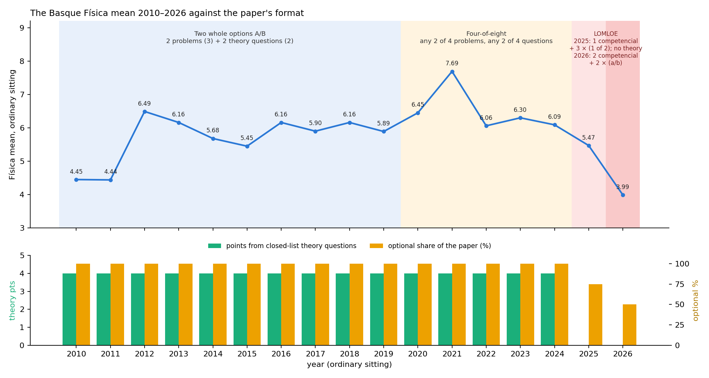{#fig-ehu-formats}

From 2010 to 2019 the paper offered two complete options, A and B, each with two three-point problems and two two-point "cuestiones"; the student chose one option and could not mix. The COVID paper of 2020 replaced this with a four-of-eight format — any two of four problems and any two of four questions — and, as the coordinator notes, the format was never withdrawn: it ran unchanged through 2024. Both formats made the whole paper optional in the sense used in Chapter 11 (every mark comes from a slot where the student chooses), but the 2020–2024 rule gave far more choice than the A/B rule, and it coincides with the two highest means of the series (7.69 in 2021, 6.49 in 2012, with 2020 third at 6.45).

The 2025 paper broke with both: seven problems in four blocks of 2.5 points, no theory questions at all, one block (A, gravitation) obligatory and written as a contextualised "competencial" exercise, the other three blocks with a choice of one problem out of two. The 2026 paper went one step further: six items, blocks A and B (gravitation, electromagnetism) both obligatory and competencial, blocks C and D with options a/b, a constants table on the paper, and most exercises split into six to nine numbered sub-tasks (option C1 has three lettered parts and none) carrying explicit 0.25-point marks.

## Forty per cent of the marks from a list of titles

::: {#tbl-theory}


The 22 titles of the official list *Evaluación para el Acceso a la Universidad: Cuestiones teóricas* (UPV/EHU and Departamento de Educación, bilingual, each title followed by a development guide for students and correctors; `sources/exams_ehu_hist/ehu_theory_list_official.pdf`), with the number of times each was set as a "cuestión" in 2010–2024 (120 questions in 30 papers). File: `data/ehu_theory_inventory.csv`.
:::

Until 2024, four of the ten points were awarded for two theory questions, and from 2012 the questions were not questions in the usual sense: they reproduced, verbatim, the title of an entry in a syllabus list. (The sixteen questions of 2010 and 2011 are the exception: they are free-form, and three of them do not correspond to a single title at all. From 2012 onwards all 104 are verbatim.) The titles set are of the kind: "Lupa. Descripción. Esquema de la formación de imágenes. Aumento." (July 2022), "Defectos de la visión. Hipermetropía y miopía." (June 2019), "Reflexión y refracción de ondas: concepto, índice de refracción, leyes… Conceptos de ángulo límite y reflexión total." (June 2024). The list was an official document: a bilingual sheet issued jointly by the university and the Basque Department of Education, *Cuestiones teóricas*, which states that the questions "aparecerán (tal y como están escritas) en la Evaluación para el Acceso a la Universidad", gives for each title a guide to the content a student should include, and was sent to the correctors as their marking reference. It has 22 titles, and the inventory reconstructed from the papers before the document was in hand recovers exactly those 22: every title was set at least once between 2010 and 2024 (the photographic camera twice, the Biot–Savart title twice; radioactivity twelve times, Kepler ten, the photoelectric effect nine); five titles — radioactivity, Kepler's laws, the photoelectric effect, Faraday–Lenz and Coulomb's law — account for 47 of the 120 questions. The document is no longer online, but any teacher who kept it, or the papers, had the whole of the theory component in advance, together with the marking guide. Under the A/B format a student who could reproduce two entries from that list held 4 points before touching a problem; under the four-of-eight format, with four titles on the paper and two to be chosen, the same 4 points were even more accessible. In 2025 this component disappeared in a single step. The other communities' 2025–2026 papers offer no exact analogue: Andalucía keeps a large share of short "razone" conceptual items (about 5–6 of 10 expected points), Valencia had 1.5-point "cuestiones" in 2025 and dropped them in 2026, Castilla-La Mancha's 2026 paper has two fixed 0.5-point items, and Asturias, Madrid, Cataluña, Extremadura and Canarias set none in either year — so removing theory is not, by itself, what separates Euskadi from the communities that rose; what is specific to Euskadi is going from 4 points of closed-list theory to none in one year.

## The de facto syllabus: which problems were actually set

::: {#tbl-topics}


Problems set per sub-topic and period, all options counted (146 problems in 34 papers). File: `data/ehu_problem_inventory_2010_2026.csv`.
:::

{#fig-ehu-topics}

The inventory confirms the coordinator's description of a syllabus that had narrowed in practice to a small set of problem types:

- **Gravitation** was a circular-orbit problem 18 times out of 29 (2010–2024), a surface-gravity problem 7 times, a launch problem 3 times and a Kepler/elliptical problem once (July 2012). Angular momentum never appeared in a problem.
- **Electromagnetism** rotated among point charges (10), a charged particle in a magnetic field (8), induction (5), straight currents (5) and a particle in a uniform electric field (4, none after 2016). The velocity selector and the mass spectrometer never appeared until July 2026, where the mass spectrometer is the *obligatory* problem 2.
- **Waves** meant a travelling harmonic wave (17) or a spring–mass oscillator (7). **Standing waves** were a theory title (set three times) but never a problem until the violin string of June 2026, which also asks for sound levels in decibels — a quantity that had never been examined in any form. The Doppler effect never appeared.
- **Optics** meant refraction (10) or thin lenses (10). **Spherical mirrors** had never been set — until the concave mirror of June 2025 (C1, as an alternative to a classical wave problem).
- **Modern physics** is the clearest case: 14 of the 15 modern-physics problems of 2010–2024 are photoelectric or photon-energy problems, the one exception a de Broglie calculation in July 2022. Radioactivity, fission and fusion existed only as theory titles. The 2025 papers kept the convention absolutely (all four block-D problems, June and July, are photoelectric), exactly as the coordinator reports the 2024 teachers' meeting had insisted; the 2026 papers lift it: C-14 dating (June 4b) and Pu-239 decay (July 4b) appear beside a photoelectric option.

Two features of this are worth stating precisely for the 2027 discussion. First, the narrowing was *de facto*: no document ever excluded mirrors, standing waves or nuclear decay; they simply were never set, and fifteen years of never being set is a stronger signal to a school than any syllabus. Second, in June 2026 the new sub-topics sat in *optional* slots — in July two of them were obligatory: a student could answer 3b (lenses) and 4a (photoelectric) and never meet a standing wave or a decay law. The inertia the coordinator describes therefore acted through preparation — schools that had to cover the modern-physics block in full for the first time, and blocks C and D in a form that made the option unpredictable — rather than through an unavoidable item. The obligatory novelty of 2026 is not a topic but a genre (the two competencial exercises), and, in July, a device never examined before (the mass spectrometer).

## The marking rules, year by year and community by community

::: {#tbl-marking}


Marking rules as printed in the corrector documents (EHU 2012–2024 papers with embedded criteria; EHU 2025 model of 18 November 2024; EHU 2026 solucionarios; the other communities' 2025 and 2026 corrector documents in `sources/exams/`). File: `data/marking_rules_2025_2026.csv`.
:::

From 2012 to 2024 the EHU criteria, printed after each paper, were two qualitative paragraphs: a *cuestión* is worth up to 2 points for a precise definition with rigour; a *problema* up to 3, later sections independent of earlier ones; planteamiento, laws, diagrams and units are valued; "purely mathematical developments without physical justification", missing units and incoherent results "se penalizarán" — with no amounts. The 2025 model (18 November 2024) introduced, for the first time, numerical penalties: −0.1 per spelling error from the third, up to 1 point per exam; up to −0.5 for syntax, coherence and presentation; units mandatory in the final answer; significant figures and exponent notation "penalised"; conceptual errors weighing more than arithmetic ones; a correct result counting only if justified. The 2026 solucionarios add the rest of the list the coordinator describes: symbolic solution before numerical substitution; −0.1 for missing or wrong units, for repeated vector-symbol errors, for rounding and significant figures; grave errors (wrong equations, scalar/vector confusion) voiding the whole section; sub-tasks marked at 0.25-point resolution against a printed table.

Set against the other communities, none of these rules is unique to Euskadi, but their combination is. Canarias applies the CRUE minor-error list in both years, and tightened it between them exactly as Euskadi did: the 2025 document lists six minor errors and caps the total at 20 % of the section, while the 2026 document adds factor-of-ten and transcription errors and drops the cap. Canarias is the other community whose mean collapsed. Andalucía prints a near-identical itemised list in 2026 — −0.1 each for units, vector or scalar character and rounding — and rose. Comunitat Valenciana has required the symbolic calculation first since 2025 and marks it at 60 % of each section, and rose. Extremadura's language penalty is worded identically to EHU's 2025 rule (−0.1 from the third fault, cap 1 point; syntax up to −0.5), and fell. Cataluña, Asturias and Andalucía cap the unit penalty at −0.25 per problem or section; Madrid states no amounts. The marking regime is thus a candidate contributor, not a discriminator, on this evidence; the observation that the three communities applying an itemised penalty list in 2026 are Euskadi, Canarias and Andalucía, of which one rose and 22–25 % of exams below 2 ([Chapter 4](#sec-ch04)) is the kind of coincidence that only item-level marks can turn into a finding or dismiss.

## What choice alone is worth

Optionality has been a recurring suspect since Chapter 6, so it is worth putting a number on it. A student who chooses among items scores, on average, more than the same student answering fixed items, because the choice picks up item-to-item luck. A simple simulation makes the size of this *selection premium* explicit for each EHU format: 200 000 simulated students with ability $a \sim \mathcal N(0.55,\,0.20)$ clipped to $[0,1]$; each item scored as $p_i \cdot \operatorname{clip}(a+\varepsilon_i,0,1)$ with $\varepsilon_i \sim \mathcal N(0,\sigma)$; the student answers the best items each rule allows. Holding the population and the items fixed and changing only the rule:

::: {#tbl-premium}


Expected gain, in points out of 10, over a paper with no choice, for three values of the item-to-item noise $\sigma$. File: `data/ehu_selection_premium.csv`.
:::

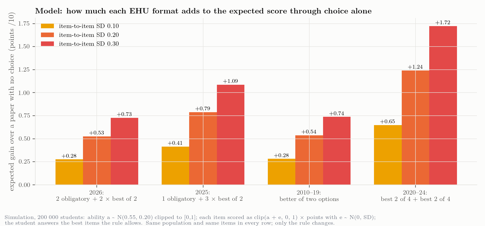{#fig-premium}

Three readings. The four-of-eight format of 2020–2024 was by a wide margin the most generous ever used (+1.2 points at $\sigma = 0.2$), which is consistent with those years carrying the highest means of the series without any change in the population. The 2025 format still gave more through choice (+0.8) than the classical A/B paper (+0.5), and the 2026 format (+0.5) is, in terms of choice, a return to the 2010–2019 level — years in which the mean ran from 4.44 to 6.49. And the step from 2025 to 2026 removes about a quarter of a point through choice, a fifth of the observed $-1.48$. Optionality is real, measurable and worth restoring where it is cheap, but it cannot carry the 2026 result; the earlier chapters' suspicion is confirmed and bounded at the same time.

## Reading 2025 and 2026 together

The most useful thing the sixteen-year record does is to separate what changed in 2025 from what changed in 2026, because the grade series reacts very differently to the two steps.

**2025** was the larger structural break: the theory questions (4 points from a closed list) vanished; the A/B and four-of-eight choice gave way to one obligatory competencial block and three binary choices; the problem count and weights changed; numerical language penalties and a justification-first rule appeared. The 2025 Basque mean fell by $0.62$ — *less* than the national average fall of $0.81$ in the first LOMLOE year, when fourteen of seventeen communities fell ([Chapter 3](#sec-ch03)). Whatever the 2025 changes cost, the Basque cohort absorbed them at least as well as the Spanish average did.

**2026** changed less on paper and more in kind. Every feature of the 2026 step is an intensification of something already present in 2025, plus two novelties: the competencial genre went from a quarter of the marks to half and from one obligatory exercise to two; choice fell from three binary options to two; the marking moved from qualitative rules with two numerical penalties to a printed −0.1 list, symbolic-first, and 0.25-point sub-tasks; and the de facto syllabus was opened — modern physics to any topic, blocks C and D to standing waves, decibels and mirrors. None of these alone is large by the yardsticks this study can apply (the choice premium is a quarter of a point; the new topics are avoidable; the marking rules are shared with communities that rose). What is not shared with any community that rose is the *joint* movement of content type, exposure, format and marking in a single year, on top of a 2025 break that the schools had had one cycle to adapt to — and the coordinator's account adds the missing mechanism: a school system trained for fifteen years on a paper whose theory came from a list and whose problems came from a dozen templates had, for 2026, to teach the whole of block E and the un-set corners of blocks C and D, while its students met an exam whose obligatory half asked them to read, judge and explain rather than to recognise.

That reading is consistent with everything the earlier chapters found — the cohort-wide displacement rather than a subgroup effect ([Chapter 4](#sec-ch04)), the concentration of the damage in Física and Matemáticas II ([Chapter 5](#sec-ch05)), the Canarian twin with the same penalty list and a structural cut of choice ([Chapter 3](#sec-ch03)) — and it is still not a causal estimate. It is, however, a precise statement of what an item-level analysis of the 2026 scripts should be able to confirm or refute: whether the marks were lost (i) in the two obligatory competencial exercises rather than in the options, (ii) in the explain/evaluate sub-tasks rather than in the calculations, (iii) through accumulated −0.1 penalties and voided sections, or (iv) in the newly-examined topics for those who chose them. Each of those has a different remedy for 2027, and only the first two would justify touching the competency design itself.

## For the record: what is documented and what is testimony

Documented on ehu.eus and archived here: the 34 papers; the criteria embedded in the 2012–2024 papers; the 2025 model paper of 18 November 2024 with its general criteria (and its earlier October version, which proposed four obligatory competencial exercises with a rubric and was withdrawn); the 2025 and 2026 solucionarios with the 2026 corrector rules. Documented by the coordinator's own file and archived here: the official EHU–Department list of 22 theory titles with its development guide. Testimony of the coordinator, consistent with the papers but not independently documented: the decision of the coordinators' meeting some twenty years ago restricting modern-physics problems to the photoelectric effect (borne out by 14 of 15 problems 2010–2024 and all four of 2025), the 2024 teachers' meeting confirming that restriction for 2025 against the coordinator's position, and the 2025 decision to open block E for 2026 (borne out by the 2026 papers). No coordination-meeting minutes are published; if the Department or the university asks for the record, these two decisions are the ones to document.


# The paradigm change, seen whole {#sec-ch16}

*Every design decision behind the 2026 paper, what it was for, what it cost, and what the data now say — followed by the order in which we came to see it*

## Why this chapter exists, and how to read it

Everything else in this dossier works from the outside in: a mean fell, and the question is what moved it. This chapter works from the inside out. It sets out the paper as a made thing — a set of decisions taken by people for reasons, under constraints they did not choose — and asks of each decision what it was for, what it cost, and what the measurements say.

It exists because the design side of the story arrived in pieces, in the order that questions happened to be asked, and that is the worst possible order to read it in. A reader meeting the itemisation for the first time in the middle of a marking simulation cannot see that the same decision also explains the reading load. The order of discovery is preserved, because it is part of the evidence and because it shows which conclusions were reached under pressure, but it is put second, in [part two](#part-two-the-order-in-which-we-came-to-see-it).

Two warnings. The account of *intent* in part one comes from the coordination and is **testimony**; it is labelled as such where it carries weight, and the dossier does not treat an explanation of why a decision was taken as evidence that it was taken for that reason alone. The account of *effect* is measurement, and is sourced. Where the two disagree, both are given.

## Part one: the scenario

### What was not chosen

Four things about the 2026 paper were settled before the coordination met, by the LOMLOE curriculum and the CRUE orientations, and no local decision could have avoided them.

**The paper had to be competency-based, and part of it had to be obligatory.** The orientations require at least one non-optional question carrying an application, a real context, a published text or a graph to interpret. What a competency item *is* — a real situation, a demand for qualitative reasoning, a demand for judgement — is specified, not left open.

**Optionality had to fall inside a band**, between 50 and 85 per cent of the marks, where the old Basque paper had offered a choice between two complete papers and then, through the COVID years, any four of eight items.

**At least 70 per cent of the marks had to come from open or semi-constructed responses**, which rules out the compensating move a paper under length pressure would otherwise make.

**And the error schedule was specified with amounts.** The seven minor types — missing or incorrect units, a vector arrow on a scalar and its converse when repeated, intermediate rounding that moves a value by more than 5 per cent, wrong SI prefixes, a factor-of-ten error, a data transcription error — carry $-0.10$ each. A grave error voids the section. The linguistic component is 0.2 within a text-producing question, and the Basque criteria cap spelling and syntax together at 1.00, ten per cent of the paper.

The last of these matters more than it looks, and in a direction that is easy to miss: **the amounts were specified, but nothing said they had to be applied in full, and in 2025 the Basque criteria carried them as words rather than numbers.** The 2025 text says significant figures and exponent notation are "penalised" and puts no figure on it. The 2026 text says $-0.10$. That is the difference the coordination describes as the regime change, and it is visible in `data/marking_rules_2025_2026.csv` without anybody's testimony.

### What was chosen

Inside that frame the coordination took at least eight decisions that it did not have to take, or did not have to take in the form it took them. Each is given here with its purpose as the coordination states it — testimony — and its measured cost.

#### 1. Optionality cut to the floor, and the competency items made obligatory

The 2025 paper offered one of two in three of its four blocks: 75 per cent optional. The 2026 paper made exercises 1 and 2 obligatory and offered a choice only in 3 and 4: **50 per cent**, the bottom of the permitted band. Of the nine communities that published a 2026 result, Euskadi and Cataluña are the only two sitting at that floor, and Cataluña was already there in 2025 — so Euskadi is the only one that *moved* to it. Two communities cut more percentage points than Euskadi's 25, Canarias and Castilla-La Mancha by 30 each, but both landed at 70; one, Andalucía, went the other way, by 15.

*What it was for.* An obligatory competency item is the only way to guarantee that every candidate meets the new paradigm; an optional one can be avoided by everybody who finds it unfamiliar, which would make the reform invisible and unassessable.

*What it cost.* Simulating both Basque formats on the same population and items, removing the choice is worth about $-0.26$; net of what the other eight communities cut, the part that belongs to Euskadi is about **$-0.20$** ([the budget](#the-mark-budget)). It also removes the candidate's escape route from the longest statements, which matters because the two obligatory items are the two longest.

#### 2. The marks itemised into quanta of 0.25

This is the decision the rest of the chapter keeps returning to. The 2026 criteria break each apartado into sub-items — a.1, a.2, a.3 — each worth 0.25 or 0.50, **forty quanta over the 10.00**. The 2025 criteria did not: the step was 0.25, but the itemisation was not written down and not printed.

*What it was for*, in the coordination's words: to help candidates. Failing a sub-question costs a quarter of a point instead of an apartado. More elements of what a candidate knows get their own chance to be credited. Spreading the marks over many small demands gives more opportunities than concentrating them in a few large ones, and for the demands that are effectively binary — does this change, yes or no, and why — a candidate who is uncertain still has a real chance on each.

*What it cost.* Three things, and the dossier could measure all three only once the decision was on the table.

**It generates text.** A paper marked in itemised quanta must print each quantum's demand and each quantum's price. Per printed statement, the competency narrative in 2026 is the same size it was in 2025 — 70 words against 71, 99 per cent — while the demand text **more than doubled**, 181 words against 88, and the printed prices went from nothing to 17. The 2025 paper stated twenty plain numbered demands and no nesting; the 2026 paper states seventeen apartado lead-ins with thirty-six numbered sub-demands inside them and fifty-one printed weights. **The reading load the dossier has been attributing to the competency reform is the price of this decision instead** ([the measurement](#exposure-and-the-third-channel)). The coordination's own reconstruction agrees from the other side: in its ladder for the electromagnetic problem, making the item competencial costs 88 words and *desglosarlo* — itemising it — costs a further 66.

**It puts the competency items and the traditional ones on the same footing.** A competency item broken into quanta of 0.25 is marked the same way as a naked ondas problem broken into quanta of 0.25. The coordination says this is deliberate: the paradigm change is diluted on purpose, so that a candidate who has prepared in the old way is not destroyed by the new one. It is a defensible transitional choice and it is worth saying out loud, because it means **the 2026 paper is less of a paradigm change than its statements look**, and any inference from the paper's appearance to what it demanded is an overstatement.

**And it works against the deductions.** Itemisation makes partial credit systematic where it had been at the corrector's discretion, so on its own it *raises* marks. The deductions lower them. Two decisions taken in the same room in the same year pull in opposite directions, and the observed fall is their sum. This has an arithmetical consequence the dossier had not drawn: a model of the fall that includes the deductions and omits the itemisation **understates the penalty burden**, because the penalties had first to cancel a benefit before they could show up as a fall.

#### 3. The deduction schedule applied in full

*What it was for.* Compliance, and consistency between correctors. The amounts are in the criteria; a meeting was held before the sitting and agreed to apply them.

*What is documented and what is not.* The amounts are documented. **That the rules were applied in full in 2026 and not in 2025 is the coordinator's account** — collective, scheduled, attended by every corrector, so any of them could confirm or deny it, but testimony until the agenda and circulated criteria are retrieved ([request 10](#what-to-ask-for-and-what-each-request-would-separate)).

*What it cost.* This is the dossier's largest single piece of modelling, and it occupies three sections of [chapter 6](#penalty-regime). In summary: the regime is **sufficient** to produce the four published 2026 figures, at about twelve deductions per script with a grave error carrying part of the paper in one script in six; it is not identified, because those four figures were fitted rather than predicted; read flat it is a **ceiling** rather than an estimate, and read as the realistic distribution it carries between 59 and 87 per cent of the Física-specific fall; and fitted to all four published figures it is **over-attributed by 0.38 marks**, because those figures contain a $-1.18$ that fell on every Basque subject and cannot be the Física marking sheet.

#### 4. The deduction of 0.10 against the quantum of 0.25

This is not a decision anybody took. It is what two decisions produce together, and it deserves its own heading because nobody chose it and its effect is real.

The scheme is built on a quarter-point step. The penalty is $0.10$, which is **two fifths of a quantum**. A 0.25 sub-item hit once is worth 0.15; hit twice, 0.05. Whatever else the deductions did, they dissolved the granularity the same criteria had just introduced: after the first deduction no script is on the grid the design is built on, and the itemisation's promise — that a candidate can see what each piece was worth — stops being visible in the mark.

It also produces the effect [the shape section](#penalty-shape) turns on. A deduction removes a full 0.10 only where 0.10 is left; on a sub-item a weak candidate has half-earned, the zero floor absorbs the rest. Fine granularity makes that worse, not better, because the pieces are smaller.

#### 5. Only half the paper can attract a deduction

Also not a decision, and also consequential. Coded from the corrector's own document, a candidate's paper has 27 to 32 sub-items of which **14 to 19 can attract a missing unit, a wrong prefix or a rounding error** — 48 to 63 per cent. The rest ask for a definition, a judgement, a comparison with its justification, a sketch. A missing unit cannot be committed there.

So the deduction schedule does not apply to the paper; it applies to the numerical half. Restated in the currency a marking sheet can be counted in, the fitted twelve deductions are **0.67 penalties on every numerical answer of every script**; carrying the whole observed fall alone would take 1.26, more than one penalty on every numerical answer there is. That is the number to take to the tally, and it is a much harder claim than "twelve per script".

There is an irony in it worth naming. The competency items are the ones richest in judgement and justification, which is to say the ones **least** exposed to the deduction schedule. The uncapped penalties fall hardest on the traditional, numerical part of the paper — the part the itemisation was meant to make forgiving.

#### 6. Symbolic resolution before numerical

New in 2026: *cálculo simbólico antes que numérico*, stated in the general criteria.

*What it was for.* It is good practice and it makes a wrong route visible before the arithmetic hides it.

*What it cost.* Not measured. It plausibly interacts with the deduction schedule — a symbolic step carries no units to omit and no figures to round, so a paper that demands symbolic work first shifts marks from exposed sub-items to unexposed ones. The coded paper bears this out: the symbolic sub-items carry 0.50 to 2.25 marks depending on the options chosen, and not one of them is exposed. This is one of the few places where a 2026 decision worked *against* the penalties.

#### 7. The constants table moved onto the paper, with distractors

New in 2026: one table for the whole paper, containing every constant needed and exactly two that are not.

*What it was for.* Uniformity, and a small test of whether a candidate knows which constants the problem needs.

*What it cost.* About 21 words moved out of the statements and into furniture, which slightly inflates both the measured statement growth and the measured furniture growth; the dossier says so where it reports them. The distractors are not costed.

#### 8. Scientific notation printed as a scored criterion

*What it was.* A transversal criterion of *saber básico* A, printed with its points in its first explicit year as deliberate scaffolding.

*What it was not.* An earlier draft of this dossier read it as a taxonomy error — a presentational convention mistaken for a competence. **That reading was wrong and was withdrawn.** The coordination's intent was to make a standing expectation visible at the moment it first became scorable, and printing it is the scaffolding, not a category confusion.

### How the decisions interact

Set out one at a time, each decision is defensible and most are obviously right. The difficulty is in the combination, and the combination was not designed.

**Two decisions pull opposite ways.** Itemisation raises marks by making partial credit systematic. The full application of an uncapped deduction schedule lowers them. Taken together the paper is more forgiving in its structure and less forgiving in its marking, and the observed mean is the residue. Nobody chose that pairing as a pairing.

**One channel is capped and the other is not.** The linguistic penalties stop at 1.00 whatever the number of errors; the $-0.10$ deductions have no cap at all in the Basque 2026 criteria. Of the nine communities coded, Canarias capped its deductions at 20 per cent of the section in 2025 and removed the cap in 2026; Andalucía caps at $-0.25$ per apartado; Extremadura caps at 1.00. Euskadi's decision to leave the numerical deductions uncapped while the linguistic ones remained capped is a choice about which kind of error is allowed to be unbounded, and it went against the kind physics is made of.

**The protection and the reading load are the same decision.** This is the finding this chapter exists to state plainly. The itemisation that shortens the fall from a mistake is the itemisation that lengthens the paper, because each protected piece has to be written down and priced. They cannot be separated by better drafting; they can only be traded.

**And the dilution is real in both directions.** Marking competency items in the same quanta as traditional ones protects candidates prepared in the old way, and it also means that the competency items — the long, contextualised, judgement-heavy ones — are the part of the paper the deduction schedule barely touches. The paradigm change was diluted in the marking as well as in the structure.

### What the data say, decision by decision

| Decision | Purpose (testimony) | Measured cost | Status |
|---|---|---|---|
| Optionality cut to 50 % | guarantee every candidate meets the new paradigm | about $-0.20$ net of the field | quantified (modelled) |
| Marks itemised into 0.25 quanta | protect candidates; credit more elements | the whole of the reading load: demand text per statement 88 → 181 words, prices 0 → 17 | measured |
| " | " | dilutes the paradigm change on purpose | testimony, consistent with the coding |
| " | " | raises marks, so the penalty burden behind the fall is larger than a model without it implies | argued, not quantified |
| Deduction schedule applied in full | compliance and consistency | sufficient for all four published figures; 59–87 % of the Física-specific fall on realistic readings; over-attributed by 0.38 if fitted to all four | modelled; the application is testimony |
| 0.10 against a 0.25 quantum | not a decision | every script off the grid after the first deduction | arithmetic |
| Half the paper exposed | not a decision | 0.67 penalties per numerical answer at the fitted rate | measured |
| Symbolic before numerical | good practice; makes a wrong route visible | shifts marks to unexposed sub-items; not costed | not measured |
| Constants table with distractors | uniformity; a small test | ≈21 words of layout effect on the statement counts | measured, small |
| Scientific notation printed | scaffolding in its first scorable year | not costed | testimony |
| Linguistic rules applied | compliance | capped at 1.00; the published figures want one error per script, worth 0.04 | modelled |

: Every design decision behind the 2026 paper, with what it was for and what it cost. {#tbl-design tbl-colwidths="[22,26,36,16]"}

### What 2027 changes, and the one decision it does not take

The 2027 paper keeps the structure, the contents and the marking. One thing changes: the statements get shorter, from about 1 430 words of reading to about 970, with the same verbs, the same rubric and the same demands. The budget is two-tiered — competency items at or below 250 words, option items at or below 150 — because the papers' own trajectory shows a competency item costing about 400 words in its first year and about 300 in its second ([the statement budget](#statement-budget)).

What this chapter adds is that **the target may be reachable by a route nobody has costed**. If the demand text per statement has doubled because of the itemisation, and the competency narrative has not grown at all, then the cheapest 470 words on the paper are in the nesting and the printed prices, not in the contextualisation everybody has been trying to compress. Flattening two levels of demand back to one, or printing the apartado's price without printing each quantum's, would buy a large part of the target without touching a single word of physics.

It would also give back exactly what the itemisation was introduced to provide. That is the trade-off, and it is not the dossier's to resolve:

- **Keep the itemisation and compress the narrative.** The narrative is already at 70 words a statement; there is not 470 words of slack in it. This is the route the 2027 target implicitly assumes and it is the hardest one.
- **Flatten the itemisation and keep the narrative.** Cheapest in words, and it returns the marking to the corrector's discretion for partial credit, which is what the itemisation was meant to remove.
- **Keep both and print less.** Itemise in the criteria, as now, but print only the apartado and its total on the paper. The candidate loses the signal of what each piece is worth; the corrector keeps the fine grid. This is the only option that separates the two effects, and nobody has tested whether candidates use the printed weights at all.
- **Keep both, print both, and cap the deductions.** Does nothing for the reading load, but it addresses the interaction in #4 and #5 directly, and it is the only item on this list that is a marking decision rather than a drafting one.

The dossier can price the first three in words and none of them in marks. It can say that the fourth is the one whose effect it has actually modelled. **What would let the coordination choose is the tally**: deductions per script crossed with the script's own mark, and the 2026 band table ([requests 3 and 11](#what-to-ask-for-and-what-each-request-would-separate)).

## Part two: the order in which we came to see it {#part-two-the-order-in-which-we-came-to-see-it}

Part one is the argument arranged. This is the sequence, which was different, and which is kept because the order in which a thing is learned is evidence about how well it is known. Each round below is recorded in full in [the audit](#sec-ch13); what follows is only the design-side thread.

**The paper as a length.** The first thing the dossier noticed about the 2026 paper was that it was longer, and the reading-load section attributed the length to the competency items, because that is what a competency item looks like: a paragraph of scenario before the physics. The correlation across nine communities between length and the change in the mean was $-0.905$. Nobody asked what *kind* of words had been added.

**The paper as a structure.** Coding the nine papers against the structural criteria showed that Euskadi was the only community to move all four axes in the direction the orientations ask, and that the nine did not sit comparable exams. This made the field comparison weaker and the Basque-specific number stronger, and it still had nothing to say about why the Basque paper was long.

**The statement item by item.** Asked for a word budget for 2027, the dossier counted every statement separately and found the length concentrated in the obligatory competency items in both years — A1 at 403 words in 2025, B1 at 406 in 2026. That looked like confirmation of the competency reading. It was not: it was the two obligatory items being the two that were both competencial *and* the most heavily itemised, and nothing in the count could separate those.

**The coordinator's corrections.** Four readings of the coordination presentation were wrong and were withdrawn, including the scientific-notation one above. The correction that mattered most was a trajectory the dossier had missed in its own data: a competency item costs about 400 words in its first year and 300 in its second. That made 2026 a paper carrying one block at 400 and another at 300, rather than a paper that had gone wrong.

**The marking regime.** The coordinator supplied the account of non-award becoming deduction. Modelling it took three attempts, two of them wrong, and produced the dossier's strongest single result: the regime is sufficient to produce the published figures. It also produced the assumption this round dismantled — that all twenty-eight sub-tasks are alike and that the linguistic channel is an unmodelled addition.

**The distribution of the penalties.** The coordinator objected that the model gives every candidate the same twelve deductions, and attached a purpose: he did not want the whole fall explained with the data in hand. That produced the ceiling argument, and the correction of a modelled top band that the dossier had been quoting as an observation.

**The granularity.** And then the piece that reorganises the rest: forty quanta of 0.25, a decision taken to protect candidates, which dilutes the paradigm change on purpose and which generates text. Measuring it showed that the competency narrative had not grown at all, and that the reading load — the dossier's oldest and most-cited finding about the paper — had been attributed to the wrong cause for the whole of its life.

**What the sequence shows.** Every substantive correction in this thread came from the coordination and none from the data. The data were sufficient to measure the itemisation's cost in words from the first day; the repository held the corrector's document, the two statements and the marking-rules table throughout. What was missing was the knowledge that the itemisation was a *decision*, with a purpose, that could have been otherwise. A dossier written from published outputs can measure what a paper is; it cannot see the choices behind it, and it will attribute what it measures to whatever cause it already has a name for. That is worth recording as a limitation of the method and not only as a history of this study.


# Literature: what exists and what does not {#sec-ch07}

*The evidence base for a Basque Physics PAU study, updated to September 2026*

## The gap, stated by the field itself

The most useful new reference is a bibliometric review published this year [@ruizlazaro2026revision]: a PRISMA screening of 16 311 records on university access in Spain that retains 59 empirical articles and 12 doctoral theses across five thematic clusters (access models; results and their explanatory variables; international comparison; psychometrics; alternative pathways). **None of the 71 items analyses Physics results.** The results-oriented literature is concentrated on mathematics, language and history; the PAU literature that touches Physics is content analysis of the papers [@gonzalez2024fisica], not analysis of marks. A Física-specific results study of the kind this project is building is unoccupied ground.

## New references located in this search

| Reference | What it contributes | Física? | Open |
|---|---|---|---|
| @ruizlazaro2026revision | Bibliometric map of the whole field to 2024; documents the absence of Physics-results studies | no | yes |
| @veas2025consistency | Many-facet Rasch analysis of 54 assessment boards, 3 000 students, five Valencian universities (June 2018): "large inconsistencies … in the severity levels of many subjects both within and between universities" — the strongest Spanish evidence for tribunal effects | not among the six subjects | yes |
| @veas2020comparabilidad | Partial-credit Rasch on 6 709 students, 15 subjects (Alicante): rubric step structure itself is a source of measurement error (non-monotonic scoring categories) — relevant to 0.25-point rubrics | included among subjects | yes |
| @faura2022desigualdad | Expert-panel difficulty rating of the 17 regional papers in one subject, correlated with regional means; concludes a single national paper is needed. The design to replicate for Física 2026 | no (Mat. CCSS) | yes |
| @luzarraga2024pau | Basque case study: EBAU shapes Bachillerato guidance toward the university pathway without assessing competences; the newest Basque PAU study (qualitative) | no | yes |
| @nortes2021pauebau | Item-level error analysis of 138 scripts across the PAU→EBAU regime change: same item types, same errors, 25 % of items scored zero. Template for a 2024→2026 Física item comparison | no (Mat. CCSS) | yes |
| @woitschach2018correctores | Differential rater severity with 13 raters and an 8-criterion rubric; not a PAU study, cited for method and magnitude | no | yes |
| @rodriguez2014genero | Oviedo PAU cohorts 2006–2010: performance gender differences shrinking, field-choice segregation persisting; the closest PAU × gender × STEM study located | not disaggregated | yes |
| @veas2025conversation | Dissemination piece from project PID2020-115248RA-I00: PAU is criterion-referenced only; proposes percentile thresholds and Rasch equating across communities, "implemented for the first time in the Comunitat Valenciana"; calls for standardised tribunal training | — | yes |

One further item was resolved in the evening follow-up: the study attributed in June 2026 press to two Universitat Jaume I researchers is the piece by @sancheztarazaga2026pau (The Conversation, 2 June 2026, with a DOI). It scores, with an AI model trained on the Bachillerato curricula, the competency orientation of the PAU papers of six communities — **including País Vasco** — over 2015–2025 on a 0–100 scale. Its findings bear directly on the Basque question: Cataluña and País Vasco are rated the *most* competency-oriented exam systems and Madrid the least; the subject matters more than the community; Matemáticas II is the least competency-oriented subject (but the one improving fastest), Inglés the most, Química and Biología low but improving. Física is not singled out. The implication for Chapter 6 is that the Basque papers were already at the competency-oriented end of the Spanish range before 2025, so the 2025–26 change in Euskadi cannot be described simply as "becoming competency-based". The underlying primary article has not been located; the authors' names are Sánchez-Tarazaga (not "Taragaza" as some outlets print) and Gimeno Rovira.

## The classic references, and how this study uses them

- **Basque PAU results**: the Ikastorratza comparison of Cataluña, Comunitat Valenciana and País Vasco for June 2011 [@ruizdegauna2013comparado] — the source of the 2011 Física comparison (4.44 vs 5.68 vs 4.07) and of the subject-choice typology in which Física is a "specific-phase" subject; the 1994–2008 Mathematics series [@ruizdegauna2011matematicas] as proof that per-subject records exist internally back to 1994; and the teachers' opinion study [@ruizdegauna2013selectividad]. The La Rioja series located here ([Chapter 3](#sec-ch03)) shows that the 2010–11 Física trough in these papers was national.
- **Physics-specific content analysis**: 183 papers from four communities 2010–2022 [@gonzalez2024fisica], the coding scheme to extend to the Basque papers; the washback study [@oliva2018influencia] for the competency-design question.
- **Marking and comparability**: rater criteria [@mengual2019criterios], scoring standards [@veas2020frontiers], the inter-community comparability thesis [@ruizlazaro2021tesis] and the gender analysis of science subjects [@manzano2011genero].

## What was searched and not found

RSEF, the Conferencia de Decanos de Física, CRUE and the physics-teacher associations published nothing on the 2026 Física results. No peer-reviewed content analysis of Física PAU papers exists for 2023–2026 (chemistry has this literature; physics does not). No study disaggregates Física PAU results by sex. Nothing newer than 2013 by Ruiz de Gauna, Sarasua or Dávila on PAU was located. No TESEO or ADDI thesis on Física PAU results exists. arXiv `physics.ed-ph` has nothing on the Spanish PAU. The 2026 national press covered Matemàtiques in Cataluña and Euskara in Euskadi; the Basque Física figures were carried nationally only as the counter-example in the Euskara story (El País, Europa Press, 20minutos, Telecinco, 6–7 July, all relaying the EHU press conference), never as a story in themselves, and the Canarias 2026 Física result was, as far as this search could establish, not covered anywhere.

## Positioning a Basque Física paper

Taken together, the literature supports a paper with three layers that nobody has combined for Physics: (1) the 2010–2026 results series with its regimes ([Chapter 2](#sec-ch02)), (2) a content and difficulty audit of the Basque papers against the other communities' 2026 papers in the design of @faura2022desigualdad and @gonzalez2024fisica, and (3) tribunal-level marking data in the design of @veas2025consistency, if EHU releases them. The Canarias comparison ([Chapter 4](#sec-ch04)) gives the paper a second case with full histograms, and the school-marks series ([Chapter 5](#sec-ch05)) gives it the certification-versus-examination gap that the Basque centre-level literature has only addressed for all subjects together.


# Sources {#sec-ch08}

*Every file, dashboard and page used, with URL, retrieval method and fingerprint*

## Raw files archived in `sources/`

::: {#tbl-registry}


Files in `sources/raw/` and `sources/ministry/` with size, retrieval route and SHA-256 prefix. Full hashes: `sources/source_registry.csv`. Text extractions (`pdftotext -layout`) are in `sources/text/`.
:::

## The consolidated regional dataset

Every regional Física figure used in this study, with its denominator and source type, is in `data/regional_fisica_found.csv` (hand-coded from the sources above and from the dashboards; the search agents' raw extractions are kept unchanged in `sources/agent_extractions/` for provenance).

::: {#tbl-found}


Regional Física results located in this study. "Source type" distinguishes official statistics, official presentations and dashboards from coordinator ponencias, working-group reports and press.
:::

## Datasets carried over from the July package

Used unchanged, copied to `data/original/`: `fisica_pau_ehu_2010_2022.csv` (EHU annual reports, with sex, language and network splits), `fisica_pau_ministerio_2015_2025.csv` (the July parse of the Ministry cube, used only as a validation target), `fisica_tables.csv`, `catalunya_materias_2014_2026.csv` and `comparativa_materias_2026.csv` from `hist_evolution`. The three Ministry PC-Axis cubes are the July copies (`nota`, `matric`) plus the grade-distribution cube downloaded on 18 September by the earlier session (`distr`); the September re-download of the first two was byte-identical to the July copies.

## Material supplied by the coordination, not archived here

Two items enter the analysis without a hash in the registry, because they are the
coordinator's own working material rather than published sources, and both are
labelled **testimony** wherever they are used.

The first is the official EHU–Department list *Evaluación para el Acceso a la
Universidad: Cuestiones teóricas* (bilingual, 22 titles with a development guide,
circulated to teachers and correctors, not online), which is archived as
`sources/exams_ehu_hist/ehu_theory_list_official.pdf` and which matches the
reconstruction of [Chapter 12](#sec-ch12) 22 of 22.

The second is the coordination presentation **USaP Física 2027** (Gorka Arretxe,
Ordizia Institutua; Asier López-Eiguren, EHU; J. M. Igartua, EHU; 18 September 2026),
a Slidev deck of fourteen slides prepared for the meeting with the Bachillerato physics
teachers. Slides 8 to 11 reconstruct the 2026 electromagnetic problem in four versions
and slide 5 sets the 2027 statement-length target; [the statement section](#statement-budget)
uses both. The deck is a design document and not evidence about the results: what it
contributes is the setter's account of *why* the 2026 statement is as long as it is,
made checkable by reconstructing the alternatives. Its own word counts were recomputed
independently here from the archived paper and agree item by item to within two per
cent, which is reported in that section.

## Bibliography

The reference list below is generated from `references.bib` (45 entries: 10 new academic references, 9 classic ones, 26 official and press sources) with the APA style (`apa.csl`).

::: {#refs}
:::


# Log {#sec-ch09}

*What was done on 18 September 2026, in order, with the dead ends and the watch-list*

## Chronology

**09:00–09:30 — Orientation.** Read the July package (`fisica_pau_ehu_package`: README, dossier, two CSVs, 16 EHU reports, Ministry cubes, parse script), `hist_evolution` (digitised centre-level figures 2010–2016, Física tables 2010–2022, Cataluña 2014–2026 press series, 2026 press comparison) and the folder `analysis_2026-09-18` produced earlier the same day by another session (its README, work log and data files), so as to know what it had found and keep this analysis independent of it. Confirmed the project's central fact: Física 2026 at EHU = 3.99 (press 3.98).

**09:30 — Task plan and folder.** Six tasks: study, exhaustive search, folder, independent analysis, Quarto site, verification. New working folder `claude_analysis_2026-09-18/`; nothing in the existing folders is modified.

**09:35–10:00 — First wave: five parallel search agents** with written briefs (Euskadi/EHU; Ministry + Cataluña/Aragón/Navarra/Baleares/Rioja; Andalucía/Extremadura/CLM/Murcia/Canarias; Galicia/Asturias/Cantabria/CyL/Madrid/Valencia; literature + national press). Each returned a structured report with URLs, downloaded files and query families that found nothing. Total: 552 tool calls, 200 web searches (the session budget), 37 files downloaded.

**10:00–10:45 — Second wave in the built-in browser** (on the user's computer, for sites that block or rate-limit automated readers):

- `unirioja.es` (HTTP 429 from the cloud): four PDFs downloaded from the user's machine; `EvolucionJUN.pdf` is a 2022 edition whose subject names are images — rendered page 18 and read the Física chart: **2010–2022 series recovered**.
- `alumnado.unex.es/pau/`: reachable in the browser but carries no statistics section; Extremadura 2026 stays press-level.
- `uclm.es` (Azure WAF): passed the bot check in the browser; the statistics page links two Power BI reports; drove the Materia slicer to Física and read the per-year, per-sitting, per-province tables from the DOM: **Castilla-La Mancha 2021–2026 recovered**.
- `ull.es/estadisticas/pau/` → Power BI "Calificaciones en la PAU por asignatura": FÍSICA × JUN/JUL × 2025-26, 2024-25, 2023-24, plus the 2010–2026 mean history: **Tenerife histograms recovered**.
- `ulpgc.es/direccion-acceso/informes-ebau-powerbi-2021` (page updated 11 Sep 2026) → Informe 2: Física × JUNIO × 2024/2025/2026: **Las Palmas histograms recovered**.
- `indicadores.usal.es` "Notas medias de las asignaturas": the page embeds an Infogram project that no longer exists (**dead end, documented**).
- `legebiltzarra.eus`: site reachable, search form does not accept automated input (**lead, not a negative**).
- `universitats.gva.es/es/estadistiques`: same three 2026 files as in July (JUNIO, JULIO, GLOBALES); downloaded from the user's machine and **re-extracted page 43 independently** (identical values).

**10:45–11:30 — Data consolidation.** Wrote `pxparse.py` (dependency-free PC-Axis reader; `pyaxis` does not build in this environment) and `01_build_ministry_panel.py`; the Euskadi specific-phase series reproduces the July CSV exactly (11/11 means, 11/11 presented counts). Hand-coded `regional_fisica_found.csv` (80 rows) from the verified figures; transcribed the three dashboards to `found_clm_powerbi.csv`, `found_canarias_ull_powerbi.csv`, `found_canarias_ull_history.csv`, `found_canarias_ulpgc_powerbi.csv`.

**11:30–12:30 — Analysis** (`02_analysis.py`): Euskadi series 2010–2026 and regimes, trend model, panel of 170 annual changes, 2026 cross-regional table, Beta-mixture fits, Ministry grade bands, Canarias histogram summaries, ordinary/extraordinary relation, participation, school-vs-PAU, subject block, sex and language. All results in `data/analysis/results.json`.

**12:30–13:15 — Figures** (`03_plots.py`, ten figures, PNG + SVG) and tables (`04_tables.py`), registry (`05_registry.py`).

**13:15–15:00 — Writing** the ten Quarto chapters and the site theme; rendering on the user's machine; verification pass ([Chapter 10](#sec-ch10)).


## Evening follow-up (same day, user away)

The user asked, from a phone, to continue without them. The session's search quota was spent, so two quota-free routes were used.

**Watch-list poll** (`scripts/06_poll_watchlist.py`, output `logs/watchlist_poll_2026-09-18.md`): all predictable 2026 files still return 404 (Cataluña Recull 2026, Aragón `pauresulasig2026.*`, Navarra `Informe_PAU_2025-26.pdf`, Cantabria 2026 PDFs, UMA ponencia 26-27, Canarias `pau-2027` folder, Murcia informe 2026, UVa 2026, EHU informe 2026, Basque *Resultados escolares 2025-26*); the EHU statistics page, the GVA statistics page, the UPNA report page and the Ministry landing page are unchanged. The script can be re-run at any time.

**Searches through the built-in browser** (DuckDuckGo, not subject to the quota), on the open leads:

- *EHU July 2026 Física*: still unpublished. New pointers to press pieces of 6–7 July with per-subject numbers (Diario Vasco "el bajón de 2026, en cifras"; Telecinco; Bilbao Hiria) and to Cadena SER of 29 June on the size of the extraordinary enrolment ("casi uno de cada tres alumnos busca subir nota"); these outlets are on the fetch tool's blocked list, so their figures were not read — worth opening by hand.
- *Basque Parliament*: the site's search form did not accept either typed or scripted input in this session; no initiative located. Still a manual BOPV check.
- *Extremadura*: no per-subject table beyond the Canal Extremadura / Hoy releases; `alumnado.unex.es/pau/` has no statistics section; the Aragón government's "Estadística de las PAU" (IAEST) is aggregate only and last updated March 2024.
- *Galicia, Cantabria, Murcia, Aragón, Navarra, La Rioja, Baleares, Castilla y León*: no 2026 Física figure surfaced; only pass rates, notas de corte and exam archives.
- *UJI study*: identified — @sancheztarazaga2026pau, The Conversation 2 June 2026, DOI 10.64628/AAO.atrdhyeha; findings incorporated in Chapters 6 and 7.
- *National coverage*: El País, Europa Press and 20minutos did carry the EHU Física figures on 6 July (as the counter-example in the Euskara story); Chapter 7 corrected accordingly. Those three sites are blocked for the fetch tool.

## Day 2 — 19 September 2026: the exam papers

The user, back at the laptop, asked for the loose ends of the previous day to be closed and for a new question to be answered: were the papers of the communities whose Física mean rose in 2026 actually competency-based, and to what extent, given that EHU went from one competency exercise out of four in 2025 to two obligatory ones (half the marks) in 2026?

**Collection** (fresh search quota; three parallel agents plus the built-in browser and the user's machine): the ordinary papers and corrector documents of 2025 and 2026 for the nine communities with a 2026 result were downloaded into `sources/exams/` (40 files, all hashed in the registry). Castilla-La Mancha's files sit behind UCLM's bot check and were read in the built-in browser and transcribed. Two files were missing at their official locations — Valencia 2025 (overwritten by the 2026 file) and Extremadura 2026 (uex.es behind a WAF) — and were retrieved from FiQuiPedia's public GitLab archive of official papers, the Valencia one verified byte-for-byte against an independent copy. An agent's attempt to use the Internet Archive for the UCLM files was reverted (files deleted; site re-read directly).

**Coding** (`scripts/07_exam_coding.py`): 146 items coded on the EHU criteria (context 0/1/2, application, explain, graph, draw, evaluate) with structure and points; paper-level measures (optional share, expected and guaranteed competency points, criteria per item); figures 11–12; tables; correlations with the grade change. Written up as [Chapter 11](#sec-ch11); Chapter 6 (H2, optionality), Chapter 1 and the index updated.

**Result in one line**: none of the six rising communities increased the competency content of its paper (five stayed at zero or fell, Castilla-La Mancha added one contextualised obligatory item); the Basque paper is the only one in the set that changed genre, on four axes at once (competency content 25 → 62.5 % of expected points, guaranteed competency points 2.5 → 5, optionality 75 → 50 %, granular sub-task format); Canarias cut optionality without adding competency content and also fell.

**Afternoon, 19 September — the paper's own history.** The user added the institutional background of the Basque paper (two-option format with theory questions from a published list; the de facto restriction of block-E problems to the photoelectric effect; the 2025 and 2026 decisions). One agent downloaded the full EHU archive 2010–2026 (34 papers, 77 PDFs) and the 2025 model documents; every problem and theory question was inventoried (`scripts/08_ehu_history.py`, 146 problems, 118 questions, 22 theory titles); the marking rules of all corrector documents in hand were tabulated; a selection-premium simulation quantified each format's choice; figures 13–15 and [Chapter 12](#sec-ch12) were written; Chapter 6, the index and this log updated; site re-rendered and copied to the Mac. The user then supplied the official EHU–Department list of theory titles (*Cuestiones teóricas*, 22 titles with development guide); it matches the reconstruction title for title and is archived in `sources/exams_ehu_hist/`.

**Evening, 19 September — the audit.** Before the site is shown to anyone, the user asked for an exhaustive and critical audit of everything: every number, figure, table, dataset and interpretation, with special attention to Chapter 6 and its account of the path the analysis took. Seven layers were run — a clean re-execution of the pipeline, delegated recomputation of every number in Chapters 2–5 and in Chapter 6 from the raw files, a blind second coding of the eighteen papers, a figure-by-figure and table-by-table check, a sourcing and cross-chapter consistency check, and a reasoning audit of Chapter 6 with four new tests (`scripts/19_audit_checks.py`). The findings, the corrections and the questions still open are in [Chapter 13](#sec-ch13); the layer reports are in `logs/audit/`. The single-page edition, which had been assembled by hand and had lagged the chapters, is now generated from them (`scripts/20_build_onepage.py`). Site re-rendered and copied to the Mac.


**20 September — the second audit, and the decomposition.** The user asked for the whole study to be audited again, for chapters 13 and 14 to be rewritten if necessary, for the data-request list to be revisited, and — the governing question — for the decay to be broken into its components so that they can be acted on separately. Five independent readers went over the chapters again, this time recomputing from the raw cubes, re-reading the PISA workbooks cell by cell, opening thirty-two exam PDFs to check structural claims against the papers, and opening every figure. They found three inherited errors that the first audit had reported as corrected but had not applied, one weighting bug that had produced a published correlation, two theory questions missing from the EHU inventory, a silent merge failure, a centring artefact, and some seventy range, superlative and population errors across the chapters. The analytical addition is `scripts/21_decay_decomposition.py` and [the decomposition](#what-the-decay-is-made-of): 2024 was a change of shape and 2025 a change of level; the Basque-specific part of the 2026 fall is 1.65 points; a quarter of it can be quantified and three quarters cannot be attributed with published data. Chapters 13 and 14 were rewritten, the data requests re-derived so that each names the component it separates, and the design levers reordered by evidence and cost.

**20 September, later — four objections from the coordinator.** The coordinator read the rewritten briefing and raised four objections and a question: an unclear paragraph about mean-based tests being blind to 2024; why a Basque fall should be measured against a Spanish field at all; that in Euskadi all the Ministry's structural requirements were followed while other communities' 2026 rises may rest on papers that did not change; that the second year of the spelling penalties and of full application of the marking criteria is a measurable hypothesis that the dossier had left unexamined; and whether a *rate* of cohort decay could be attached to PISA so that a PAU year could be anticipated. Three new scripts answer them. `22_subject_decomposition.py` splits the Basque Física change exactly, on the balanced five-by-three subject panel, into a Euskadi-wide term ($-1.18$) and a Física-specific one ($-1.10$), and uses the eight Basque subjects to bound a general marking-severity effect at a fifth of the fall while showing that a severity confined to the numerical deductions fits the pattern. `23_comparability.py` scores the nine 2026 papers against the structural criteria and ranks how far each moved. `24_cohort_rate.py` shows that the PISA per-cohort-year change is a sequence of steps rather than a slope, that the within-cohort term is not identified from PISA and the PAU together, and that the 2026 entry count runs the wrong way for dilution. Chapter 6 gained three sections and a justification of the field frame, Chapter 11 a comparability section, the data-request list two new items, and both briefings the same material; [Chapter 13](#sec-ch13) records the round.

**20 September, last — the statement, and a document for a meeting.** The coordinator asked for a synthesis of the dossier usable both by the admissions office and at the coordination meeting with the Bachillerato physics teachers, for the last rounds to be added to the account of how the analysis was arrived at, and for an in-depth reading of the coordination presentation *USaP Física 2027*, whose slides 8 to 11 reconstruct the 2026 electromagnetic problem along two separate routes — forward from the habitual style (90, 178, 244, 408 words) and back from what was issued (408, 287, 154, 113) — which share only their endpoint. `scripts/25_statement_budget.py` measures each item's statement separately in both Basque papers, which locates the reading load in the obligatory competency items in both years and separates 103 words of printed weights, new in 2026, from the question text; the coordination's own counts and this study's agree to three per cent on the paper total. A verification pass then found three defects in that script and eight in the prose around it, all fixed and recorded in [Chapter 13](#sec-ch13). Chapter 6 gained [the statement section](#statement-budget) and figure 29, figure 18 gained steps 15 and 16 and lost a stale pair of numbers, and [Chapter 15](#sec-ch15) was written in English and Spanish.

**20 September, after that — the coordinator's corrections, and the marking regime.** The coordinator disagreed with four readings of the presentation and supplied the account of the marking that the dossier had been missing. The corrections: the scientific-notation instruction is a transversal criterion of *saber básico* A, printed with points in 2026 as deliberate scaffolding in its first explicit year, not a taxonomy error; parts b) and c) of problem 2 are physically different situations, so what repeats is the structure of the demand and not the calculation; the two ladders are two different exercises rather than an inconsistency, and the reverse one ends with the configurations *drawn*, which is the coordination's own point and the most transferable thing in the four slides; and the reconstructions are proposed improvements, not a verdict on what should have been done. The dossier had also missed a trajectory visible in its own data: a competency item costs about 400 words in its first year and 300 in its second (block A 403 then 289; block B 406 in 2026), which makes the 250 wanted for 2027 a continuation and makes the budget two-tiered rather than one uniform band. The new analysis is `scripts/26_penalty_regime.py` and [the regime section](#penalty-regime): the 2025 distribution put through the 2026 marking regime — deduction added to non-award, uncapped, plus grave errors voiding an apartado — reproduces all four published 2026 figures at once, on twelve deductions per script and a cascading grave error in one script in six. Sufficient, not identified — and on the rebuilt baseline a uniformly harder paper fits far worse rather than "nearly as well", which is the correction the round's own audit forced.
## Dead ends, so they are not repeated

**20 September, sixth — how the penalties are spread, and what that leaves for everything else.** The coordinator read the marking simulation and made one objection with a purpose attached. The objection: it applies the same number of deductions to every candidate, and it should not — a candidate proficient in units, vectors, prefixes and rounding will collect few, one weak in physics and weak in general will collect many, and the count per script should be a distribution heaviest below the middle and heaviest of all in the left tail. The purpose: he did **not** want the dossier to explain the whole fall with the data it has, because there are objective reasons to ask for more. Read flat, the regime would take everything; read as a distribution it should take less and leave the remainder to the components the analysis has already isolated. `scripts/27_penalty_shape.py` tests exactly that, giving each candidate an expected count that depends on that candidate's own level while holding the *mean* count fixed, so that only the spread changes. The intuition holds, and the mechanism is the zero floor: a deduction removes a full $0.10$ only where $0.10$ is left, so penalties aimed at weak work are partly spent on nothing, and the marks removed per deduction fall monotonically in the share of penalties landing below four out of ten ($r = -0.99$). Flat and equal is therefore the most expensive way to spend a fixed number of penalties, and a maximum rather than an estimate. Read as a budget against the $-1.10$ the subject split assigns to Física — the marking change is a Física change, so the $-1.18$ that fell on every Basque subject is not its to explain — twelve deductions carry 87 % of it spread flat and 81 % to 59 % distributed, leaving between a fifth and nearly half a mark of Física-specific fall for the paper, the reading load, the optionality and the cohort. The round also disciplined the claim in two directions the coordinator had not asked for: "flat is the ceiling" is false as first written, since a shape that *spares* the weakest costs more, so the bound is stated with the family it actually bounds; and the published low-mark mass rules out a *heavy* concentration at the bottom as well, since the steep tilts would put 27 to 30 % of scripts at or below two against the 24.5 % observed. **The round's own audit found the dossier's worst error to date**: the previous round had reported that the model "fails on the one figure it was not fitted to, 2.1 % of scripts at nine or above". Euskadi has not published a 2026 band table; that 2.09 % was this study's own Beta extrapolation from the same four published figures, so a model had been compared with another model and the disagreement reported as a confrontation with data. Corrected in four documents, and the correction turns the failure into the sharpest request on the list — refitted, the readings of the regime agree on every published figure and differ on the top band from 0.3 % to 6.1 %, a factor of twenty-three, so [one unpublished table](#what-to-ask-for-and-what-each-request-would-separate) decides whether the marking sheet accounts for 87 % of the Física-specific fall or 59 % of it. Chapter 6 gained [the shape section](#penalty-shape) and figure 31, the request list an eleventh item, the overview a thirteenth finding, figure 18 step 18 and a corrected step 17, and [Chapter 13](#sec-ch13) the sixth round.

**20 September, seventh — what the paper is made of, and where the reading load really came from.** The coordinator supplied four facts about the marking that the dossier had not had. The maximum spelling penalty is ten per cent of the paper, 1.00, however many errors there are. Not every one of the forty 0.25 quanta can attract a unit error, because many of them ask for a judgement, a definition, an enumeration of the laws used and why, or a sketch. The 0.25 itemisation is itself a 2026 decision, taken to protect candidates — failing a sub-question costs a quarter of a point instead of an apartado, and more of what a candidate knows gets its own chance — which puts the competency items and the traditional ones on the same footing and so dilutes the paradigm change on purpose, and which generates statement text. And the deduction of 0.10 is not a multiple of the quantum of 0.25. `scripts/28_marking_exposure.py` takes each of these seriously. Coded from the corrector's own document, a candidate's paper has 27 to 32 sub-items of which 14 to 19 can attract a unit, prefix or rounding error, which restates the fitted intensity in a currency a marking sheet can be counted in: 0.67 penalties on every numerical answer of every script, where carrying the whole fall alone would take 1.26. The linguistic channel, which three sections had called an unmodelled *understatement* of the regime, is capped at 1.00 by a rule that was in the repository's own marking-rules table all along; its absolute bound is 0.96 marks and the four published figures, fitting it jointly with the other two channels, want one error per script worth 0.04. And a fit to all four published figures is over-attributed by 0.38 marks by construction, because the subject split allows Física only $-1.10$ of the $-1.48$. **The round's largest result was not about the marking at all.** Splitting both papers' statements into narrative, demand text and printed prices shows the contextual narrative unchanged per printed statement — 71 words in 2025 against 70 in 2026 — while the demand text more than doubled, 88 words against 181, and the printed prices went from nothing to 17. The reading load this dossier has attributed to the competency items since [step 12](#how-much-of-the-paper-is-reading) is the price of the itemisation instead, and the coordination's own reconstruction of the electromagnetic problem prices the same step independently at 66 words. Nothing in that measurement needed data EHU has not released; both statements have been in `sources/exams/` since the first day. What was missing was the knowledge that the itemisation was a decision, with a purpose, that could have been otherwise. Chapter 6 gained [the exposure section](#exposure-and-the-third-channel) and figure 32, the overview two more findings, figure 18 steps 19 and 20 with step 12 re-marked as weakened, and the dossier a new chapter, [The paradigm change, seen whole](#sec-ch16), which sets out every design decision behind the 2026 paper with what it was for and what it cost, and then retraces the order in which we came to see them.


| Target | What happened | Verdict |
|---|---|---|
| Ministry PC-Axis host `estadisticas.ciencia.gob.es` | incomplete TLS chain; unreachable from the cloud | use project copies; 2026 edition ≈ June 2027 |
| EHU July 2026 Física | three press versions of the 7 July release, none with subject data; Campusa slug for 2026 not found | ask EHU |
| EHU "Informe PAU 2026" | archive ends at 2025; 2023–2025 informes have no subject tables anyway | low value even when published |
| Eusko Legebiltzarra initiatives | search form accepts neither typed nor scripted input in this session (two attempts); database unqueried | manual check of the BOPV for Jul–Sep 2026 |
| Ararteko, unions, physics-teacher associations, Ikastolen Elkartea, Kristau Eskola | nothing on Física 2026 | negative |
| Open Data Euskadi, Eustat, ISEI-IVEI | no PAU dataset; ISEI-IVEI robots-blocked | negative / lead |
| El Correo, El Diario Vasco, El País, Europa Press, 20minutos, Cadena SER | paywalled or blocked for the fetch tool | not retrieved; open by hand |
| Aragón `pauresulasig2026.*`, Navarra `Informe_PAU_2025-26.pdf`, Cantabria 2026 filenames, Catalan `pau_estadistiques_2026.pdf`, UMA ponencia 26-27, Canarias `pau-2027` acta | all HTTP 404 | not yet published |
| Galicia CiUG statistics | working-group page reads "Actualizando contido"; filenames now hashed, cannot be guessed | watch the page |
| Castilla y León | no per-subject publication exists in any year (UVa 2025 PDF has none; USAL viewer dead) | transparency request |
| Illes Balears | UIB publishes no subject statistics | negative |
| Extremadura official statistics | `unex.es` 403 to fetchers; browser reached the PAU page, which has no statistics | press value stands |
| USAL Infogram | project deleted | negative |
| Sánchez-Tarazaga & Gimeno Rovira (UJI) | The Conversation piece located (DOI 10.64628/AAO.atrdhyeha); primary article still not located | partial |

## Watch-list for the next update

| What | Where | When expected |
|---|---|---|
| Cataluña Recull estadístic PAU 2026 (full-year Física, phase and CFGS splits) | `https://universitats.gencat.cat/web/.content/01_acces_i_admissio/pau/documents/informes_i_estad/pau_estadistiques_2026.pdf` | after 29 Sep 2026 |
| Canarias Física coordination minutes PAU 2027 (2026 analysis; Las Palmas item study) | `…/descargas/pau-2027/2026100X_acta-primera-reunion-coordinacion-fisica-pau-27.pdf` | October 2026 |
| Murcia Informe General PAU2026 | `https://www.um.es/documents/d/estudios/co-pau2027-1-doc-N-informe-general-pau2026` | autumn 2026 |
| Andalucía Física ponencias 2026-27 (UMA, US, UCA) with per-university N, pass %, per-question data | `https://www.uma.es/media/files/PRESENTACIÓN_PONENCIA_UMA_26-27.pdf`; `https://www.us.es/pevau/coordinacion` | November 2026 |
| Valencia `FISI Acta noviembre 2026 PAU 2027.pdf` (comisión de materia) | `https://universitats.gva.es/documents/389338055/389340468/` | November 2026 |
| UCLM `FISICA-PAU-2027.ashx` coordination report | `https://www.uclm.es/-/media/Files/A04-Gestion-Academica/PDFEstudiantes/PDFEvAU/ReunionesMateria2627/InformacionMaterias/` | November 2026 |
| Cantabria `Resultados por Materia PAU Ordinaria 2026_Web.pdf` | `https://web.unican.es/admision/Documents/Acceso/` | autumn 2026 |
| Aragón `pauresulasig2026.xlsx` (grade bands) | `https://academico.unizar.es/sites/academico/files/archivos/acceso/estad/` | winter 2026-27 |
| Navarra `Informe_PAU_2025-26.pdf` | `https://www2.unavarra.es/gesadj/Estudios/acceso_matricula/PAU/` | winter 2026-27 |
| Galicia Física working-group report (2024–2026) | `https://ciug.gal/grupos-de-traballo` | unknown |
| Basque *Resultados escolares 2025-2026* (school Física marks of the PAU 2026 cohort) | `https://www.euskadi.eus/resultados-escolares-inspeccion-de-educacion/web01-a2hikus/es/` | autumn 2026 |
| EHU PAU 2027 instructions for Física; any tribunal-level release | `https://www.ehu.eus/es/web/unibertsitaterako-sarbidea/` | autumn 2026 |
| Ministry EPAU 2026 cubes | `https://www.ciencia.gob.es/Ministerio/Estadisticas/SIIU/PAU.html` | June 2027 |

## Files in this folder

- `index.qmd`, `chapters/*.qmd`, `_quarto.yml`, `styles.scss`, `styles-dark.scss`, `assets/`: the site.
- `data/`: `regional_fisica_found.csv`, `found_*.csv` (dashboard transcriptions), `ministry_fisica_*.csv` (parsed cubes), `original/` (July package copies), `analysis/` (all computed outputs + `results.json`), `tables/` (Markdown tables included by the chapters).
- `sources/`: `raw/` (41 downloaded documents), `ministry/` (3 cubes), `text/` (extractions), `agent_extractions/` (the search agents' CSVs, unmodified), `source_registry.csv`, `literature_new.bib`, `references_core.bib`.
- `scripts/`: `pxparse.py`, `plot_style.py` and the numbered scripts `01`–`28` (see [Methods](#sec-ch10) for the run order; `19` are the audit checks, `20` builds the single-page edition, and `27` and `28` take `--replot` to redraw their figures, and `28` its tables, from the saved results).
- `plots/`: thirty-two figures, PNG and SVG.
- `logs/`: `WORK_LOG.md` (this chapter as a standalone file), `SEARCH_REPORTS.md` (the five agents' full reports), `AUDIT_2026-09-19.md` and `audit/` (the audit report and its seven layer reports, see [Audit](#sec-ch13)).


# Methods, checks and reproduction {#sec-ch10}

*How every number was computed, what was verified against what, and how to rebuild the site*

## Provenance and interest

The author of this study was involved in setting the 2026 Basque Física paper, and in particular chose to expand the statement of its second exercise — writing out each requirement and repeating it — because a competency-style *saber básico* entered the examined set for the first time that year.

This is recorded for three reasons. It is a material interest: several chapters reach conclusions about that paper, and a reader is entitled to know that its analyst helped write it. It is also evidence, and evidence of a kind no measurement could supply — it establishes that the unusual length of that statement was a deliberate pedagogical decision rather than an accident of drafting, which is what makes the reading-load hypothesis of [Chapter 6](#how-much-of-the-paper-is-reading) worth testing at all. And the direction matters: the hypothesis it produced points at the paper, and at one of the author's own choices within it, rather than away from them.

Nothing in the analysis depends on privileged access, with one documented exception: the official list of theory titles used in [Sixteen years of one paper](#sec-ch12), which EHU no longer publishes and which the author supplied from his own files (archived as `sources/exams_ehu_hist/ehu_theory_list_official.pdf`). Every paper used is public and archived under `sources/exams/` and `sources/exams_ehu_hist/`; every figure is regenerated from those files by a script in `scripts/`; the word counts that carry the argument can be reproduced by anyone with the PDFs. Where the author's own knowledge is used rather than the documents, as in the paragraph above, it is stated as such.

## Definitions

Unless stated otherwise, for a subject in a given community, year and sitting:

$$
\text{pass rate} = \frac{\text{passed}}{\text{presented}}, \qquad
\text{presentation rate} = \frac{\text{presented}}{\text{enrolled}}, \qquad
\bar{x} = \frac{1}{N}\sum_{i=1}^{N} x_i \ \text{over presented students.}
$$

When a source reports Física in two phases (general and specific, as the Ministry does for 2015–2016 in some communities), the pooled mean is presented-weighted,
$$
\bar{x}_{\text{pooled}} = \frac{\sum_p n_p \bar{x}_p}{\sum_p n_p},
$$
never the unweighted average of the two phase means. The same rule pools ULL and ULPGC into a Canarias 2026 figure, and the five Valencian universities into the SUV figure (the published SUV row is used, and it agrees with the weighted mean of the five rows to three decimals).

The change of a mean between consecutive years is $\Delta_t = \bar{x}_t - \bar{x}_{t-1}$. The reference distribution of changes is the set $\{\Delta_{c,t}\}$ over the 17 communities and the 10 transitions 2015→2016 … 2024→2025 of the Ministry cube (ordinary sitting, pooled phases), $n = 170$; its mean and standard deviation give $z = (\Delta - \bar\Delta)/s_\Delta$ for any new change.

The trend baseline for Euskadi is an ordinary least-squares fit $\bar{x}_t = \alpha + \beta t + \varepsilon_t$ over 2012–2024 excluding 2021, with residual standard deviation $\sigma_\varepsilon$; residuals of 2025 and 2026 are reported in units of $\sigma_\varepsilon$.

The grade-distribution reconstruction fits $f(x) = p_0\delta(x) + (1-p_0)\,\tfrac{1}{10}\mathrm{Beta}(x/10; a, b)$ by least squares on the three constraints $(\bar{x},\ P(x \ge 5),\ P(x \le 2))$ in $(\log a, \log b)$; $p_0$ is the published zero share (2026) or an assumed 1.2 % (2025, with $p_0 \in \{0, 0.02\}$ as sensitivity). The model-implied standard deviation is $\sqrt{(1-p_0)\,(\sigma_B^2 + \mu_B^2) - \bar{x}^2}$ with $\mu_B = 10a/(a+b)$ and $\sigma_B^2 = 100ab/[(a+b)^2(a+b+1)]$.

## Validation

**Ministry parse.** The PC-Axis cubes are read by `scripts/pxparse.py`, which parses `STUB`, `HEADING` and `VALUES` and lays the `DATA` block out in row-major order over the declared dimensions (cell count asserted: 551 760, 827 640 and 1 655 280 cells). The Euskadi specific-phase ordinary series produced by `01_build_ministry_panel.py` is compared with `fisica_pau_ministerio_2015_2025.csv` of the July package: 11/11 means and 11/11 presented counts identical (assertion in the script). Spot checks of the pooled ordinary means against independently found sources: Aragón 2025 6.47 vs 6.469 (UNIZAR); Navarra 5.36 vs 5.36 (UPNA); Cantabria 5.42 vs 5.44 (UC, Bachillerato only); Castilla-La Mancha 5.86 vs 5.86 (UCLM); Comunitat Valenciana 5.89 vs 5.889 (GVA); Canarias 5.08 vs the ULL/ULPGC presented-weighted 5.08; Andalucía 5.69 vs 5.69 (ponencias); La Rioja 2022 7.43 vs 7.430 (UR). Murcia 5.31 vs 5.33 (COPAU, final post-claims) is the largest discrepancy and is within revision-stage differences.

**Found data.** Every histogram transcribed from the ULL and ULPGC dashboards sums to the displayed number of exams (683, 97, 796, 731; 712, 758, 796). Bin-midpoint means recomputed from the histograms are within 0.02–0.07 of the published means (the midpoint approximation biases slightly upward when the density falls within bins). UCLM presented = aprobados + no aprobados, and the displayed pass percentages are reproduced from those counts. Valencia page-43 figures were re-extracted from freshly downloaded PDFs and agree with the earlier session's extraction. The EHU 2026 figures were re-read from the text of the 6 July deck (pages 3–8).

**EHU 2026 counts.** With $N = 2\,066$ and percentages rounded to one decimal, the compatible integer counts are 822–823 passes (39.8 %), 506–507 exams at ≤ 2 (24.5 %) and 66–67 zeros (3.2 %). These intervals are reported instead of point counts.

**Plots.** All twenty-five figures were rendered and inspected on a contact sheet (figures 1–10 on 18 September; 11–24 on 19 September, and all of them again in the audit); label collisions found in a first pass (regime labels, axis footnotes, legend overlap) were corrected before the final render.

## Data dictionary

| File | Content | Grain |
|---|---|---|
| `data/ministry_fisica_panel.csv` | Ministry Física: enrolled, presented, passed, mean, mean of passed, pass %, presentation % | ccaa × year × sitting × phase (+ pooled) |
| `data/ministry_fisica_distr.csv` | Ministry Física grade bands (counts) | ccaa × year × sitting × phase |
| `data/ministry_fisica_ord_ccaa.csv` | Ordinary pooled mean, wide | ccaa × year |
| `data/regional_fisica_found.csv` | All regional figures located in this study, with denominator, source type and URL | region × university × year × sitting |
| `data/found_clm_powerbi.csv` | UCLM Física 2021–2026 by sitting and province | year × sitting × province |
| `data/found_canarias_ull_powerbi.csv`, `found_canarias_ulpgc_powerbi.csv` | Histograms, zeros, tens, means by sex | university × year × sitting |
| `data/found_canarias_ull_history.csv` | ULL Física mean history 2010–2026, both sittings (chart labels) | year × sitting |
| `data/analysis/euskadi_fisica_series_2010_2026.csv` | The consolidated Basque series with Spain mean, gap and changes | year |
| `data/analysis/annual_changes_all_ccaa.csv` | The 170 year-to-year changes | ccaa × year |
| `data/analysis/regions_2026_vs_2025.csv` | The 2026 cross-regional table | ccaa |
| `data/analysis/subjects_2025_2026_by_region.csv` | Subject means 2025/2026 in five regions | region × subject |
| `data/analysis/beta_fit_EHU_2025.csv`, `beta_fit_EHU_2026.csv` | Fitted densities on a 1 001-point grid | x |
| `data/analysis/euskadi_grade_bands_2015_2025.csv` | Ministry band shares, Euskadi | year |
| `data/analysis/canarias_histograms.csv` | Band shares, six university-years | band |
| `data/analysis/ord_vs_extra_ministry.csv` | Ordinary and extraordinary means and gap | ccaa × year |
| `data/analysis/euskadi_gender_language.csv`, `euskadi_participation.csv`, `euskadi_regimes.csv` | As named | year / regime |
| `data/analysis/results.json` | Every scalar quoted in the text | — |

## Rebuild

```bash
cd claude_analysis_2026-09-18
python3 scripts/01_build_ministry_panel.py   # parses the cubes, validates against the July package
python3 scripts/02_analysis.py               # all computations → data/analysis/
python3 scripts/03_plots.py                  # ten figures → plots/
python3 scripts/04_tables.py                 # Markdown tables → data/tables/
python3 scripts/07_exam_coding.py            # exam coding, figs 11-12, exam tables (day 2)
python3 scripts/08_ehu_history.py            # EHU paper history 2010-2026, figs 13-15 (day 2)
python3 scripts/09_shape_locus.py            # shape-vs-shift locus, fig 16 (day 2)
python3 scripts/10_reference_frames.py       # reference-frame ledger, fig 17 (day 2)
python3 scripts/11_analysis_path.py          # the path of the analysis, fig 18 (day 2)
python3 scripts/12_conditional_top.py        # conditional top-band ratio, fig 19 (day 2)
python3 scripts/14_take_up.py                # Física take-up share (needs the full cube)
python3 scripts/13_cohort_drift.py           # cohort-drift tests, fig 20 (day 2)
python3 scripts/15_pisa_link.py              # PISA cohort triangulation, fig 21 (day 2)
python3 scripts/16_slope_compare.py          # PAU vs PISA slope comparison, fig 22 (day 2)
python3 scripts/17_pau2027_estimator.py      # PAU 2027 estimator from PISA 2025, fig 23 (day 2)
python3 scripts/18_reading_load.py           # paper length + PISA reading, fig 24 (day 2)
python3 scripts/19_audit_checks.py           # plateau by subject, turn base rate, 2026 vs norm (audit 1)
python3 scripts/21_decay_decomposition.py    # location/shape typology, mark budget, fig 25 (audit 2)
python3 scripts/22_subject_decomposition.py  # Euskadi-common vs Física-specific, severity, fig 26 (audit 3)
python3 scripts/23_comparability.py          # structural criteria, reform intensity, fig 27 (audit 3)
python3 scripts/24_cohort_rate.py            # PISA steps, selection transfer, fig 28 (audit 3)
python3 scripts/25_statement_budget.py       # statement length item by item, fig 29 (audit 4)
python3 scripts/26_penalty_regime.py         # non-award vs deduction, fig 30 (audit 5)
python3 scripts/27_penalty_shape.py          # how the penalties are spread, fig 31 (audit 6)
python3 scripts/28_marking_exposure.py       # exposure, the capped channel, the statement, fig 32 (audit 7)
#   ... 27 and 28 take ~4-6 min each; `--replot` redraws their figures (and 28's
#       tables) from the saved JSON in seconds
python3 scripts/05_registry.py               # source registry
python3 scripts/20_build_onepage.py          # onepage.qmd from index + chapters (audit)
quarto render                                # → _site/
quarto render onepage.qmd                    # → onepage.html (self-contained)
```

Requirements: Python ≥ 3.10 with `numpy`, `pandas`, `scipy`, `matplotlib`; Quarto ≥ 1.4 (the site uses no execution engine — every table is a static include, so no Jupyter kernel is needed). `pdftotext` (poppler) only for re-extracting the archived PDFs. A **LaTeX installation** with `latex` and `dvipng` on `PATH` is required for the figures: every figure sets `text.usetex`, so the plotting scripts abort rather than silently falling back to a substitute font.

## The figures

All thirty-two figures are matplotlib, generated by `scripts/03_plots.py` (1–10), `scripts/07_exam_coding.py` (11–12), `scripts/08_ehu_history.py` (13–15) `scripts/09_shape_locus.py` (16) `scripts/10_reference_frames.py` (17) `scripts/11_analysis_path.py` (18) `scripts/12_conditional_top.py` (19) `scripts/13_cohort_drift.py` (20) `scripts/15_pisa_link.py` (21) `scripts/16_slope_compare.py` (22) `scripts/17_pau2027_estimator.py` (23) `scripts/18_reading_load.py` (24) `scripts/21_decay_decomposition.py` (25), `scripts/22_subject_decomposition.py` (26), `scripts/23_comparability.py` (27), `scripts/24_cohort_rate.py` (28) and `scripts/25_statement_budget.py` (29) `scripts/26_penalty_regime.py` (30) `scripts/27_penalty_shape.py` (31) and `scripts/28_marking_exposure.py` (32) from the CSVs in `data/` and `data/analysis/`, and written to `plots/` as PNG (200 dpi throughout, since the audit of 20 September) and SVG under the exact filenames the chapters include. Nothing in the site is a hand-drawn or externally sourced image.

Every piece of figure text — titles, axis labels, tick labels, legends, annotations — is typeset by LaTeX rather than by a system font, so the figures match the mathematics in the prose. All styling lives in one module, `scripts/plot_style.py`: the rcParams, the font sizes derived from a single `BASE` constant, the colour registry shared by the twelve plotting scripts, and a text guard that escapes every label on its way into matplotlib. That guard is not cosmetic. This study's labels are full of percentages, and under `usetex` an unescaped `%` opens a LaTeX comment that silently swallows the rest of the line — "Euskadi 39.8 % pass" renders as "Euskadi 39.8", with no error. The guard also maps the Greek and mathematical characters that appear in the data (`Δ`, `λ`, `→`, `≤`, `±`, `×`), which LaTeX rejects outright in text mode, and promotes the sign of a signed number to a true minus while leaving the hyphens in names like Castilla-La Mancha alone.

## Limits

The 2026 data are cohort statistics of different papers marked by different tribunals; no causal claim is made. The Beta reconstruction is a two-parameter summary of three published moments, labelled as a model wherever it appears, and the published moments cannot distinguish a J-shaped density from a bell pushed against the floor. Press-reported values (Extremadura 2026; EHU July 2026 global figures) are marked as such. The Ministry 2025 baselines include non-Bachillerato access routes; the effect on Física is ≤ 0.05 where it can be checked. Chart-read values (Madrid, La Rioja, ULL history) carry the precision of their labels (one decimal for Madrid and the ULL history; three decimals for La Rioja).


# Audit {#sec-ch13}

*Two audits, what each found, what the first one got wrong, and what is still open*

::: {.callout-important title="Read this chapter as part of the evidence"}
The study has been audited twice. The first audit corrected the analysis; the second audited the first, found that three of its corrections had not been carried into the chapters they named, corrected a data bug that had survived both, and established that one of its retractions had gone too far. Everything below is what the two passes found, including what they found about each other.
:::

## Why and how

Before this site is shown to anyone, it was audited with an explicit brief: be exhaustive and critical, check every number, figure, table, dataset and interpretation, and report the errors, the bad reasoning and the bad conclusions rather than quietly fixing them.

| Pass | Layers | Reports |
|---|---|---|
| **First, 19 September** | A reproducibility re-run; B numbers in Chapters 2–5 and the overview; C numbers in Chapter 6; D reasoning in Chapter 6; E blind second coding of all 146 exam items; F figures and tables; G sources and consistency | `logs/audit/B_…` to `G_…`; layer A and the consolidation are in this chapter |
| **Second, 20 September** | A second clean re-run; five independent readers over (i) Chapters 2–5 and the overview, (ii) Chapter 6 including its statistical reasoning, (iii) Chapters 11–12 *against the exam PDFs themselves*, (iv) Chapters 13 and 14; one over all 24 figures then in the set, opening each image and checking it against the script and the data; and, after the rewrite, a sixth reader over the rewritten chapters and the new decomposition | `logs/AUDIT_2026-09-20.md` |

Every reader worked only from the files, recomputing rather than trusting the derived tables: for the second pass that meant re-parsing the Ministry PC-Axis cubes, re-reading the INEE PISA workbooks cell by cell, and opening thirty-two exam PDFs with `pdftotext` to check structural claims against the papers instead of against the coding file.

## Reproducibility

The pipeline reproduces exactly. Run clean on 20 September, scripts 01–20 regenerated every JSON, CSV and Markdown table byte-identically and every PNG pixel-identically; the SVGs differ only in their embedded timestamp. (Script 21, which produces the decomposition, was written after that run and so is outside the identity test; its outputs are reproduced by re-running it.) On 19 September the same test passed for every one of the 162 registry hashes then recorded (the registry holds 166 once the PISA workbooks are added), but not for two derived outputs: `slope_compare.json` and figure 22 carried five PISA rounds while the chapter's text had been written on four. That was the first audit's most serious single finding: a finished-looking figure whose text predated its data.

## What was wrong

### Claims withdrawn or restated (interpretation)

**Withdrawn at the first audit and still withdrawn.** *"The plateau reshaped the distribution"* — the conditional top-band ratio rose 0.353 → 0.466 through 2020–2024, but it tracks the mean at $r = 0.905$; the locus predicts 0.356 → 0.442 from the level alone, the residual excess is $+0.02$ with $p = 0.17$ on year means, carried by 2020. The plateau was a lift. *"The two instruments fall at the same rate"* — stale (above), and ill-posed: both records are steps rather than slopes, and the ratio compares two slopes with $p$-values of 0.19 and 0.38.

**Withdrawn at the first audit and partly reinstated at the second.** *"A Basque signal that arrives a year early."* The first audit was right that the *level* of Euskadi's conditional residual in 2024–25 is unremarkable: five of seventeen communities are below $-0.5$ SD in both years. It was wrong to conclude that nothing happened, because neither version tested the *transition*, which is what "a turn" means. Euskadi's residual moved $-3.08$ SD between 2023 and 2024 — the second-most-negative move of the 170 transitions in the panel, and the largest negative move outside the LOMLOE year. On the unsigned size of the shape move it is eleventh of 170, which is the honest way to state it. The corrected statement, and what follows from it, is in [the decomposition](#what-the-decay-is-made-of).

### Errors in the data and the scripts

The second audit found one error that had produced a published number, and two that had produced published counts.

- **A weighting bug** in `07_exam_coding.py`. Expected exposure was computed as `points / n_options`, which is right for "choose one of $n$" slots but wrong for Asturias, whose paper is "answer any five of eight": its weights summed to 2.0 instead of 10, so its contextualised share was recorded as 10 % and 12.5 % instead of 50 % and 62.5 %. The correlation between the change in contextualised points and the change in grade moves from $-0.89$ to $-0.85$, and figure 12's Asturias stack was drawn at a fifth of its height. Weights are now normalised to each paper's total.
- **Two theory questions missing** from the EHU inventory: option B of July 2019 carries *Cámara fotográfica* and *Campos de fuerza conservativos…*, which `08_ehu_history.py` did not record. The count is 120 questions in 30 papers, not 118; the photographic camera was set twice, not once; and the five most frequent titles account for 47 of 120.
- **A silent merge failure** in `18_reading_load.py`: the coding file uses short community names and the length table long ones, so Asturias and Madrid were dropped and the length–competency collinearity was computed on six papers. It is $+0.79$ ($p = 0.02$, $n = 8$), not $+0.90$.
- **A centring artefact** in the take-up test: both variables were centred within community over all eleven years and the test then run on the six non-plateau ones, which left the plotted cloud sitting 0.3 below an axis labelled "relative to the community's own average". Centred on the years actually used, the correlation is $r = -0.096$, $p = 0.339$, against the $-0.020$, $p = 0.839$ the chapter reported. The conclusion — take-up is unrelated to the mean — is unchanged.

### Errors of number and fact

The first audit corrected some forty; the second found twenty-one more in Chapters 2–5 and the overview, seventeen in Chapter 6, fifteen in Chapters 11–12 and seventeen in Chapter 14. They fall into three recurring classes, and the classes are more useful than the list.

**Range endpoints.** Almost every "X to Y" in the study was rounded inward or outward by a tenth: the plateau by subject, the Basque science subjects, the failing band, the presentation rate, the enrolment range, the risers' range, the July–June gap. Each is now the computed minimum and maximum.

**Superlatives.** "The only", "never", "the lowest", "the strongest", "the largest" were wrong about as often as they were right. Canarias had not "lived through a Basque-sized collapse" (three one-year falls were larger than Euskadi's); the reading-load correlation is not "the strongest this study has found" (it ties with contextualised points); Euskadi's 2024 move is not the largest of the 170 transitions (Cantabria 2025 is larger); 2020 was not the largest residual in the panel (it is the largest year mean).

**Populations silently mixed.** Three Basque 2015–19 baselines circulate in the study — 5.92 specific phase, 5.90 pooled, 5.86 general-phase-preferred — and the chapter used all three within a few pages. Two z-scales for the same conditional residual were in use. The nine-community 2026 cross-section mixes presented, *aptes* and chart-label bases and is compared with a decade of presented-basis means. Figure 4 drew Cataluña's ministry 2025 against its *aptes* 2026 under a panel titled "aptes basis", making +0.86 of a change the rest of the study calls +0.80.

### What the first audit itself got wrong

This is the part of an audit chapter that is usually missing.

- It stated that the corrected reading-load correlation was "now quoted to three decimals wherever it appears". It was not: Chapter 6 still carried $-0.91$ twice, once inside its own account of the audit.
- It stated that two over-rounded plateau ranges were "corrected here and in the chapters". They were corrected in the briefing and not in Chapter 6.
- It corrected the optionality claim in Chapter 6 and not in Chapter 11, where the uncorrected sentence then contradicted a correct one fourteen lines below it.
- Its own caption said the 2025 science subjects returned "within ±0.2" of norm while printing Biología at $-0.21$; it called a 2.93-point dispersion "two points"; it described the 61.5 % euskera share for 2014 as "not reproducible" when what fails to reconcile is the column total; it attributed $\kappa = 0.61$ to the three-level context code, which is 0.70.
- It listed the 2017 Basque cohort of ≈ 9 900 among unverifiable press figures; the Ministry cube gives it directly (Historia de España 9 940 presented).
- Its "what held" list included the 2026 regional table, two of whose figures the same chapter lists as unverifiable press, and "the 2027 arithmetic", whose proration it had just corrected.

The general lesson is the one the second audit acted on: a correction is not applied until the string is changed in the file, and an audit that reports corrections rather than verifying them is a second draft, not an audit.

## What held

Under two independent passes, recomputed from the raw cubes and the original PDFs: the Basque headline numbers and the whole 2010–2026 series; the Ministry panel (170 changes, SD 0.74, $z = -1.97$, 7 of 170, 14 of 17 in 2025 at $-0.81$, the ranks and levels); the 2026 regional table's official values and its cross-checks; the Beta fits; every Canarian histogram statistic; the school-marks block, verified line by line in the Inspectorate PDF; the ordinary–extraordinary relation; the locus construction and all its caveats; the drift tests; every PISA mean, standard error and proficiency share against the INEE workbooks; the selection-premium simulation; every marking rule against the corrector documents; every citation key, internal link and registry hash.

The exam coding was put to two independent tests. A blind second coder over all 146 items agreed at $\kappa = 0.76$ on the competency flag and 0.83–1.00 on drawing, graph reading, evaluation and explanation, with weaker agreement on application (0.76) and on the three-level context code (0.70, or 0.61 on its substantive-context boundary). Separately, the second audit checked the structural claims against thirty-two exam PDFs: every structure row, every marking rule, every "never set" topic and the verbatim-title claim were confirmed from the papers, with the exceptions listed above. Every conclusion Chapter 11 draws is identical under both coders; the one number that is not robust is the contextualised-points correlation, which a stricter coder puts at $-0.59$.

## What the audits added

The first audit added four tests the interpretation chapter should have run: the plateau by subject (it is in every subject), the base rate of the conditional turn (five of seventeen), Euskadi's subjects against their own norms (Física alone clearly below in 2025), and the nine communities against their pre-COVID norms (a 2.9-point spread behind a $+0.02$ average).

::: {#tbl-audit-plateau}


The 2020–2024 plateau and its end in 2025, subject by subject: each subject's mean over the seventeen communities against its own 2015–2019 norm. The plateau is in every subject; in 2025 every science subject returned to within about a fifth of a point of its norm, while the humanities kept part of the lift.
:::

::: {#tbl-audit-baseline}


The nine communities with a 2026 result against their own pre-COVID norms (Ministry pooled means; Cataluña's 2026 value on its aptes basis). The "+0.02" nine-community average hides a spread of 2.9 points.
:::

The second audit added the [decomposition](#what-the-decay-is-made-of): the classification of each Basque year as a change of location or of shape, the split of each year's change into a common and a Basque-specific part, and the attribution of the Basque-specific 2026 change to the components that can be quantified — leaving four fifths of it explicitly unattributed. The attribution itself was corrected once during the audit: the first version subtracted Basque-level terms (the full choice premium, the full Basque PISA decline) from a quantity that is a *difference* from the field, which double-counts what the other communities did. Both terms are now differences too — the choice cut net of the 6.25-point average cut elsewhere, and the Basque PISA decline in excess of Spain's — which moves the quantified part from $-0.44$ to $-0.31$ and the unattributed share from 73 % to 81 %. That is the study's main new result, and it came from changing the question rather than from checking another number.

### The third round: four objections from the coordinator, and what they changed

On 20 September the coordinator raised four objections and one question, and the answers changed the dossier more than the second audit had. They are recorded here as objections rather than as errors, because three of the four were about what the dossier had failed to ask rather than about a number being wrong.

**"I do not understand this paragraph."** The paragraph explaining why mean-based tests are blind to 2024 asserted the conclusion without the mechanism. It has been rewritten in both languages to say what actually happens: the 8–10 share fell 9.0 points while the pass rate *rose* 2.3, the two cancel, and the mean moves 0.21 — a twentieth of what the band moves were worth separately. A reader who does not already know that a mean can be insensitive to a redistribution could not have reconstructed that from the old text. That is a writing failure, not an analytical one, and it was the kind that an audit checking numbers against sources will never catch.

**"Why measure the Basque decay from the Spanish mean?"** A fair objection, and the dossier had used the field frame without ever justifying it. [A new section](#why-a-field) now sets the three frames side by side ($-1.48$, $-1.91$, $-1.65$; a spread of 0.43 of a mark), states that no conclusion turns on the choice, and says what the field is for: separating a year in which everyone fell from a year in which only Euskadi did, which is the whole content of the 2025/2026 contrast and which no absolute number can deliver. It also says plainly what the dossier had let the arithmetic imply — that the field is *not* a control group.

**"In Euskadi we followed all the requirements; the other communities' increases are fictitious."** This could not be accepted as stated and could be tested. [A new section in Chapter 11](#comparability) scores the nine 2026 papers against the three structural criteria and builds a standardised index of how far each moved from its own 2025 predecessor. Asturias fails two criteria (100 % optionality, no obligatory item) and rose $+1.13$; Euskadi ranks first on the movement index at $+1.76$ SD, more than a standard deviation clear of the second, and is the only community that moved all four axes in the direction the orientations ask for; three moved on no axis but the contextualised share. The index correlates with the change in the mean at $r = -0.70$ ($p = 0.035$), but Euskadi is the extreme point on both axes and dropping it leaves $r = -0.40$ ($p = 0.33$), so the correlation is one community making the point rather than eight agreeing, and the section says so. What the dossier cannot do is call this non-compliance: RD 534/2024 and the Ministry and CRUE orientations are not in the source registry, were not retrievable during the data hunt, and no attempt has been made to quote or paraphrase them from memory. That gap is now data request 9.

**"Tribunal severity — the second year of the spelling penalties — should be analysed, or at least commented."** It had not been, beyond being listed as unidentified. It now is, and the analysis produced the round's largest single result. Building the balanced five-by-three subject panel to test it showed that the Basque-specific $-1.65$ is [about half Euskadi-wide and about half Física-specific](#fisica-or-euskadi) — an exact arithmetical split that had been available since the subject table was assembled on 18 September and that nobody had computed. On the severity question itself: the *timing* fits the hypothesis exactly (Basque-specific $+0.03$ in 2025, $-1.65$ in 2026, which is what "cautious in year one, full in year two" predicts), a *general* severity effect is bounded at a fifth of the Física fall by Lengua Castellana $+0.03$ and Biología $+0.15$, and a severity confined to the seven numerical deductions fits the pattern but is confounded with the format change. The deduction tally that would settle it is now data request 3 and is the cheapest decisive item on that list.

**"Can a rate of decay be attached to the cohort?"** [A new section](#rate-of-decay) works it through and answers no, with reasons: the PISA per-cohort-year change is a sequence of steps ($+3.7$ to $-7.5$) and not a slope; the within-cohort term is not identified from PISA and the PAU together at any sample size, because it enters every difference alongside the paper term; a constant one cancels and is therefore irrelevant to the year-to-year question; and a changing one would show as the PAU falling faster than PISA, which it does not. Two by-products are corrections to the existing dossier. The 2026 entry count runs the *wrong way* for dilution — 5.6 % fewer candidates, which under the assumption most favourable to dilution should have raised the mean by 0.29 — so the composition term is a credit against the fall rather than a part of it. And the one-for-one transfer of a PISA shift to the selected PAU population, which the dossier had used without bounding, is now shown to be the *top* of a range running down to 0.23 under a fixed-ability-bar model: the cohort term is an upper bound in magnitude, and the unattributed remainder correspondingly a lower bound.

Three scripts were added (`22_subject_decomposition.py`, `23_comparability.py`, `24_cohort_rate.py`) and three figures (26, 27, 28). No existing number changed. The new work is additive, which is itself worth noting after two rounds in which most new work subtracted.

### The fourth round: the statement, and a summary for a meeting

Later on 20 September the coordinator asked for three further things: a synthesis of the dossier for the admissions office and for the coordination meeting with the Bachillerato physics teachers; the last rounds added to the account of how the analysis was arrived at; and an analysis of the coordination presentation *USaP Física 2027*, in particular the four slides that reconstruct the 2026 electromagnetic problem in four versions.

**A new measurement.** `25_statement_budget.py` counts each item's statement separately in both Basque papers rather than each paper as a whole. It finds what the paper-level number could not: the length lives in the obligatory competency items, and it did so in 2025 as well — six of the 2025 statements run 56 to 147 words and A1 runs 403, while in 2026 A1 and B1 run 289 and 406 and carry 49 % of everything read. It also separates a part of the paper that is not questions at all: the furniture barely moved in total, 356 to 398 words, but changed composition entirely, the block headings shrinking while 103 words of printed weights appeared where the 2025 paper had none. [A new section in Chapter 6](#statement-budget) carries it, with figure 29.

**An external check on a load-bearing measurement.** The $+45$ % reading-load figure is the strongest cross-community correlate in this study and the weakest causally, and it rests on a word count nobody else had made. The coordination has now counted the same six 2026 statements independently: 1 472 words against this study's 1 431, within three per cent on the paper total and from one to six per cent item by item. It is recorded as a check rather than as a confirmation, and the two counts are not independent of each other in method — both are word counts of the same extracted text.

**One observation the dossier could not have reached on its own.** Of the three "competency elements" the coordination designed into the 2026 electromagnetic problem, one — "express the result in scientific notation and with two decimals" — is not on the four-level verb ladder the coordination itself uses. It is a criterion from the marking specification, it applies whether printed or not, and failing it costs $-0.10$. That makes it a concrete, locatable instance of the format-and-marking confound that [the severity section](#the-third-round-four-objections-from-the-coordinator-and-what-they-changed) could bound statistically but not separate: in that sub-task the competency wording and the deduction are the same words.

**A test the dossier can now specify.** Parts b) and c) of that problem ask the same three-step chain of two configurations. If the repetition worked as the scaffolding it was designed to be, candidates score higher on c) than on b); if it was a time tax on the longest statement in the paper, lower. That comparison is now the first sub-question of data request 1, and it is the only place in the dossier where the coordinator's design intent has been turned into a falsifiable prediction.

**One internal error found while doing it.** Figure 18's step 14 still carried the pre-correction values of the decomposition — a quantified part of $-0.44$ and an unattributed $-1.21$ — which the second audit had already moved to $-0.31$ and $-1.33$ in the prose. It is the sixth instance of the same failure mode and the second in that figure. Corrected, and steps 15 and 16 added.

**And what its own verification found.** A reader recomputed every new count from the archived papers and found three defects in the new script and eight in the new prose, all of which are fixed above and none of which changed a conclusion. In the script: the pattern that cut a trailing block heading off each item did not match the plural heading "BLOQUES C y D" and cut at its colon rather than at its start, so twenty words of apparatus stayed inside A1 2025 and seven inside B1 2026 (423 and 413 became 403 and 406); the weight pattern could not match across an interposed watermark letter, so the count of printed weights was fifty rather than fifty-one; and the furniture was computed by subtracting a whitespace count from a word-token count, which is why it appeared to grow from 289 to 502 when on one tokenisation it goes from 356 to 398. In the prose: "a weight on fifty sub-tasks" was wrong twice over, since eighteen of the fifty-one are at part level; the agreement with the coordination's count is three per cent on the total and one to six per cent item by item, not two per cent item by item; the two targets for 2027 were called independent when both are anchored to the 2025 paper; the asymmetric-scaffolding form was given a length of 170 words borrowed from a different rewrite; the b)-against-c) comparison was called clean when half of c) is an evaluation sub-task with no analogue in b); the setter's account of the 2026 design was stated as fact rather than as testimony, with no note that the author of this dossier is a co-author of the presentation it quotes; and the two reconstruction ladders were collapsed into one everywhere except the section that explicitly warns against doing so.

Also written: [Chapter 15](#sec-ch15), the synthesis for the coordination, in English and Spanish with PDF output, checked for numeric parity token by token. It is deliberately not part of the single-page edition, like the briefings.

### The fifth round: the coordinator's corrections, and the marking regime

The coordinator read the fourth round and disagreed with part of it. Five corrections and one new analysis followed, and the analysis is the largest single addition the dossier has had since the decomposition.

**What was wrong in the reading of the presentation.** Four things, and the first two matter most.

The chapter called the scientific-notation instruction in problem 2 a marking rule printed by oversight. It is a transversal criterion of *saber básico* A, it applies to every numerical answer whether printed or not, and 2026 was the first year it was examined explicitly as the criteria require. The coordination printed it, and attached points to it, **as scaffolding** — to tell candidates it counted. That is a defensible design decision and not a taxonomy error, and the chapter now says so, while keeping the two consequences that survive: it costs words for a demand that exists anyway, and it created a sub-task in which one requirement both earned points and attracted a $-0.10$.

The chapter said parts b) and c) ask "the same three steps". They do not. Configuration I is a stationary loop in a field varying as $3t^2$ and configuration II a loop rotating in a constant field; the physics, the derivative and the numbers differ. What repeats is the *structure of the demand*, not the calculation, and the asymmetry recommendation now rests on that — it is an increase in demand, not the removal of a redundancy.

The two ladders were treated as a defect to be flagged. They are two different exercises: slide 8 builds up from a statement written for the purpose in the pre-competency manner, and slides 9 to 11 work backwards from what was issued. And the reverse ladder's last rung is not merely a shorter statement — it is the old style **with the configurations drawn**, which is how they were given before the competency requirement. That contrast, a drawing given away against a drawing demanded, is the coordination's own and is now credited as such. The chapter had presented it as this study's recommendation.

The reconstructions were described as what the paper should have been. They are proposed improvements, and the dossier now says so in both languages.

**What the chapter had missed.** A competency item costs about 400 words in its first year and about 300 in its second, and the two Basque papers show it twice: block A entered in 2025 at 403 and ran 289 in 2026; block B entered in 2026 at 406, A's first-year figure to within three words. Read that way 2026 is not a paper that went wrong but a paper carrying one block at 400 and another at 300 in the same year. It also makes the 2027 target of 250 for both a continuation rather than a demand — and it shows that 250 does not fit inside a uniform 150–175 band. [The chapter now states the budget in two tiers](#statement-budget): competency items at or below 250, option items at or below 150, about 1 100 words read, a cut of 23 %. The fourth round's "the target requires cutting the competency items by 40 to 55 per cent" is withdrawn; it was arithmetic applied to the wrong shape of budget.

**The new analysis: [what the change of marking regime is worth](#penalty-regime).** The coordinator's account of the marking is more specific than the dossier had recorded, and it is not severity in the ordinary sense. Until 2025 a missing unit cost the part of the sub-task that depended on it; from 2026 it costs that part *and* $-0.10$, uncapped. A second class of defect carried a rule in 2025 that was not applied and in 2026 was. A grave error voids the whole apartado. The rules barely changed; they were deployed in full, by a consensus reached with the correctors at the meeting before the sitting. `26_penalty_regime.py` asks whether that regime is capable of producing the 2026 result and what it would have to look like.

The answer took three attempts and the first two were wrong, which is worth recording because the third would not have been reached without them.

The first attempt treated grave-error voiding as independent across apartados and concluded that nothing reproduces the 2026 tail. That conclusion was drawn from a single evaluated point rather than a search, and the search — run afterwards — happens to support it, but nothing in the repository had.

The second attempt allowed voiding to cascade and appeared to reproduce all four published figures. Its baseline was wrong. It took the Beta *component* of the 2025 mixture fit as though it were the whole 2025 distribution, dropped the 1.2 % point mass at zero, and then rescaled the remainder *downwards* to a mean of 5.47 — the opposite of the correction deleting a zero mass requires. The resulting baseline reproduced one of the four 2025 figures it should have matched and missed the other three badly: a pass rate of 58.7 against 62.3, a low-mark mass of 6.7 against 10.0, and 1.9 % in the top band against a published 6.7 %. A model fitted to four 2026 figures from a baseline that cannot reproduce the same four for 2025 is not worth much, and the audit was right to lead with it.

The third attempt builds the baseline non-parametrically from the **published** 2025 band shares. It now reproduces 2025 by construction (5.47 / 62.4 / 9.9 / 1.2 / 6.7 against 5.47 / 62.3 / 10.0 / 1.2 / 6.7), and the conclusions change in three ways. The fit is now about twelve deductions per script, a partial cascade in 16 % of scripts and a total one in three to four per cent — the last read off the observed zero rate rather than inferred through a twelfth power, which is how the previous version had effectively been estimating it. The comparison with a harder paper **reverses**: on a baseline with real mass near the floor, a uniform subtraction of 1.48 marks piles 7.8 % of scripts at zero against the 3.2 % observed, so within these models the regime now fits considerably better rather than "nearly as well" — a claim the previous version made and which is withdrawn in both directions. And a genuine failure appears that the broken baseline had hidden: 2.1 % of the 2026 scripts scored nine or above, and twelve deductions spread evenly cap a paper at about 8.8, so no version of this model leaves anyone in the top band. That is now reported as the model's limitation and as a prediction the tally can test.

What survives all three attempts is the deduction count: twelve, in every variant of dispersion, sub-task structure and deduction mode tried. The dossier can now say the regime is **sufficient** to produce the four published figures, which is more than "possible, unmeasured"; it cannot say it happened, and the four figures were fitted rather than predicted. Data request 3 was extended to ask for the voided-apartado counts, and request 10 added for the meeting's own record.

**And one more instance of the recurring failure.** Figure 18's step 16 still carried the fourth round's superseded counts — A1 423 of 1046, B1 413 of 1438, "fifty printed sub-task weights" — after the prose had been corrected to 403 of 1026 and 406 of 1431. Seventh instance, third in that figure. Corrected, and step 17 added.


## The sixth round (20 September): how the penalties are spread

The coordinator read the marking simulation and made one objection: it applies the same number of deductions to every candidate. It should not. A candidate proficient in units, vectors, prefixes and rounding will collect few; a candidate weak in physics and weak in general will collect many, and 2026 was the first year anyone sat a paper marked this way, so even good work should have collected some. The count per script should be a distribution, heaviest below the middle and heaviest of all in the left tail. And he attached a purpose to the question that shaped the whole round: **he did not want the dossier to explain the entire fall with the data it has**, because there are objective reasons to ask for more. The flat figure, he suggested, should be read as a maximum; a distributed one would carry less, leaving the remainder to the other components the analysis has isolated.

That is what `27_penalty_shape.py` tests. It gives each candidate an expected count $w(a) = a^{p-1}(1-a)^{q-1}$ in that candidate's own level $a$, normalised so that the *mean* count is the same in every run and only the spread changes. Seven shapes were run at twelve deductions each, and each was then refitted on its own three parameters against the four published figures.

**The intuition is right, and the mechanism is the zero floor.** A deduction removes a full $0.10$ only where $0.10$ is left on the sub-task; on weak work the floor absorbs the rest. Across the seven shapes the marks removed per deduction fall monotonically in the share of penalties landing below four out of ten, with a correlation of $-0.99$. Every shape in which the weak collect more than their proportionate share costs less per deduction than flat — 93 % of it at a mild tilt, 68 % at a steep one — and unequal rates at the same average cost less again, 88 % at the widest dispersion tried. Flat and equal is the most expensive way to spend a fixed number of penalties.

**But the first draft of that conclusion overstated it, and the script says so.** "Flat is the ceiling" was written before the shapes were run, and it is false as stated: a symmetric hump light at *both* ends removes 102 % of the flat figure, and a tilt towards the best scripts 115 %, because neither wastes penalties on work with nothing left to take. Flat bounds the family of readings that send *at least* the proportionate share to the weakest — which is the reading on the table and the only one anybody has offered — and it bounds nothing wider. The claim is now stated with its domain, and the two counterexamples are reported in the table rather than omitted.

**The budget this produces is the round's substantive result.** The regime change is a Física change, so what it can properly be asked to carry is the $-1.10$ the subject split assigns to Física, not the observed $-1.48$; the $-1.18$ that fell on every Basque subject at once is not the Física marking sheet's. At twelve deductions the flat reading carries $0.96$ marks, 87 % of that $-1.10$; the realistic tilts carry $0.89$ to $0.65$, 81 % down to 59 %. Between a fifth and nearly half a mark of Física-specific fall is therefore left unexplained by the marking, and about half a mark of the observed fall on top of that was never its to explain. Inverted, the same result: to carry the whole $-1.48$ alone the flat reading needs nineteen deductions per script, the mild tilt twenty-two, and the steepest thirty-five — more than the paper's twenty-eight marked sub-tasks, which is to say it cannot.

**One thing came back the other way, and it is a constraint the round did not go looking for.** Refitted, the steep tilts need sixteen to twenty-five deductions to reach a mean of $3.99$, and at those intensities they put 27 to 30 % of scripts at or below two against the 24.5 % observed. The published figures therefore rule out a *heavy* concentration at the bottom as well. What survives is a mild tilt, between the two extremes — narrower than either the coordinator's reading or the model's original one.

**The error this round found is the fifth round's, and it is the worst kind.** The fifth round reported that the marking model "fails on the one figure it was not fitted to: 2.1 % of the 2026 scripts scored nine or above". **Euskadi has not published a 2026 band table.** The 2.09 % is `results.json`'s `beta_fits.EHU_2026.p_ge9` — an output of the Beta mixture the dossier itself fitted to the same four published figures, a smooth two-parameter curve asked what it implies above nine. The dossier compared one of its own models against another and reported the disagreement as a confrontation with data. That sentence appeared in Chapter 6, in both languages of Chapter 15, and in finding 12 of the index, and it is corrected in all four. The audit's standing rule about labelling modelled figures existed precisely to prevent this and did not: the figure was labelled modelled where it was computed and unlabelled where it was used.

Correcting it improves the dossier rather than damaging it. There is no observation contradicting a flat regime at the top, and none supporting one. What there is instead is a prediction: refitted to the four published figures, the readings on the table agree on all four and differ on the share at or above nine from 0.3 % to 6.1 %, a factor of twenty-three. That single unpublished number decides whether the marking sheet accounts for 87 % of the Física-specific fall or 59 % of it, which is [request 11](#what-to-ask-for-and-what-each-request-would-separate) — the cheapest item on the list and now the sharpest.

**And the recurring failure recurred, an eighth time and a fourth in the same figure.** Figure 18's step 17 carried the *second* attempt's fit — mean 4.01, zero 2.6 — after the third attempt had rebuilt it to 4.11 and 3.5, and it still described a uniformly harder paper as fitting "nearly as well" when the same rebuild had reversed that comparison (loss 22.6 against 1.1). Both are corrected, step 17 is re-marked as weakened rather than standing, step 18 is added, and the figure's own footnote now names all three drifts instead of one. The check that found it is the one instituted after the seventh instance: every hand-written number in that figure read against the JSON at the end of each round. It worked. The lesson of eight instances is not that more care is needed but that hand-written numbers beside computed ones need a mechanical check, and figure 18 is the only place in the repository that still has them.


## The seventh round (20 September): what the paper is made of

The coordination supplied four facts about the marking that the dossier did not have, and three of them change numbers rather than decorate them. They are set out here in the order of how much they cost the dossier, which is not the order they were given in.

**The reading load had the wrong cause, and had had it from the start.** Since [step 12](#how-much-of-the-paper-is-reading) the dossier has read the 2026 paper's extra length as what the competency items cost. The coordination pointed out that the 0.25 itemisation — forty quanta over the ten marks, new in 2026 — also generates text, because a paper marked in itemised quanta must print each quantum's demand and each quantum's price. Splitting both papers' statements into narrative, demand text and printed prices settles it, and settles it against the dossier. Per printed statement the contextual narrative is **unchanged**: 71 words in 2025, 70 in 2026. The demand text **more than doubled**, 88 words to 181. The printed prices went from nothing to 17. The 2025 paper stated twenty plain numbered demands and no nesting; the 2026 paper states seventeen apartado lead-ins with thirty-six numbered sub-demands inside them and fifty-one printed weights. The coordination's own ladder for the electromagnetic problem prices the same step independently at 66 words.

Two things about that are worth separating. The finding that length tracks the fall across the nine communities is untouched; what is overturned is the account of *why the Basque paper is long*. And the measurement needed nothing the repository did not already hold: both statements have been in `sources/exams/` since the first day. What was missing was the knowledge that the itemisation was a **decision**, taken for a reason, that could have been otherwise — and a dossier that does not know which features of a paper were chosen will attribute what it measures to whatever cause it already has a name for. That is a limitation of working from published outputs, and it is now stated as one in [the new design chapter](#sec-ch16).

**The linguistic channel is capped, and the dossier said the opposite three times.** The regime sections said the third channel was unmodelled and that the dossier therefore *understated* the regime by whatever it was worth. The Basque criteria deduct 0.10 from the third spelling error, allow up to 0.50 for syntax and coherence, and **cap the two together at 1.00** — ten per cent of the paper. The rule is in `data/marking_rules_2025_2026.csv`, it was in it when those sentences were written, and it is the same rule in 2025 and 2026. A capped channel does not understate anything. Modelled, its absolute bound is 0.96 marks with every script in Euskadi losing the maximum; fitted jointly with the other two channels the four published figures want **one error per script, worth 0.04**, and pushing it harder degrades the fit because the mean and the pass rate cannot both be matched by a penalty that takes the same amount from everyone who writes. The claim is withdrawn in Chapter 6 and the channel is now modelled.

Modelling it required a correction of its own, found by running it rather than by reading it. The first version raised the error rate as the mark fell, on the same reasoning that governs the grave-error rate, and produced **8.2 per cent of scripts at exactly zero against a published 3.2**. The reason is obvious once the number appears: a candidate who writes almost nothing cannot misspell it. Errors need text and text needs an attempt, so the rate has to vanish at both ends. The published zero rate turns out to bound the shape of this channel quite tightly, which is a small dividend from a mistake.

**Only half the paper can attract a deduction.** The model treated all twenty-eight sub-tasks as alike. Coded from the corrector's own document — which lists every sub-item with its point value and its content — a candidate's paper has 27 to 32 sub-items of which **14 to 19 can attract a missing unit, a wrong prefix or a rounding error**. The rest ask for a definition, a judgement, a comparison with its justification, one sketch. The coding is in `data/exam_subtask_coding_2026.csv` and it is the first sub-task-level measurement in the dossier that did not require data EHU has not released.

The effect on the fitted numbers is modest and the effect on their meaning is not. Concentrating the deductions on the exposed half wastes more of them — 85 per cent of the unrestricted shift at thirty per script — so exposure **lowers** the sixth round's ceiling rather than raising it. More importantly it changes the currency: twelve deductions per script is a quantity nobody can check, and **0.67 penalties on every numerical answer of every script** is one a corrector can recognise or reject on sight. Carrying the whole observed fall alone would take 1.26 per numerical answer, which is more than there are answers to put them on.

**And one piece of arithmetic that nobody supplied.** A regime fitted to the four published 2026 figures reproduces the whole observed $-1.48$ by construction. The subject decomposition says at most $-1.10$ of that fall can be Física's, because $-1.18$ moved every Basque subject at once. So any fit to all four published figures is **over-attributed by 0.38 marks**, necessarily and knowably. Asked only for the part that can be its, the regime needs 8.8 deductions per script rather than 15.5. This is a second and independent reason to read the fitted regime as a ceiling, and it does not depend on the shape argument at all.

**What this round did not find.** It did not find an error in any computed quantity. Every number the previous rounds published survived re-running; the three corrections are all of *interpretation* — a cause attributed to the wrong decision, a channel described as unbounded when the repository recorded its bound, and a uniformity assumed where the source document gives the detail. That is the same pattern as the sixth round and the opposite of the fourth's, and after two rounds of it the generalisation is probably safe: **this study's arithmetic is in better condition than its reading of its own sources.**

**One new claim failed its own check before it was published.** The design chapter's first draft said Euskadi had cut optionality the furthest of the nine communities. It had not: Canarias and Castilla-La Mancha each cut thirty points to Euskadi's twenty-five, though both landed at 70 per cent while Euskadi went to the floor of the permitted band. The true and narrower claim — that Euskadi is the only community that *moved* to 50 per cent, Cataluña having been there already — is the one now made. It is recorded because it is the ninth instance of the same species as the eight drifts: a superlative written from a general impression rather than read off the panel, in a chapter whose whole purpose is to be read by people who will act on it.

**And the round was not finished when it was declared finished.** The seventh round's findings went into Chapter 6, the index, the audit and the new design chapter, and into the *marking* passages of both briefings — but not into the passages of those briefings that are about the papers, the 2027 levers or the decisions to be taken, which is where a reader of either report would look for them. The section of the short report headed "Where the reading actually is" still said the length lived in the competency items, which is the sentence the round had just relocated. It took the coordinator asking whether the results were in both reports to find it. The gap is worth recording because it is a new species: not a number that drifted and not a source misread, but a finding correctly written into the analysis and incompletely propagated to the documents that will actually be read. Four places were missing in each language — the papers section, the statement-length lever, the request list and the table of what has to be decided — and all are now filled, with EN/ES parity re-checked.

**The recurring failure did not recur, and a different one did.** Every hand-written number in figure 18 was checked against the JSON before this round closed, and none had drifted — the first clean check since the habit was instituted. What did fail was the figure's layout: its vertical pitch was a constant sized for four-line entries, and for the third time a step outgrew it and collided with the next heading. It is now computed from each step's own wrapped line count, which is the same move as the drift check — replacing a constant that has to be remembered with a quantity that is derived.

## Corrections applied

Every correction listed above is in the text of the chapter it belongs to. That sentence is easy to write and was false the last time it was written, so it was tested: after the rewrite a further reader was asked to grep for every superseded string and confirm it was gone. That reader found five more corrections claimed and not applied — the Asturias fix not carried into the derived eight-community correlation, the theory count not carried into one table caption, the collinearity and the "cannot drift" footnote not carried into figure 18, and the z-scale not carried into one paragraph of Chapter 6 — which have since been applied and re-checked. The general point stands and now has a second instance behind it. In summary: scripts 03, 07, 08, 09, 10, 11, 12, 13, 14, 16, 17, 18 corrected; script 21 added (the decomposition) in the second round and scripts 22, 23 and 24 in the third (the subject split, the comparability audit and the cohort rate), and all 28 figures now rendered at one resolution; Chapters 2, 3, 4, 5, 6, 11, 12, 14 and the overview corrected in place; Chapter 6 extended with the decomposition and its data-request list rewritten so that each request names the component it would separate; figures 4, 7, 9, 11, 14, 16, 17, 19, 20, 22, 23, 24 corrected for basis, legibility or a stale hard-coded string; figure 18's status colours reconciled with its own text, its stale "+0.9" replaced by the corrected $+0.79$, and its "cannot drift" footnote replaced by the truth.

### What the third round's own verification found

Two independent readers recomputed every number in the new sections from the source CSVs. The quantitative apparatus reproduced to full precision — every cell of the four new tables, both new JSON files and all three figures — and nothing previously published changed. What they found was six prose errors in the new text, which are worth listing because they are all of one kind: counts and proportions written from memory of the data rather than read off it.

- **"Split the $-1.48$ exactly into $-1.18$ and $-1.10$"** in both briefings' opening callout. Those two do not sum to $-1.48$; the identity has four terms, and the two Euskadi ones sum to $-2.28$, which is Euskadi's Física against the four comparators' Física. Rewritten, and the proportion restated against the gap it actually divides.
- **"A little more than half of the Basque-specific fall"** in five places. True against the $-2.28$ (51.6 %), not against the $-1.65$ of the nine-community budget (71.4 %) or the observed $-1.48$ (79.6 %), and the two decompositions use different fields and are not commensurable. Rewritten everywhere to name its denominator.
- **"In all four of them Física ran $+0.74$ above its own community's mean."** $+0.74$ is the mean of the four premia, which run from $+0.38$ to $+1.29$. Corrected.
- **"The same tribunals, the same fortnight and the same cohort."** Each subject has its own correctors and its own candidates; only the sitting, the university and the marking specification are shared. This was load-bearing for the severity argument, and the argument survives in the corrected form — a change written into the shared specification would still move both families — but the overstatement is removed from the chapter, both briefings, the overview and the table's own footnote.
- **"Four communities did not move on any of the four axes."** None of the nine is at zero on all four; three (Asturias, Madrid, Extremadura) moved on the contextualised share and nothing else, and four left optionality untouched, which is presumably where the four came from. Corrected in six places and in both languages.
- **"Only Euskadi both cut its optionality and raised the competency-coded share."** Castilla-La Mancha did both, by 30 and 20 points, while cutting contextualised marks by 45. The true unique claim is narrower and is the one now made: Euskadi is the only community that moved all four axes in the direction the orientations ask for.

Two smaller ones: Asturias's $+1.13$ is the largest rise of the nine and was called the second-largest in one line, and the "bounded above by the verbal mean" claim is a bound only if the 2026 verbal papers were no easier than their predecessors, which is not known — both now say so. One constant was harmonised: `17_pau2027_estimator.py` used a PAU standard deviation of 2.34 where every other script uses 2.343; corrected, with no change to any published rounded value.

That every one of the six was a count or a proportion, and none was a computed quantity, is the pattern the second audit also found. The scripts are checked by re-running them; the sentences about them are not checked by anything except a reader who goes back to the table.

The sixth and seventh rounds add six more of a different kind again, and they are errors of *status* and of *attribution* rather than of arithmetic. The sixth round's three: rather than of arithmetic: a modelled top band used as an observation in four documents; a bound ("flat is the ceiling") asserted before the runs that would have shown its domain; and a comparison of fit quality across shapes made while holding the voiding parameters at values fitted under one of them. The first was corrected, the second restricted to the family it actually bounds, and the third redone by refitting every shape on its own three numbers. All three were caught by running the analysis rather than by re-reading the prose, which is the opposite of the fourth round's pattern and suggests the two checks are complementary rather than redundant. The seventh round's three are of the same kind and one degree worse, because in each case the correcting fact was already in the repository: a cap recorded in `data/marking_rules_2025_2026.csv` while three sections said the channel was unbounded; a per-sub-item content listing sitting in the corrector's document while the model assumed uniformity; and two statements in `sources/exams/` that would have shown, at any point in the study's life, that the competency narrative had not grown. None of the three needed data EHU has not released. What they needed was a reason to look, and in every case the reason came from the coordination rather than from the dossier's own reading of its own files. **The standing lesson after seven rounds is that this study checks what it computes far better than it checks what it assumes**, and that its assumptions are most often wrong where they concern decisions somebody took on purpose.

## Still open, and for the author to decide

- **Whether the design chapter should carry the 2027 options at all.** [Chapter 16](#sec-ch16) sets out four routes to the 2027 word target and prices three of them in words and none in marks. The case for keeping them is that the trade-off between the itemisation's protection and its reading cost is the decision this dossier has actually illuminated, and leaving it implicit would waste the finding. The case against is that the dossier has no measurement of what the protection is worth to a candidate, so three of the four options are priced on one side only.
- **Whether the exposure coding should be second-coded.** `data/exam_subtask_coding_2026.csv` classifies forty-six sub-items by the nature of their demand, and it was coded once, by the author, from the corrector's content column. The reading-load coding was second-coded blind after the first audit found errors in it; this one has not been, and it now carries a published finding.
- **Whether the $2.09$ % should appear in the dossier at all.** It is now labelled a modelled extrapolation everywhere it is used, and it is drawn on figure 31 as a dashed reference. The case for keeping it is that a reader will otherwise wonder what a smooth distribution implies; the case for dropping it is that this round's worst error was caused by its presence in the repository, and a number that has already been mistaken once for an observation will be mistaken again.
- **Figure 18's hand-written step texts.** Eight drift instances, four in this figure, and the mechanical check instituted after the seventh is a habit rather than a test. The texts could be generated from the JSON for the numeric parts, or the figure could carry no numbers at all and point to the chapters. Neither was done.
- **The structure of Chapter 6.** It now carries three layers of history — the original argument, the first audit's corrections, the second audit's decomposition. The recommended three-part form (verdicts, tests in logical order, history in one place) is a rewrite and was again not made.
- **Whether the slope comparison should remain at all**, given that neither record is a slope.
- **The reading-load section.** It survives with stronger numbers, but it is post-hoc, its hypothesis was generated by the author from his own paper, and on eight points it is indistinguishable from the contextualised-points measure. Presenting it as exploratory and short is the audit's view.
- **One "national mean".** The unweighted seventeen-community mean (5.67 in 2025), the Ministry's Total (5.65) and a presented-weighted mean (5.73) all appear. One should be declared and used throughout, and the nine-community cross-section should say that it is unweighted and mixed-basis wherever it carries an argument.
- **Press-only figures.** Extremadura 5.27; Asturias 6.62 / 76.87 % and its subject values; the EHU July 2026 figures; the Catalan revision requests. None is archived in `sources/`. They should be archived or dropped, and the regional table should flag Asturias as it flags Extremadura.
- **The 2014 language columns** of `fisica_pau_ehu_2010_2022.csv` sum to 2 195 against a matrícula of 2 495. The shares are internally consistent; the total is not. The original informe should be re-read.
- **Colour meaning** is still not constant across the figure set (Euskadi is blue in some figures and violet in others; red carries at least five meanings). A single pass over `plot_style.py` and the twelve plotting scripts would fix it.
- **Chapter numbers in prose** have no counterpart in the sidebar.

## What these audits could not do

They could not verify anything that exists only in the press, in dashboards read visually, or in the author's account of unpublished coordination decisions. They did not re-examine the PISA sampling design beyond the printed standard errors. They could not classify the 2026 Basque distribution as a shift or a reshaping, because EHU has not published it. And they could not separate the four mechanisms that account for three quarters of the Basque-specific fall — which is not a limitation of the audits but the central finding of the study.
