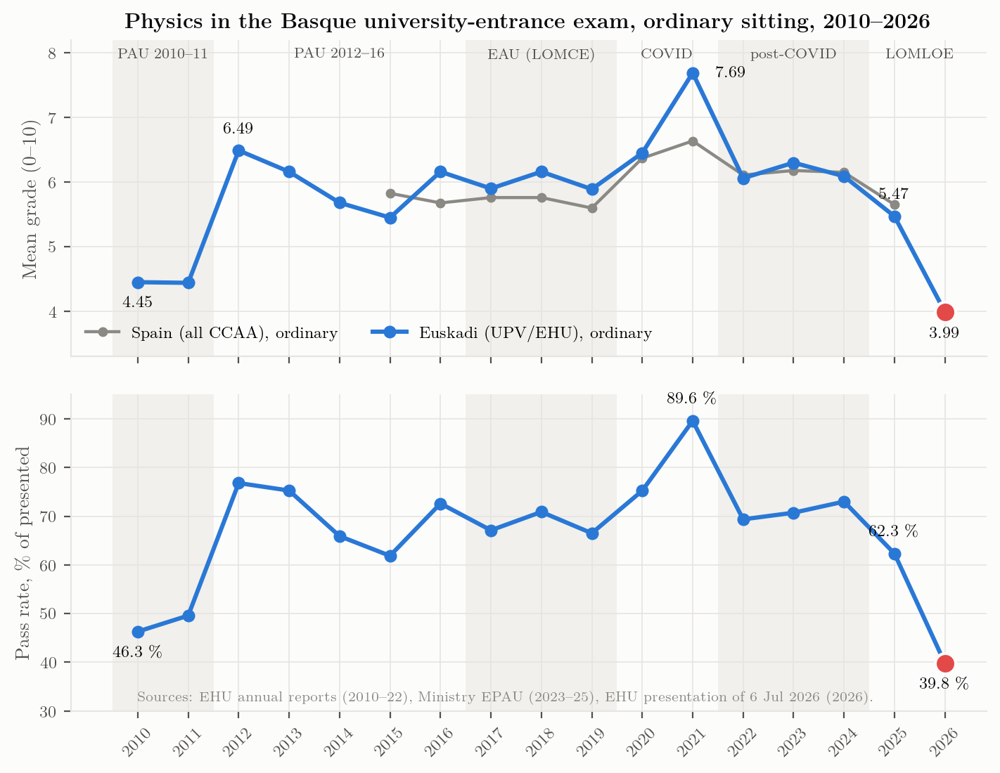

# Overview {#sec-overview .unnumbered}

## Headline numbers

::: {.kpi-row}
::: {.kpi .bad}
[3.99]{.v}
[Física mean, Euskadi, June 2026 (2025: 5.47)]{.l}
:::
::: {.kpi .bad}
[39.8 %]{.v}
[pass rate, Euskadi 2026 (2025: 62.3 %)]{.l}
:::
::: {.kpi .bad}
[24.5 %]{.v}
[of Basque Physics exams at ≤ 2 points (2025: 10 %)]{.l}
:::
::: {.kpi}
[9 / 17]{.v}
[communities with a published 2026 Física mean (3 down, 6 up)]{.l}
:::
::: {.kpi .bad}
[4.08 · 4.41]{.v}
[Tenerife (ULL) and Las Palmas (ULPGC), June 2026 — the Canarias twin]{.l}
:::
::: {.kpi .good}
[+0.80]{.v}
[Cataluña Física 2025→2026 (6.04 → 6.84, 8 021 students)]{.l}
:::
:::

## What this study adds

The July 2026 package in this project (`fisica_pau_ehu_package`, `hist_evolution`) already held the Euskadi Physics series 2010–2025 and the Ministry EPAU cubes 2015–2025. The question the user asked on 18 September was different: *since then, what else has been published, anywhere in Spain, and what does the whole body of evidence say?* This site answers in three layers.

**Data hunt** ([Chapter 1](#sec-ch01)). Five parallel searches (Euskadi/EHU; Ministry and north-east; south; north-west, Madrid and Valencia; literature and national press) plus a second pass with a real browser on the official dashboards that block automated readers. Nine communities now have a 2026 Física mean; two of those (Castilla-La Mancha and Canarias, through Tenerife and Las Palmas), together with La Rioja's 2010–2022 series, were retrieved from dashboards or chart-only PDFs that no search engine indexes. The Basque Government's school-results report gives, for the first time in this project, the *school* Physics marks of the cohort that sits the PAU.

**Independent analysis** ([Chapters 2–6](#sec-ch02)). Everything is recomputed from the raw files with the scripts in `scripts/`. The Ministry cubes are parsed with a small dependency-free PC-Axis reader and the result is checked cell-by-cell against the July package (exact agreement, [Chapter 10](#sec-ch10)). Where a number is modelled rather than observed (the implied 2026 grade distribution) it is labelled as such.

**Log and sources** ([Chapters 8–9](#sec-ch08)). Every figure on this site can be traced to a URL, a page number or a dashboard filter, and every dead end is recorded so that the next update does not repeat it.

## Seven findings in one paragraph each

**1. The 2025 fall was national; the 2026 fall is regional.** Across the 17 communities the ordinary-sitting Physics mean changed by $-0.81$ points on average between 2024 and 2025 (14 of 17 fell), the first year of the LOMLOE competency exam. Euskadi's $-0.62$ that year was *milder* than the national move. In 2026 most communities that have reported bounced back ($+0.5$ to $+1.1$ for Asturias, Madrid, Castilla-La Mancha, Cataluña and C. Valenciana; $+0.17$ for Andalucía), while Euskadi ($-1.48$), Canarias ($-0.83$) and Extremadura ($-0.82$) fell further. Measured against the pre-COVID norm rather than the previous year, 2025 was a return to the 2015–2019 level in every subject, so the reform's first year coincides with the end of a five-year plateau and cannot be separated from it; neither explains 2026. ([Chapter 3](#sec-ch03))

**2. A one-year change of $-1.48$ is rare but not unprecedented; the *level* is what is exceptional.** In the Ministry panel of 170 year-to-year changes (17 communities × 10 transitions, 2015–2025) the standard deviation is 0.74 and only 7 changes were as negative — Extremadura 2024 ($-2.10$), Cantabria 2017 ($-1.94$), Canarias 2019 ($-1.76$), Baleares 2025, Euskadi itself in 2022 ($-1.62$, the post-COVID normalisation), Asturias 2025, Cantabria 2025. But a mean of 3.99 is lower than any ordinary-sitting regional mean in the eleven years of Ministry data except Canarias 2019 (3.60), and it is Euskadi's second consecutive fall: $6.09 \to 5.47 \to 3.99$. ([Chapter 2](#sec-ch02))

**3. Canarias 2026 is the Basque case's twin.** Tenerife (ULL): 683 exams, mean 4.08, 38.5 % pass, 30 zeros, 25 % of exams below 2. Las Palmas (ULPGC): 712 presented, mean 4.41, 42.8 % pass, 22.6 % below 2. These histograms, read directly from the universities' dashboards, show the same shape the Basque summary statistics imply: a flat-to-decreasing density with a heavy tail at 0–2 and a collapsed top decile. They are the best available empirical picture of what "3.99 / 39.8 % / 24.5 % ≤ 2" looks like exam by exam. ([Chapter 4](#sec-ch04))

**4. In Euskadi the damage is concentrated in the science-technical block; elsewhere the pattern differs by subject.** Euskadi 2025→2026: Física $-1.48$, Matemáticas II $-1.67$, Historia $-0.83$, Euskara $-0.48$, Química $-0.21$, Biología $+0.15$. Cataluña: Física $+0.80$ but Matemàtiques $-1.94$. Madrid: Física $+1.1$ on the chart labels ($+1.05$ against the Ministry 2025 baseline), Matemáticas II $+0.5$. Andalucía: Física $+0.17$, Matemáticas II $-0.59$. The subject-by-region pattern is not the signature of a single national exam-model effect; it is the signature of regional paper design and marking, subject by subject. ([Chapter 5](#sec-ch05))

**5. The same students carry a school Physics mark of 7.09.** The Basque Inspectorate's *Resultados escolares 2024-25* gives 2º Bachillerato Física: 4 541 students, 98.1 % pass, mean 7.09 (public 7.04, private/concertada 7.15; models A/B/D 6.93/7.31/7.09). Roughly 45–48 % of them sit PAU Física. The school-to-exam gap was 1.6 points in 2025 and, if school marks did not move, 3.1 points in 2026. ([Chapter 5](#sec-ch05))

**6. The papers of the communities that rose did not become more competency-oriented; the Basque paper did, and changed genre.** Coding every exercise of the eighteen 2025 and 2026 ordinary papers (nine communities) on the EHU competency criteria: Asturias, Madrid and Andalucía had no competency-style exercise in either year; Cataluña was already fully contextualised in 2025 and did not change; Valencia replaced its 2025 competency-style obligatory item with a lighter one; only Castilla-La Mancha added one contextualised obligatory item (0 → 20 % of expected points). Euskadi went from 25 % to 62.5 % of expected points in competency-style exercises, from 2.5 to 5 guaranteed points, halved its optionality (75 % → 50 %) and moved to a granular sub-task format — three changes at once, and the largest change of any paper in the set. Canarias, which cut choice without adding competency content, fell too. ([Chapter 11](#sec-ch11))

**7. Against its own sixteen-year history, the Basque paper changed twice, and the second change is the one the grades react to.** All 34 EHU papers since 2010 show a very stable exam: two options with two problems and two theory "questions" that reproduced, verbatim, titles from an official EHU–Department list of 22 (40 % of the marks; the list, with its marking guide, was in teachers' hands), problems drawn from about a dozen templates (14 of 15 modern-physics problems photoelectric; mirrors, standing waves, decibels and nuclear decay never set), qualitative marking rules, and — from 2020 to 2024 — the most generous choice rule the exam ever had (+1.2 points of expected score through choice alone, by simulation). The 2025 paper removed the theory, restructured the paper and introduced numerical penalties, and the Basque mean fell *less* than the national average. The 2026 paper doubled the obligatory competencial share, halved choice (worth about −0.25 by simulation), printed a −0.1 penalty list with symbolic-first and 0.25-point sub-tasks, and opened the de facto syllabus (block E to any topic; standing waves, decibels, a mass spectrometer in July). No rule is unique to Euskadi — Canarias applies the same penalty list and also fell; Valencia requires symbolic-first and rose — but no community that rose moved on all axes at once. ([Chapter 12](#sec-ch12))

## What is still missing

No 2026 Física figure has been published for Aragón, Baleares, Cantabria, Castilla y León, Galicia, Murcia, Navarra or La Rioja; the Ministry's 2026 cube is due in June 2027. EHU has not published the Física result of the July 2026 sitting, the pass *count*, the revision statistics for Física, the tribunal-level spread it referred to on 6 July, nor any split by sex, language or territory. The Basque *Resultados escolares 2025-26* (the school marks of the cohort that sat PAU 2026) is not yet out. [Chapter 9](#sec-ch09) lists the URLs to poll and the dates by which each is expected.

::: {.callout-note title="How to read the numbers"}
All means are on the 0–10 scale and, unless stated, refer to the **ordinary (June) sitting** and to **students who sat the exam**. Cataluña publishes means over students *eligible for university assignment* ("aptes"), Madrid publishes chart labels rounded to one decimal, Extremadura's 2026 value comes from the university's press release as quoted by regional media; these are flagged wherever they appear. Nothing on this site is a causal estimate: the data are cohort statistics of different exams marked by different tribunals.
:::


# The data hunt {#sec-ch01}

*What was searched, what exists, what was found, what is still unpublished*

## Design of the search

The search was organised as five parallel investigations, each with an explicit brief, followed by a second pass with a real browser session on the user's computer for the sites that reject automated readers (Power BI dashboards, WAF-protected university sites, rate-limited servers). The five briefs were:

1. **Euskadi / EHU** — anything published after 6 July 2026: extraordinary sitting, revisions, tribunal data, Basque Government, Parliament, unions, press in Spanish and Basque, Open Data Euskadi, Eustat, ISEI-IVEI, the Inspectorate's school results.
2. **Ministry and north-east** — SIIU/EPAU 2026 status, Cataluña (Govern dossiers and Recull estadístic), Aragón, Navarra, Baleares, La Rioja.
3. **South** — Andalucía (Distrito Único, ponencias UMA/US/UCA), Extremadura, Castilla-La Mancha, Murcia, Canarias (coordination minutes).
4. **North-west, Madrid, Valencia** — Galicia (CiUG), Asturias, Cantabria, Castilla y León (four universities), Madrid (six universities), Comunitat Valenciana (five universities).
5. **Literature and national narrative** — Dialnet, Redalyc, UNED/UM journals, MDPI, Frontiers, arXiv, TESEO; national press and professional bodies (RSEF, CRUE, teacher associations).

Query families were run in Spanish, Basque, Catalan and Galician (`nota media Física PAU 2026`, `Fisika USaP 2026 emaitzak`, `mitjana Física PAU 2026`, `estatísticas PAU 2026 Física`, …) until the search budget of the session (200 web searches) was exhausted. Direct URL probes (HTTP status of the predictable 2026 filenames) were used to distinguish "not found by search" from "not yet published".

::: {.callout-tip title="What made the difference"}
The four largest gains came from **reading dashboards and chart-only PDFs in a real browser**, not from search engines: the UCLM Power BI (Física 2021–2026, both sittings, by province), the ULL and ULPGC Power BI (Física histograms 2024–2026 with zeros, tens and means by sex), and the University of La Rioja's chart-only PDF (Física 2010–2022). None of these numbers exist as text anywhere on the web.
:::

## Coverage matrix, 18 September 2026

| Community | 2026 Física (ordinary) | 2025 baseline | Best source found | Status |
|---|---:|---:|---|---|
| País Vasco | **3.99**, 39.8 % pass, N = 2 066 | 5.47, 62.3 % | EHU presentation 6 Jul 2026 [@ehu2026notak] | [official]{.pill .ok}; July sitting, pass count, tribunal spread **not** published |
| Cataluña | **6.84** (aptes basis), N = 8 021 | 6.04 (aptes) / 5.98 (ministry) | Govern dossier 23 Jun 2026, pp. 19–21 [@govern2026dossier] | [official]{.pill .ok}; September sitting aggregate only; Recull 2026 due after 29 Sep |
| Andalucía | **5.86** | 5.69 | Junta table of 33 subject means [@junta2026pevau]; UMA/US/UCA ponencias give 2025 by university | [official]{.pill .ok}; N and pass % unpublished; ponencias for 2026 due Nov 2026 |
| Extremadura | **5.27** (lowest subject) | 6.09 | UEx release via Canal Extremadura [@canalextremadura2026] | [press]{.pill .press}; unex.es statistics pages block readers |
| Asturias | **6.62**, 76.87 % pass | 5.49 | Uniovi press release 12 Jun 2026 [@uniovi2026junio] | [official]{.pill .ok}; July release omits Física |
| Comunidad de Madrid | **6.7** (chart, 1 dec.) | 5.6 (chart) / 5.65 | CM presentation p. 14, read from the rendered chart [@madrid2026pau] | [official]{.pill .ok}; per-university 2026 not published; UAM ponencia charts have no labels |
| Comunitat Valenciana | **6.396**, 76.35 %, N = 5 259, SD 2.38 | 5.889, 69.6 % | GVA statistics PDFs June/July/Global 2026, p. 43 [@gva2026junio] | [official]{.pill .ok}; re-extracted here; July 2026 = 4.162 |
| Castilla-La Mancha | **6.80**, 80.07 %, N = 1 781 | 5.86, 65.6 % | UCLM Power BI, curso 2025-26 [@uclm_powerbi] | [official]{.pill .ok}; full 2021–2026 series by province and sitting retrieved |
| Canarias | **4.08** (ULL, N = 683) / **4.41** (ULPGC, N = 712) | 4.92 / 5.25 (ministry pooled 5.08) | ULL and ULPGC Power BI [@ull_powerbi; @ulpgc_powerbi] | [official]{.pill .ok}; histograms, zeros, tens, sex means; July ULL = 3.27 |
| Aragón | — | 6.469, 79.4 % | UNIZAR xlsx 2020–2025 with grade bands [@unizar2025asig] | [gap]{.pill .gap}; `pauresulasig2026.*` → 404 (expected winter 2026-27) |
| Navarra | — | 5.36, 60.9 % | UPNA Informe 2024-25, grade bands [@upna2025informe] | [gap]{.pill .gap}; `Informe_PAU_2025-26.pdf` → 404 |
| Región de Murcia | — | 5.33, 61 % | Informe General PAU2025 (2017–2025 pass series) [@umu2025informe] | [gap]{.pill .gap}; 2026 report due at first COPAU meeting of 2026-27 |
| Cantabria | — | 5.44, 63.2 % | UC per-subject PDFs 2025 [@unican2025materia] | [gap]{.pill .gap}; four 2026 filename probes → 404 |
| Galicia | — | 5.63 (ministry) | CiUG working-group report 2020–2023 [@ciug_fisica2023] | [gap]{.pill .gap}; "Grupos de traballo" page reads *Actualizando contido* (18 Sep 2026) |
| Castilla y León | — | 6.19 (ministry) | UVa/USAL/UBU/ULE releases (global only) | [gap]{.pill .gap}; no per-subject publication exists in any year; USAL viewer is a dead Infogram embed |
| Illes Balears | — | 4.45 (ministry) | UIB releases (global only) | [gap]{.pill .gap}; UIB appears never to publish subject statistics |
| La Rioja | — | 6.39 (ministry) | UR chart-only PDF, Física 2010–2022 [@unirioja_evolucion] | [gap]{.pill .gap}; page still links the 2022 edition |
| **Spain (Ministry)** | — | 5.65 | SIIU EPAU 2025 cubes, published 8 Jun 2026 [@siiu_epau2025] | [gap]{.pill .gap}; 2026 edition due ≈ June 2027; no *avance* exists |

## Euskadi: everything found after 6 July 2026

**Numerical.** The EHU deck of 6 July [@ehu2026notak] remains the only source of Física 2026 figures. It also gives the other subjects' means, pass rates and low-score shares, revision requests for four subjects (not Física), and the global PAU counts: 12 080 presented, 41 tribunals, 848 evaluators, 4 223 revision requests covering 8 127 exams, 313 zeros (2.6 %). The extraordinary sitting was reported on 7 July through the press (1 332 presented, 951 passed, 71.40 %; Araba 77.9 %, Bizkaia 64.3 %, Gipuzkoa 79.8 %; euskera 75.7 %, castellano 61.7 %) with **no subject breakdown** [@donostitik2026extra]. The annual *Informe* archive still ends at 2025 (two-page summaries since 2023, with no subject tables).

**A genuinely new dataset.** The Basque Inspectorate's *Resultados escolares 2024-2025* [@gv_resultados_escolares_2425] tabulates 2º Bachillerato Física by territory, network and linguistic model: 4 541 students evaluated, 4 455 passed (98.11 %), mean 7.09. This is the first time the project has the school marks of a PAU cohort ([Chapter 5](#sec-ch05)).

**Institutional narrative.** The Education Counsellor's interview of 12 July [@pedrosa2026entrevista] is the key post-6-July document: the Department has "only the report the university made public", will "ask for more data", will review "all subjects" for 2027 "in the short term", and has no diagnosis yet. The Science and Universities Counsellor admitted a "déficit de confianza" in the marking system (7 July). The rector's press conference, as reported in Basque by Argia [@argia2026ehu], acknowledged significant variation between evaluation panels in Física and other subjects. As of 7 September nothing had been sent to schools for PAU 2027 beyond the Euskara II instructions. The 22 June *agerraldia* referenced in the deck's footer was not located.

**Not found.** No Ararteko file, no union or physics-teacher statement on Física, no Open Data Euskadi or Eustat PAU dataset, no parliamentary initiative text (the Parliament's search interface could not be driven from this session — a lead, not a negative), no EHU 2027 Física orientations, no per-territory or per-language Física figure for 2026.

## The exam papers (added 19 September 2026)

For the content audit of [Chapter 11](#sec-ch11) the ordinary-sitting Física papers of 2025 and 2026 were collected for the nine communities with a 2026 result: EHU (both years, with the corrector documents, from ehu.eus), Cataluña (Generalitat exam archive; the 2026 corrector document from the Betevé mirror, the official file returning 404), Madrid (UCM archive, criteria in the same PDF), Asturias (Uniovi archive with criteria), Andalucía (Junta archive: 2025 models A and B with criteria, 2026 with criteria), Canarias (Gobierno de Canarias archive with criteria), Extremadura 2025 (Educarex teachers' site, Google Drive), Comunitat Valenciana 2026 (universitats.gva.es, downloaded from the user's machine), and Castilla-La Mancha (both years read in the built-in browser behind UCLM's bot check and transcribed to `sources/exams/clm_20xx_ord_transcript.md`). Two papers were not at their official location — Valencia 2025 had been overwritten by the 2026 file, and Extremadura 2026 sits behind UEx's WAF — and were retrieved from FiQuiPedia's public GitLab archive of official PAU papers, with the Valencia copy checked byte-for-byte against an independent teacher's copy. All files are in `sources/exams/` and hashed in the [source registry](#sec-ch08). No Internet Archive copy of a blocked site was used; the two files taken from FiQuiPedia's public archive of official papers are flagged as such in the registry.

For [Chapter 12](#sec-ch12) the complete EHU archive was downloaded from ehu.eus: the 34 Física papers 2010–2026 (June and July, Spanish and Basque versions where both exist; criteria embedded in the 2012–2024 papers; separate solucionarios for 2025–2026), the PAU 2025 model paper of 18 November 2024 with its general correction criteria, and the earlier October 2024 version of that model. No pre-2025 theory-title document, no "Orientaciones Física 2026" and no coordination-meeting minutes are published on the site; the official list of 22 theory titles was supplied by the coordinator from his own files and is archived as `ehu_theory_list_official.pdf`. Files in `sources/exams_ehu_hist/` (77 PDFs), URLs in its `urls_tried.log`.

## Sources that exist but could not be read

- **unex.es** (Extremadura statistics) and **uclm.es** return 403 to automated readers; UCLM was solved with the browser, UEx's `alumnado.unex.es/pau/` page turned out to contain no statistics section at all.
- **estadisticas.ciencia.gob.es** (Ministry PC-Axis host) serves an incomplete TLS chain; the July copies already in the project (byte-identical to the September re-download made by the earlier session) were used.
- **ciug.gal** also serves an incomplete chain; it was fixed legitimately by adding the missing intermediate certificate, but the statistics section itself is empty.
- **universitats.gva.es** is disallowed by robots.txt for the fetch tool; the three 2026 PDFs were downloaded from the user's own machine and re-extracted (values identical to the earlier session's).
- **unirioja.es** rate-limits (HTTP 429); the four PDFs were downloaded from the user's machine with a browser session.
- **Deia / Noticias de Gipuzkoa / Noticias de Álava** return 406; worked around with a browser user-agent. **El Correo** and **El Diario Vasco** are paywalled and were not retrieved.

## Numbers that must not be mixed

- **Cataluña** means are over *students eligible for university assignment*, and the ordinary-only figure (6.04 for 2025) differs from the full-year Recull figure (5.85). The 2026 dossier's back-series is the ordinary-only one.
- **Valencia** publishes six differently-scoped 2025 reports (Ordinaria/JUNIO/Extraordinaria/JULIO/JULIO finales/GLOBALES) whose Física means differ at the second decimal; the JUNIO files are used here for both years.
- **Aragón**'s `DESV` column is a *mean absolute deviation*, not a standard deviation.
- **Andalucía** 2025: the ponencias' 5.69 (unweighted mean of ten university means) coincides with the ministry's 5.69; a secondary blog's 5.67 is unverified.
- **EHU** press: 3.98 (Orain/EITB copy) versus 3.99 (deck and Campusa); some outlets copied Matemáticas II's $-1.67$ onto Física. Use 3.99 and $-1.48$.
- **Valencia July 2026** Física pass rate 39.41 % (resit population) is *not* comparable with Euskadi's 39.8 % (ordinary sitting) despite the coincidence.


# Euskadi 2010–2026: the series and the break {#sec-ch02}

*Level, pass rate and regimes of the Physics exam at UPV/EHU*

## The consolidated series

The Euskadi Physics series is spliced from three sources: the EHU annual reports for 2010–2022 (all Physics takers, both phases) [@ehu_informes], the Ministry EPAU cube for 2023–2025 (specific/admission phase, which is where Física sits since 2017 — the two agree to ±0.02 on the overlap 2017–2022) [@siiu_epau2025], and the EHU presentation of 6 July 2026 for the last point [@ehu2026notak]. The splice is validated in [Chapter 10](#sec-ch10).

{#fig-series}

::: {#tbl-series}


Euskadi Física, ordinary sitting, 2010–2026. Pass rate over presented; "Spain mean" is the Ministry national mean (all communities, presented-weighted over phases). File: `data/analysis/euskadi_fisica_series_2010_2026.csv`.
:::

Two features of the table matter for everything that follows. First, the **2011 presented count (2 610) is an artefact** of the 2011 report, which prints an implausible ten no-shows; the pass rate for that year should be read as roughly 55 % rather than 49.6 %. Second, from 2017 the presented/enrolled ratio drops sharply (from ≈ 89 % to ≈ 70 %) because Física became an optional admission-phase subject that many students enrol in and then skip; **2025 reversed this** (2 189 of 2 597, 84 %), so the 2025 and 2026 means are computed over a *larger and less self-selected* pool than 2017–2024. Part of the 2025 drop is therefore compositional; the 2026 drop, on a slightly smaller pool (2 066), is not.

## Regimes rather than a trend

The series is not stationary; it is a sequence of plateaus separated by policy changes — the two-phase PAU of RD 1892/2008 (2010), the EAU under LOMCE (2017), the COVID flexibility (2020–21), and the LOMLOE competency model of RD 534/2024 (2025) [@rd534_2024]. Averaging within each regime:

::: {#tbl-regimes}


Regime means, Euskadi Física, ordinary sitting.
:::

Between 2012 and 2024, excluding the COVID year 2021, the series is flat: a linear fit $x_t = \alpha + \beta t + \varepsilon_t$ gives $\beta = +0.013$ points per year ($r = 0.17$, $p = 0.60$) with a residual standard deviation $\sigma_\varepsilon = 0.31$. Against that baseline,

$$
\hat{x}_{2026} = 6.17, \qquad x_{2026} - \hat{x}_{2026} = -2.18 \approx -7.0\,\sigma_\varepsilon ,
$$

and the 2025 residual was already $-0.69 \approx -2.2\,\sigma_\varepsilon$. In plain words: for thirteen years the Basque exam produced means between 5.45 and 6.49 in normal years; 2025 (5.47) sat at the bottom of that band, 2.2 residual standard deviations below the trend, and 2026 fell far outside it. The only comparable level in the series is the 2010–11 start of the two-phase PAU (4.45, 4.44), when Física was the lowest-scoring modality subject in the Basque system and roughly half of the candidates passed — and, as [Chapter 3](#sec-ch03) shows with the newly found La Rioja series, that 2010–11 trough was itself a national feature, not a Basque one.

## How unusual is a −1.48 change?

A single region's history is a small sample. The Ministry cube offers a much larger reference set: the year-to-year change of the ordinary-sitting Physics mean for each of the 17 communities over 2015–2025, $n = 170$ changes.

{#fig-changes}

The panel of changes has mean $\bar\Delta = -0.03$ and standard deviation $s_\Delta = 0.74$ (excluding the COVID transitions 2020–2022: 0.69). The Basque 2026 change sits at

$$
z = \frac{-1.48 - \bar{\Delta}}{s_\Delta} = -1.97,
$$

and only 7 of the 170 observed changes were as negative: Extremadura 2024 ($-2.10$), Cantabria 2017 ($-1.94$), Canarias 2019 ($-1.76$), Baleares 2025 ($-1.65$), Euskadi 2022 ($-1.62$, the post-COVID normalisation), Asturias 2025 ($-1.55$), Cantabria 2025 ($-1.51$). Regional Physics means are volatile — the standard deviation of the annual change is 0.74 and the median absolute change 0.5 points — so a fall of this size, while rare (≈ 4 % of transitions), has precedents. The Basque series' own year-to-year standard deviation before 2026 is 0.85.

What has fewer precedents is the **level**. Among the 187 community-year ordinary means in the cube, only Canarias 2019 (3.60) lies below 3.99; the next lowest are Baleares 2025 (4.45), Andalucía 2018 (4.65) and Galicia 2023 (4.67). Two consecutive falls summing to more than two points have precedents in the panel — Extremadura $8.55 \to 6.45 \to 6.09$ and Baleares $6.49 \to 6.10 \to 4.45$, both over 2023–2025 — but Euskadi's ($6.09 \to 5.47 \to 3.99$) ends a point and a half lower than either.

::: {#tbl-changes}


Year-to-year changes of the ordinary-sitting Physics mean across the 17 communities, by transition year (Ministry cube). The 2025 row is the first year of the LOMLOE model.
:::

The last row of @tbl-changes is the first key result of this study: **2025 was a national fall**. Fourteen of seventeen communities went down, by $-0.81$ on average; Euskadi's $-0.62$ was milder than the typical move. Whatever the new exam model did to Physics marks, it did it everywhere in 2025.

## Euskadi's position among the communities

::: {#tbl-rank}


Rank of Euskadi among the 17 communities by ordinary-sitting Physics mean (1 = highest), Ministry cube.
:::

Euskadi has been a mid-table region in Physics: its median rank over 2015–2025 is 8, with three years in fourth place (2016, 2018, 2021) and lows of 15th in 2015 and 13th in 2024. In 2025 it ranked 12th with 5.47, 0.18 below the national mean. Among the nine communities with 2026 data Euskadi is last; if the 2025 values are kept for the eight that have not published, Euskadi 2026 would still be last, 0.46 below Baleares 2025.

::: {#tbl-wide}


Ordinary-sitting Física mean by community, 2015–2025 (Ministry cube, presented-weighted over phases; "Estado" = UNED/foreign centres omitted). Sorted by 2025.
:::

## What the series does and does not say

The series establishes three facts. The 2026 value is the lowest since the start of the two-phase PAU; it is the second consecutive fall; and the size of the single-year fall is at the edge of, but inside, the range of regional Physics volatility in Spain. It does not, by itself, identify a cause: a change of exam difficulty, of marking severity, of the students' preparation, or of who sits the exam all produce the same summary statistic. [Chapter 3](#sec-ch03) uses the other communities to narrow the field; [Chapter 4](#sec-ch04) uses the shape of the distribution.


# Spain 2026: nine communities, three directions {#sec-ch03}

*The 2026 Física results located in this study, against the 2025 Ministry baseline*

## The 2026 table

::: {#tbl-regions}


Ordinary-sitting Física mean, 2025 (Ministry cube, presented-weighted over phases; Cataluña on its own "aptes" basis) and 2026 (this study's data hunt). Canarias 2026 pools ULL and ULPGC by presented students. File: `data/analysis/regions_2026_vs_2025.csv`.
:::

{#fig-dumbbell}

Nine of seventeen communities have a published or retrievable 2026 Física mean. Six rose, three fell, and the three that fell are Euskadi, Canarias and Extremadura. Weighted by the number of presented students where it is known (Canarias, C. Valenciana, Cataluña, Castilla-La Mancha), the change outside Euskadi is $+0.58$; the median change over the eight other communities is $+0.65$. Read together with the table of annual changes in the previous chapter, this is the central comparative fact of the study:

> In 2025 the Physics mean fell in 14 of 17 communities (mean $-0.81$). In 2026 it **recovered** in six of the nine communities that have reported — five of them by $+0.5$ to $+1.1$, Andalucía by $+0.17$ — and fell further in three. The competency model of RD 534/2024 was applied in all seventeen in both years. What differs between Cataluña ($+0.80$) and Euskadi ($-1.48$) is not the legal framework; it is the paper, the marking scheme and the tribunals of each community.

## Small multiples, 2015–2026

{#fig-small}

Three readings of @fig-small:

- **Euskadi** tracked the national line closely for a decade (gap within ±0.5 except 2021) and detached from it in 2025–26.
- **Canarias** is the one community that had already lived through a Basque-sized collapse: 5.36 → 3.60 in 2019, then 5.25 in 2020. Its 2024 → 2025 → 2026 path (5.88 → 5.08 → 4.25 pooled) is the same two-step fall as Euskadi's (6.09 → 5.47 → 3.99), from a lower starting level and ending a quarter of a point above it. The Canarias Physics coordination minutes of October 2025 [@canarias2025acta] already listed candidate explanations for 2025 — superficial preparation, low incentive (few degrees require a high Física mark), Física being the *third exam of the same day* after Matemáticas and Química, the weighting of Matemáticas crowding out Física — and Las Palmas undertook to run an item/option error study for 2026.
- **Extremadura** is the third faller, from a level that had been among the highest in Spain in 2021 (8.03, second to La Rioja) and the highest in 2022–2023 (8.44, 8.55) before a $-2.10$ correction in 2024; its 2026 figure (5.27, the lowest subject in the UEx table) is press-reported and should be confirmed from the university's statistics when they become readable.

## Two long series that did not exist in the project before

**Castilla-La Mancha, 2021–2026, both sittings** (UCLM Power BI). The ordinary mean went 6.08, 6.48, 5.97, 6.57, 5.86, **6.80** with pass rates 71.7, 75.1, 71.2, 76.6, 65.6, **80.1 %** on 1 590–1 800 presented students each year; the extraordinary sitting sits 1.2–2.8 points lower (3.97 in 2026 on 142 presented). The 2025 dip and 2026 recovery are exactly the national pattern. The dashboard also gives the 2026 result by province (Albacete 6.75, Ciudad Real 6.91, Cuenca 6.68, Toledo 6.77): within a single tribunal system the between-province spread is 0.23 points, a useful yardstick for what "normal" geographic dispersion looks like under one paper and one marking scheme.

**La Rioja, 2010–2022** (UR chart-only PDF). Física ordinary means 4.49, 5.49, 6.73, 5.63, 6.17, 5.78, 6.10, 6.33, 6.61, 6.15, 6.97, 8.31, 7.43, with pass rates 41.8 % in 2010 and 63.6 % in 2011 before settling at 66–86 % in normal years (94 % in 2021). This matters for Euskadi because it shows that the **2010–2011 trough was national**: La Rioja's 4.49 / 41.8 % in 2010 mirrors Euskadi's 4.45 / 46.3 %, and both had gained two points by 2012 (Euskadi in one step, La Rioja in two). The Basque series' worst historical years were not a Basque anomaly either.

## Comparability, stated once

The figures in @tbl-regions are not a designed experiment and the following differences are irreducible:

- **Denominator.** Cataluña's mean is over students *eligible for university assignment*; everyone else's is over students who sat the exam. Cataluña's 2025 value on the same basis (6.04) is used for its change, so the *change* is comparable even if the level is not.
- **Precision.** Madrid's values are chart labels to one decimal; Andalucía, Extremadura and Asturias publish the mean but not the number of examinees.
- **Population.** The Ministry 2025 baselines include FP and foreign-access students; university releases sometimes report Bachillerato students only. The effect on Física, a subject taken overwhelmingly by Bachillerato science students, is small (≤ 0.06 in eight of the nine comparators; 0.11 for Cataluña).
- **Revision stage.** Some releases are provisional (before revision), some are final. EHU's 3.99 is the figure the university itself chose to present on 6 July, after the revision window.

None of these can turn a $+0.8$ into a $-1.5$. The direction and rough magnitude of the 2026 divergence are robust to every caveat listed.

## Bottom line for the Basque question

If the 2026 Basque result had been caused by the competency model as such, the other sixteen communities — which use the same model — would show the same sign in 2026. They do not; most show the opposite sign. The Basque result is regional, and it is shared, in a slightly milder form, by one other region with a documented history of Physics volatility (Canarias) and possibly by a third (Extremadura). The next chapter asks what the shape of the grade distribution can add.


# The shape of the collapse {#sec-ch04}

*What the published moments imply about the 2026 grade distribution, checked against the Canarias histograms*

## What EHU published, and what it implies

For Física 2026 the university published four summary statistics [@ehu2026notak]: the mean $\bar{x} = 3.99$ over $N = 2\,066$ examinees, the pass share $P(x \ge 5) = 0.398$, the low-score share $P(x \le 2) = 0.245$ (2025: 0.10) and the zero share $P(x = 0) = 0.032$. No histogram, no standard deviation, no pass *count*. With $N = 2\,066$ the rounded percentages pin the counts to narrow intervals: 822–823 passes, 506–507 exams at two points or less, 66–67 zeros. These are arithmetic consequences, not observations, and are used only as such.

A mean, a pass rate and a tail share are three constraints. A two-parameter family on $[0,10]$ with a point mass at zero,

$$
f(x) = p_0\,\delta(x) + (1-p_0)\,\frac{1}{10}\,\mathrm{Beta}\!\left(\tfrac{x}{10};\,a,b\right),
\qquad p_0 = 0.032 ,
$$

can be fitted to them by least squares in $(\log a, \log b)$. The Beta family is not a theory of how marks arise; it is the simplest smooth density on a bounded interval that can be unimodal, flat or J-shaped, which is what is needed to see whether "3.99 / 39.8 % / 24.5 %" describes a shifted bell or a different shape altogether. The same fit is made for 2025 (mean 5.47, pass 62.3 %, 10 % at ≤ 2; the zero share was not published and 1.2 % is assumed, with a sensitivity check in `results.json`).

::: {#tbl-beta}


Beta-mixture fits to the published Euskadi Física moments. "SD (model)" and the tail shares are model-implied, not observed. Residuals of the three constraints are below 0.05 in every case (`results.json → beta_fits`).
:::

{#fig-dist}

The 2025 fit is a mild bell with mode near 6 ($a = 2.0,\ b = 1.6$). The 2026 fit has $a = 1.27 < b = 1.81$: a density skewed towards the low end, zero at the origin, with its mode near 2.5 (against 6.2 in 2025) and roughly flat band shares of 12–13 % across $[0,5)$ before declining, with an implied median of 3.8, an implied share of marks above 7 that falls from 30 % to 15 %, and a share above 9 that falls from 6 % to 2 %.

Three moments cannot, however, distinguish a low-skewed density from a bell that has been pushed down against the floor: shifting the 2025 fit by $-1.48$ and letting the mass below zero pile up in the lowest band reproduces $P(x \le 2) \approx 0.23$ and $P(x \ge 5) \approx 0.38$, close to the published 0.245 and 0.398. What the moments *do* establish is the opposite of a subgroup effect. If 2026 had been a normal year for most candidates and a disaster for a minority — say, the scripts of a few of the 41 tribunals — the low tail would be a lump added to an otherwise 2025-like distribution, and a quarter of all candidates could not end up at two points or less while the pass rate stayed near 40 %. The 2026 numbers describe a **cohort-wide displacement of roughly one and a half points** with the lower part of the cohort compressed into the 0–2 band. Whatever the cause, it acted on almost everyone.

## The Ministry grade bands, 2015–2025

The Ministry cube gives, for every community and year, the distribution of Physics marks in six bands. For Euskadi (specific phase, ordinary sitting):

::: {#tbl-bands}


Share of Basque Física examinees by grade band, ordinary sitting, 2015–2025 (Ministry cube, `data/analysis/euskadi_grade_bands_2015_2025.csv`).
:::

{#fig-bands}

Two things stand out. The failing band $[0,5)$ had been 25–36 % in every normal year (36.4 % in 2015, 24.9 % in 2020) and 37.7 % in 2025; the 2026 fit puts it near 65 %. And the **top band $[9,10]$ had already collapsed in 2025** (6.7 %, from 10.3 % in 2024 and 15–20 % in 2018–2023 outside the 36 % of 2021) before the mean did: the first year of the competency model removed the top of the Basque distribution, the second removed the middle.

## The Canarias mirror: observed histograms

Euskadi publishes moments; the two Canarian universities publish full histograms, zero counts, ten counts and means by sex on their Power BI dashboards [@ull_powerbi; @ulpgc_powerbi]. Their 2026 results are the closest observed analogue of the Basque case.

::: {#tbl-canarias}


Física, June sitting, Tenerife (ULL) and Las Palmas (ULPGC), 2024–2026, read from the universities' dashboards on 18 September 2026. Files: `data/found_canarias_ull_powerbi.csv`, `data/found_canarias_ulpgc_powerbi.csv`.
:::

::: {#tbl-canarias-hist}


Percentage of exams per one-point band, same sources.
:::

The 2026 Tenerife histogram — 683 exams, 15 % in $[0,1)$, 25 % below 2, 61 % below 5, 3 % at or above 9, mean 4.08 — is, band for band, what the Basque fit predicts for 2026 (13 % in $[0,1)$, 26 % below 2, 65 % below 5, 2 % above 9). Las Palmas 2026 (22.6 % below 2, 57 % below 5, mean 4.41) is the same shape one step less severe. Both islands had a 2024 concentrated in the upper half (ULL modal at $[5,6)$; ULPGC rising monotonically to a mode at $[9,10]$), a flattened 2025, and a 2026 that is flat-to-decreasing across the scale with a heavy $[0,2)$ tail.

Two details of the Canarian histograms are worth carrying back to Euskadi:

- **The pass-line pile-up disappeared.** In 2024 and 2025 the $[5,6)$ band is the modal band at ULL (17.5 %, 16.2 %) — the familiar signature of markers rounding borderline scripts up to 5. In 2026 it is 11.9 %, still the fourth-largest band but no longer a peak that stands out from its neighbours (10.0 % and 9.7 %). Whatever happened in 2026, it did not include a benevolent hand at the threshold.
- **Zeros multiplied.** ULL: 5 → 18 → 30 zeros (0.7 % → 2.3 % → 4.4 % of exams). Euskadi 2026: 3.2 %. Zeros in a four-problem paper are not students who tried and failed; they are blank or near-blank scripts, i.e. a decision by the candidate. Their growth is a participation signal (students sitting Física because they enrolled for it, then giving up) as much as a difficulty signal.

## Variance, not only level

Where standard deviations are published — Valencia gives them per university — the 2026 Física SD is 2.38 on a mean of 6.40, essentially unchanged from 2.28 on 5.89 in 2025. The Basque fit implies an SD of 2.5 in 2026 against 2.4 in 2025: the coefficient of variation rises from 0.44 to 0.63 simply because the mean fell while the spread did not. In the language of the Ikastorratza comparison [@ruizdegauna2013comparado], the Basque exam did not become a finer discriminator in 2026; it compressed everyone toward the floor while keeping the same absolute dispersion.

## What the shape rules out, and what it does not

A distribution with a quarter of the candidates at two points or less and a vanishing top decile, in a cohort whose school marks average 7.1 ([Chapter 5](#sec-ch05)), is not the product of one severe tribunal or one badly prepared school network: those would show up as a lump, not as a shift of the whole mass. It is consistent with a cohort-wide cause — a paper that a large fraction of candidates could not start, marking criteria applied strictly to all, or both — and with the disappearance of any compensating leniency at the pass threshold that the Canarian histograms make visible. The Canarian coordinators wrote exactly this diagnosis for their milder 2025 [@canarias2025acta]. The Basque tribunal-level data that EHU says it holds ([Chapter 6](#sec-ch06)) would separate the paper from the marking; the published moments cannot.


# Subjects, sittings, participation and groups {#sec-ch05}

*Física against its neighbours, June against July, exam marks against school marks, and the sex and language dimensions*

## The science block, 2025 → 2026, five regions

Five communities have published subject means for both 2025 and 2026: Euskadi (EHU deck), Cataluña (Govern dossiers, "aptes" basis), Madrid (chart labels), Andalucía (Junta table; 2025 baselines for Matemáticas II and Química from the Ministry cube) and Asturias (Uniovi releases; same treatment).

::: {#tbl-subj-delta}


Change of the ordinary-sitting mean, 2025 → 2026, by subject and region. File: `data/analysis/subjects_2025_2026_by_region.csv`.
:::

::: {#tbl-subj-2026}


Ordinary-sitting mean, 2026, same sources.
:::

{#fig-subjects}

Read by rows, @tbl-subj-delta says that **no subject moved the same way everywhere**. Física fell in Euskadi and rose in the other four; Matemáticas II fell in Euskadi, Cataluña and Andalucía and rose in Madrid and Asturias; Química fell slightly in four of five and rose in Asturias; Biología rose in Euskadi and Madrid and fell in Cataluña (not published for Andalucía and Asturias). Read by columns, Euskadi is the only community where the two hardest quantitative subjects fell together by more than a point and a half ($-1.48$, $-1.67$) while Química ($-0.21$), Biología ($+0.15$) and Lengua ($+0.03$) barely moved. The Basque 2026 problem is a *science-technical block* problem, and within that block it is a Física-and-Matemáticas problem, not a general marking or cohort problem — Química is marked by tribunals drawn from the same pool of secondary teachers.

Cataluña shows the mirror image: a Matemàtiques paper that produced the lowest subject mean of a decade (4.18) and 2 057 revision requests, next to a Física paper that produced the best Física mean in five years (6.84). Two subjects, one exam authority, one cohort, opposite outcomes: the paper is the variable.

## Ordinary versus extraordinary

The July sitting is a different population — candidates who failed or did not sit in June — and every dataset in this study shows it below June — by $1.85 \pm 0.86$ points across the Ministry community-years, and by as little as 0.8 (Tenerife 2026) or as much as 4 in individual cases.

::: {#tbl-oe}


Euskadi Física, ordinary and extraordinary means (Ministry cube, pooled phases).
:::

{#fig-oe}

Across the 187 community-years the gap averages $1.85 \pm 0.86$ points. The three 2026 extraordinary values found — Comunitat Valenciana 4.16 (777 presented), Castilla-La Mancha 3.97 (142), Tenerife 3.27 (97) — sit on the historical relation, Tenerife at its low edge (gap 0.81, 1.2 SD below the mean gap). **EHU has not published the July 2026 Física mean**; only the global July pass rate (71.40 % of 1 332 presented, against 83.2 % in July 2025 and 90.6 % in July 2024 according to EHU's own annual reports; the press comparison quoted 90.6 % as the 2025 figure) and the observation that the 624 candidates who re-sat to *improve* a June mark chose "sobre todo Matemáticas II, Biología y Química" [@donostitik2026extra]. If the historical gap held, the Basque July Física mean would be near 2, which would be the lowest in the panel; if the July paper was pitched differently, it would not. This single number is the most informative unpublished Basque figure after the tribunal spread.

## Who sits Física, and how many

::: {#tbl-part}


Euskadi Física, specific phase, ordinary sitting: enrolled, presented and presentation rate (Ministry cube; 2026 from the EHU deck, enrolment not published).
:::

Two structural facts. First, Física enrolment in Euskadi has been flat at 2 300–2 600 since 2017 while the Basque PAU cohort grew from ≈ 9 900 to ≈ 12 300, so Física's share of the cohort fell from about a quarter to about a fifth. Second, the presentation rate jumped from 64–76 % (2017–2024) to 84 % in 2025: under the 2025 rules far fewer enrolled students skipped the Física exam. The 2025 pool therefore contained some 200–370 candidates (depending on which earlier rate is taken as the counterfactual) who, under the previous incentives, would not have sat — plausibly the weakest — and the 2025 fall of $-0.62$ is partly this compositional change. For 2026 the enrolment is unpublished; 2 066 presented is 6 % fewer than in 2025 and 16 % more than in 2024.

## School marks against exam marks

The Basque Inspectorate's *Resultados escolares 2024-2025* [@gv_resultados_escolares_2425] gives, for 2º Bachillerato Física across all networks and linguistic models: 4 541 students evaluated, 4 455 passed (98.11 %), mean 7.09 — public 7.04, private/concertada 7.15; Araba 7.09, Bizkaia 7.11, Gipuzkoa 7.08; model A 6.93, B 7.31, D 7.09.

{#fig-school}

Three consequences. (i) Only about 45–48 % of the students who take Física in 2º Bachillerato sit PAU Física ($2\,189 / 4\,541 = 0.48$ for the 2025 exam; $2\,066 / 4\,541 = 0.45$ for 2026 against the same, offset, cohort). The PAU Física population is a self-selected half of the Bachillerato Física population — presumably the half that needs the weighting for engineering and physics degrees. (ii) Even that stronger half scored 1.6 points below its school mark in 2025 and, if school marks did not move, 3.1 points below in 2026. (iii) The school pass rate is 98 %; the exam pass rate is 40 %. Whatever the 2026 paper measured, it is not what Bachillerato Física teachers certify. The 2025-26 school results, due in the coming months, will give the matched cohort.

The centre-level scatter of the July package (`hist_evolution`, 2010–2016) already showed a mean school-minus-exam gap of about one point across *all* subjects; a three-point gap in a single subject is of a different order.

## Sex and language

::: {#tbl-gl}


Euskadi Física, ordinary sitting, by sex and by exam language, 2010–2022 (EHU annual reports; no breakdown has been published since).
:::

{#fig-gl}

Women are 31–36 % of Basque Física enrolment and, from 2011, outscore men in every year but 2014 ($-0.01$) by $+0.21$ on average, with the gap widening after 2016 ($+0.34$ in 2017, $+0.51$ in 2021, $+0.38$ in 2022). The Canarian dashboards show the same sign in 2026 under collapse conditions: ULL women 4.09 vs men 4.07, ULPGC women 4.50 vs men 4.38. The euskera track rose from 61 % to 75 % of Física candidates over 2010–2022; its mean was below the castellano track by 0.1–0.3 in most years, and above it in 2012, 2020 and 2021. Neither dimension has been published for Física since 2022, and EHU's 6 July statement that its global 2026 analysis found no bias by linguistic model or network referred to Euskara II, not Física.


# Interpretation and the 2027 question {#sec-ch06}

*Which explanations survive the evidence, what would decide between the rest, and what to ask for*

::: {.callout-important title="Audit of 19 September 2026"}
This chapter was audited after it was written — every number recomputed, every figure re-derived, the argument read step by step. The corrections are applied in the text below and listed, with what they cost, in [Audit](#sec-ch13) and in the last section of this chapter. Three claims of the earlier version were withdrawn: that the COVID-era plateau *reshaped* the grade distribution (it is a level effect), that Euskadi shows a distinctive turn on the conditional top-band measure in 2024 (four other communities show the same), and that the PAU and PISA series fall at the same rate (the fit was stale, and the two records are steps rather than slopes).
:::

## The hypotheses, one by one

The evidence assembled in Chapters 2–5 is observational and the exam changes every year, so nothing below is a causal estimate. But the hypotheses that circulated in July can be sorted by what the data allow.

**H1 — "The competency model (RD 534/2024) is to blame."** *Explains 2025, not 2026.* The model was applied in all seventeen communities in both years. In 2025 the Física mean fell in 14 of 17, by $-0.81$ on average — Euskadi's $-0.62$ was below the national move. In 2026 six of nine reporting communities rose under the same model — five by $+0.5$ to $+1.1$, Andalucía by $+0.17$; Euskadi fell $-1.48$. A national cause cannot produce opposite signs in the same year. The Basque institutions' July framing ("el nuevo enfoque competencial pasa factura") is therefore at most a description of 2025. There is a further difficulty with it: the only systematic rating of PAU papers' competency orientation, covering six communities over 2015–2025 [@sancheztarazaga2026pau], places País Vasco and Cataluña at the *top* of the range before the reform, so the Basque papers did not "become competency-based" in 2025 — they were already the most competency-oriented in Spain, and Cataluña, rated alongside them, rose in 2026.

**H2 — "The 2026 Basque Física paper was harder, or differently pitched, than its own 2025 paper and than other communities' 2026 papers."** *Consistent with everything.* The cohort-wide displacement of the distribution ([Chapter 4](#sec-ch04)), the confinement of the damage to Física and Matemáticas II with Química, Biología and Lengua unaffected ([Chapter 5](#sec-ch05)), the Catalan mirror image (Física up, Matemàtiques down, same authority, same cohort) and the Canarian coordinators' own reading of their milder 2025 all point to the paper — its problems, its optionality (two of four problems with no choice in 2026), its marking scheme — as the first-order variable. The July package already noted that the 2026 ordinary paper's gravitational problem contains a validity issue in its energy comparison. A structured content audit of the 2025 and 2026 papers of the nine communities with a 2026 result was carried out on 19 September and is reported in [The papers themselves](#sec-ch11): none of the six rising communities increased the competency content of its paper (five stayed at zero or fell; Castilla-La Mancha added one obligatory contextualised item), while the Basque paper moved from one competency exercise to half the marks, halved its optionality and changed format at the same time — it is the only paper in the set that changed genre between the two years. The comparison with the 2010–2024 Basque papers is in [Sixteen years of one paper](#sec-ch12): the 2025 break (no theory questions, new structure, first numerical penalties) was absorbed better than the national average; the 2026 step (competencial half, choice halved, −0.1 list and symbolic-first, syllabus opened) is the one the grades react to. An item-level analysis of the 2026 scripts is the natural continuation.

**H3 — "Tribunals marked more severely."** *Possible, unmeasured, and acknowledged by EHU.* The rector's press conference reported "significant variation between evaluation panels" in Física among other subjects [@argia2026ehu], and the 6 July deck published tribunal-mean ranges for Euskara (2.88–4.43), Lengua (5.80–6.92) and Inglés (6.65–7.56) but not for Física. Rater-severity effects of the size needed to move a subject mean by more than a point are not unknown in Spanish PAU marking [@veas2025consistency], but the cohort-wide shape of the 2026 distribution says severity, if present, was general rather than confined to a few panels. Only the tribunal-level Física table settles this.

**H4 — "The cohort was weaker or differently composed."** *Weak inside the PAU data, stronger outside it. The recruitment version fails outright ([below](#is-the-drift-real)) and the PAU shows no drift; but an externally marked instrument shows Basque science falling from +9 points above Spain to −5 over the decade, breaking in 2015 ([below](#an-instrument-the-basque-tribunals-do-not-mark)).* Presentation fell 6 % from 2025 and enrolment is unpublished, so a small compositional component cannot be excluded, but the school marks of the preceding cohort were 7.09 with 98 % passing, and the same students' Química and Biología marks did not move. A weaker cohort does not fail Física and Matemáticas by 1.5 points while holding Química. The same test can be run against Euskadi's own pre-COVID baselines: relative to 2015–2019, Basque Matemáticas II, Química and Biología sat $+0.3$ to $+1.4$ above baseline through 2021–2024 and $+0.27$, $-0.01$ and $+0.31$ in 2025, while Física was $-0.39$ in 2025 — the only Basque science subject below its norm a year before the 2026 event (`data/audit/basque_subjects_vs_baseline.csv`). Whatever PISA sees in the Basque science base, the Basque PAU sees it in Física only, and only from 2025.

### Is the drift real? {#is-the-drift-real}

H4 is usually posed as a claim about one cohort, but it has a slower version worth testing separately: that the students presenting for Física arrive a little less prepared each year, so that part of 2025 and 2026 is the end of a long drift rather than an event. The mechanism is concrete. Física is voluntary, its examined population grew 30 % over this decade — from 37,661 to 49,010 — and a subject that recruits more widely should be recruiting further down the distribution.

The counts matter here more than usual, and an earlier version of this section got them wrong. Física appears in both phases until 2016 and only in the specific phase from 2017, so counting the specific phase alone understates 2015 and 2016 by about 18 % — 30,839 against a true 37,661 in 2015. Those two years then present as small-cohort years that happen to have high means, and a dilution effect appears which is not there. Every count below is pooled across phases.

![**a** — the national mean by year with the 2015–2019 trend extrapolated forward, and the number presented (pooled across phases) on the right-hand axis. The shaded plateau years are the ones that cannot be used to measure a drift. **b** — take-up, the share of each community's PAU candidates sitting Física, with the pooled national series in black; it is flat. **c** — the dilution test on take-up: each point is a community-year, with both variables expressed as deviations from that community's own average, so the comparison is a community against itself rather than against communities that differ for other reasons. The fitted line is flat, and the raw-cohort-size version of the same test is no better.](plots/fig20_cohort_drift.png){#fig-drift}

Three tests. The two that can see composition find nothing, and the one that appears to support the intuition cannot tell students from papers.

The pre-COVID years do decline, at $-0.071$ points a year with $R^2 = 0.75$ ($p = 0.058$) — five points falling steadily, which is what the intuition predicts. But the decline did not continue: extrapolated to 2025 that trend projects a mean of 5.20, and the actual 2025 mean is **5.67**, $+0.47$ above it. Whatever was pulling the mean down between 2015 and 2019 either stopped or was offset.

The dilution mechanism is not detectable at all, and this is where the count correction bites. On the undercounted series it looked real and modest — $r = -0.212$, $p = 0.032$ — which is what an earlier version of this section reported. On the pooled counts it disappears: $r = -0.064$, $p = 0.525$ over the same 102 non-plateau region-years. The entire apparent effect was two mislabelled years.

Panels b and c of @fig-drift test it on the variable that actually corresponds to the mechanism. Raw cohort size confounds a community whose whole candidate population grew with one in which a larger fraction chose Física; only the second is composition. Using `Lengua Castellana y Literatura II` — compulsory in the general phase, hence a count of candidates — as the denominator, take-up is the share of a community's PAU candidates sitting Física. It has barely moved: **0.222 in 2015, 0.241 in 2025**, a rise of 8 % in relative terms across a decade. And within a community it is unrelated to the mean: $r = -0.020$, $p = 0.839$. Física is not visibly recruiting further down the distribution, because it is not visibly recruiting more widely at all.

And the shape measure shows nothing either. The conditional top-band share has no significant trend across the non-plateau years ($-0.0029$ a year, $p = 0.082$), which is where a recruitment effect should show first and most clearly.

The honest summary is that the drift is not visible on any measure that can see composition, and that the one measure suggesting a fall — the 2015–19 trend in the mean — cannot distinguish students from papers. The reason is visible in panel a of @fig-drift and is the same obstruction that produced the reference-frame problem: the five years in the middle of the decade are the plateau, and they are unusable for estimating a slow trend. Six year-points remain to fit a decade. That is why none of these tests is decisive, and it is a better reason to withhold judgement than any of the individual $p$-values — a drift of $-0.07$ a year would need about fifteen clean years to separate from noise, and this decade contains six.

One consequence for the reading of 2026: a slow drift and a one-year event are not competing explanations here. The composition channel, which is the one that could have been measured, contributes nothing detectable, and the pre-2019 decline in the mean — the only surviving evidence of a drift — is confounded between the students and the paper in exactly the way this chapter cannot resolve from PAU data alone.

### A Basque turn in 2024 on the conditional measure — shared with four other communities {#a-basque-signal-that-arrives-a-year-early}

The conditional ratio of @fig-locus, measured against the common locus and then against the field in the same year, gives Euskadi a positive residual in six of the nine years 2015–2023 (mean $+0.64$ SD over 2016–2023; negative in 2015, 2020 and 2021), then $-0.96$ SD in 2024 and $-0.52$ in 2025. An earlier version of this section read that as "a two-year turn away from eight consecutive years on the other side" and as a Basque signal that predated both candidate causes. The audit removed both readings. The run was not unbroken, and — the test that had not been made — the turn is not Basque: five of the seventeen communities (Aragón, Castilla y León, Comunitat Valenciana, La Rioja and País Vasco) have a residual below $-0.5$ SD in both 2024 and 2025, nine of seventeen have some two-year run below $-0.5$ SD in the panel, and three communities have longer positive runs over 2016–2023 than Euskadi (`data/audit/conditional_turn_base_rate.csv`). On a right-skewed measure whose "SD" units are, as the [shape section](#was-2026-a-shift-or-a-change-of-shape) says, only indicative, two negative years after a mostly positive run is what a quarter of the panel shows in the same two years.

What remains is a cheap monitoring statistic — the conditional ratio is the one published quantity least dominated by the level — and a caution: the school record of the 2024–25 cohort (7.09, 98 % passing) and the widening school-to-PAU gap (1.62 in 2025, 3.10 in 2026 on unchanged school marks) cannot be read through it, because a thinner top tail and a paper that discriminates less at the top produce the same signature.

### An instrument the Basque tribunals do not mark {#an-instrument-the-basque-tribunals-do-not-mark}

The ambiguity above — a thinner top tail or a paper that stopped rewarding it — is not resolvable from the PAU, because the PAU produces one number for both. It needs an instrument that measures the same students and is marked elsewhere. PISA is that instrument, and the cohorts can be matched by birth year: PISA tests 15-year-olds, modal 4º ESO, who reach the PAU two years later — although PISA samples the whole age cohort, repeaters included, while the PAU is sat by the Bachillerato half of it and Física by about a quarter of the PAU candidates, so the match is by cohort, not by population.

That alignment also says what *cannot* be done. Only three PISA rounds fall inside this study's PAU window — 2015 → PAU 2017, 2018 → PAU 2020, 2022 → PAU 2024 — and two of the three land in the marking plateau. A PAU–PISA correlation would be three points with two contaminated, and none is attempted here. What is available is one aligned cohort, compared on the one quantity both instruments measure at the same place in the distribution: PISA's proficiency levels 5 and 6 are the top of its scale as the 8–10 band is the top of the PAU's.

{#fig-pisa}

The long series settles the question the two-round version could not, and it settles it against the reading offered here in an earlier draft. Across 2006, 2009 and 2012 the Basque science score ran **+6.2, +6.4 and +9.2 points above Spain**. Between 2012 and 2015 it fell **22.6 points** while Spain fell 3.7, and it has not recovered: $-9.7$ against Spain in 2015, $+4.1$ in 2018, $-5.0$ in 2022. Over the decade to 2022 the Basque fall is **26 points against Spain's 12**.

The break is in the **2015 round** — administered five years before the schools closed. Sampling error matters for the rest of the series: the INEE tables give the Basque science mean a standard error of 2.4 (2012), 3.0 (2015), 4.2 (2018), 4.6 (2022) and 4.3 points (2025), Spain's 1.6–2.1, so the 2012→2015 change in the gap ($-18.9$) is about four standard errors while the 2015→2018 ($+13.8$) and 2018→2022 ($-9.1$) moves are within two; "$+4.1$ in 2018" and "$-5.0$ in 2022" are not distinguishable from each other. The break and the 2025 gap ($-18.6 \pm 4.7$) are real; the shape of the series between them is not resolved. An earlier version of this section read only 2018 and 2022, found the Basque top tail thin in 2022, and attributed it to the pandemic cohort. That was wrong, and wrong in a way that mattered: it was offered as a reason to *discount* the slow-drift reading, and the earlier rounds show the opposite. A standing Basque advantage in science became a deficit a decade ago, on an instrument marked outside the Basque system, and stayed one.

The top of the distribution tells the same story without a trend. The Basque share at proficiency levels 5–6 in science runs 3.25 % in 2015, 3.87 % in 2018 and 3.32 % in 2022, against Spanish figures of 4.98 %, 4.18 % and 4.92 %. There is no progressive thinning: 2015 is as low as 2022. What there is, is a level that has sat below Spain's in all three rounds and below the OECD's (7.47 % in 2022) in all of them.

**But the cohorts do not line up.** This is the second correction, and it undoes the triangulation this section originally claimed. Of the three PISA rounds that map onto a PAU year inside the study window, only one agrees with the PAU conditional measure:

| Cohort | PISA gap vs Spain | PAU conditional vs field | |
|---|---|---|---|
| PISA 2015 → PAU 2017 | $-9.7$ | $+0.70$ SD | disagree |
| PISA 2018 → PAU 2020 | $+4.1$ | $-0.82$ SD | disagree |
| PISA 2022 → PAU 2024 | $-5.0$ | $-0.96$ SD | agree |

One of three is what chance produces. The 2022/2024 match, which this section was originally built around, is not evidence of a cohort mechanism; it is the one case out of three in which two noisy measures happened to point the same way.

What survives is worth more than what was lost, and it supports the drift reading rather than the event reading. There is a real, large and sustained deterioration in Basque science attainment beginning in 2015, visible to an external instrument, which the PAU Física series does not show — Euskadi's Física mean sits near its own baseline through 2024. Two conclusions follow. The PAU is not a good detector of whatever PISA is measuring, which is unsurprising given that Física is sat by a self-selected quarter of the cohort. And the slow-drift version of H4, which the [previous section](#is-the-drift-real) could not find in the PAU data, is clearly present in the schooling that precedes it. Those are compatible: a decade-long weakening of the base need not show in a subject whose takers are drawn from the top of it.

### Do the two instruments fall at the same rate? {#do-the-two-instruments-fall-at-the-same-rate}

The cohort test above compares single years and finds noise. A gentler question is whether the two series, taken whole, descend at the same rate — whether @fig-drift's panel a and @fig-pisa's panel a are parallel. That is a better question than whether they correlate, which three overlapping points cannot answer, and it turns out to have a more interesting answer than the cohort test did.

It needs a common scale. Each series is divided by a student-level standard deviation: 2.34 marks for PAU Física, the median of the thirteen standard deviations published by the Comunitat Valenciana universities for 2025–2026 (the only community that publishes them) and consistent with the Beta fits of [Chapter 4](#sec-ch04); about 90 points for PISA science, from Spain's p10–p90 spread in the 2015 tables. A slope in standard deviations per decade is then the same quantity on both instruments. The PISA fit runs over the four rounds 2012–2022, the decade the PAU series covers; the 2025 round is held out because the section below uses it as the forward-looking measurement, and the fit that includes it is reported at the end.

{#fig-slopes}

| Series | Slope, SD per decade | 95 % interval |
|---|---|---|
| PAU Física, Spain | $-0.092$ | $[-0.251,\ +0.068]$ |
| PISA science, Spain | $-0.147$ | $[-0.381,\ +0.086]$ |
| PAU Física, Euskadi | $-0.157$ | $[-0.601,\ +0.286]$ |
| PISA science, Euskadi | $-0.245$ | $[-0.785,\ +0.296]$ |

The point estimates are strikingly consistent. All four decline; the PAU and PISA slopes for the same population differ by $+0.06$ and $+0.09$ SD per decade, differences that no test could distinguish from zero ($p = 0.48$ and $p = 0.67$). And the relative figure is closer still: **Euskadi falls 1.72 times as fast as Spain on the PAU and 1.66 times as fast on PISA**. Two instruments with nothing in common — different ages, different subjects, different markers, different scales — put the Basque disadvantage at the same multiple of the national one.

That is worth stating because it tempers a claim made in the previous section. There it was said that PISA shows a deterioration the PAU Física series does not. On *cohorts* that stands, and the matching is one of three. On *trend* it overstates: the PAU does decline, at a rate whose point estimate sits comfortably inside PISA's interval, and the reason it looked absent is that the plateau hides it in the raw series and the six surviving year-points cannot make it significant.

The honest summary is the one panel b is drawn to make unavoidable: on this window **every interval includes zero**. With four PISA rounds and six usable PAU years, these data are consistent with two instruments measuring one common decline at the same rate — and equally consistent with no decline at all in either. The agreement of four point estimates, and of two ratios to within 4 %, is the kind of coincidence that is worth recording and is not worth believing on its own: the ratio is of two slopes whose own $p$-values are 0.19 and 0.38, and has no usable interval.

Two further things the audit added. First, adding the 2025 round changes the PISA half of the table: on 2012–2025 the Spanish PISA slope is $-0.155$ SD per decade $[-0.256,\ -0.054]$ ($p = 0.016$) and the Basque one $-0.327$ $[-0.603,\ -0.051]$ ($p = 0.033$), both significant on their own, and the Basque-to-Spanish ratio becomes 2.1 rather than 1.7 (`data/analysis/slope_compare.json`). Second, and more fundamental: the comparison is not well posed as a comparison of *rates*, because neither record is a slope. The Basque PISA series is a step in 2015 followed by noise and a second step in 2025; the Basque PAU series is a plateau followed by a step. A straight line through step changes measures where the steps fall in the window, not a common rate of decline. The right statement is the weaker one: both instruments show the Basque position relative to Spain deteriorating over the decade, in steps rather than steadily, and the PAU shows it only from 2025 and only in Física. It is a reason to keep measuring both, which is the recommendation of the next section, rather than a finding.

### How much of the paper is reading? {#how-much-of-the-paper-is-reading}

::: {.callout-note}
## Disclosure
The author of this study was involved in setting the 2026 Basque Física paper, and specifically chose to expand the statement of its second exercise — spelling out each requirement and repeating it — because a competency-style *saber básico* was entering the examined set for the first time. That account is the origin of the hypothesis tested in this section, and it is first-hand evidence no amount of text analysis could have supplied: it establishes that the length was deliberate rather than accidental. It also means this section examines a decision its author made. The author is the Física coordinator whose account [Sixteen years of one paper](#sec-ch12) reports in the third person; that chapter's "testimony of the coordinator" is the author's own. The provenance note in [Methods](#sec-ch10) records the same facts.
:::

Every section so far has treated the paper as a single variable — harder or easier, more or less competency-oriented. It has another dimension that is objective, easy to measure and so far unexamined: how much text a candidate must read before answering. The competency reform pushes in exactly that direction, because contextualised items carry a scenario and the scenario has to be written down.

That matters more if the cohort's reading has weakened, and the Basque cohort's has, far more than its science. Over the decade to 2025 the País Vasco PISA reading score falls **72 points**, from 491.4 to 419.1, against a science fall of 24.5. The gap to Spain widens from $-4.1$ to $-32.2$. Whatever else is true of these students, reading is where they have lost most ground. (There is no 2018 point: the Spanish PISA 2018 report contains mathematics and science only, because the OECD withheld Spain's 2018 reading results over anomalous response patterns.)

{#fig-reading}

The association is the strongest this study has found between any property of a paper and the movement of its grade: **$r = -0.91$, $p = 0.002$** across the eight communities with both a 2026 result and an archived pair of papers (Castilla-La Mancha's papers exist only as transcripts and are excluded), and $\rho = -0.86$, $p = 0.007$ on ranks. Stripping rubric and constant tables from the counts moves it to $-0.94$; leaving País Vasco out, $-0.88$ ($p = 0.008$). Asturias, Madrid and the Comunitat Valenciana shortened their papers and rose; Extremadura, Canarias and País Vasco lengthened theirs and fell. The Basque paper lengthened **45 %**, from 1,335 words of statement to 1,940, and fell furthest.

Those are the audited numbers. The first version of this section counted whole PDF files and reported $r = -0.84$, a Basque change of $+39.5$ % and a Madrid paper of 4,070 words; the audit found that the Madrid files embed the marking criteria and full solutions (about 70 % of their words — the statement itself went from 1,127 to 1,093 words, a *shortening*), that the Valencian files are bilingual, and that the EHU Spanish files open with the Basque instruction block. Counting statement text only, the correlation strengthens rather than weakens. The raw-file figures are kept in `data/analysis/reading_load.json` for the record.

Three cautions, and the second is the one that matters.

The word count includes everything the candidate is given, and papers that offer more choice print more text for the same student workload. That is why only within-community change is used, and why the levels (Cataluña 1,628 words, Asturias 899) are not compared.

**Length and competency content are not independent.** The competency measure of [The papers themselves](#sec-ch11) correlates with the length change at $r = +0.90$. Contextualised items are longer items, so the two are largely one signal seen twice, and with eight points they cannot be separated. What length adds is not a second cause but a better instrument: it is a count, reproducible by anyone with the PDFs, where the competency coding is a judgement made by one reader (a blind second coder agreed with it on every direction of change; [Audit](#sec-ch13)). That the objective measure correlates twice as strongly with the outcome ($-0.91$ against $-0.47$) is a reason to prefer it as the measurement, not a reason to believe a new mechanism. Two cautions belong here as well: the hypothesis was suggested by the author's knowledge of his own paper's length, which makes length a variable chosen after the outcome was known, and with eight points the result should be read as exploratory however small its $p$-value.

And the interaction that motivated the section — long papers hurting weak readers more than strong ones — is not tested here. Testing it needs the reading level of each community crossed with its length change, and with eight communities an interaction term would be fitting noise. It remains a hypothesis, and a cheap one to settle: the 2027 paper could be set with its statement length recorded, and the Basque reading collapse means that number now carries more weight than it did.

### What PISA 2025 says about PAU 2027 {#what-pisa-2025-says-about-pau-2027}

PISA 2025 was published on 8 September 2026, eleven days before this chapter was written, and science was its major domain. It is the cohort that sits the PAU in 2027, so for the first time in this study a genuinely forward-looking measurement exists, and it is worth asking what estimate it supports.

The measurement itself is severe. Basque science falls to **458.5**, against a Spanish **477.1** and an OECD **481.9**. The gap to Spain, which was $+9.2$ in 2012 and $-5.0$ in 2022, is now $-18.6 \pm 4.7$ — the largest in the series and nearly double the previous worst ($-9.7$ in 2015). At the top of the distribution the Basque share at levels 5–6 **falls by almost half, from 3.32 % to 1.83 %** (a change of about two standard errors), against a Spanish figure that eases from 4.9 % to 4.2 %. On the instrument that does not depend on Basque marking, the cohort now sitting in 1º Bachillerato is the weakest this series has recorded.

{#fig-2027}

Converting that into a PAU estimate is arithmetic, and the arithmetic is what makes the answer honest. The Basque PISA fall of 21.0 points is $0.233$ of a student standard deviation; transferred one-for-one to the PAU — the relation [figure 22](#do-the-two-instruments-fall-at-the-same-rate) could neither reject nor establish — and prorated over the two years separating the PAU 2025 and PAU 2027 cohorts, it is a **cohort term of $-0.36$ marks** (about $\pm 0.12$ from PISA's sampling error alone); measured from the 2026 cohort, one year closer, the same move gives $-0.18$.

Set that against what else moves the number. The standard deviation of Euskadi's own year-to-year change in the Física mean, excluding 2026, is **0.855 marks** (0.72 without the COVID transitions); over two years, treating the changes as independent, the 95 % band on that alone is **$\pm 2.37$**. That term is not "the paper": it is everything the PISA cohort measure does not capture — paper, marking, sitting composition and cohort noise together — and the random-walk assumption behind the two-year band overstates it for a series that visibly reverts to its mean. Even so, the cohort term is **6.5 times smaller than the band it has to be read against**. And 2026 itself moved the mean by $-1.48$ in a single year on a changed paper — four times the cohort term, and more than the whole decade of PISA drift converted the same way ($1.23$ marks from 2012 to 2025).

So the estimate exists and is this:

| If the 2027 paper resembles | Cohort term | Central estimate | 95 % band from the year-to-year term alone |
|---|---|---|---|
| the 2025 paper | $-0.36$ | **5.11** | $[2.74,\ 7.48]$ |
| the 2026 paper | $-0.18$ | **3.81** | $[1.44,\ 6.18]$ |

The two scenarios differ by 1.3 marks, most of the size of the 2026 event; the cohort contributes a third of a mark or less to either. That is the finding, and it is not the one the question was hoping for. **PAU 2027 is not something PISA predicts. It is something the 2027 paper and its marking scheme decide**, with the cohort supplying a slow downward nudge four to seven times smaller than the choice. A forecast whose interval spans 2.7 to 7.5 is not a forecast; it is a restatement that the exam is the dominant variable.

Two things follow that are worth acting on rather than reading. The cohort term, small as it is, points the same way as every other measure in this section, so the sensible default for 2027 is that the intake will be slightly weaker than 2025's and considerably weaker than the decade's average — which argues for the paper being set with that in mind rather than against a remembered cohort. And the honest use of PISA 2025 here is not prediction but *attribution after the fact*: when the 2027 result arrives, the $-0.36$ is the part that should not be blamed on the paper, and everything beyond it is the part that should be explained.

**H5 — "Students under-prepare Física because the weighting rules make it dispensable."** *Plausible as a slow driver, not as a 2026 trigger.* This is the Canarian coordinators' hypothesis for their own decline (few degrees need a high Física mark; Matemáticas II carries the weighting; Física is examined last on a long day). It fits the ten-year erosion of the top decile better than a one-year fall of 1.5 points, and it is the hypothesis most directly addressable by the Basque ponderación table and the exam timetable for 2027.

**H6 — "Language or network bias."** *No evidence either way for Física.* The 2010–2022 series shows euskera/castellano differences of a few tenths in both directions and no sign that either network fails Física differentially; EHU's 2026 bias analysis was run for Euskara II. Nothing published for Física 2026 speaks to this.

The ranking that emerges is H2 first, H3 unresolved and testable, H5 as background, H1 as a national 2025 coincidence that cannot be separated from the end of the COVID-era plateau and says nothing about 2026, H4 unsupported as a Basque-specific cohort effect in the PAU (though the PISA level decline is real), and H6 unsupported.

## Was 2026 a shift or a change of shape?

The hypotheses above divide along a line the published aggregates can be made to test. A harder paper or a uniformly stricter marking scheme moves the whole distribution down together. A change in who sits the exam, or a marking change that bites only at the bottom, changes its *shape* — it thins the pass region without touching the top, or the reverse. The published data carry three summaries of the same distribution — the mean, the pass rate, and the share in the 8–10 band — and the second and third are near-deterministic functions of the first: across seventeen communities and eleven years the correlations are $r = 0.974$ and $r = 0.961$. A scatter of pass rate against mean therefore mostly redraws arithmetic. What carries information is the *residual*: a cohort sitting off the common locus has a differently shaped distribution, not merely a lower one.

![**a, b** — Pass rate and the 8–10 band share against the mean Física mark, ordinary sitting, specific phase, seventeen communities 2015–2025 (n = 187 region-years, Ministry EPAU). The solid line is a quadratic fit; the pale band is ±2 residual standard deviations (1.9 pp left, 2.7 pp right) and the darker band the 95 % confidence interval of the fit itself, which widens where the region-years thin out. The dashed line is the same locus refitted with the 2020–2024 plateau removed: it departs from the solid one in the middle and upper range, where the plateau years sit, and converges on it at the low end, so the 2026 readings do not depend on the plateau. Hollow grey markers are 2015–16, the years in which Física could still be sat in the general phase; from 2017 LOMCE left it in the voluntary phase only and the presented cohort grew from 37,661 to 49,010 (pooled across phases). The Euskadi trajectory is drawn as a connected path. ULL and ULPGC 2026 are observed histograms, on a denominator of exams sat rather than presented. The EHU 2026 marker is hollow because its band share is a Beta fitted to the published mean, pass rate and zero count, so on these axes it can only restate them. The tinted strip marks the part of the mean axis where only two of the 187 region-years lie, and where all three 2026 cohorts sit. **c** — the ratio of b to a, $P(x \ge 8 \mid x \ge 5)$: the share of those who passed who reached the top band. Because it is conditional on passing it carries far less of the level than either component, tracking the mean at $r = 0.905$ against $0.974$ and $0.961$, and it is therefore the column that can separate a distribution that moved from one that was reshaped. **d, e, f** — the distribution of each column's own vertical variable, with a normal of the same mean and standard deviation drawn for comparison and the 2026 values marked as vertical rules. These are deliberately not the distribution of the mean, which is the same variable on all three horizontal axes. **g, h, i** — the same three distributions with the 2020–2024 plateau removed, drawn over the full sample in pale grey; the dashed curve is the normal fitted to all years and the solid one the normal fitted without the plateau. Panels d–i share one vertical scale, which is why the bars in g–i are lower: 85 of the 187 region-years have been removed, and a density normalisation would have hidden that.](plots/fig16_shape_locus.png){#fig-locus}

Two things follow, and the first is a precondition for the second.

**The locus is a property of the marking scale, not of the cohort.** Física's examined population changed substantially inside this window: until 2016 it could be taken in the general phase, from 2017 LOMCE left it voluntary only, and the number presented grew by 30 % — from 37,661 to 49,010, pooled across phases. If the mapping from mean to pass rate depended on who sits the paper, it should step at that boundary. It does not: comparing residuals before and after 2017, the pass panel gives $p = 0.40$ and the top-band panel $p = 0.12$ once the two COVID sittings are excluded. On the full series the top-band difference does reach $p = 0.008$, but that result is carried by 2020, whose residual of $+3.6$ pp is the largest in the panel, and it is the COVID year — so the honest reading is the conservative one. In @fig-locus the hollow 2015–16 markers interleave with the later ones along the same curve. That stability is what licenses reading a 2026 point off the locus at all.

**Where 2026 can be observed, it is a location shift — but the test is weaker than it looks.** The only 2026 cohorts with a published histogram are the two Canarian universities, and both land on the locus: ULL at $-0.08$ SD on the pass panel and $+0.65$ SD on the top band, ULPGC at $-1.04$ and $+0.24$, against a historical scatter that reaches $\pm 3.5$ SD. Their distributions are the same shape as everyone else's at that mean — simply further down it. Nothing was thinned selectively: the top of the Canarian cohort fell with the rest.

How much that settles depends on how much evidence sits where these cohorts fall, and the answer is honestly very little. The 187 region-year means pile up between 5.0 and 6.5 — they are themselves right-skewed and heavy-tailed rather than normal (skew $+0.60$, excess kurtosis $+0.88$; Shapiro–Wilk $p = 0.00017$, Anderson–Darling $A^2 = 2.06$ against a 5 % critical value of $0.77$). Only **2 of 187** sit below 4.5 — the tinted strip in panels a and b of @fig-locus — and none within $\pm 0.25$ of where ULL (4.08) and the Basque cohort (3.99) fall. The curve there is therefore an extrapolation from the body of the data, and its own 95 % interval is $\pm 1.41$ pp at mean 4.08 against $\pm 0.32$ pp at mean 6.0, which is why the figure draws that interval as well as the flat scatter band. ULL's residual of $-0.16$ pp sits comfortably inside the uncertainty of the very curve it is measured against.

The columns are also not equally well-behaved, and panels d, e and f of @fig-locus separate them because they give different answers. The pass rate is symmetric and close to normal (skew $+0.01$, excess kurtosis $+0.39$; Shapiro–Wilk $p = 0.096$, Anderson–Darling $A^2 = 0.58$, below the critical value — normality cannot be rejected). The 8–10 share is not (skew $+1.29$, $A^2 = 5.80$), and neither is the conditional ratio (skew $+0.98$, $A^2 = 3.90$). Right-skew is what one should expect of a tail quantity pressed against zero, but it has a practical consequence: a residual quoted "in standard deviations" assumes roughly symmetric scatter, so the SD units are trustworthy on the pass panel and only indicative on the other two. Those residuals should be read as directional, not as calibrated probabilities.

The third column settles the question the first two could not. A uniform shift of the whole distribution moves the pass rate and the 8–10 share together, so a cohort sitting on both loci is consistent with a shift but does not demonstrate one — the two measurements are not independent tests. The conditional ratio is the quantity that distinguishes them, and on it the two observed 2026 cohorts sit *above* the locus, not below: ULL at $+1.05$ SD and ULPGC at $+0.53$ SD. Among the students who passed in Canarias in 2026, the top band is if anything slightly better represented than their mean predicts. Whatever happened there did not thin the top of the cohort relative to its middle, which is the first measurement in this sequence to strengthen a conclusion rather than qualify it.

The consequence is a limit on power, not a reversal of sign. Nothing in the 2026 data indicates a change of shape, and a *large* one would still have shown: a cohort that had thinned only at the bottom would sit several points off the curve, far outside even the widened interval. But a modest reshaping at mean 4 could not be detected with two historical neighbours, so "consistent with a pure location shift" is the correct reading, and "demonstrated to be one" is not.

That bears on the ranking above in one direction and one only. It is evidence against **H4**: a cohort that had become differently composed would be expected to sit off the locus, and Canarias does not. It does not discriminate between **H2** and **H3**, because a harder paper and a uniformly severer marking scheme produce the same signature here — both move the distribution without reshaping it. What it weighs against is any mechanism acting *strongly* and selectively on one part of the range.

The Basque case cannot be put to this test with what is published. The 2026 band shares shown in [Chapter 4](#sec-ch04) are output of the Beta fitted to the mean, the pass rate and the zero count; plotting them here as evidence would be circular, which is why the EHU 2026 marker in @fig-locus is drawn hollow. Its apparent residual of $-0.05$ SD on the top band is the model agreeing with itself and should not be read as a result. Resolving the Basque case the same way needs one thing: the observed 2026 grade histogram, which is item 2 of the data requests below.

One data caveat surfaced in building this. The Ministry's own cube is internally inconsistent for two of the 187 region-years — Galicia 2015 and 2016 — where the published pass rate and the published $[0,5)$ share disagree by 5.64 and 4.48 pp; these are the two years in which Física appeared in both phases, so the cells are carried on different bases. Every band row sums to 100.0 and the remaining 185 agree to rounding, so the two points are kept rather than discarded, and they are recorded in `data/analysis/shape_locus.json`.

## What you compare against decides what you find

Every number in this report is a change measured from some reference point, and the reference point is almost never argued for. It is usually the previous year, because that is what the sources publish and what the press quotes. Reading the same series against a different baseline does not merely adjust the size of the effect — in this case it reverses the sign of the national story.

{#fig-frames}

The pattern in panel a of @fig-frames is not a decline. It is a plateau that ended. The nine communities sit $+0.5$ to $+1.05$ above their pre-COVID baseline in every year from 2020 to 2024, peaking in 2021, and then return to it in 2025. The relaxation did not decay gradually, which is what "returning to normal" would look like; it held for three full years after the peak — 2022, 2023 and 2024 are $+0.62$, $+0.53$ and $+0.50$ — and then ended in a single step. Whatever produced the COVID-era regime was still producing it in 2024, and stopped in 2025.

It was not a Física phenomenon either. Run on every subject in the Ministry cube (seventeen communities, each subject against its own 2015–2019 norm; `data/audit/plateau_by_subject.csv`), the plateau is present everywhere — Matemáticas II $+0.5$ to $+1.0$, Química $+0.6$ to $+0.9$, Biología $+0.2$ to $+0.6$, Historia $+0.3$ to $+0.8$, Lengua $+0.2$ to $+0.5$ — and in 2025 every science subject returned to within $\pm 0.2$ of its norm (Física $-0.06$, Matemáticas II $+0.11$, Química $+0.20$, Biología $-0.21$), while Historia kept most of its lift ($+0.53$). The 2025 fall was the simultaneous end of a subject-general regime.

Was it a uniform lift? The conditional measure of @fig-locus was first read as saying no: among students who passed, the share reaching the 8–10 band ran $0.353$ across 2015–2019, rose to $0.466$ through the plateau and came back to $0.331$ in 2025, and an earlier version of this section called that a reshaping ($p = 4 \times 10^{-11}$). The audit withdrew it. The conditional ratio tracks the mean at $r = 0.905$, so most of that rise is what the level alone produces: the locus predicts $0.356$ at the pre-COVID mean of 5.77 and $0.442$ at the plateau mean of 6.44, about 0.09 of the observed 0.11. Measured on the locus residual, the plateau's excess is $+0.02$ (about half a residual SD), $p = 0.17$ on the five-against-five year means, and it is carried by 2020 alone (residual $+0.06$; 2021–2024 are within $\pm 0.02$). To the precision these data allow, the plateau lifted the distribution and did not reshape it. Panel i of @fig-locus still shows that the conditional ratio's departure from normality is largely an artefact of those five years (Anderson–Darling $3.90 \to 0.94$ without them), where the raw 8–10 share stays non-normal at $1.53$ because its skew is intrinsic.

{#fig-condtop}

That is enough to change the reading of three separate claims in this report.

| Measured as | Change | Invites the conclusion |
|---|---|---|
| 2024 → 2025, nine communities | $-0.65$ | "A national collapse; the competency model bites." |
| 2025 → 2026, nine communities | $+0.17$ | "A recovery everywhere, so 2026 is a Basque problem." |
| 2015–19 baseline → 2026, nine communities | $+0.02$ | "Nothing has happened; Spain is where it was a decade ago." |
| 2025 → 2026, Euskadi | $-1.48$ | "The Basque fall is one and a half points." |
| 2015–19 baseline → 2026, Euskadi | $-1.93$ | "The Basque fall is nearly two points — a third larger." |

Rows one and three are the uncomfortable pair — and row three hides a dispersion that is the real 2026 story: against their own pre-COVID baselines, Madrid ($+1.02$), Castilla-La Mancha ($+0.86$), Cataluña ($+0.63$), Andalucía and Asturias ($+0.48$) and Valencia ($+0.34$) sit above their norm in 2026, Extremadura ($-0.78$), Canarias ($-0.86$) and País Vasco ($-1.91$) below it (`data/audit/baseline_2026_by_community.csv`). "Spain is where it was" is an average of communities a point apart in both directions. Both are true of the same nine communities and the same ministry series, and they are not reconcilable as statements of fact about "what happened to Physics in Spain": one says the subject collapsed, the other that it is exactly where it was in 2015–2019, $+0.02$ away after eleven years. The contradiction is entirely in the choice of reference year, and the year-on-year framing is the one that misleads, because 2024 was not a normal year to measure from.

This weakens **H1** further than [the hypothesis review above](#the-hypotheses-one-by-one) already did, though not as far as an earlier version of this section claimed. That section could say only that the competency model explains 2025 and not 2026. Measured from the pre-COVID baseline, the 2025 sitting did not fall below the historical norm, it returned to it — in every subject at once. A model introduced in 2025 that leaves the national Física mean 0.15 below where it sat in 2015–2019 is not doing anything visible to the *level*. What the frame cannot decide is why the plateau ended in 2025 rather than in 2023 or 2024: the withdrawal of a COVID-era regime and the first LOMLOE papers, with their new marking instructions in every subject, arrive in the same year, and nothing in the PAU series separates them. The honest form of H1 is therefore: the reform coincides with the end of a subject-general plateau and cannot be told apart from it; it does not explain the 2026 Basque result, which is the one this study is about.

It also makes the Basque case worse, not better. The headline everyone quoted is $-1.48$, measured from 2025. Against Euskadi's own pre-COVID baseline of 5.92 the 2026 fall is $-1.93$ — a third larger than the number in circulation — because 2025 was already 0.45 below that baseline. The Basque series did not fall once; it fell twice, and only the second fall was reported as news.

None of this is a criticism of the sources. The Ministry publishes years, the universities publish years, and a year-on-year change is the only comparison most readers can make from what is published. But it means the honest form of every claim in this report carries its reference point on its face, and that the three sentences most likely to be quoted from this study — "the 2025 fall was national", "the 2026 fall is regional", "Euskadi fell 1.48" — are each true only in the frame that produced them.

## How this reading was arrived at, and what it cost each earlier one

The previous section shows that the frame decides the answer. This one records the order in which the frames were tried, because the sequence is itself a finding: the analysis in this chapter was not assembled in one pass, and most of its thirteen steps damaged the conclusion that motivated them — the last step, an audit of the other twelve, most of all.

![**a** — the two headline quantities under three successive framings, all computed on the same nine communities. The national number does not merely shrink as the frame widens; it changes sign. **b** — the order the questions were asked in, the claim each step produced, and what the later steps did to it. The numbers are read from the JSON written by the scripts that computed them; the step descriptions are written by hand, which is how step 10's text drifted from its own data until the audit caught it.](plots/fig18_analysis_path.png){#fig-path}

The sequence in panel b of @fig-path ran as follows.

**Step 1** was the July framing, taken from the institutions: Física fell 1.48 points and the competency model is to blame. **Step 2**, the cross-section of 2026 in [Chapter 3](#sec-ch03), overturned it — six of nine communities rose in 2026 under the same model, and a national cause cannot produce opposite signs in the same year. That is the step that produced this chapter's original hypothesis ranking.

**Step 3** asked whether the 2026 fall was a change of shape or of position, and answered that Canarias 2026 sits on the historical locus: the distribution moved down without being reshaped. **Step 4** then asked how much evidence supports the locus where those cohorts fall, and found almost none — two region-years of 187 below mean 4.5, and a fit whose own interval there is four times its width at the centre of the data. The step-3 claim survived, but only as *consistent with* a location shift rather than a demonstration of one. **Step 5** decoupled the two distributions and found the 8–10 share strongly non-normal, so the standard-deviation units in which the step-3 residuals had been quoted are not calibrated on that panel, and those residuals are directional only.

**Step 6** re-baselined to the pre-COVID norm and did the most damage of all — not to step 3, but to step 2. Step 2's reasoning depends on 2025 having been a national collapse that the competency model could be blamed for. Measured from 2015–2019 the 2025 sitting was not a collapse: it was a return to the norm after a five-year plateau, and the nine communities finish 2026 $+0.02$ from where they started in 2015. So the hypothesis ranking earlier in this chapter had to demote H1 further than "a description of 2025".

**Step 7** conditioned on passing. The pass rate and the 8–10 share are both dominated by the level, so a cohort lying on both loci was never two independent tests; their ratio is less so, and on it the two observed 2026 cohorts sit *above* the locus. That part stood. The step also made two further claims — that the plateau had reshaped the distribution, and that Euskadi showed a turn in 2024 that predated both candidate causes — and both were withdrawn at step 13.

**Steps 8 to 12** widened the evidence beyond the PAU: the slow version of H4 (no recruitment drift visible; a dilution effect this study had itself reported turned out to be a phase-undercount of 2015–16), PISA as an outside instrument (a Basque break in 2015; the cohort triangulation first claimed, then retracted, one of three), the slope comparison (four series falling; "Euskadi 1.7 × Spain on both"), the 2027 estimator (a cohort term of a third of a mark against a two-year band of year-to-year variation 6.5 times larger), and the reading load (the strongest single correlate of the 2026 grade change).

**Step 13** was an audit of the other twelve, made on the evening of 19 September with every script re-run from the raw sources, every number recomputed independently, a blind second coder on the exam papers and a reading of the logic ([Audit](#sec-ch13)). It cost more than any step before it. The plateau "reshaping" was a level effect (the conditional ratio tracks the mean at $r = 0.905$; the residual test gives $p = 0.17$). The Basque 2024 "signal" is shared by four other communities and rests on a run that was not unbroken. The slope agreement was stale — the committed figure already contained the 2025 round, on which both PISA slopes are significant and the ratio is 2.1 — and the comparison itself treats two step-changes as slopes. The 2027 estimator added the same cohort term to both scenarios when the 2026 baseline should carry half of it. The reading-load count included Madrid's embedded solutions; corrected, the correlation is stronger ($-0.91$) but the sentence explaining Madrid's length was simply wrong. And the audit found the test the frame section should have run: the plateau, and its end in 2025, are in every subject.

Three things follow that are worth stating plainly, because they bear on how this report should be read rather than on what it found.

The first is that the steps which *narrowed* the claims came from two kinds of question. Steps 4–6 came from asking about the data rather than about the subject — where the observations lie, whether the distributions are what the summary statistics assume, what the baseline year happens to be. Step 13's findings came mostly from asking about the subject — what the plateau did in other subjects, what the base rate of a two-year turn is, what PISA's sampling error is, what a PDF actually contains. Neither kind was enough on its own.

The second is that the surviving strong claims are the narrow ones. That Euskadi 2026 is anomalous survives every reframing and gets *larger* under the honest baseline, from $-1.48$ to $-1.93$. That the 2026 fall is confined to Física and Matemáticas II while Química and Biología held ([Chapter 5](#sec-ch05)) is untouched by any of this, because it is a within-cohort comparison and carries no baseline choice at all — and the audit added its baseline twin: in 2025 Basque Física was the only Basque science subject clearly below its own pre-COVID norm ($-0.39$; Química $-0.01$, Matemáticas II $+0.27$, Biología $+0.31$; `data/audit/basque_subjects_vs_baseline.csv`). Comparisons that do not need a reference point are the ones that did not move.

The third is the uncomfortable one, and the audit sharpened it. If this analysis had stopped at step 2 — which is where a competent and honest reading of the published sources naturally stops — it would have produced a coherent, quotable and partly wrong account: a national collapse in 2025 caused by the reform, and a separate Basque failure in 2026. If it had stopped at step 12, it would have produced a longer, more careful and still partly wrong account, with three quotable sentences that the data did not support. Nothing in the published sources signals that the previous year was abnormal, and nothing in a finished-looking figure signals that its text was written before its data changed. Both are reasons to treat any single-year comparison, and any figure whose numbers have not been re-derived by someone else, as provisional.

## The institutional record since 6 July

- **6 July**, EHU: Física figures published as a counter-example in the Euskara controversy; tribunal data handed to the Education Department; anomalous tribunal values reported for eleven subjects including Física [@ehu2026campusa; @argia2026ehu].
- **7 July**, Science and Universities Counsellor: admits a "déficit de confianza, fundamentado o no fundamentado" in the marking system; floats multi-marker models; ≈ 40 judicial appeals by students with very low marks.
- **7 July**, extraordinary sitting: 71.4 % global pass (90.6 % in 2025); no Física figure.
- **8–10 July**: 12 000-signature faculty manifesto in support of markers; EHU appeals the court measures on the Euskara marks; press notes that "los ceros en Física duplican a los de Euskera".
- **12 July**, Education Counsellor Pedrosa [@pedrosa2026entrevista]: the Department has only the EHU report, will request more data, will review all subjects for 2027 "a corto plazo", has no diagnosis yet, and does not hold other communities' data.
- **30 July**, Galicia (context): after errors in three papers, the Xunta announces peer review of papers and double marking for 2027 — the single-author, no-external-review failure mode that any Basque audit should check for.
- **7 September**: nothing sent to schools for PAU 2027 beyond the Euskara II instructions; "2027 será un año de ajuste técnico" and the competency model is to be fully deployed in 2028.

## What to ask for, in order of value

1. **Física by tribunal, 2025 and 2026**: $n_j$, $\bar{x}_j$, $s_j$ and the school composition of each tribunal's scripts. EHU computed this. It separates H2 from H3 in one table.
2. **The full Física grade histogram, 2024–2026**, in one-point bands with zeros and tens, as ULL and ULPGC publish routinely. It replaces the model of [Chapter 4](#sec-ch04) with data.
3. **July 2026 Física**: presented, passed, mean. Its position relative to the June result tells whether the July paper was pitched like the June one.
4. **Revision statistics for Física 2026**: requests, share raised, mean change. Published for four subjects, not for the subject with the lowest mean.
5. **Física by sex, language and territory for 2023–2026**, the breakdowns the annual reports carried until 2022.
6. **Problem-level marks** (four problems, options a/b) for a sample of scripts: this is the item-level evidence that distinguishes "the paper was hard" from "the paper was unanswerable", and it is what the Canarian subcommittee planned for 2026.

## Design questions for 2027 that the data already inform

- **Optionality.** The 2026 Basque paper fixed problems 1 and 2 with no alternative (optional share 75 % → 50 %; Canarias, the other community that cut choice by ≥ 25 points, also fell — [Chapter 11](#sec-ch11)). The COVID years (single super-option, choice among questions) produced the highest means in the series; the 2025–26 reduction of choice coincides with the two lowest. Restoring a choice within problems 1–2 is the cheapest lever with a documented effect.
- **Calibration against a reference.** The Ministry cube gives, for every subject, community and year, a full distribution; a target distribution for Física (for example the 2017–2024 Basque band structure, $[0,5)$ ≈ 30 %, $[9,10]$ ≈ 15 %) can be written into the coordination instructions and checked against a pre-test of the paper on a sample of Bachillerato students, as some communities' ponencias already do informally.
- **The threshold.** The Canarian histograms show that in 2026 the customary rounding of borderline scripts to 5 vanished. Whether that is desirable is a policy question; that it moves the pass rate by 5–8 points is an empirical one.
- **Order of exams.** Física is sat on the last slot of the science day in several communities; the Tenerife minutes name this explicitly. The Basque timetable is a free parameter.
- **Second marking.** Galicia's 2027 reform (double marking, external review of papers) is the model that the "déficit de confianza" language of July points toward; Veas & López-Pina's Rasch equating in Comunitat Valenciana is the statistical complement.

None of these requires new data to be argued; all of them would be sharpened by the six items above.


# The papers themselves {#sec-ch11}

*How competency-oriented were the 2025 and 2026 Física exams in the communities that rose and in those that fell?*

## The question

The comparative chapters establish that between 2025 and 2026 the Física mean rose in six of the nine communities with a published figure and fell in three, Euskadi most of all. One reading of that pattern, put forward when this chapter was commissioned, is that the Basque paper moved further towards the competency model than the others: in 2025 the EHU paper had one competency-style exercise out of four blocks; in 2026 it had two obligatory competency exercises out of four, that is half of the marks. If the communities that rose did not move at all, the "competency" label would be doing very different work in different places, and the 2026 Basque result would be at least partly a *paper-design* event rather than a *cohort* event.

That is a question about the exams, not about the results, so this chapter reads the exams. The eighteen ordinary-sitting papers (nine communities × two years) were collected — the [Data hunt](#sec-ch01) chapter and the [source registry](#sec-ch08) say where each came from — and every exercise, with every option counted separately, was coded on the same criteria that the EHU competency-conversion scheme uses. The coding file is `data/exam_coding_2025_2026.csv` (146 rows); the script that turns it into the tables and figures of this chapter is `scripts/07_exam_coding.py`.

## The coding scheme

Each item (an exercise, or one option of an exercise) carries the structural facts — block, obligatory or optional, number of options in its slot, points — and six content codes:

| Code | Meaning |
|---|---|
| `ctx` | 0 no context · 1 *decorative* (a named real object or setting, but the tasks are the standard calculation and the context adds no data, claim or decision) · 2 *substantive* (a scenario, role, headline, regulation or design specification that drives the tasks or must be interpreted) |
| `app` | a technological, medical, social or environmental application is named |
| `explain` | at least one section demands a qualitative explanation or justification in words that is not itself a calculation |
| `graph` | the student must read data off a given graph, table, photograph or figure |
| `draw` | the student must produce a diagram (ray tracing, vector scheme, force diagram, sketch of a curve) |
| `evaluate` | a numerical result must be judged against a real-world criterion, claim, specification or regulation ("¿te parece realista?", "cumple el requisito?", "¿está protegida?") |

From these, an item is **competency-style** when it has a substantive context *and* an explain or an evaluate section — the minimum that the EHU scheme (real-world narrative, qualitative reasoning, evaluation) and the UJI study's three criteria (contextualised, productive, complex) have in common. Two paper-level measures follow. The *expected share of competency points* assumes a student who chooses options at random,

$$
E_{\text{comp}} \;=\; \frac{1}{10}\sum_{i} \frac{p_i\,c_i}{n_i}\times 100,
$$

where $p_i$ are the points of item $i$, $n_i$ the number of options in its slot (1 when obligatory) and $c_i\in\{0,1\}$ its competency flag; and the *guaranteed* competency points are those of obligatory items only, which no choice of options can avoid. The *optional share* of a paper is the fraction of its 10 points that sit in slots where the student chooses. A last, cruder measure, *criteria per item*, is the mean number of the five EHU criteria (substantive context, application, explain, graph, evaluate) met by an item.

Three caveats before the numbers. The coding is one reader's, made in one pass with the scheme fixed in advance; borderline calls are recorded in the `note` column so they can be disputed, and a blind second coding of all 146 items made during the audit of 19 September ([Audit](#sec-ch13); `logs/audit/E_second_coding.csv`) agreed with it on every direction of change and on the Basque and Castilla-La Mancha levels (κ = 0.76 on the competency flag; 0.83–1.00 on draw, graph, evaluate and explain), while reading Cataluña's contexts more strictly (competency share 37.5 → 25 % rather than 75 → 38 %). The `ctx` 1/2 boundary is the least reliable element of the scheme. Only the ordinary sitting is coded. And nothing here measures *difficulty* — a naked, context-free question can be very hard and a contextualised one very easy; the chapter is about the *type* of paper, which is what the question asked.

## Structure and content of the eighteen papers

::: {#tbl-format}


Format of each ordinary paper: items offered and answered, share of the 10 points in slots where the student chooses, and points that are obligatory. File: `data/exam_structure_2025_2026.csv`.
:::

::: {#tbl-structure}


Competency content of each ordinary paper. "Contextualised items" have `ctx ≥ 1`; "substantive-context items" have `ctx = 2`; "competency items" additionally demand explanation or evaluation. Expected competency points assume random choice of options; obligatory competency points cannot be avoided. File: `data/exam_structure_2025_2026.csv`.
:::

::: {#tbl-criteria}


Share of items meeting each criterion, and the mean number of EHU criteria met per item. File: `data/exam_structure_2025_2026.csv`.
:::

{#fig-profiles}

## What the papers of the rising communities look like

**Asturias** ($+1.13$) and **Madrid** ($+1.05$), the two largest rises, had *no* competency-style exercise in either year. Asturias keeps its long-standing format — answer any five of eight two-point questions, so the whole paper is optional — and its contexts are decorative and, in 2026, whimsical: a melon weighed on Jupiter, two pumpkins and an apple, a kayak off Cudillero, a porcelain figurine in front of a mirror. Its 2025 paper actually demanded more reasoning (justify the sign of the work and whether it depends on the path; the Doppler echo question) than its 2026 paper, whose criteria-per-item score (0.25, tied with Canarias 2026) is among the lowest of the eighteen. Madrid's obligatory question changed from a narrated dwarf-planet problem (Eris, 2025) to an item built around a measured potential between two plates (a $V(x)$ graph is printed, but $V(x)=-3x$ is also given in the text, so the graph is illustrative rather than read; a second coder scored it as no graph interpretation) — and the rest of the 2026 paper is bare: no context at all in five of seven items. Madrid's optionality (75 %) did not move.

**Castilla-La Mancha** ($+0.94$) is the only rising community whose paper moved towards the competency model, and it did so modestly: a new obligatory two-point item set in the Artemis II re-entry (compare the orbital and escape speeds; compute the energy to dissipate for a safe landing) replaced a "choose two of three sections" Saturn problem, and the paper's optionality fell from 100 % to 70 %. Its expected competency points went from 0 to 20 %, all of them guaranteed. Everything else in the 2026 UCLM paper is classical.

**Cataluña** ($+0.80$) was, in 2025, the most contextualised paper of the set — every exercise narrated (space debris and the end of the ISS, Millikan's experiment, a coin inside a polycarbonate block in an art exhibition, a flute, a Na-24 blood-volume tracer) with "justifiqueu" sections throughout — and it stayed that way in 2026 (a Generalitat nanosatellite, Halley's comet, an X-ray tube, a phone's vibration motor, Chernobyl at forty years). Its structure did not change either: four exercises, options in two of them, 50 % optional. On this coding its competency share *fell* (75 → 38 %; 37.5 → 25 % for the stricter second coder), because two of the 2026 contexts drive calculations only and the explain/evaluate demands moved into the optional exercises; every Cataluña item carries a context in both years, and how many of those contexts count as *substantive* is the one place where the two coders differ materially (87.5 % against 25–37.5 %). Catalan students have sat contextualised papers for well over a decade — the UJI study rates Cataluña, with País Vasco, as the most competency-oriented system of 2015–2025 [@sancheztarazaga2026pau] — so for them 2026 brought no change of genre.

**Comunitat Valenciana** ($+0.51$) went the other way. Its 2025 obligatory item was the most fully competency-style question in any 2025 paper outside Cataluña: a worker in a chlorine-electrolysis plant under an 18 kA cable, the Biot–Savart law to be stated and explained, the field to be drawn, and the result to be judged against the 2 T limit of Real Decreto 299/2016. In 2026 the obligatory item is a Deimos-2 satellite whose only demands are "deduce and calculate". Valencia also redesigned its paper (six questions with 85 % optional points → four *apartados* with 80 %) and its 2026 paper is rich in *graph and figure interpretation* (57 % of items: a photographed rope wave, a laser scheme with angles to read, an $E_k$–$f$ photoelectric plot to interpret) — a different flavour of "competency" from the narrative one.

**Andalucía** ($+0.17$) kept its style — a conceptual true/false "razone" section plus a problem in each block — and *increased* optionality from 60 % to 75 % by making the conceptual sections optional too. No competency-style exercise in either year; decorative contexts only (a suitcase dragged through an airport, a child on a slide, a wind farm in the Strait of Gibraltar).

## What the papers of the falling communities look like

**País Vasco** ($-1.48$). The 2025 paper had seven problems in four blocks, one obligatory (Galileo satellite — an ESA/AVS narrative in which the student is a member of a design team, with "justifica", "explica" and "discute" sections and a figure to check results against), and the other three blocks chosen one of two among classical problems. The 2026 paper has six items, of which the two obligatory ones — an alarmist Starlink headline to be assessed ("¿te parece realista que este impacto destruya grandes zonas?", plus a reasoning-without-calculation section) and a weather-station microgenerator with a specification to check (fem ≥ 0.50 mV) — meet all five EHU criteria save the graph, and all four options carry a context as well, two of them substantive (a violin and a concert, a projector to be chosen and justified, an oxidised photocathode, the C-14 dating of bone remains with a sketch of the decay law). Every measure moves at once: expected competency points 25 → 62.5 %, guaranteed competency points 2.5 → 5.0, criteria per item 0.86 → 2.67 (the highest of the eighteen papers, above Cataluña's 2.33), optionality 75 → 50 %. The format changed as well: the 2026 items are cut into six to nine numbered sub-tasks scored in 0.25-point steps, with a constants table replacing per-problem data.

**Canarias** ($-0.83$) did not move towards the competency model at all — its 2026 paper has no substantive context (the one real setting, Cs-137 in dust after a *calima* episode, is decorative) — but it did change structure: from four blocks with a free choice of option A or B (100 % optional) to a paper with two obligatory items (3 points) and unequal block weights (2.5 / 3 / 3 / 1.5), 70 % optional. Together with Euskadi it is one of the two communities that cut optionality by 25 points or more, and both fell.

**Extremadura** ($-0.82$) kept an identical structure (block A obligatory, choose one of two elsewhere, 75 % optional) and traded one decorative narrative (two Extremaduran students on an ESA mission, 2025) for another (the Artemis II launch, 2026), adding a photoelectric item built on an experimental data table. No competency-style exercise in either year.

## Paper change against grade change

{#fig-exam-scatter}

::: {#tbl-change}


Paper measures and grade change side by side, sorted by grade change. File: `data/exam_change_vs_grade.csv`.
:::

With nine points no correlation is significant and none is claimed; the signs are what matter, and they answer the question as it was put. Across the six communities that rose, the expected competency content went **down or stayed at zero in five** (Asturias 0 → 0, Madrid 0 → 0, Andalucía 0 → 0, Valencia 15 → 0, Cataluña 75 → 38) and rose only in Castilla-La Mancha (0 → 20). The Basque increase ($+37.5$ points of expected share, $+2.5$ guaranteed points) is the largest in the set and is matched in direction by no rising community. The correlation between the change in competency content and the change in grade is negative ($r=-0.47$; $-0.62$ on the criteria-per-item measure; $-0.89$ on the change in the share of contextualised points, a figure driven by Euskadi and Extremadura at one end and Madrid, Castilla-La Mancha and Valencia at the other). The correlation with the change in optionality is positive ($r=+0.37$): the two papers that removed the most choice (Castilla-La Mancha and Canarias, $-30$ points each; Euskadi $-25$) contain both the third-largest rise and two of the three falls, so optionality alone separates nothing.

What the coding therefore supports is narrower and, for the purpose of the 2027 discussion, more useful than a correlation:

1. **The 2026 recovery elsewhere happened on papers that had not become more competency-oriented.** Where the recovery was largest (Asturias, Madrid) the papers are, on every criterion, traditional; where the paper was already competency-style (Cataluña) it had been so for years and did not change; where a genuinely competency-style obligatory item existed in 2025 (Valencia) it was replaced by a lighter one in 2026.
2. **The Basque paper is the one paper in the set that changed genre between the two years**, and it changed on three axes at once — content type (from one competency exercise to half the marks), guaranteed exposure (the competency exercises are the obligatory ones), and format (granular 0.25-point sub-tasks, halved optionality). Castilla-La Mancha, the only other paper that moved in the same direction, moved on one axis by a fifth of the distance and rose.
3. **Canarias shows that a structural cut in optionality without any competency content coincides with a fall of the same order as the second Basque step.** That is one data point, and Canarias carries its own history (the 2019 collapse, the third-exam-of-the-day timetable noted in its coordination minutes); but it means the Basque fall cannot be attributed to the competency exercises *rather than* to the reduction in choice, on this evidence.

The cleanest statement is the one the earlier chapters left open: the reform framework (RD 534/2024) is common to all seventeen communities and cannot explain 2026; the *papers* are not common, and the Basque 2026 paper differs from its 2025 predecessor more than any other paper in this set differs from its own. Whether that difference produced the fall through the competency exercises, through the loss of choice, through the unfamiliar granular format, through the amount of reading the new items require in ninety minutes, or through marking-scheme effects that the corrector documents would show, is a question the grade data cannot settle and the exams alone cannot either. The natural next step is the one the UAM and Las Palmas commissions have taken elsewhere: an item-level analysis of the 2026 Basque scripts (marks by sub-task, by exercise and by option chosen), which would say directly whether the two obligatory competency exercises are where the 2 066 candidates lost their marks.

## A note on the UJI rating

The UJI study [@sancheztarazaga2026pau] rated País Vasco and Cataluña as the most competency-oriented PAU systems of 2015–2025 and Madrid as the least. The present coding of the 2025 papers agrees on the ordering (Cataluña 2.00 and Euskadi 0.86 criteria per item versus Madrid 0.43), with the Basque 2025 paper owing its position to a single obligatory exercise. In 2026 the Basque paper (2.67) overtakes Cataluña (2.33); Madrid (0.43) does not move. If "competency orientation" is measured as the UJI study measures it, the 2026 Basque paper is now the most competency-oriented Física paper among the nine coded here on both coders' readings (2.67 criteria per item against Cataluña's 2.33; 2.50 against 1.83 for the second coder) — which is the strongest form of the hypothesis this chapter was asked to test, and the reason the item-level data matter.


# Sixteen years of one paper {#sec-ch12}

*The Basque Física exam 2010–2026: format, theory questions, the de facto syllabus and the marking rules — and what 2025 and 2026 changed*

## Why the paper's own history matters

[Chapter 11](#sec-ch11) compared the 2025 and 2026 papers of nine communities and found that the Basque paper was the only one that changed genre between the two years. That comparison is horizontal. This chapter is vertical: it reads the Basque paper against *itself*, from 2010 to 2026, because the students who sat in June 2026 were prepared by teachers whose expectations were shaped by fifteen years of a very stable exam — and the account of that stability given by the coordinator, who has held the Física coordination since the 2018 edition (a two-option paper with two problems and two "theory questions"; theory drawn from a published list of titles; problems drawn, by long-standing convention, from a small subset of the syllabus; the modern-physics problem always photoelectric by a decision of the coordinators taken some twenty years ago and confirmed by the teachers' meeting of 2024 for the 2025 paper, then lifted for 2026) can be checked against the papers.

All 34 papers (ordinary and extraordinary sittings, 2010–2026) and the guidance documents that EHU published for the 2025 model were downloaded from ehu.eus on 19 September ([Data hunt](#sec-ch01); files in `sources/exams_ehu_hist/`, hashed in the [source registry](#sec-ch08)). Every problem and every theory question was inventoried by sub-topic (`data/ehu_problem_inventory_2010_2026.csv`, `data/ehu_theory_inventory.csv`; script `scripts/08_ehu_history.py`). The official list of theory titles, which EHU no longer publishes online, was supplied by the coordinator and is archived with the papers. Two things could *not* be verified from documents and are reported as the coordinator's account: the minutes of the 2024 and 2025 coordination meetings (EHU does not publish them) and the origin of the photoelectric convention. The papers themselves settle the rest.

## Four formats in sixteen years

::: {#tbl-formats}


The four formats of the EHU Física paper, from the papers' instruction blocks. File: `data/ehu_formats.csv`.
:::

{#fig-ehu-formats}

From 2010 to 2019 the paper offered two complete options, A and B, each with two three-point problems and two two-point "cuestiones"; the student chose one option and could not mix. The COVID paper of 2020 replaced this with a four-of-eight format — any two of four problems and any two of four questions — and, as the coordinator notes, the format was never withdrawn: it ran unchanged through 2024. Both formats made the whole paper optional in the sense used in Chapter 11 (every mark comes from a slot where the student chooses), but the 2020–2024 rule gave far more choice than the A/B rule, and it coincides with the highest means of the series (7.69 in 2021, 6.45 in 2020).

The 2025 paper broke with both: seven problems in four blocks of 2.5 points, no theory questions at all, one block (A, gravitation) obligatory and written as a contextualised "competencial" exercise, the other three blocks with a choice of one problem out of two. The 2026 paper went one step further: six items, blocks A and B (gravitation, electromagnetism) both obligatory and competencial, blocks C and D with options a/b, a constants table on the paper, and every exercise split into six to nine numbered sub-tasks carrying explicit 0.25-point marks.

## Forty per cent of the marks from a list of titles

::: {#tbl-theory}


The 22 titles of the official list *Evaluación para el Acceso a la Universidad: Cuestiones teóricas* (UPV/EHU and Departamento de Educación, bilingual, each title followed by a development guide for students and correctors; `sources/exams_ehu_hist/ehu_theory_list_official.pdf`), with the number of times each was set as a "cuestión" in 2010–2024 (118 questions in 30 papers). File: `data/ehu_theory_inventory.csv`.
:::

Until 2024, four of the ten points were awarded for two theory questions, and the questions were not questions in the usual sense: they reproduced, verbatim, the title of an entry in a syllabus list — "Lupa. Descripción. Esquema de la formación de imágenes. Aumento." (July 2022), "Defectos de la visión. Hipermetropía y miopía." (June 2019), "Reflexión y refracción de ondas: concepto, índice de refracción, leyes… Conceptos de ángulo límite y reflexión total." (June 2024). The list was an official document: a bilingual sheet issued jointly by the university and the Basque Department of Education, *Cuestiones teóricas*, which states that the questions "aparecerán (tal y como están escritas) en la Evaluación para el Acceso a la Universidad", gives for each title a guide to the content a student should include, and was sent to the correctors as their marking reference. It has 22 titles, and the inventory reconstructed from the papers before the document was in hand recovers exactly those 22: every title was set at least once between 2010 and 2024 (the photographic camera once, the Biot–Savart title twice; radioactivity twelve times, Kepler ten, the photoelectric effect nine); the most frequent five — radioactivity, Kepler's laws, the photoelectric effect, simple harmonic motion, Faraday–Lenz — account for 46 of the 118 questions. The document is no longer online, but any teacher who kept it, or the papers, had the whole of the theory component in advance, together with the marking guide. Under the A/B format a student who could reproduce two entries from that list held 4 points before touching a problem; under the four-of-eight format, with four titles on the paper and two to be chosen, the same 4 points were even more accessible. In 2025 this component disappeared in a single step. The other communities' 2025–2026 papers offer no exact analogue: Andalucía keeps a large share of short "razone" conceptual items (about 5–6 of 10 expected points), Valencia had 1.5-point "cuestiones" in 2025 and dropped them in 2026, Castilla-La Mancha's 2026 paper has two fixed 0.5-point items, and Asturias, Madrid, Cataluña, Extremadura and Canarias set none in either year — so removing theory is not, by itself, what separates Euskadi from the communities that rose; what is specific to Euskadi is going from 4 points of closed-list theory to none in one year.

## The de facto syllabus: which problems were actually set

::: {#tbl-topics}


Problems set per sub-topic and period, all options counted (146 problems in 34 papers). File: `data/ehu_problem_inventory_2010_2026.csv`.
:::

{#fig-ehu-topics}

The inventory confirms the coordinator's description of a syllabus that had narrowed in practice to a small set of problem types:

- **Gravitation** was a circular-orbit problem 18 times out of 29 (2010–2024), a surface-gravity problem 7 times, a launch problem 3 times and a Kepler/elliptical problem once (July 2012). Angular momentum never appeared in a problem.
- **Electromagnetism** rotated among point charges (10), a charged particle in a magnetic field (8), induction (5), straight currents (5) and a particle in a uniform electric field (4, none after 2016). The velocity selector and the mass spectrometer never appeared until July 2026, where the mass spectrometer is the *obligatory* problem 2.
- **Waves** meant a travelling harmonic wave (17) or a spring–mass oscillator (7). **Standing waves** were a theory title (set three times) but never a problem until the violin string of June 2026, which also asks for sound levels in decibels — a quantity that had never been examined in any form. The Doppler effect never appeared.
- **Optics** meant refraction (10) or thin lenses (10). **Spherical mirrors** had never been set — until the concave mirror of June 2025 (C1, as an alternative to a classical wave problem).
- **Modern physics** is the clearest case: 14 of the 15 modern-physics problems of 2010–2024 are photoelectric or photon-energy problems, the one exception a de Broglie calculation in July 2022. Radioactivity, fission and fusion existed only as theory titles. The 2025 papers kept the convention absolutely (all four block-D problems, June and July, are photoelectric), exactly as the coordinator reports the 2024 teachers' meeting had insisted; the 2026 papers lift it: C-14 dating (June 4b) and Pu-239 decay (July 4b) appear beside a photoelectric option.

Two features of this are worth stating precisely for the 2027 discussion. First, the narrowing was *de facto*: no document ever excluded mirrors, standing waves or nuclear decay; they simply were never set, and fifteen years of never being set is a stronger signal to a school than any syllabus. Second, in 2026 the new sub-topics all sit in *optional* slots: a student could answer 3b (lenses) and 4a (photoelectric) and never meet a standing wave or a decay law. The inertia the coordinator describes therefore acted through preparation — schools that had to cover block E in full for the first time, and blocks C and D in a form that made the option unpredictable — rather than through an unavoidable item. The obligatory novelty of 2026 is not a topic but a genre (the two competencial exercises), and, in July, a device never examined before (the mass spectrometer).

## The marking rules, year by year and community by community

::: {#tbl-marking}


Marking rules as printed in the corrector documents (EHU 2012–2024 papers with embedded criteria; EHU 2025 model of 18 November 2024; EHU 2026 solucionarios; the other communities' 2025 and 2026 corrector documents in `sources/exams/`). File: `data/marking_rules_2025_2026.csv`.
:::

From 2012 to 2024 the EHU criteria, printed after each paper, were two qualitative paragraphs: a *cuestión* is worth up to 2 points for a precise definition with rigour; a *problema* up to 3, later sections independent of earlier ones; planteamiento, laws, diagrams and units are valued; "purely mathematical developments without physical justification", missing units and incoherent results "se penalizarán" — with no amounts. The 2025 model (18 November 2024) introduced, for the first time, numerical penalties: −0.1 per spelling error from the third, up to 1 point per exam; up to −0.5 for syntax, coherence and presentation; units mandatory in the final answer; significant figures and exponent notation "penalised"; conceptual errors weighing more than arithmetic ones; a correct result counting only if justified. The 2026 solucionarios add the rest of the list the coordinator describes: symbolic solution before numerical substitution; −0.1 for missing or wrong units, for repeated vector-symbol errors, for rounding and significant figures; grave errors (wrong equations, scalar/vector confusion) voiding the whole section; sub-tasks marked at 0.25-point resolution against a printed table.

Set against the other communities, none of these rules is unique to Euskadi, but their combination is. Canarias applies the full CRUE minor-error list (−0.1 for units, vector symbols, prefixes, factors of ten, transcription and rounding; grave errors void the section) in both 2025 and 2026, and Canarias is the other community whose mean collapsed. Comunitat Valenciana has required the symbolic calculation first since 2025 and marks it at 60 % of each section, and rose. Extremadura's language penalty is worded identically to EHU's 2025 rule (−0.1 from the third fault, cap 1 point; syntax up to −0.5), and fell. Cataluña, Asturias and Andalucía cap the unit penalty at −0.25 per problem or section; Madrid states no amounts. The marking regime is thus a candidate contributor, not a discriminator, on this evidence; the observation that the two communities applying the full penalty list in 2026 (Euskadi, Canarias) are the two with flat, low-skewed distributions and 22–25 % of exams below 2 ([Chapter 4](#sec-ch04)) is the kind of coincidence that only item-level marks can turn into a finding or dismiss.

## What choice alone is worth

Optionality has been a recurring suspect since Chapter 6, so it is worth putting a number on it. A student who chooses among items scores, on average, more than the same student answering fixed items, because the choice picks up item-to-item luck. A simple simulation makes the size of this *selection premium* explicit for each EHU format: 200 000 simulated students with ability $a \sim \mathcal N(0.55,\,0.20)$ clipped to $[0,1]$; each item scored as $p_i \cdot \operatorname{clip}(a+\varepsilon_i,0,1)$ with $\varepsilon_i \sim \mathcal N(0,\sigma)$; the student answers the best items each rule allows. Holding the population and the items fixed and changing only the rule:

::: {#tbl-premium}


Expected gain, in points out of 10, over a paper with no choice, for three values of the item-to-item noise $\sigma$. File: `data/ehu_selection_premium.csv`.
:::

{#fig-premium}

Three readings. The four-of-eight format of 2020–2024 was by a wide margin the most generous ever used (+1.2 points at $\sigma = 0.2$), which is consistent with those years carrying the highest means of the series without any change in the population. The 2025 format still gave more through choice (+0.8) than the classical A/B paper (+0.5), and the 2026 format (+0.5) is, in terms of choice, a return to the 2010–2019 level — years in which the mean sat between 5.5 and 6.5. And the step from 2025 to 2026 removes about a quarter of a point through choice, a fifth of the observed $-1.48$. Optionality is real, measurable and worth restoring where it is cheap, but it cannot carry the 2026 result; the earlier chapters' suspicion is confirmed and bounded at the same time.

## Reading 2025 and 2026 together

The most useful thing the sixteen-year record does is to separate what changed in 2025 from what changed in 2026, because the grade series reacts very differently to the two steps.

**2025** was the larger structural break: the theory questions (4 points from a closed list) vanished; the A/B and four-of-eight choice gave way to one obligatory competencial block and three binary choices; the problem count and weights changed; numerical language penalties and a justification-first rule appeared. The 2025 Basque mean fell by $0.62$ — *less* than the national average fall of $0.81$ in the first LOMLOE year, when fourteen of seventeen communities fell ([Chapter 3](#sec-ch03)). Whatever the 2025 changes cost, the Basque cohort absorbed them at least as well as the Spanish average did.

**2026** changed less on paper and more in kind. Every feature of the 2026 step is an intensification of something already present in 2025, plus two novelties: the competencial genre went from a quarter of the marks to half and from one obligatory exercise to two; choice fell from three binary options to two; the marking moved from qualitative rules with two numerical penalties to a printed −0.1 list, symbolic-first, and 0.25-point sub-tasks; and the de facto syllabus was opened — block E to any topic, blocks C and D to standing waves, decibels and mirrors. None of these alone is large by the yardsticks this study can apply (the choice premium is a quarter of a point; the new topics are avoidable; the marking rules are shared with communities that rose). What is not shared with any community that rose is the *joint* movement of content type, exposure, format and marking in a single year, on top of a 2025 break that the schools had had one cycle to adapt to — and the coordinator's account adds the missing mechanism: a school system trained for fifteen years on a paper whose theory came from a list and whose problems came from a dozen templates had, for 2026, to teach the whole of block E and the un-set corners of blocks C and D, while its students met an exam whose obligatory half asked them to read, judge and explain rather than to recognise.

That reading is consistent with everything the earlier chapters found — the cohort-wide displacement rather than a subgroup effect ([Chapter 4](#sec-ch04)), the concentration of the damage in Física and Matemáticas II ([Chapter 5](#sec-ch05)), the Canarian twin with the same penalty list and a structural cut of choice ([Chapter 3](#sec-ch03)) — and it is still not a causal estimate. It is, however, a precise statement of what an item-level analysis of the 2026 scripts should be able to confirm or refute: whether the marks were lost (i) in the two obligatory competencial exercises rather than in the options, (ii) in the explain/evaluate sub-tasks rather than in the calculations, (iii) through accumulated −0.1 penalties and voided sections, or (iv) in the newly-examined topics for those who chose them. Each of those has a different remedy for 2027, and only the first two would justify touching the competency design itself.

## For the record: what is documented and what is testimony

Documented on ehu.eus and archived here: the 34 papers; the criteria embedded in the 2012–2024 papers; the 2025 model paper of 18 November 2024 with its general criteria (and its earlier October version, which proposed four obligatory competencial exercises with a rubric and was withdrawn); the 2025 and 2026 solucionarios with the 2026 corrector rules. Documented by the coordinator's own file and archived here: the official EHU–Department list of 22 theory titles with its development guide. Testimony of the coordinator, consistent with the papers but not independently documented: the decision of the coordinators' meeting some twenty years ago restricting block-E problems to the photoelectric effect (borne out by 14 of 15 problems 2010–2024 and all four of 2025), the 2024 teachers' meeting confirming that restriction for 2025 against the coordinator's position, and the 2025 decision to open block E for 2026 (borne out by the 2026 papers). No coordination-meeting minutes are published; if the Department or the university asks for the record, these two decisions are the ones to document.


# Literature: what exists and what does not {#sec-ch07}

*The evidence base for a Basque Physics PAU study, updated to September 2026*

## The gap, stated by the field itself

The most useful new reference is a bibliometric review published this year [@ruizlazaro2026revision]: a PRISMA screening of 16 311 records on university access in Spain that retains 59 empirical articles and 12 doctoral theses across five thematic clusters (access models; results and their explanatory variables; international comparison; psychometrics; alternative pathways). **None of the 71 items analyses Physics results.** The results-oriented literature is concentrated on mathematics, language and history; the PAU literature that touches Physics is content analysis of the papers [@gonzalez2024fisica], not analysis of marks. A Física-specific results study of the kind this project is building is unoccupied ground.

## New references located in this search

| Reference | What it contributes | Física? | Open |
|---|---|---|---|
| @ruizlazaro2026revision | Bibliometric map of the whole field to 2024; documents the absence of Physics-results studies | no | yes |
| @veas2025consistency | Many-facet Rasch analysis of 54 assessment boards, 3 000 students, five Valencian universities (June 2018): "large inconsistencies … in the severity levels of many subjects both within and between universities" — the strongest Spanish evidence for tribunal effects | not among the six subjects | yes |
| @veas2020comparabilidad | Partial-credit Rasch on 6 709 students, 15 subjects (Alicante): rubric step structure itself is a source of measurement error (non-monotonic scoring categories) — relevant to 0.25-point rubrics | included among subjects | yes |
| @faura2022desigualdad | Expert-panel difficulty rating of the 17 regional papers in one subject, correlated with regional means; concludes a single national paper is needed. The design to replicate for Física 2026 | no (Mat. CCSS) | yes |
| @luzarraga2024pau | Basque case study: EBAU shapes Bachillerato guidance toward the university pathway without assessing competences; the newest Basque PAU study (qualitative) | no | yes |
| @nortes2021pauebau | Item-level error analysis of 138 scripts across the PAU→EBAU regime change: same item types, same errors, 25 % of items scored zero. Template for a 2024→2026 Física item comparison | no (Mat. CCSS) | yes |
| @woitschach2018correctores | Differential rater severity with 13 raters and an 8-criterion rubric; not a PAU study, cited for method and magnitude | no | yes |
| @rodriguez2014genero | Oviedo PAU cohorts 2006–2010: performance gender differences shrinking, field-choice segregation persisting; the closest PAU × gender × STEM study located | not disaggregated | yes |
| @veas2025conversation | Dissemination piece from project PID2020-115248RA-I00: PAU is criterion-referenced only; proposes percentile thresholds and Rasch equating across communities, "implemented for the first time in the Comunitat Valenciana"; calls for standardised tribunal training | — | yes |

One further item was resolved in the evening follow-up: the study attributed in June 2026 press to two Universitat Jaume I researchers is the piece by @sancheztarazaga2026pau (The Conversation, 2 June 2026, with a DOI). It scores, with an AI model trained on the Bachillerato curricula, the competency orientation of the PAU papers of six communities — **including País Vasco** — over 2015–2025 on a 0–100 scale. Its findings bear directly on the Basque question: Cataluña and País Vasco are rated the *most* competency-oriented exam systems and Madrid the least; the subject matters more than the community; Matemáticas II is the least competency-oriented subject (but the one improving fastest), Inglés the most, Química and Biología low but improving. Física is not singled out. The implication for Chapter 6 is that the Basque papers were already at the competency-oriented end of the Spanish range before 2025, so the 2025–26 change in Euskadi cannot be described simply as "becoming competency-based". The underlying primary article has not been located; the authors' names are Sánchez-Tarazaga (not "Taragaza" as some outlets print) and Gimeno Rovira.

## The classic references, and how this study uses them

- **Basque PAU results**: the Ikastorratza comparison of Cataluña, Comunitat Valenciana and País Vasco for June 2011 [@ruizdegauna2013comparado] — the source of the 2011 Física comparison (4.44 vs 5.68 vs 4.07) and of the subject-choice typology in which Física is a "specific-phase" subject; the 1994–2008 Mathematics series [@ruizdegauna2011matematicas] as proof that per-subject records exist internally back to 1994; and the teachers' opinion study [@ruizdegauna2013selectividad]. The La Rioja series located here ([Chapter 3](#sec-ch03)) shows that the 2010–11 Física trough in these papers was national.
- **Physics-specific content analysis**: 183 papers from four communities 2010–2022 [@gonzalez2024fisica], the coding scheme to extend to the Basque papers; the washback study [@oliva2018influencia] for the competency-design question.
- **Marking and comparability**: rater criteria [@mengual2019criterios], scoring standards [@veas2020frontiers], the inter-community comparability thesis [@ruizlazaro2021tesis] and the gender analysis of science subjects [@manzano2011genero].

## What was searched and not found

RSEF, the Conferencia de Decanos de Física, CRUE and the physics-teacher associations published nothing on the 2026 Física results. No peer-reviewed content analysis of Física PAU papers exists for 2023–2026 (chemistry has this literature; physics does not). No study disaggregates Física PAU results by sex. Nothing newer than 2013 by Ruiz de Gauna, Sarasua or Dávila on PAU was located. No TESEO or ADDI thesis on Física PAU results exists. arXiv `physics.ed-ph` has nothing on the Spanish PAU. The 2026 national press covered Matemàtiques in Cataluña and Euskara in Euskadi; the Basque Física figures were carried nationally only as the counter-example in the Euskara story (El País, Europa Press, 20minutos, Telecinco, 6–7 July, all relaying the EHU press conference), never as a story in themselves, and the Canarias 2026 Física result was, as far as this search could establish, not covered anywhere.

## Positioning a Basque Física paper

Taken together, the literature supports a paper with three layers that nobody has combined for Physics: (1) the 2010–2026 results series with its regimes ([Chapter 2](#sec-ch02)), (2) a content and difficulty audit of the Basque papers against the other communities' 2026 papers in the design of @faura2022desigualdad and @gonzalez2024fisica, and (3) tribunal-level marking data in the design of @veas2025consistency, if EHU releases them. The Canarias comparison ([Chapter 4](#sec-ch04)) gives the paper a second case with full histograms, and the school-marks series ([Chapter 5](#sec-ch05)) gives it the certification-versus-examination gap that the Basque centre-level literature has only addressed for all subjects together.


# Sources {#sec-ch08}

*Every file, dashboard and page used, with URL, retrieval method and fingerprint*

## Raw files archived in `sources/`

::: {#tbl-registry}


Files in `sources/raw/` and `sources/ministry/` with size, retrieval route and SHA-256 prefix. Full hashes: `sources/source_registry.csv`. Text extractions (`pdftotext -layout`) are in `sources/text/`.
:::

## The consolidated regional dataset

Every regional Física figure used in this study, with its denominator and source type, is in `data/regional_fisica_found.csv` (hand-coded from the sources above and from the dashboards; the search agents' raw extractions are kept unchanged in `sources/agent_extractions/` for provenance).

::: {#tbl-found}


Regional Física results located in this study. "Source type" distinguishes official statistics, official presentations and dashboards from coordinator ponencias, working-group reports and press.
:::

## Datasets carried over from the July package

Used unchanged, copied to `data/original/`: `fisica_pau_ehu_2010_2022.csv` (EHU annual reports, with sex, language and network splits), `fisica_pau_ministerio_2015_2025.csv` (the July parse of the Ministry cube, used only as a validation target), `fisica_tables.csv`, `catalunya_materias_2014_2026.csv` and `comparativa_materias_2026.csv` from `hist_evolution`. The three Ministry PC-Axis cubes are the July copies (`nota`, `matric`) plus the grade-distribution cube downloaded on 18 September by the earlier session (`distr`); the September re-download of the first two was byte-identical to the July copies.

## Bibliography

The reference list below is generated from `references.bib` (45 entries: 10 new academic references, 9 classic ones, 26 official and press sources) with the APA style (`apa.csl`).

::: {#refs}
:::


# Log {#sec-ch09}

*What was done on 18 September 2026, in order, with the dead ends and the watch-list*

## Chronology

**09:00–09:30 — Orientation.** Read the July package (`fisica_pau_ehu_package`: README, dossier, two CSVs, 16 EHU reports, Ministry cubes, parse script), `hist_evolution` (digitised centre-level figures 2010–2016, Física tables 2010–2022, Cataluña 2014–2026 press series, 2026 press comparison) and the folder `analysis_2026-09-18` produced earlier the same day by another session (its README, work log and data files), so as to know what it had found and keep this analysis independent of it. Confirmed the project's central fact: Física 2026 at EHU = 3.99 (press 3.98).

**09:30 — Task plan and folder.** Six tasks: study, exhaustive search, folder, independent analysis, Quarto site, verification. New working folder `claude_analysis_2026-09-18/`; nothing in the existing folders is modified.

**09:35–10:00 — First wave: five parallel search agents** with written briefs (Euskadi/EHU; Ministry + Cataluña/Aragón/Navarra/Baleares/Rioja; Andalucía/Extremadura/CLM/Murcia/Canarias; Galicia/Asturias/Cantabria/CyL/Madrid/Valencia; literature + national press). Each returned a structured report with URLs, downloaded files and query families that found nothing. Total: 552 tool calls, 200 web searches (the session budget), 37 files downloaded.

**10:00–10:45 — Second wave in the built-in browser** (on the user's computer, for sites that block or rate-limit automated readers):

- `unirioja.es` (HTTP 429 from the cloud): four PDFs downloaded from the user's machine; `EvolucionJUN.pdf` is a 2022 edition whose subject names are images — rendered page 18 and read the Física chart: **2010–2022 series recovered**.
- `alumnado.unex.es/pau/`: reachable in the browser but carries no statistics section; Extremadura 2026 stays press-level.
- `uclm.es` (Azure WAF): passed the bot check in the browser; the statistics page links two Power BI reports; drove the Materia slicer to Física and read the per-year, per-sitting, per-province tables from the DOM: **Castilla-La Mancha 2021–2026 recovered**.
- `ull.es/estadisticas/pau/` → Power BI "Calificaciones en la PAU por asignatura": FÍSICA × JUN/JUL × 2025-26, 2024-25, 2023-24, plus the 2010–2026 mean history: **Tenerife histograms recovered**.
- `ulpgc.es/direccion-acceso/informes-ebau-powerbi-2021` (page updated 11 Sep 2026) → Informe 2: Física × JUNIO × 2024/2025/2026: **Las Palmas histograms recovered**.
- `indicadores.usal.es` "Notas medias de las asignaturas": the page embeds an Infogram project that no longer exists (**dead end, documented**).
- `legebiltzarra.eus`: site reachable, search form does not accept automated input (**lead, not a negative**).
- `universitats.gva.es/es/estadistiques`: same three 2026 files as in July (JUNIO, JULIO, GLOBALES); downloaded from the user's machine and **re-extracted page 43 independently** (identical values).

**10:45–11:30 — Data consolidation.** Wrote `pxparse.py` (dependency-free PC-Axis reader; `pyaxis` does not build in this environment) and `01_build_ministry_panel.py`; the Euskadi specific-phase series reproduces the July CSV exactly (11/11 means, 11/11 presented counts). Hand-coded `regional_fisica_found.csv` (80 rows) from the verified figures; transcribed the three dashboards to `found_clm_powerbi.csv`, `found_canarias_ull_powerbi.csv`, `found_canarias_ull_history.csv`, `found_canarias_ulpgc_powerbi.csv`.

**11:30–12:30 — Analysis** (`02_analysis.py`): Euskadi series 2010–2026 and regimes, trend model, panel of 170 annual changes, 2026 cross-regional table, Beta-mixture fits, Ministry grade bands, Canarias histogram summaries, ordinary/extraordinary relation, participation, school-vs-PAU, subject block, sex and language. All results in `data/analysis/results.json`.

**12:30–13:15 — Figures** (`03_plots.py`, ten figures, PNG + SVG) and tables (`04_tables.py`), registry (`05_registry.py`).

**13:15–15:00 — Writing** the ten Quarto chapters and the site theme; rendering on the user's machine; verification pass ([Chapter 10](#sec-ch10)).


## Evening follow-up (same day, user away)

The user asked, from a phone, to continue without them. The session's search quota was spent, so two quota-free routes were used.

**Watch-list poll** (`scripts/06_poll_watchlist.py`, output `logs/watchlist_poll_2026-09-18.md`): all predictable 2026 files still return 404 (Cataluña Recull 2026, Aragón `pauresulasig2026.*`, Navarra `Informe_PAU_2025-26.pdf`, Cantabria 2026 PDFs, UMA ponencia 26-27, Canarias `pau-2027` folder, Murcia informe 2026, UVa 2026, EHU informe 2026, Basque *Resultados escolares 2025-26*); the EHU statistics page, the GVA statistics page, the UPNA report page and the Ministry landing page are unchanged. The script can be re-run at any time.

**Searches through the built-in browser** (DuckDuckGo, not subject to the quota), on the open leads:

- *EHU July 2026 Física*: still unpublished. New pointers to press pieces of 6–7 July with per-subject numbers (Diario Vasco "el bajón de 2026, en cifras"; Telecinco; Bilbao Hiria) and to Cadena SER of 29 June on the size of the extraordinary enrolment ("casi uno de cada tres alumnos busca subir nota"); these outlets are on the fetch tool's blocked list, so their figures were not read — worth opening by hand.
- *Basque Parliament*: the site's search form did not accept either typed or scripted input in this session; no initiative located. Still a manual BOPV check.
- *Extremadura*: no per-subject table beyond the Canal Extremadura / Hoy releases; `alumnado.unex.es/pau/` has no statistics section; the Aragón government's "Estadística de las PAU" (IAEST) is aggregate only and last updated March 2024.
- *Galicia, Cantabria, Murcia, Aragón, Navarra, La Rioja, Baleares, Castilla y León*: no 2026 Física figure surfaced; only pass rates, notas de corte and exam archives.
- *UJI study*: identified — @sancheztarazaga2026pau, The Conversation 2 June 2026, DOI 10.64628/AAO.atrdhyeha; findings incorporated in Chapters 6 and 7.
- *National coverage*: El País, Europa Press and 20minutos did carry the EHU Física figures on 6 July (as the counter-example in the Euskara story); Chapter 7 corrected accordingly. Those three sites are blocked for the fetch tool.

## Day 2 — 19 September 2026: the exam papers

The user, back at the laptop, asked for the loose ends of the previous day to be closed and for a new question to be answered: were the papers of the communities whose Física mean rose in 2026 actually competency-based, and to what extent, given that EHU went from one competency exercise out of four in 2025 to two obligatory ones (half the marks) in 2026?

**Collection** (fresh search quota; three parallel agents plus the built-in browser and the user's machine): the ordinary papers and corrector documents of 2025 and 2026 for the nine communities with a 2026 result were downloaded into `sources/exams/` (40 files, all hashed in the registry). Castilla-La Mancha's files sit behind UCLM's bot check and were read in the built-in browser and transcribed. Two files were missing at their official locations — Valencia 2025 (overwritten by the 2026 file) and Extremadura 2026 (uex.es behind a WAF) — and were retrieved from FiQuiPedia's public GitLab archive of official papers, the Valencia one verified byte-for-byte against an independent copy. An agent's attempt to use the Internet Archive for the UCLM files was reverted (files deleted; site re-read directly).

**Coding** (`scripts/07_exam_coding.py`): 146 items coded on the EHU criteria (context 0/1/2, application, explain, graph, draw, evaluate) with structure and points; paper-level measures (optional share, expected and guaranteed competency points, criteria per item); figures 11–12; tables; correlations with the grade change. Written up as [Chapter 11](#sec-ch11); Chapter 6 (H2, optionality), Chapter 1 and the index updated.

**Result in one line**: none of the six rising communities increased the competency content of its paper (five stayed at zero or fell, Castilla-La Mancha added one contextualised obligatory item); the Basque paper is the only one in the set that changed genre, on three axes at once (competency content 25 → 62.5 % of expected points, optionality 75 → 50 %, granular sub-task format); Canarias cut optionality without adding competency content and also fell.

**Afternoon, 19 September — the paper's own history.** The user added the institutional background of the Basque paper (two-option format with theory questions from a published list; the de facto restriction of block-E problems to the photoelectric effect; the 2025 and 2026 decisions). One agent downloaded the full EHU archive 2010–2026 (34 papers, 77 PDFs) and the 2025 model documents; every problem and theory question was inventoried (`scripts/08_ehu_history.py`, 146 problems, 118 questions, 22 theory titles); the marking rules of all corrector documents in hand were tabulated; a selection-premium simulation quantified each format's choice; figures 13–15 and [Chapter 12](#sec-ch12) were written; Chapter 6, the index and this log updated; site re-rendered and copied to the Mac. The user then supplied the official EHU–Department list of theory titles (*Cuestiones teóricas*, 22 titles with development guide); it matches the reconstruction title for title and is archived in `sources/exams_ehu_hist/`.

**Evening, 19 September — the audit.** Before the site is shown to anyone, the user asked for an exhaustive and critical audit of everything: every number, figure, table, dataset and interpretation, with special attention to Chapter 6 and its account of the path the analysis took. Seven layers were run — a clean re-execution of the pipeline, delegated recomputation of every number in Chapters 2–5 and in Chapter 6 from the raw files, a blind second coding of the eighteen papers, a figure-by-figure and table-by-table check, a sourcing and cross-chapter consistency check, and a reasoning audit of Chapter 6 with four new tests (`scripts/19_audit_checks.py`). The findings, the corrections and the questions still open are in [Chapter 13](#sec-ch13); the layer reports are in `logs/audit/`. The single-page edition, which had been assembled by hand and had lagged the chapters, is now generated from them (`scripts/20_build_onepage.py`). Site re-rendered and copied to the Mac.

## Dead ends, so they are not repeated

| Target | What happened | Verdict |
|---|---|---|
| Ministry PC-Axis host `estadisticas.ciencia.gob.es` | incomplete TLS chain; unreachable from the cloud | use project copies; 2026 edition ≈ June 2027 |
| EHU July 2026 Física | three press versions of the 7 July release, none with subject data; Campusa slug for 2026 not found | ask EHU |
| EHU "Informe PAU 2026" | archive ends at 2025; 2023–2025 informes have no subject tables anyway | low value even when published |
| Eusko Legebiltzarra initiatives | search form accepts neither typed nor scripted input in this session (two attempts); database unqueried | manual check of the BOPV for Jul–Sep 2026 |
| Ararteko, unions, physics-teacher associations, Ikastolen Elkartea, Kristau Eskola | nothing on Física 2026 | negative |
| Open Data Euskadi, Eustat, ISEI-IVEI | no PAU dataset; ISEI-IVEI robots-blocked | negative / lead |
| El Correo, El Diario Vasco, El País, Europa Press, 20minutos, Cadena SER | paywalled or blocked for the fetch tool | not retrieved; open by hand |
| Aragón `pauresulasig2026.*`, Navarra `Informe_PAU_2025-26.pdf`, Cantabria 2026 filenames, Catalan `pau_estadistiques_2026.pdf`, UMA ponencia 26-27, Canarias `pau-2027` acta | all HTTP 404 | not yet published |
| Galicia CiUG statistics | working-group page reads "Actualizando contido"; filenames now hashed, cannot be guessed | watch the page |
| Castilla y León | no per-subject publication exists in any year (UVa 2025 PDF has none; USAL viewer dead) | transparency request |
| Illes Balears | UIB publishes no subject statistics | negative |
| Extremadura official statistics | `unex.es` 403 to fetchers; browser reached the PAU page, which has no statistics | press value stands |
| USAL Infogram | project deleted | negative |
| Sánchez-Tarazaga & Gimeno Rovira (UJI) | The Conversation piece located (DOI 10.64628/AAO.atrdhyeha); primary article still not located | partial |

## Watch-list for the next update

| What | Where | When expected |
|---|---|---|
| Cataluña Recull estadístic PAU 2026 (full-year Física, phase and CFGS splits) | `https://universitats.gencat.cat/web/.content/01_acces_i_admissio/pau/documents/informes_i_estad/pau_estadistiques_2026.pdf` | after 29 Sep 2026 |
| Canarias Física coordination minutes PAU 2027 (2026 analysis; Las Palmas item study) | `…/descargas/pau-2027/2026100X_acta-primera-reunion-coordinacion-fisica-pau-27.pdf` | October 2026 |
| Murcia Informe General PAU2026 | `https://www.um.es/documents/d/estudios/co-pau2027-1-doc-N-informe-general-pau2026` | autumn 2026 |
| Andalucía Física ponencias 2026-27 (UMA, US, UCA) with per-university N, pass %, per-question data | `https://www.uma.es/media/files/PRESENTACIÓN_PONENCIA_UMA_26-27.pdf`; `https://www.us.es/pevau/coordinacion` | November 2026 |
| Valencia `FISI Acta noviembre 2026 PAU 2027.pdf` (comisión de materia) | `https://universitats.gva.es/documents/389338055/389340468/` | November 2026 |
| UCLM `FISICA-PAU-2027.ashx` coordination report | `https://www.uclm.es/-/media/Files/A04-Gestion-Academica/PDFEstudiantes/PDFEvAU/ReunionesMateria2627/InformacionMaterias/` | November 2026 |
| Cantabria `Resultados por Materia PAU Ordinaria 2026_Web.pdf` | `https://web.unican.es/admision/Documents/Acceso/` | autumn 2026 |
| Aragón `pauresulasig2026.xlsx` (grade bands) | `https://academico.unizar.es/sites/academico/files/archivos/acceso/estad/` | winter 2026-27 |
| Navarra `Informe_PAU_2025-26.pdf` | `https://www2.unavarra.es/gesadj/Estudios/acceso_matricula/PAU/` | winter 2026-27 |
| Galicia Física working-group report (2024–2026) | `https://ciug.gal/grupos-de-traballo` | unknown |
| Basque *Resultados escolares 2025-2026* (school Física marks of the PAU 2026 cohort) | `https://www.euskadi.eus/resultados-escolares-inspeccion-de-educacion/web01-a2hikus/es/` | autumn 2026 |
| EHU PAU 2027 instructions for Física; any tribunal-level release | `https://www.ehu.eus/es/web/unibertsitaterako-sarbidea/` | autumn 2026 |
| Ministry EPAU 2026 cubes | `https://www.ciencia.gob.es/Ministerio/Estadisticas/SIIU/PAU.html` | June 2027 |

## Files in this folder

- `index.qmd`, `chapters/*.qmd`, `_quarto.yml`, `styles.scss`, `styles-dark.scss`, `assets/`: the site.
- `data/`: `regional_fisica_found.csv`, `found_*.csv` (dashboard transcriptions), `ministry_fisica_*.csv` (parsed cubes), `original/` (July package copies), `analysis/` (all computed outputs + `results.json`), `tables/` (Markdown tables included by the chapters).
- `sources/`: `raw/` (41 downloaded documents), `ministry/` (3 cubes), `text/` (extractions), `agent_extractions/` (the search agents' CSVs, unmodified), `source_registry.csv`, `literature_new.bib`, `references_core.bib`.
- `scripts/`: `pxparse.py`, `plot_style.py` and the numbered scripts `01`–`20` (see [Methods](#sec-ch10) for the run order; `19` are the audit checks, `20` builds the single-page edition).
- `plots/`: twenty-four figures, PNG and SVG.
- `logs/`: `WORK_LOG.md` (this chapter as a standalone file), `SEARCH_REPORTS.md` (the five agents' full reports), `AUDIT_2026-09-19.md` and `audit/` (the audit report and its seven layer reports, see [Audit](#sec-ch13)).


# Methods, checks and reproduction {#sec-ch10}

*How every number was computed, what was verified against what, and how to rebuild the site*

## Provenance and interest

The author of this study was involved in setting the 2026 Basque Física paper, and in particular chose to expand the statement of its second exercise — writing out each requirement and repeating it — because a competency-style *saber básico* entered the examined set for the first time that year.

This is recorded for three reasons. It is a material interest: several chapters reach conclusions about that paper, and a reader is entitled to know that its analyst helped write it. It is also evidence, and evidence of a kind no measurement could supply — it establishes that the unusual length of that statement was a deliberate pedagogical decision rather than an accident of drafting, which is what makes the reading-load hypothesis of [Chapter 6](#how-much-of-the-paper-is-reading) worth testing at all. And the direction matters: the hypothesis it produced points at the paper, and at one of the author's own choices within it, rather than away from them.

Nothing in the analysis depends on privileged access, with one documented exception: the official list of theory titles used in [Sixteen years of one paper](#sec-ch12), which EHU no longer publishes and which the author supplied from his own files (archived as `sources/exams_ehu_hist/ehu_theory_list_official.pdf`). Every paper used is public and archived under `sources/exams/` and `sources/exams_ehu_hist/`; every figure is regenerated from those files by a script in `scripts/`; the word counts that carry the argument can be reproduced by anyone with the PDFs. Where the author's own knowledge is used rather than the documents, as in the paragraph above, it is stated as such.

## Definitions

Unless stated otherwise, for a subject in a given community, year and sitting:

$$
\text{pass rate} = \frac{\text{passed}}{\text{presented}}, \qquad
\text{presentation rate} = \frac{\text{presented}}{\text{enrolled}}, \qquad
\bar{x} = \frac{1}{N}\sum_{i=1}^{N} x_i \ \text{over presented students.}
$$

When a source reports Física in two phases (general and specific, as the Ministry does for 2015–2016 in some communities), the pooled mean is presented-weighted,
$$
\bar{x}_{\text{pooled}} = \frac{\sum_p n_p \bar{x}_p}{\sum_p n_p},
$$
never the unweighted average of the two phase means. The same rule pools ULL and ULPGC into a Canarias 2026 figure, and the five Valencian universities into the SUV figure (the published SUV row is used, and it agrees with the weighted mean of the five rows to three decimals).

The change of a mean between consecutive years is $\Delta_t = \bar{x}_t - \bar{x}_{t-1}$. The reference distribution of changes is the set $\{\Delta_{c,t}\}$ over the 17 communities and the 10 transitions 2015→2016 … 2024→2025 of the Ministry cube (ordinary sitting, pooled phases), $n = 170$; its mean and standard deviation give $z = (\Delta - \bar\Delta)/s_\Delta$ for any new change.

The trend baseline for Euskadi is an ordinary least-squares fit $\bar{x}_t = \alpha + \beta t + \varepsilon_t$ over 2012–2024 excluding 2021, with residual standard deviation $\sigma_\varepsilon$; residuals of 2025 and 2026 are reported in units of $\sigma_\varepsilon$.

The grade-distribution reconstruction fits $f(x) = p_0\delta(x) + (1-p_0)\,\tfrac{1}{10}\mathrm{Beta}(x/10; a, b)$ by least squares on the three constraints $(\bar{x},\ P(x \ge 5),\ P(x \le 2))$ in $(\log a, \log b)$; $p_0$ is the published zero share (2026) or an assumed 1.2 % (2025, with $p_0 \in \{0, 0.02\}$ as sensitivity). The model-implied standard deviation is $\sqrt{(1-p_0)\,(\sigma_B^2 + \mu_B^2) - \bar{x}^2}$ with $\mu_B = 10a/(a+b)$ and $\sigma_B^2 = 100ab/[(a+b)^2(a+b+1)]$.

## Validation

**Ministry parse.** The PC-Axis cubes are read by `scripts/pxparse.py`, which parses `STUB`, `HEADING` and `VALUES` and lays the `DATA` block out in row-major order over the declared dimensions (cell count asserted: 551 760, 827 640 and 1 655 280 cells). The Euskadi specific-phase ordinary series produced by `01_build_ministry_panel.py` is compared with `fisica_pau_ministerio_2015_2025.csv` of the July package: 11/11 means and 11/11 presented counts identical (assertion in the script). Spot checks of the pooled ordinary means against independently found sources: Aragón 2025 6.47 vs 6.469 (UNIZAR); Navarra 5.36 vs 5.36 (UPNA); Cantabria 5.42 vs 5.44 (UC, Bachillerato only); Castilla-La Mancha 5.86 vs 5.86 (UCLM); Comunitat Valenciana 5.89 vs 5.889 (GVA); Canarias 5.08 vs the ULL/ULPGC presented-weighted 5.08; Andalucía 5.69 vs 5.69 (ponencias); La Rioja 2022 7.43 vs 7.430 (UR). Murcia 5.31 vs 5.33 (COPAU, final post-claims) is the largest discrepancy and is within revision-stage differences.

**Found data.** Every histogram transcribed from the ULL and ULPGC dashboards sums to the displayed number of exams (683, 97, 796, 731; 712, 758, 796). Bin-midpoint means recomputed from the histograms are within 0.02–0.07 of the published means (the midpoint approximation biases slightly upward when the density falls within bins). UCLM presented = aprobados + no aprobados, and the displayed pass percentages are reproduced from those counts. Valencia page-43 figures were re-extracted from freshly downloaded PDFs and agree with the earlier session's extraction. The EHU 2026 figures were re-read from the text of the 6 July deck (pages 3–8).

**EHU 2026 counts.** With $N = 2\,066$ and percentages rounded to one decimal, the compatible integer counts are 822–823 passes (39.8 %), 506–507 exams at ≤ 2 (24.5 %) and 66–67 zeros (3.2 %). These intervals are reported instead of point counts.

**Plots.** All twenty-four figures were rendered and inspected on a contact sheet (figures 1–10 on 18 September; 11–24 on 19 September, and all of them again in the audit); label collisions found in a first pass (regime labels, axis footnotes, legend overlap) were corrected before the final render.

## Data dictionary

| File | Content | Grain |
|---|---|---|
| `data/ministry_fisica_panel.csv` | Ministry Física: enrolled, presented, passed, mean, mean of passed, pass %, presentation % | ccaa × year × sitting × phase (+ pooled) |
| `data/ministry_fisica_distr.csv` | Ministry Física grade bands (counts) | ccaa × year × sitting × phase |
| `data/ministry_fisica_ord_ccaa.csv` | Ordinary pooled mean, wide | ccaa × year |
| `data/regional_fisica_found.csv` | All regional figures located in this study, with denominator, source type and URL | region × university × year × sitting |
| `data/found_clm_powerbi.csv` | UCLM Física 2021–2026 by sitting and province | year × sitting × province |
| `data/found_canarias_ull_powerbi.csv`, `found_canarias_ulpgc_powerbi.csv` | Histograms, zeros, tens, means by sex | university × year × sitting |
| `data/found_canarias_ull_history.csv` | ULL Física mean history 2010–2026, both sittings (chart labels) | year × sitting |
| `data/analysis/euskadi_fisica_series_2010_2026.csv` | The consolidated Basque series with Spain mean, gap and changes | year |
| `data/analysis/annual_changes_all_ccaa.csv` | The 170 year-to-year changes | ccaa × year |
| `data/analysis/regions_2026_vs_2025.csv` | The 2026 cross-regional table | ccaa |
| `data/analysis/subjects_2025_2026_by_region.csv` | Subject means 2025/2026 in five regions | region × subject |
| `data/analysis/beta_fit_EHU_2025.csv`, `beta_fit_EHU_2026.csv` | Fitted densities on a 1 001-point grid | x |
| `data/analysis/euskadi_grade_bands_2015_2025.csv` | Ministry band shares, Euskadi | year |
| `data/analysis/canarias_histograms.csv` | Band shares, six university-years | band |
| `data/analysis/ord_vs_extra_ministry.csv` | Ordinary and extraordinary means and gap | ccaa × year |
| `data/analysis/euskadi_gender_language.csv`, `euskadi_participation.csv`, `euskadi_regimes.csv` | As named | year / regime |
| `data/analysis/results.json` | Every scalar quoted in the text | — |

## Rebuild

```bash
cd claude_analysis_2026-09-18
python3 scripts/01_build_ministry_panel.py   # parses the cubes, validates against the July package
python3 scripts/02_analysis.py               # all computations → data/analysis/
python3 scripts/03_plots.py                  # ten figures → plots/
python3 scripts/04_tables.py                 # Markdown tables → data/tables/
python3 scripts/07_exam_coding.py            # exam coding, figs 11-12, exam tables (day 2)
python3 scripts/08_ehu_history.py            # EHU paper history 2010-2026, figs 13-15 (day 2)
python3 scripts/09_shape_locus.py            # shape-vs-shift locus, fig 16 (day 2)
python3 scripts/10_reference_frames.py       # reference-frame ledger, fig 17 (day 2)
python3 scripts/11_analysis_path.py          # the path of the analysis, fig 18 (day 2)
python3 scripts/12_conditional_top.py        # conditional top-band ratio, fig 19 (day 2)
python3 scripts/14_take_up.py                # Física take-up share (needs the full cube)
python3 scripts/13_cohort_drift.py           # cohort-drift tests, fig 20 (day 2)
python3 scripts/15_pisa_link.py              # PISA cohort triangulation, fig 21 (day 2)
python3 scripts/16_slope_compare.py          # PAU vs PISA slope comparison, fig 22 (day 2)
python3 scripts/17_pau2027_estimator.py      # PAU 2027 estimator from PISA 2025, fig 23 (day 2)
python3 scripts/18_reading_load.py           # paper length + PISA reading, fig 24 (day 2)
python3 scripts/19_audit_checks.py           # plateau by subject, turn base rate, 2026 vs norm (audit)
python3 scripts/05_registry.py               # source registry
python3 scripts/20_build_onepage.py          # onepage.qmd from index + chapters (audit)
quarto render                                # → _site/
quarto render onepage.qmd                    # → onepage.html (self-contained)
```

Requirements: Python ≥ 3.10 with `numpy`, `pandas`, `scipy`, `matplotlib`; Quarto ≥ 1.4 (the site uses no execution engine — every table is a static include, so no Jupyter kernel is needed). `pdftotext` (poppler) only for re-extracting the archived PDFs. A **LaTeX installation** with `latex` and `dvipng` on `PATH` is required for the figures: every figure sets `text.usetex`, so the plotting scripts abort rather than silently falling back to a substitute font.

## The figures

All twenty-four figures are matplotlib, generated by `scripts/03_plots.py` (1–10), `scripts/07_exam_coding.py` (11–12), `scripts/08_ehu_history.py` (13–15) `scripts/09_shape_locus.py` (16) `scripts/10_reference_frames.py` (17) `scripts/11_analysis_path.py` (18) `scripts/12_conditional_top.py` (19) `scripts/13_cohort_drift.py` (20) `scripts/15_pisa_link.py` (21) `scripts/16_slope_compare.py` (22) `scripts/17_pau2027_estimator.py` (23) and `scripts/18_reading_load.py` (24) from the CSVs in `data/` and `data/analysis/`, and written to `plots/` as PNG (200 dpi, or 170 dpi for 11–15) and SVG under the exact filenames the chapters include. Nothing in the site is a hand-drawn or externally sourced image.

Every piece of figure text — titles, axis labels, tick labels, legends, annotations — is typeset by LaTeX rather than by a system font, so the figures match the mathematics in the prose. All styling lives in one module, `scripts/plot_style.py`: the rcParams, the font sizes derived from a single `BASE` constant, the colour registry shared by the twelve plotting scripts, and a text guard that escapes every label on its way into matplotlib. That guard is not cosmetic. This study's labels are full of percentages, and under `usetex` an unescaped `%` opens a LaTeX comment that silently swallows the rest of the line — "Euskadi 39.8 % pass" renders as "Euskadi 39.8", with no error. The guard also maps the Greek and mathematical characters that appear in the data (`Δ`, `λ`, `→`, `≤`, `±`, `×`), which LaTeX rejects outright in text mode, and promotes the sign of a signed number to a true minus while leaving the hyphens in names like Castilla-La Mancha alone.

## Limits

The 2026 data are cohort statistics of different papers marked by different tribunals; no causal claim is made. The Beta reconstruction is a two-parameter summary of three published moments, labelled as a model wherever it appears, and the published moments cannot distinguish a J-shaped density from a bell pushed against the floor. Press-reported values (Extremadura 2026; EHU July 2026 global figures) are marked as such. The Ministry 2025 baselines include non-Bachillerato access routes; the effect on Física is ≤ 0.05 where it can be checked. Chart-read values (Madrid, La Rioja, ULL history) carry the precision of their labels (one decimal for Madrid and the ULL history; three decimals for La Rioja).


# Audit {#sec-ch13}

*Every number recomputed, every figure re-derived, the argument read step by step — what was wrong, what was corrected, what is still open*

## Why and how

Before this site is shown to anyone else, the whole of it was audited in one evening, with the explicit brief to be exhaustive and critical: every number, figure, table, dataset and interpretation. The audit was organised in seven layers, each run independently of the others and each producing a written report that is archived verbatim in `logs/audit/`:

| Layer | What was done | Report |
|---|---|---|
| A. Reproducibility | All eighteen numbered scripts re-run from the raw sources in a clean environment; every JSON, CSV, table and figure compared with the committed version | this chapter, §Reproducibility |
| B. Numbers, Chapters 2–5 and the overview | Every numeric claim located, recomputed from the cubes, the July package and the archived documents, and given a verdict | `B_numbers_ch2-5_index.md` |
| C. Numbers, Chapter 6 | Every statistic of the locus, drift, PISA, slope, reading-load and 2027 sections recomputed; PISA values checked cell by cell in the INEE workbooks; word counts recomputed from the PDFs | `C_numbers_ch6.md` |
| D. Reasoning, Chapter 6 | The argument read in the order it was built; confounds, missing base rates, missing sub-questions; three new tests run | `D_reasoning_ch6.md` |
| E. Chapters 11–12 | A blind second coding of all 146 exam items by a second reader; agreement measured; structure facts re-verified | `E_second_coding_report.md`, `E_second_coding.csv` |
| F. Figures and tables | All 24 figures opened and checked against their data, captions and the prose about them; all included tables checked against their CSVs | `F_figures_tables.md` |
| G. Sources and consistency | Citation keys, registry hashes, cross-chapter consistency of every headline quantity, internal links, dates, provenance statements, the rendered site | `G_sources_consistency.md` |

Layers B, C, E, F and G were delegated to independent readers working only from the files; layer D and the consolidation were done by the lead. Nothing below was fixed silently: every correction is listed with the wrong statement, the right one and where it was applied, and the interpretive changes are marked as such so the author can reverse them.

## Reproducibility

The pipeline reproduces. With the LaTeX text stack installed (`cm-super`, `lmodern`, `dvipng`) and `xlrd` for the 2015 PISA workbook, all scripts ran in the documented order, and the regenerated outputs were byte- or value-identical to the committed ones — 162 of 162 registry hashes, every table, every figure to the pixel — with one exception. `data/analysis/slope_compare.json` and `plots/fig22_slope_compare.png` differed from the text of Chapter 6: the chapter's slope table was computed on PISA 2012–2022 (four rounds), but PISA 2025 had since been appended to the series for the 2027 section and the script re-run, so the committed figure and JSON carried five rounds — on which both PISA slopes are significant and the Basque-to-Spanish ratio is 2.1, not 1.7, and the figure's own panel title ("every interval includes zero") was false in the picture. That is the most serious single finding: a figure that looked finished, whose text had been written before its data changed. The fix pins the fit to 2012–2022 with the reason stated, reports the five-round result alongside, and rewrites the section's conclusion (§Corrections).

Two script defects that had not yet reached the text were also found and fixed: `09_shape_locus.py` wrote the normality statistics of the last marginal loop into the `mean_axis` block of its JSON (the chapter quoted the right values, the JSON held wrong ones), and its presented counts were the specific-phase undercount that the chapter itself rejects; `11_analysis_path.py` used the seventeen-community 2024→2025 change (−0.81) as the first point of a figure captioned "all computed on the same nine communities" (the nine-community value is −0.65).

## What was wrong

Ninety-odd claims were checked in Chapters 2–5 and the overview, seventy-two in Chapter 6. Most were right. The ones that were not, in order of consequence:

**Claims withdrawn (interpretation).** Three sentences of Chapter 6 that a reader would have quoted did not survive. (1) *"The plateau reshaped the distribution"* — the conditional top-band ratio rose from 0.353 to 0.466 through 2020–2024, but the ratio tracks the mean at $r = 0.905$; the locus predicts 0.356 → 0.442 from the level alone, the residual excess is $+0.02$ with $p = 0.17$ on year means, carried by 2020. The plateau was a lift. (2) *"A Basque signal that arrives a year early"* — Euskadi's conditional residual was not "eight consecutive years on the other side" (2015, 2020 and 2021 were negative), and the two-year negative turn of 2024–25 is shared by Aragón, Castilla y León, Comunitat Valenciana and La Rioja: five of seventeen communities, nine of seventeen with some such run. It is not a Basque signal. (3) *"The two instruments fall at the same rate; Euskadi 1.72 × Spain on the PAU and 1.66 × on PISA, within 4 %"* — stale (above), and ill-posed: both records are steps (2015, 2025 in PISA; the plateau's end and 2026 in the PAU), not slopes, and the ratio is of two slopes with $p$-values of 0.19 and 0.38.

**Errors of fact (numbers and statements).** Chapter 2: 2025's 5.47 was said to fall "just outside" the 5.45–6.49 band (it is inside; the *residual* is outside); the list of the seven changes as negative as −1.48 named six (Cantabria 2025, −1.51, missing — the `results.json` list was truncated); "the only case in the panel with two consecutive falls summing to more than two points" (Extremadura and Baleares 2023–25 both qualify); "never a top region" (three fourth places). Chapter 3: Canarias' path "one point higher" than Euskadi's (it is lower in 2024–25, higher in 2026); Extremadura "highest in 2021–2023" (second in 2021); Castilla-La Mancha's July sitting "2–3 points lower every year" (1.2–2.8); La Rioja pass rates "settling at 66–80 %" (66–94 %); "both jumped two points in 2012" (La Rioja in two steps). Chapter 4: the fitted 2026 density described as "highest near the origin and decreasing monotonically" — Beta(1.27, 1.81) is zero at the origin with a mode near 2.5, not J-shaped; the failing band "25–34 % in every normal year" (36.4 % in 2015); the top band "17–20 % in 2018–2023" (15.4 % in 2019, 36.0 % in 2021). Chapter 5: "Biología rose in Asturias" (no value exists); the July sitting "1.5 to 3 points below June" in every dataset (Tenerife 2026: 0.81); "90.6 % in July 2025" (EHU's own report gives 83.2 % for July 2025; 90.6 % is July 2024); "some 400 candidates" (200–370); women outscore men "every year" (2014: −0.01). Overview: "lowest since 2010–11" (lowest of the whole series); "four of the nine from dashboards" (two); "twelve years of Ministry data" (eleven); "+0.5 to +1.1" for six risers (Andalucía +0.17). Chapter 6: "more than double the previous worst" PISA gap (1.92 ×); Basque top-band share "below Spain's in two rounds of three" (all three); "thirteen published regional standard deviations" (thirteen Comunitat Valenciana figures); the nine-community plateau "+0.4 to +1.0 … all about +0.65" (seventeen-community figures; the nine give +0.5 to +1.05, and +0.62/+0.53/+0.50); the 2027 estimator added the same cohort term to both scenarios when the 2026-based one should carry half (3.63 → 3.81); the reading-load section's Madrid figure — 4,070 words, explained by "more choice" — was 70 % embedded solutions and criteria: the statement went from 1,127 to 1,093 words, a shortening. Chapter 12: "three formats" (four); the Biot–Savart title "once" (twice).

**Stale or inconsistent presentation.** The deployed site (`_site/`, `docs/`, the single-page edition) was rendered at 09:33 and did not contain the afternoon's Chapter 6, its disclosure, or figures 16–24; `docs/` also carried an 11 MB stale copy of itself (`docs/docs/`), picked up by an unanchored resource glob. The path section narrated seven steps against a twelve-step figure. Figure 19 was generated but included nowhere. Figure captions said "2006 to 2022" for a series that ran to 2025, and named the wrong panel; figure 13's footer mixed per-year and per-paper counts and contradicted its own row for decibels. The Madrid Física change appeared as +1.05 (Ministry baseline) and +1.10 (chart-label baseline) in different tables without comment. Front-matter dates said 18 September on chapters with 19 September content. The PISA workbooks were not in the source registry. The Chapter 6 disclosure and Chapter 12's "the coordinator" were never reconciled. Chapter 1 said "no archive or mirror of a blocked site was used" in the same paragraph that described two files retrieved from FiQuiPedia's public archive.

## What held

The Basque headline numbers (3.99, 39.8 %, 24.5 % ≤ 2, 3.2 % zeros, 2 066) and the 2010–2026 series; the Ministry panel (170 changes, SD 0.74, $z = -1.97$, 7 of 170; 14 of 17 in 2025, −0.81; ranks; levels); the 2026 regional table and its cross-checks (the Canarias pooled 2025 equals the Ministry's 5.08 exactly; La Rioja's chart readings coincide with the cube for 2015–2022); the Beta fits (stable from three starting points); every Canarian histogram statistic; the school-marks block (verified line by line in the Inspectorate PDF); the subject tables; the ordinary–extraordinary relation; the locus construction and its caveats; the drift tests; every PISA mean and top-band share against the INEE workbook cells; the 2027 arithmetic; every citation key; every internal link; every registry hash.

The exam-content coding of Chapter 11 was put to the hardest test available — a blind second coder over all 146 items — and held: agreement κ = 0.76 on the competency flag and 0.83–1.00 on draw, graph, evaluate and explain; every direction of change 2025 → 2026 identical under both coders; País Vasco 25 → 62.5 % and Castilla-La Mancha 0 → 20 % identical; the ten papers of Asturias, Madrid, Andalucía, Canarias and Extremadura at zero under both. The one coder-sensitive quantity is Cataluña's absolute level (75 → 38 % for the first coder, 37.5 → 25 % for the stricter second), which the chapter now states.

## What the audit added

Three tests that the interpretation chapter should have run were run, and are now part of it (`scripts/19_audit_checks.py`, `data/audit/`):

::: {#tbl-audit-plateau}


The 2020–2024 plateau and its end in 2025, subject by subject: each subject's mean over the seventeen communities against its own 2015–2019 norm. The plateau is in every subject; in 2025 every science subject returned to within $\pm 0.2$ of its norm, while the humanities kept part of the lift.
:::

::: {#tbl-audit-turn}


Base rate of the two-year negative turn on the conditional top-band residual that had been read as a Basque signal.
:::

::: {#tbl-audit-basque}


Euskadi's subjects against their own 2015–2019 norms: in 2025 Física is the only Basque science subject clearly below its norm ($-0.39$; Química sits on it at $-0.01$, Matemáticas II and Biología above it).
:::

::: {#tbl-audit-baseline}


The nine communities with a 2026 result against their own pre-COVID norms (Ministry pooled means; Cataluña's 2026 value on its aptes basis). The "+0.02" nine-community average of Chapter 6 hides a dispersion of two points.
:::

The first table strengthens the reference-frame argument of Chapter 6 and, at the same time, keeps its confound honest: the 2025 return to norm was subject-general, so it is not a Física effect of the competency model, but it happened in the first LOMLOE year and cannot be separated from the reform. The second removes a section. The third is the cleanest within-Basque comparison the data allow, and it points at the Física paper: whatever PISA measures in the Basque science base, the Basque PAU sees it in one subject and only from 2025.

## Corrections applied

All corrections are in the text of the chapters; the interpretive ones are also visible in the "audit" callout at the head of Chapter 6 and in the rewritten last section of that chapter, which now ends with the audit as its thirteenth step. In summary:

- Chapter 6: the plateau-reshaping paragraph rewritten around the locus residual (figure 19 rebuilt to show it, and included); the Basque-signal section rewritten around the base rate; the slope section pinned to 2012–2022 with the five-round result and the steps-not-slopes objection added; the reading-load numbers replaced by statement-text counts ($r = -0.91$, $\rho = -0.86$; Basque paper +45 %; Madrid −3 %) with the pre-audit figures kept in the JSON; the 2027 table corrected (3.81 for the 2026-paper scenario, cohort term ±0.12) and its "paper term" relabelled as the year-to-year term; H1's verdict reworded around the coincidence with the end of a subject-general plateau; the hypothesis ranking updated; the orphan sentence removed; the identity of the author and the coordinator stated in the disclosure; captions corrected.
- Chapters 2, 3, 4, 5, 11, 12 and the overview: the factual corrections listed above, each in place.
- Scripts: `09` (normality leak; pooled presented counts), `11` (nine-community first point; step texts for 7, 10, 12; step 13 added), `12` (panel b as residual), `16` (window pinned; five-round fit written), `17` (2026-scenario proration; labels), `18` (statement-only counts; pre-audit counts retained), `08`, `13`, `03` (footers, labels), `05` (PISA workbooks registered), `19` (new).
- Site: dates carry `date-modified`; the footer states the audit; the single-page edition is now generated from the chapters by `scripts/20_build_onepage.py` rather than maintained by hand, so it cannot go stale again; the site was re-rendered and `docs/` refreshed.

## Still open, and for the author to decide

- The structure of Chapter 6. The corrections keep the author's step-by-step construction, but the chapter now carries its history inside its argument in several places. The audit's recommendation (`D_reasoning_ch6.md`, §0) is a three-part structure — verdicts, tests in logical order, history in one place — which is a rewrite rather than a correction and was not made.
- The slope comparison. It has been made consistent and honest; whether it should remain at all, given that neither record is a slope, is a judgement.
- The reading-load section. It survives with stronger numbers, but it is a post-hoc variable chosen with knowledge of the author's own paper, and the interaction it was built to test (length × reading level) is untested. The audit's view is that it should be presented as exploratory and kept short.
- Which "national mean". The drift section uses an unweighted mean of seventeen communities (5.67 in 2025), the Ministry's Total is 5.65, a presented-weighted mean is 5.73. One should be declared and used throughout.
- Unverifiable press figures. Extremadura 5.27; Asturias 6.62 / 76.87 % and its Matemáticas II and Química values; the EHU July 2026 71.40 % / 1 332 / 624; Cataluña's 2 057 revision requests; the 2017 Basque cohort ≈ 9 900. All are flagged in the text as press-sourced; none is in `sources/`. They should be archived when the pages can be reached, or dropped.
- The July-package flaw: the 2014 language enrolment columns of `fisica_pau_ehu_2010_2022.csv` sum to 2 195 rather than 2 495, so the 61.5 % euskera share for 2014 is not reproducible. The original informe should be re-read.
- Colour meaning is not constant across figures (Euskadi blue in 1–10 and violet in 16–23; "fell" red in 3–4 and orange in 11). Cosmetic, listed in `F_figures_tables.md` with the other visual notes.
- Chapter numbers in prose ("Chapter 11") have no counterpart in the unnumbered sidebar; the links resolve, the numbers do not help a reader.

## What this audit could not do

It could not verify anything that lives only in the press, in dashboards read visually (the transcriptions are internally consistent and cross-validate against the cube where they overlap, which is the best available check), or in the author's account of unpublished coordination decisions. It did not re-read the PISA tables' sampling design beyond the standard errors they print. It did not attempt the item-level analysis of the 2026 scripts, which remains the one dataset that would decide between the surviving hypotheses.
